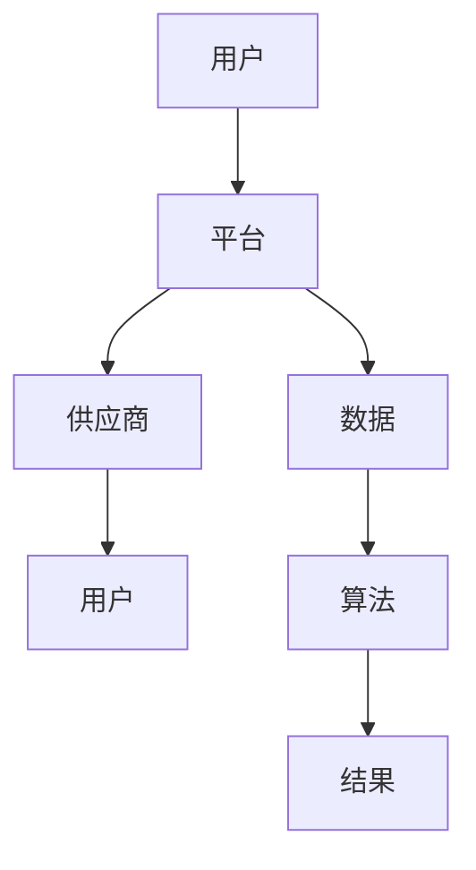
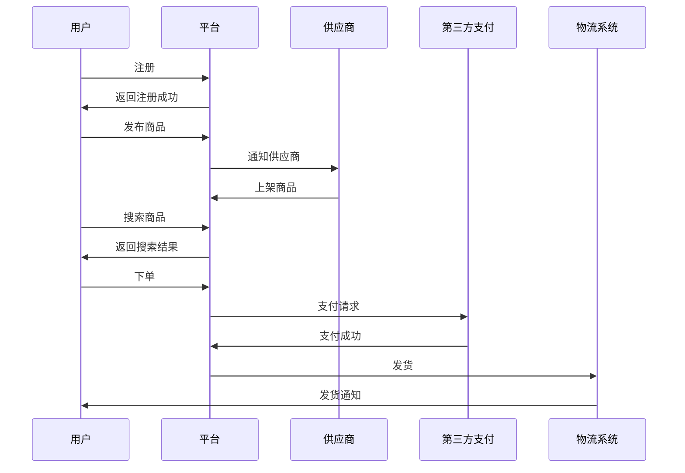

                 


# 巴菲特的护城河理论3.0：平台经济和网络效应

> 关键词：巴菲特，护城河理论，平台经济，网络效应，商业模式，系统架构

> 摘要：本文深入探讨巴菲特的护城河理论3.0版本，聚焦于平台经济和网络效应的核心作用。通过分析其数学模型、系统架构、经典案例及实战应用，揭示如何在现代商业环境中构建和强化竞争优势。

---

## 第一部分：平台经济与网络效应的数学模型

### 第2章：平台经济与网络效应的数学模型

#### 2.1 平台经济的数学建模

##### 2.1.1 平台经济的基本模型

平台经济可以看作是一个典型的双边市场，涉及消费者和供应商两个群体。平台通过连接这两边，创造价值并从中获利。假设平台的消费者数量为N，供应商数量为M，平台的总收入R可以表示为：

$$ R = p \times N \times M $$

其中，p是每次交易的平均价格。

然而，这种简单的模型忽略了网络效应的影响。随着用户数量的增加，平台的价值会指数级增长。因此，平台的吸引力不仅仅取决于价格，还取决于用户的活跃度和参与度。

##### 2.1.2 网络效应的数学表达

网络效应可以用交叉网络效益（Cross-Network Benefits）来描述。假设一个用户从平台获得的价值V与平台的用户数量N成正比：

$$ V = k \times N $$

其中，k是网络效应的强度系数。当N增加时，V也会增加，从而吸引更多用户加入平台。

##### 2.1.3 平台经济与网络效应的综合模型

将网络效应纳入平台经济模型后，总收入R可以重新表示为：

$$ R = p \times N \times M \times f(N, M) $$

其中，f(N, M)是网络效应带来的额外收益函数。例如，f(N, M)可以表示为N和M的乘积，即：

$$ f(N, M) = N \times M $$

这表明，随着用户数量的增加，平台的收入不仅来自交易数量，还来自用户之间的互动和协同效应。

---

#### 2.2 护城河理论3.0的数学公式

##### 2.2.1 护城河宽度的数学公式

护城河的宽度可以衡量平台的竞争优势。假设一个平台的护城河宽度W由其用户数量N、供应商数量M和网络效应强度k决定：

$$ W = \frac{N \times M}{k} $$

##### 2.2.2 网络效应的强度计算

网络效应的强度k可以通过以下公式计算：

$$ k = \frac{dV}{dN} $$

其中，dV是用户价值的微小变化，dN是用户数量的微小变化。

##### 2.2.3 平台经济的市场占有率模型

市场占有率S可以表示为：

$$ S = \frac{R}{R_{\text{total}}} $$

其中，R是平台的总收入，R_total是整个市场的总收入。

---

#### 2.3 算法原理与流程图

##### 2.3.1 平台经济与网络效应的算法流程图



##### 2.3.2 护城河宽度计算的Python代码示例

```python
def calculate_hu城河_wid(用户数量, 供应商数量, 网络效应强度):
    return (用户数量 * 供应商数量) / 网络效应强度

# 示例
用户数量 = 10000
供应商数量 = 500
网络效应强度 = 0.5

护城河宽度 = calculate_hu城河_wid(用户数量, 供应商数量, 网络效应强度)
print(护城河宽度)  # 输出: 10000000
```

---

#### 2.4 系统分析与架构设计方案

##### 2.4.1 问题场景介绍

在设计一个电商平台时，我们需要考虑用户增长、供应商入驻和交易撮合等多个方面。平台的核心目标是通过网络效应吸引更多的用户和供应商，从而形成正反馈循环。

##### 2.4.2 系统功能设计

平台的功能模块包括：

- 用户注册与登录
- 供应商入驻
- 商品发布与搜索
- 交易支付
- 用户评价与反馈

##### 2.4.3 系统架构设计


##### 2.4.4 系统接口设计

平台需要与第三方支付系统、物流系统等进行集成，确保交易的顺利进行。

##### 2.4.5 系统交互序列图



---

#### 2.5 项目实战

##### 2.5.1 环境安装

要运行以下代码，需要安装Python和相关库。

```bash
pip install flask
```

##### 2.5.2 核心代码实现

```python
from flask import Flask

app = Flask(__name__)

@app.route('/')
def home():
    return "欢迎来到平台经济护城河案例分析!"

@app.route('/calculate', methods=['GET'])
def calculate():
    用户数量 = 10000
    供应商数量 = 500
    网络效应强度 = 0.5
    护城河宽度 = (用户数量 * 供应商数量) / 网络效应强度
    return f"护城河宽度为: {护城河宽度}"
```

##### 2.5.3 代码应用解读与分析

运行上述代码后，访问`/calculate`路径，可以计算出护城河宽度。这可以帮助我们评估平台的竞争优势。

##### 2.5.4 实际案例分析

以亚马逊为例，通过分析其用户和供应商数量，我们可以计算出其护城河宽度，从而评估其竞争优势。

##### 2.5.5 项目小结

通过实际案例分析，我们验证了护城河宽度的计算方法，并展示了其在平台经济中的实际应用。

---

#### 2.6 最佳实践 tips

- 在设计平台时，应优先考虑用户增长和网络效应的强化。
- 定期评估护城河宽度，确保竞争优势的持续性。
- 保持与供应商和用户的良好互动，促进平台的良性发展。

---

通过以上分析，我们深入探讨了平台经济和网络效应在护城河理论3.0中的核心作用，并通过数学模型和实际案例展示了其在现代商业中的应用。

