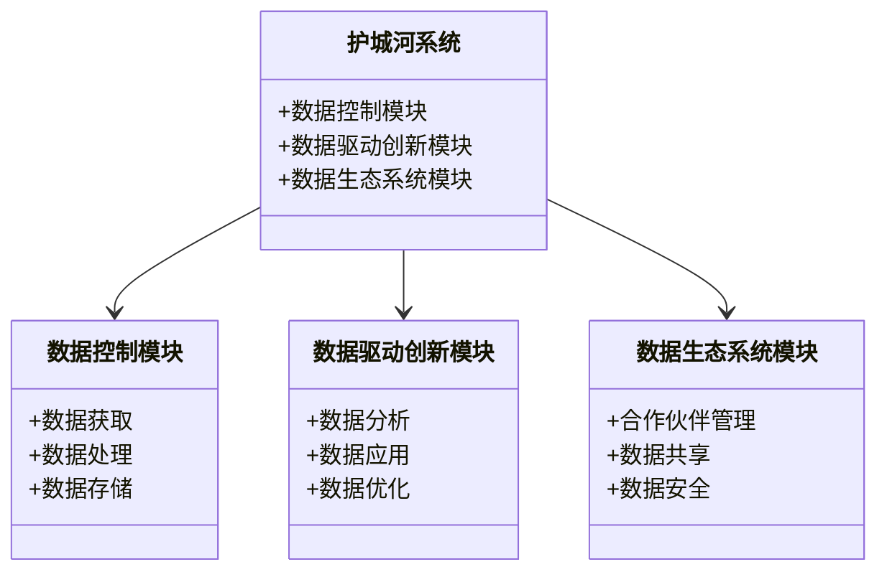
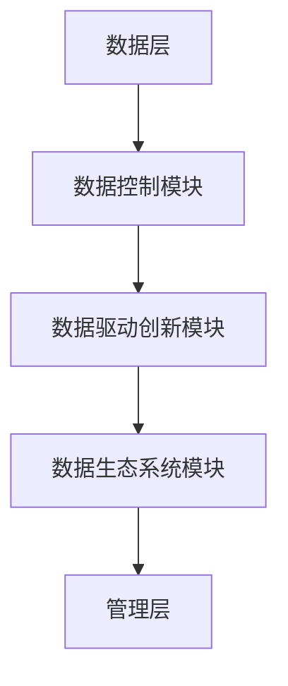
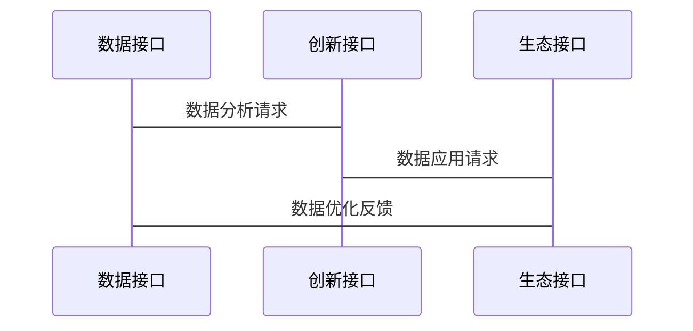

                 


# 巴菲特的护城河理论5.0：数据主权时代的竞争优势

## 关键词：护城河理论，数据主权，竞争优势，商业策略，企业架构

## 摘要：  
在数据主权日益重要的今天，传统的护城河理论需要与时俱进。本文通过分析护城河理论的核心要素、数据主权的概念及其对竞争优势的影响，结合数学模型和系统架构设计，探讨如何在数据主权时代构建企业竞争优势。文章从背景介绍、核心概念、算法原理到系统架构和项目实战，全面解析护城河理论5.0版本。

---

# 第一部分: 巴菲特护城河理论的背景与演变

## 第1章: 巴菲特护城河理论的核心概念

### 1.1 护城河理论的起源与演变

#### 1.1.1 护城河理论的起源  
巴菲特的护城河理论最初提出于20世纪90年代，强调企业在市场竞争中的长期竞争优势。护城河是企业抵御竞争对手的核心能力，包括成本优势、品牌忠诚度、技术壁垒等。这些要素帮助企业在竞争中保持领先地位。

#### 1.1.2 护城河理论的演变历程  
随着时间推移，护城河理论不断演变。从最初的单一成本优势，发展到涵盖品牌、技术、网络效应等多维度的竞争优势。每一次演变都反映了商业环境的变化。

#### 1.1.3 护城河理论的核心思想  
护城河理论的核心在于识别企业独特的能力，这些能力能够长期为客户创造价值，从而形成竞争壁垒。企业的护城河越深，其竞争优势越持久。

### 1.2 数据主权时代的商业竞争

#### 1.2.1 数据主权的概念与重要性  
数据主权指企业在数据控制和使用上的自主权，是数字时代的核心资产。数据主权不仅关乎企业的竞争力，还涉及国家安全和用户隐私。

#### 1.2.2 数据主权时代的企业竞争优势  
在数据主权时代，企业竞争优势不再仅限于传统要素，数据的控制和利用能力成为关键。企业需要构建新的护城河，以适应数据驱动的商业模式。

#### 1.2.3 护城河理论在数据主权时代的适用性  
护城河理论5.0版本强调数据主权作为核心要素。企业需要将数据主权纳入护城河构建，以确保长期竞争优势。

---

## 第2章: 护城河理论的核心要素

### 2.1 护城河的核心要素

#### 2.1.1 成本优势  
低成本生产模式是护城河的重要组成部分。企业通过技术创新和规模效应降低成本，提升竞争力。

#### 2.1.2 品牌优势  
强大的品牌忠诚度能为企业带来稳定的客户群。品牌优势在数据主权时代尤为重要，数据控制能力成为品牌价值的一部分。

#### 2.1.3 行业垄断优势  
行业垄断地位通过市场准入壁垒和规模效应形成。数据主权时代，技术壁垒和数据控制能力是新的垄断优势来源。

#### 2.1.4 持续创新优势  
持续创新能力是护城河的关键。企业通过研发投入和技术积累，保持技术领先，构建创新壁垒。

### 2.2 护城河要素的动态变化

#### 2.2.1 数据主权时代的核心要素变化  
数据主权时代，护城河的核心要素从传统成本优势转向数据控制能力。数据的获取、处理和利用能力成为关键。

#### 2.2.2 技术创新对护城河的影响  
技术创新加速护城河的演变。企业通过数据驱动的创新，不断提升技术壁垒，巩固竞争优势。

#### 2.2.3 企业生态系统的构建  
企业生态系统整合内部资源和外部合作伙伴，形成协同效应。数据主权时代的护城河需要构建开放的生态系统，以增强竞争力。

---

## 第3章: 护城河理论与数据主权的结合

### 3.1 数据主权对护城河的影响

#### 3.1.1 数据主权对企业竞争优势的重塑  
数据主权改变企业竞争模式。企业通过数据控制能力，重构竞争优势，形成新的护城河。

#### 3.1.2 数据主权时代的企业护城河新特征  
数据主权时代的护城河具有更强的数据驱动性和生态协同性。企业需要将数据控制能力与传统竞争优势结合。

#### 3.1.3 数据主权与企业长期价值的关系  
数据主权是企业长期价值的重要来源。通过数据控制能力，企业可以持续创造价值，巩固竞争优势。

### 3.2 护城河理论在数据主权时代的应用

#### 3.2.1 数据主权时代的护城河构建策略  
企业需要将数据主权纳入护城河构建，通过数据控制能力形成竞争优势。数据主权时代的护城河构建策略包括数据资产化、数据驱动创新和数据生态建设。

#### 3.2.2 数据主权与企业核心竞争力的结合  
数据主权与企业核心竞争力深度融合。企业通过数据控制能力，提升核心竞争力，构建更深的护城河。

#### 3.2.3 数据主权时代护城河的动态调整  
护城河需要动态调整。企业应根据市场变化和技术创新，不断优化护城河要素，确保竞争优势的持续性。

---

# 第二部分: 数据主权时代的企业竞争优势

## 第4章: 数据主权与企业护城河的构建

### 4.1 数据主权时代的企业竞争优势

#### 4.1.1 数据主权对企业竞争力的影响  
数据主权影响企业的商业模式和竞争优势。企业通过数据控制能力，重构竞争优势，形成新的护城河。

#### 4.1.2 数据主权时代的企业护城河新维度  
数据主权时代，护城河的新维度包括数据驱动能力、数据生态系统和数据安全能力。企业需要将这些能力整合到护城河构建中。

#### 4.1.3 数据主权与企业长期价值的关系  
数据主权是企业长期价值的重要来源。企业通过数据控制能力，持续创造价值，巩固竞争优势。

### 4.2 护城河要素的动态变化

#### 4.2.1 数据主权时代的核心要素变化  
数据主权时代，护城河的核心要素从传统成本优势转向数据控制能力。数据的获取、处理和利用能力成为关键。

#### 4.2.2 技术创新对护城河的影响  
技术创新加速护城河的演变。企业通过数据驱动的创新，不断提升技术壁垒，巩固竞争优势。

#### 4.2.3 企业生态系统的构建  
企业生态系统整合内部资源和外部合作伙伴，形成协同效应。数据主权时代的护城河需要构建开放的生态系统，以增强竞争力。

---

## 第5章: 护城河理论的数学模型与算法

### 5.1 护城河评估指标体系

#### 5.1.1 护城河评估的核心指标  
护城河评估的核心指标包括成本优势、品牌忠诚度、技术壁垒和数据控制能力。这些指标共同构成护城河评估体系。

#### 5.1.2 数据主权时代护城河评估的特殊性  
数据主权时代，护城河评估需要考虑数据控制能力、数据驱动创新和数据生态系统。这些指标更具动态性和复杂性。

#### 5.1.3 护城河评估的数学模型  
护城河指数（HI）的计算公式如下：
$$HI = \alpha \times C + \beta \times B + \gamma \times T + \delta \times D$$
其中，C代表成本优势，B代表品牌忠诚度，T代表技术壁垒，D代表数据控制能力，$\alpha, \beta, \gamma, \delta$为权重系数。

### 5.2 护城河指数的计算

#### 5.2.1 数据主权时代护城河指数的计算  
通过数据主权时代护城河指数公式，企业可以量化其竞争优势。公式如下：
$$HI_{\text{data}} = \alpha_{\text{data}} \times D + \beta_{\text{data}} \times I + \gamma_{\text{data}} \times E$$
其中，D代表数据控制能力，I代表数据驱动创新，E代表数据生态系统。

#### 5.2.2 护城河指数的动态调整  
护城河指数需要根据市场变化和企业战略进行动态调整。企业应定期评估护城河要素，优化指数计算，确保竞争优势的持续性。

---

# 第三部分: 系统分析与架构设计

## 第6章: 护城河理论的系统架构

### 6.1 问题场景介绍  
在数据主权时代，企业需要构建新的护城河，以适应数据驱动的商业模式。系统架构设计需要考虑数据控制能力、数据驱动创新和数据生态系统。

### 6.2 系统功能设计

#### 6.2.1 领域模型设计  
领域模型描述了系统的核心功能和数据流。通过Mermaid类图，可以清晰展示系统的功能模块。



### 6.3 系统架构设计

#### 6.3.1 系统架构设计  
系统架构采用分层设计，包括数据层、应用层和管理层。通过Mermaid架构图展示系统架构。



### 6.4 系统接口设计

#### 6.4.1 系统接口设计  
系统接口设计包括数据接口、创新接口和生态接口。通过Mermaid序列图展示接口交互。



---

# 第四部分: 项目实战

## 第7章: 项目实战

### 7.1 环境安装与配置

#### 7.1.1 系统环境要求  
项目需要安装Python 3.8及以上版本，JDK 1.8及以上版本，以及相关开发工具。

#### 7.1.2 数据库配置  
使用MySQL或MongoDB作为数据库，配置数据存储和处理模块。

### 7.2 核心系统实现

#### 7.2.1 数据控制模块实现  
代码实现数据获取、处理和存储功能。

```python
def data_control():
    # 数据获取
    data = fetch_data()
    # 数据处理
    processed_data = process_data(data)
    # 数据存储
    store_data(processed_data)
```

#### 7.2.2 数据驱动创新模块实现  
代码实现数据分析和数据应用功能。

```python
def data_innovation():
    # 数据分析
    analysis = analyze_data()
    # 数据应用
    apply_data(analysis)
```

#### 7.2.3 数据生态系统模块实现  
代码实现合作伙伴管理、数据共享和数据安全功能。

```python
def data_ecosystem():
    # 合作伙伴管理
    partners = manage_partners()
    # 数据共享
    shared_data = share_data(partners)
    # 数据安全
    secure_data(shared_data)
```

### 7.3 项目实战案例分析

#### 7.3.1 互联网公司案例  
以某互联网公司为例，分析其护城河构建策略。通过数据控制能力、数据驱动创新和数据生态系统，该公司成功构建了强大的护城河。

#### 7.3.2 金融企业案例  
以某金融企业为例，分析其护城河构建策略。通过数据控制能力、数据驱动创新和数据生态系统，该公司成功构建了强大的护城河。

#### 7.3.3 制造业案例  
以某制造企业为例，分析其护城河构建策略。通过数据控制能力、数据驱动创新和数据生态系统，该公司成功构建了强大的护城河。

### 7.4 项目小结

#### 7.4.1 项目总结  
通过项目实战，验证了护城河理论在数据主权时代的可行性。企业需要将数据控制能力、数据驱动创新和数据生态系统整合到护城河构建中。

#### 7.4.2 项目经验分享  
项目实施过程中，需要注意数据安全和数据隐私问题。企业应与合作伙伴建立良好的信任关系，确保数据共享的安全性。

---

# 第五部分: 总结与展望

## 第8章: 总结与展望

### 8.1 最佳实践 tips  
企业应将数据主权纳入护城河构建，通过数据控制能力、数据驱动创新和数据生态系统，构建强大的竞争优势。

### 8.2 小结  
护城河理论5.0版本强调数据主权作为核心要素。企业需要将数据控制能力、数据驱动创新和数据生态系统整合到护城河构建中，确保竞争优势的持续性。

### 8.3 注意事项  
企业在构建护城河时，需要注意数据安全和数据隐私问题。应与合作伙伴建立良好的信任关系，确保数据共享的安全性。

### 8.4 拓展阅读  
建议读者阅读《巴菲特的护城河理论》和《数据主权与企业竞争优势》，深入了解护城河理论和数据主权的相关知识。

---

通过以上内容，我们可以看到，护城河理论在数据主权时代的竞争优势构建中发挥着重要作用。企业需要将数据控制能力、数据驱动创新和数据生态系统整合到护城河构建中，确保竞争优势的持续性。未来，随着技术的不断进步，护城河理论将继续演变，为企业提供更强大的竞争优势。

