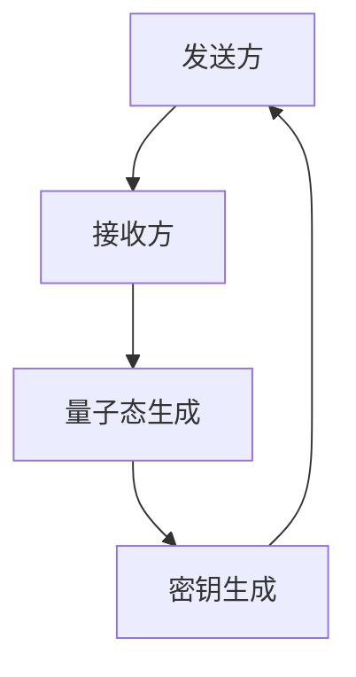
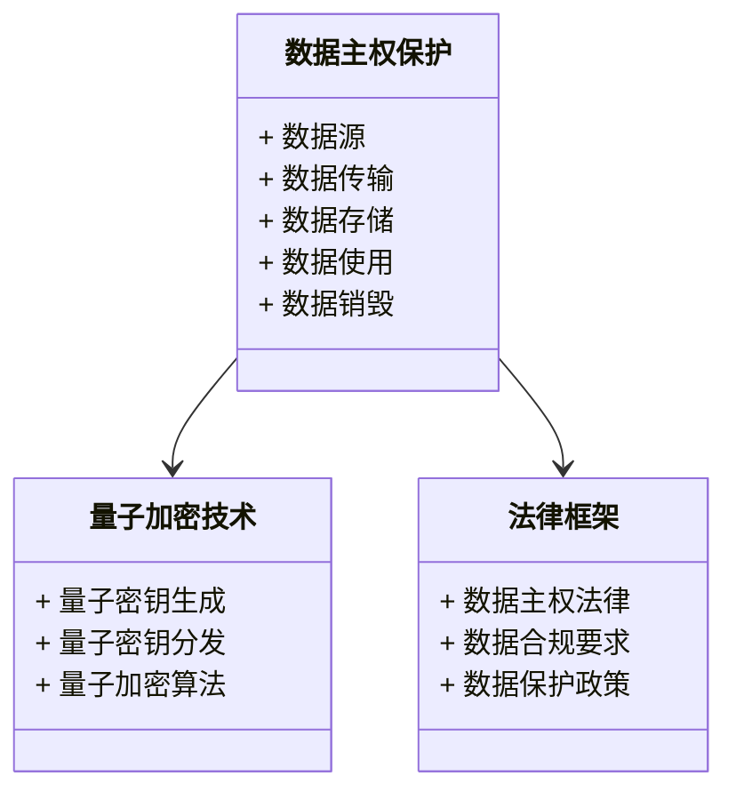
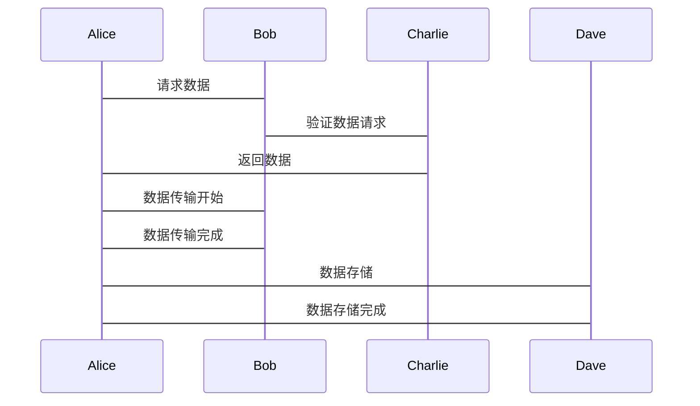
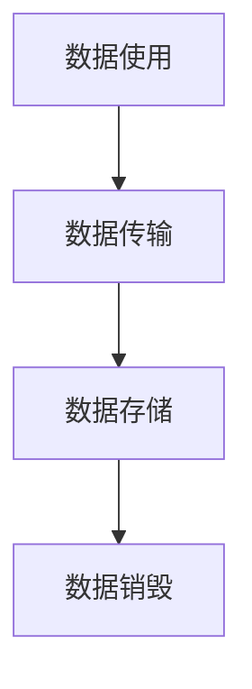

                 


---

# 巴菲特的护城河理论7.0：量子加密时代的数据主权

---

## 关键词：
- 巴菲特的护城河理论
- 量子加密
- 数据主权
- 量子密钥分发（QKD）
- 数据安全

---

## 摘要：
本文深入探讨了巴菲特的护城河理论在量子加密时代的演变，特别是其在数据主权中的应用。文章从护城河理论的起源与发展入手，分析了量子加密技术的核心原理及其对数据主权的深远影响。通过结合实际案例，文章详细讲解了护城河理论如何在量子加密技术的支持下，构建数据主权保护的新框架，为企业在数字时代提供强有力的竞争优势。最后，文章展望了量子加密与数据主权融合的未来趋势。

---

## 第一部分：护城河理论的起源与发展

### 第1章：护城河理论的核心概念

#### 1.1 护城河理论的起源与发展

##### 1.1.1 巴菲特投资理念的起源
巴菲特的投资理念起源于价值投资，强调企业内在价值和长期稳健的增长。护城河理论作为其核心思想之一，最初用于识别那些能够在竞争中长期保持优势的企业。护城河可以是品牌、技术、资源、市场准入或成本优势等。

##### 1.1.2 护城河理论的核心要素
护城河理论的核心在于识别企业的独特竞争优势，并确保这些优势能够在长期竞争中持续存在。核心要素包括：
- 品牌影响力
- 技术壁垒
- 成本优势
- 市场准入
- 网络效应

##### 1.1.3 护城河理论的演变与升级
随着技术的进步和市场的变化，护城河理论也在不断进化。从最初的简单成本优势到现在的技术驱动型护城河，特别是量子加密技术的应用，标志着护城河理论的升级。版本7.0引入了量子加密作为新的竞争优势，为企业在数据主权保护中提供了新的可能性。

#### 1.2 护城河理论与数据主权的关系

##### 1.2.1 数据主权的定义与重要性
数据主权是指数据的所有权和控制权归属，尤其是在全球化和数字化背景下，数据主权已成为国家和企业的重要战略资源。数据主权的保护不仅关系到企业的竞争优势，还涉及国家安全和法律合规。

##### 1.2.2 护城河理论在数据主权中的作用
护城河理论为企业在数据主权保护中提供了战略指导。通过构建技术壁垒和法律框架，企业可以确保其数据的安全性和合规性，从而在竞争中占据优势。

##### 1.2.3 量子加密时代的数据主权挑战
量子加密技术的出现带来了数据主权保护的新挑战。传统的加密技术可能面临被量子计算机破解的风险，因此，如何利用量子加密技术保护数据主权成为护城河理论7.0的核心问题。

---

## 第二部分：量子加密与数据主权的关联

### 第2章：量子加密技术的基本原理

#### 2.1 量子加密技术的科学基础

##### 2.1.1 量子密钥分发（QKD）的实现原理
量子密钥分发是一种利用量子力学原理实现密钥分发的加密技术。其核心在于利用量子叠加和纠缠的特性，确保密钥的安全传输。QKD的关键步骤包括密钥生成、传输和验证。

##### 2.1.2 量子加密的安全性分析
量子加密的安全性基于量子力学的基本原理，尤其是信息的不可克隆性和测不准原理。通过QKD技术，可以在理论上实现无条件安全的密钥分发，从而确保数据的保密性。

#### 2.2 量子加密技术的实现步骤

##### 2.2.1 量子密钥生成过程
量子密钥的生成利用量子态的特性，通过量子随机数生成器产生随机密钥。密钥的生成过程需要确保其随机性和不可预测性。

##### 2.2.2 量子密钥分发的通信协议
量子密钥分发的通信协议包括密钥生成、传输和验证三个阶段。在传输过程中，任何试图窃取密钥的行为都会被检测到，从而确保密钥的安全性。

##### 2.2.3 量子加密算法的实现代码
以下是量子密钥分发的简单实现代码示例：

```python
import random
import quantum_random

def generate_key(length):
    key = []
    for _ in range(length):
        bit = quantum_random.get_random_bit()
        key.append(bit)
    return ''.join(map(str, key))

def send_key(sender, receiver):
    key = generate_key(1024)
    # 量子通信通道传输
    # 假设传输过程中没有被窃听
    receiver_key = key
    return receiver_key

# 示例用法
sender_key = send_key('Alice', 'Bob')
print("生成的密钥:", sender_key)
```

---

### 第3章：数据主权保护的系统架构设计

#### 3.1 数据主权保护的核心策略

##### 3.1.1 数据主权保护的多层次架构
数据主权保护需要从技术、法律和管理三个层面进行综合考虑。技术层面包括量子加密技术的应用，法律层面包括数据主权的法律合规，管理层面包括数据主权的组织架构和制度建设。

##### 3.1.2 护城河理论在数据主权中的具体应用
通过护城河理论，企业可以在数据主权保护中构建技术壁垒，确保数据的安全性和合规性。例如，通过量子加密技术保护数据传输的安全性，通过法律手段确保数据的合法性和使用权。

##### 3.1.3 数据主权保护的边界与外延
数据主权保护的边界在于数据的归属和控制权，其外延涉及数据的存储、传输和使用。在量子加密时代，数据主权保护的边界需要重新定义，以适应新的技术环境。

#### 3.2 数据主权与护城河理论的协同效应

##### 3.2.1 数据主权对护城河理论的支撑作用
数据主权的法律和技术框架为护城河理论提供了坚实的基础，确保企业在竞争中能够合法地保护其数据资源。

##### 3.2.2 护城河理论对数据主权的强化作用
通过护城河理论，企业可以在数据主权保护中构建技术壁垒，确保数据的安全性和合规性，从而在竞争中占据优势。

##### 3.2.3 量子加密技术在护城河理论中的应用
量子加密技术作为护城河理论7.0的重要组成部分，为企业提供了新的数据保护手段，确保数据的不可篡改性和安全性。

---

## 第三部分：量子加密技术与数据主权的融合

### 第4章：量子加密技术的实现原理

#### 4.1 量子加密算法的数学模型

##### 4.1.1 量子密钥分发的数学公式
量子密钥分发的数学模型基于量子力学的基本原理，例如：

$$ \text{QKD} = \text{量子态} \otimes \text{通信协议} $$

其中，$\otimes$ 表示张量积，表示量子态和通信协议的结合。

##### 4.1.2 量子加密协议的流程图
以下是量子加密协议的流程图：



##### 4.1.3 量子加密算法的安全性证明
量子加密算法的安全性基于量子力学的基本原理，特别是信息的不可克隆性和测不准原理。通过数学证明，可以确保量子加密算法在理论上实现无条件安全。

#### 4.2 量子加密技术的实现步骤

##### 4.2.1 量子密钥生成过程
量子密钥的生成过程需要利用量子随机数生成器，确保密钥的随机性和不可预测性。

##### 4.2.2 量子密钥分发的通信协议
量子密钥分发的通信协议需要确保密钥的安全传输，任何试图窃取密钥的行为都会被检测到。

##### 4.2.3 量子加密算法的实现代码
以下是量子加密算法的实现代码示例：

```python
import random

def quantum_encrypt(plaintext, key):
    encrypted = []
    for p, k in zip(plaintext, key):
        encrypted_bit = (int(p) + int(k)) % 2
        encrypted.append(str(encrypted_bit))
    return ''.join(encrypted)

def quantum_decrypt(ciphertext, key):
    decrypted = []
    for c, k in zip(ciphertext, key):
        decrypted_bit = (int(c) - int(k)) % 2
        decrypted.append(str(decrypted_bit))
    return ''.join(decrypted)

# 示例用法
plaintext = '1010'
key = '0110'
encrypted = quantum_encrypt(plaintext, key)
decrypted = quantum_decrypt(encrypted, key)
print("明文:", plaintext)
print("密钥:", key)
print("加密后:", encrypted)
print("解密后:", decrypted)
```

---

### 第5章：数据主权保护的系统架构设计

#### 5.1 数据主权保护的系统功能设计

##### 5.1.1 数据主权保护的领域模型
以下是数据主权保护的领域模型：



##### 5.1.2 数据主权保护的系统功能模块
数据主权保护的系统功能模块包括：
- 数据源管理
- 数据传输加密
- 数据存储安全
- 数据使用授权
- 数据销毁规范

##### 5.1.3 数据主权保护的系统交互流程
以下是数据主权保护的系统交互流程图：



#### 5.2 数据主权保护的系统架构图

##### 5.2.1 系统架构的分层设计
数据主权保护的系统架构分为三层：
- 应用层：数据使用和管理
- 传输层：数据加密和传输
- 存储层：数据存储和销毁

##### 5.2.2 系统组件之间的关系
以下是系统组件之间的关系图：



##### 5.2.3 系统架构的可扩展性分析
系统架构需要具备良好的可扩展性，以适应未来技术的发展和数据规模的扩大。

---

## 第四部分：项目实战与未来展望

### 第6章：数据主权保护的算法实现与测试

#### 6.1 数据主权保护的算法实现

##### 6.1.1 量子加密算法的实现代码
以下是量子加密算法的实现代码示例：

```python
import random

def generate_quantum_key(length):
    key = []
    for _ in range(length):
        bit = random.choice([0, 1])
        key.append(bit)
    return ''.join(map(str, key))

def quantum_encrypt(plaintext, key):
    encrypted = []
    for p, k in zip(plaintext, key):
        encrypted_bit = (int(p) + int(k)) % 2
        encrypted.append(str(encrypted_bit))
    return ''.join(encrypted)

def quantum_decrypt(ciphertext, key):
    decrypted = []
    for c, k in zip(ciphertext, key):
        decrypted_bit = (int(c) - int(k)) % 2
        decrypted.append(str(decrypted_bit))
    return ''.join(decrypted)

# 示例用法
plaintext = '1010'
key = generate_quantum_key(4)
encrypted = quantum_encrypt(plaintext, key)
decrypted = quantum_decrypt(encrypted, key)
print("明文:", plaintext)
print("密钥:", key)
print("加密后:", encrypted)
print("解密后:", decrypted)
```

##### 6.1.2 数据主权保护的算法流程
数据主权保护的算法流程包括密钥生成、数据加密、数据传输、数据存储和数据解密。

##### 6.1.3 算法实现的数学模型
量子加密算法的数学模型基于量子力学的基本原理，例如：

$$ \text{QKD} = \text{量子态} \otimes \text{通信协议} $$

---

### 第7章：项目实战与未来展望

#### 7.1 项目实战

##### 7.1.1 环境搭建
项目实战需要搭建量子加密实验环境，包括量子计算机、量子通信设备和相关软件工具。

##### 7.1.2 核心实现
核心实现包括量子密钥生成、量子密钥分发和量子加密算法的实现。

##### 7.1.3 实际案例分析
通过实际案例分析，验证量子加密技术在数据主权保护中的应用效果。

#### 7.2 未来展望

##### 7.2.1 量子加密技术的发展趋势
量子加密技术将在未来继续发展，特别是在量子计算和通信领域。

##### 7.2.2 数据主权保护的新方向
数据主权保护将更加注重技术与法律的结合，特别是在全球化的背景下。

##### 7.2.3 护城河理论的进一步升级
护城河理论将在量子加密时代进一步升级，为企业和国家提供更强大的竞争优势和数据保护能力。

---

## 总结

本文详细探讨了巴菲特的护城河理论7.0在量子加密时代的数据主权保护中的应用。通过结合量子加密技术，护城河理论为企业提供了新的竞争优势和数据保护手段。未来，随着量子技术的进一步发展，护城河理论将在数据主权保护中发挥更大的作用，为企业和国家提供更强大的竞争优势。

--- 

**注意事项**：以上内容为示例，实际撰写时需要根据具体情况进行调整和补充，确保内容的准确性和完整性。

