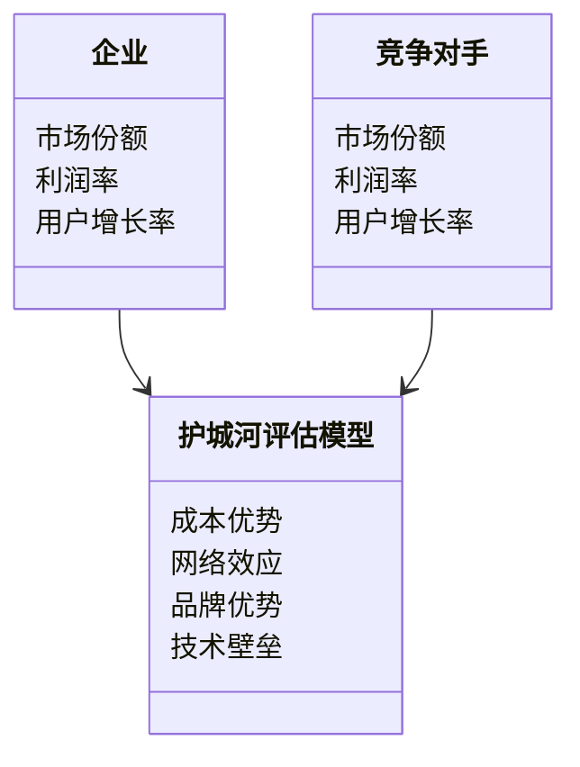
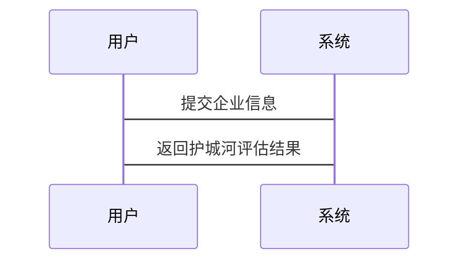

                 


# 巴菲特的护城河理论及其实际应用

> 关键词：巴菲特, 护城河理论, 企业竞争优势, 投资策略, 案例分析

> 摘要：本文深入探讨巴菲特护城河理论的核心思想，分析其在企业竞争优势中的应用，并结合实际案例，展示如何构建和评估护城河。通过系统分析和项目实战，帮助读者掌握护城河理论的实际应用方法。

---

## 第1章: 护城河理论的背景与核心概念

### 1.1 护城河理论的起源与演变

#### 1.1.1 巴菲特投资理念的形成
沃伦·巴菲特的投资理念植根于价值投资，他强调企业内在价值的重要性。护城河理论是其价值投资体系中的核心部分，用于识别具有长期竞争优势的企业。

#### 1.1.2 护城河理论的提出与核心思想
护城河理论的核心在于识别那些能够长期抵御竞争的压力，维持高利润率的企业。巴菲特认为，真正的护城河来源于企业的独特优势，如成本优势、网络效应、品牌影响力或技术壁垒。

#### 1.1.3 护城河理论在投资中的应用
在投资决策中，护城河理论帮助企业筛选出具有长期竞争优势的公司，从而降低投资风险，提高投资回报。

### 1.2 护城河理论的核心概念

#### 1.2.1 什么是护城河
护城河是指企业为防止竞争对手侵蚀其市场份额和利润而构建的一系列竞争优势。这些优势可以是成本优势、品牌影响力、技术壁垒或网络效应等。

#### 1.2.2 护城河的四种类型
1. **成本优势**：企业通过规模经济、流程优化或资源控制降低成本，从而在价格竞争中占据优势。
2. **网络效应**：产品的价值随着用户数量的增加而增加，形成正反馈循环，吸引更多的用户。
3. **品牌优势**：强大的品牌认知度和忠诚度能够吸引顾客，增强企业的市场地位。
4. **技术壁垒**：通过专利、专有技术和研发能力，形成难以被竞争对手复制的技术优势。

#### 1.2.3 护城河的边界与外延
护城河并非一成不变，随着市场环境和技术进步的变化，企业需要不断调整和强化其护城河。

---

## 第2章: 护城河的四种类型及其特征

### 2.1 成本优势

#### 2.1.1 成本优势的定义与特点
成本优势是指企业在生产或运营过程中，能够以低于竞争对手的成本提供相同或更好的产品或服务。

#### 2.1.2 成本优势的形成机制
- **规模经济**：通过大规模生产降低成本。
- **流程优化**：通过技术创新和管理优化降低成本。
- **资源控制**：通过控制关键资源（如原材料、技术）降低成本。

#### 2.1.3 成本优势的案例分析
以可口可乐为例，其全球供应链和分销网络使其能够以较低的成本实现高效运营。

### 2.2 网络效应

#### 2.2.1 网络效应的定义与特点
网络效应是指产品的价值随着用户数量的增加而增加。这种效应形成了一种正反馈机制，吸引更多用户加入。

#### 2.2.2 网络效应的形成机制
- **用户增长**：用户数量的增加直接提升了产品的价值。
- **数据积累**：随着用户使用产品的增加，数据积累能够进一步优化产品和服务。
- **锁定效应**：用户转换成本高，形成用户粘性。

#### 2.2.3 网络效应的案例分析
以微信为例，随着用户数量的增加，微信的社交网络和生态系统变得越来越有价值，形成了强大的网络效应。

### 2.3 品牌优势

#### 2.3.1 品牌优势的定义与特点
品牌优势是指强大的品牌认知度和忠诚度，能够吸引更多的顾客，增强企业的市场地位。

#### 2.3.2 品牌优势的形成机制
- **品牌知名度**：通过广告、营销和优质产品建立品牌知名度。
- **品牌忠诚度**：通过提供优质服务和用户体验，增强用户对品牌的忠诚度。
- **品牌延伸**：通过品牌延伸进入新的市场和产品领域。

#### 2.3.3 品牌优势的案例分析
以苹果公司为例，其品牌价值和忠诚度使其能够在竞争激烈的科技市场中占据领先地位。

### 2.4 技术壁垒

#### 2.4.1 技术壁垒的定义与特点
技术壁垒是指企业通过技术专利、专有技术和研发能力形成的技术优势，使得竞争对手难以复制。

#### 2.4.2 技术壁垒的形成机制
- **研发投资**：通过持续的研发投入，开发具有创新性的技术和产品。
- **专利保护**：通过申请专利保护核心技术，防止竞争对手复制。
- **技术标准化**：通过技术标准的制定，增强技术的市场影响力。

#### 2.4.3 技术壁垒的案例分析
以特斯拉为例，其在电动汽车和自动驾驶技术领域的专利和技术优势形成了强大的技术壁垒。

---

## 第3章: 护城河理论的分析框架

### 3.1 护城河分析的维度

#### 3.1.1 财务指标分析
- 营业利润率
- 净利润率
- 资产回报率
- 估值指标（市盈率、市净率等）

#### 3.1.2 非财务指标分析
- 市场占有率
- 用户增长率
- 产品创新速度
- 品牌影响力

#### 3.1.3 综合分析框架
结合财务和非财务指标，构建综合分析框架，全面评估企业的护城河。

### 3.2 护城河的全景图

#### 3.2.1 护城河全景图的构建
通过绘制护城河全景图，展示企业在不同方面的竞争优势。

#### 3.2.2 护城河全景图的分析方法
使用系统思维，从多个维度分析企业的护城河，识别其优势和潜在风险。

#### 3.2.3 护城河全景图的案例分析
以亚马逊为例，分析其在成本优势、网络效应、品牌优势和技术壁垒方面的护城河。

---

## 第4章: 护城河理论的系统分析与架构设计

### 4.1 系统分析

#### 4.1.1 问题场景介绍
分析一个企业的护城河时，需要考虑其市场环境、竞争格局、商业模式等因素。

#### 4.1.2 系统功能设计
- 数据收集与分析
- 护城河评估模型
- 竞争对手分析

#### 4.1.3 领域模型（Mermaid 类图）


#### 4.1.4 系统架构设计


### 4.2 系统接口设计与交互

#### 4.2.1 系统接口设计
- 数据接口：获取企业财务数据和市场数据。
- 评估接口：计算护城河指标。

#### 4.2.2 系统交互（Mermaid 序列图）


---

## 第5章: 项目实战

### 5.1 环境安装

#### 5.1.1 安装Python和相关库
```bash
pip install numpy pandas matplotlib
```

### 5.2 核心代码实现

#### 5.2.1 护城河评估模型
```python
import pandas as pd

def calculate_profit_margin(revenue, cost):
    return (revenue - cost) / revenue * 100

def calculate_market_share(market_size, company_revenue):
    return company_revenue / market_size * 100

# 示例数据
revenue = 1000000
cost = 800000
market_size = 5000000
company_revenue = 1000000

profit_margin = calculate_profit_margin(revenue, cost)
market_share = calculate_market_share(market_size, company_revenue)

print(f"利润率：{profit_margin}%")
print(f"市场份额：{market_share}%")
```

### 5.3 代码应用解读与分析

#### 5.3.1 代码功能
上述代码展示了如何计算企业的利润率和市场份额，这些指标是评估护城河的重要组成部分。

#### 5.3.2 实际案例分析
以某科技公司为例，计算其利润率和市场份额，并结合其他指标（如用户增长率、技术专利数量等）评估其护城河。

---

## 第6章: 总结与展望

### 6.1 最佳实践 tips
- 定期评估企业的护城河，及时调整策略。
- 关注新兴技术和市场变化，增强企业的竞争优势。
- 通过多元化和创新，构建多层次的护城河。

### 6.2 小结
护城河理论是企业竞争优势的核心，通过识别和构建护城河，企业可以在激烈的市场竞争中占据优势地位。

### 6.3 注意事项
- 护城河并非一成不变，需要持续优化和调整。
- 注重企业的创新能力，应对市场变化。

### 6.4 拓展阅读
- 《竞争优势》（迈克尔·波特）
- 《巴菲特的护城河》（马克·普尔）
- 《商业生态系统》（詹姆斯·奥利里）

---

通过以上步骤，您可以系统地理解和应用巴菲特的护城河理论，识别和构建企业的竞争优势，提升投资决策的科学性和有效性。

