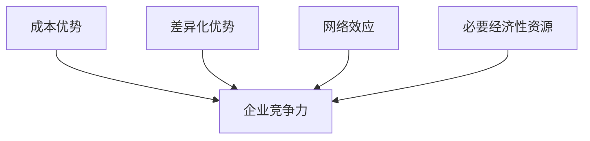
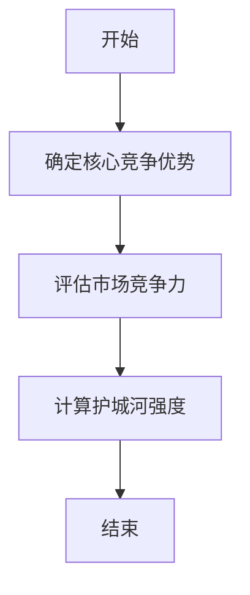
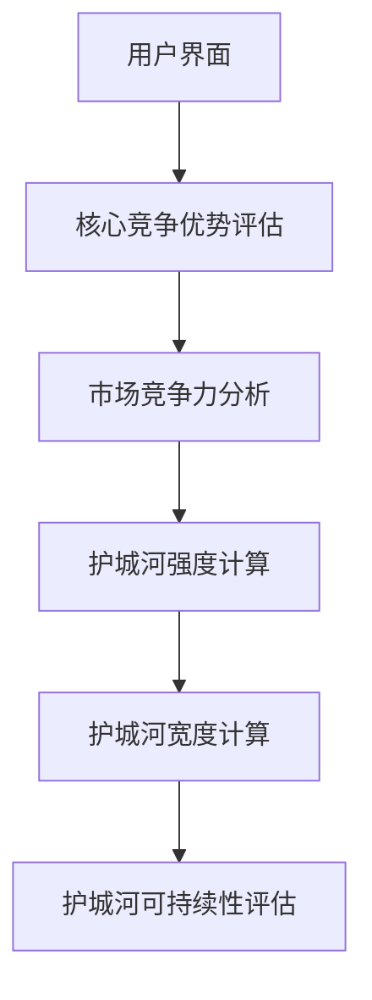

                 


# 巴菲特的护城河理论及其应用

## 关键词：
- 巴菲特护城河理论
- 企业竞争优势
- 商业投资策略
- 数学模型
- 系统架构设计

## 摘要：
本文深入探讨了巴菲特护城河理论的核心思想及其在商业投资中的应用。通过分析护城河的四个核心要素——成本优势、差异化优势、网络效应和必要经济性资源，我们构建了一个完整的理论框架。结合数学模型和系统架构设计，本文详细阐述了如何量化护城河的强度和宽度，并提供了实际案例分析，帮助读者更好地理解和应用这一理论。

---

# 第一部分: 巴菲特护城河理论的背景与核心概念

## 第1章: 巴菲特护城河理论的起源与核心思想

### 1.1 巴菲特投资理念的形成与发展

#### 1.1.1 巴菲特的投资哲学
沃伦·巴菲特的投资哲学以“价值投资”为核心，主张寻找那些具有持续竞争优势的企业进行长期投资。他的投资理念强调企业基本面分析、安全边际和长期持有的原则。

#### 1.1.2 护城河理论的提出背景
在巴菲特的投资实践中，他发现那些具有强大竞争优势的企业能够在市场上长期保持领先地位。为了量化和分析这种竞争优势，他提出了“护城河”理论。护城河是指企业在市场上竞争时所拥有的独特优势，这种优势能够防止竞争对手轻易侵蚀其市场份额。

#### 1.1.3 护城河理论的核心思想
护城河理论的核心思想是：企业竞争优势的来源决定了其长期盈利能力。只有那些具有强大护城河的企业，才能在长期的竞争中立于不败之地。护城河的强弱取决于企业的核心竞争力、市场地位、客户忠诚度等因素。

---

### 1.2 护城河理论的商业逻辑

#### 1.2.1 商业竞争中的护城河概念
在商业竞争中，护城河是指企业在市场上竞争时所具备的独特优势，这种优势可以是成本优势、差异化优势、网络效应或必要的经济性资源。护城河的存在使得竞争对手难以复制或超越企业的竞争优势。

#### 1.2.2 护城河的核心要素与分类
护城河的核心要素包括：
1. **成本优势**：企业能够在较低成本下提供产品或服务，从而在价格上具有竞争力。
2. **差异化优势**：企业通过提供独特的产品或服务，满足特定客户群体的需求。
3. **网络效应**：企业的产品或服务的价值随着用户数量的增加而增加，形成正反馈循环。
4. **必要经济性资源**：企业拥有关键资源或技术，使得竞争对手难以复制。

#### 1.2.3 护城河与企业持续竞争优势的关系
护城河是企业持续竞争优势的来源。通过构建和强化护城河，企业能够在激烈的市场竞争中保持领先地位，并实现长期的盈利能力。

---

### 1.3 护城河理论的数学模型与分析框架

#### 1.3.1 护城河强度的量化方法
护城河强度的量化可以通过以下公式进行计算：
$$
\text{护城河强度} = \frac{\text{核心竞争优势}}{\text{市场竞争力}}
$$
其中，核心竞争优势包括成本优势、差异化优势等；市场竞争力则反映了企业在市场上的竞争压力。

#### 1.3.2 护城河宽度的计算公式
护城河宽度反映了企业竞争优势的广度和深度，可以通过以下公式进行计算：
$$
\text{护城河宽度} = \text{市场占有率} \times \text{客户忠诚度}
$$

#### 1.3.3 护城河可持续性的评估模型
护城河的可持续性反映了企业在未来市场中的竞争优势，可以通过以下公式进行评估：
$$
\text{护城河可持续性} = \frac{\text{核心竞争优势}}{\text{市场竞争压力}}
$$

---

### 1.4 本章小结
本章介绍了巴菲特护城河理论的起源、核心思想及其商业逻辑。通过分析护城河的核心要素，我们构建了一个完整的理论框架，为后续的深入分析奠定了基础。

---

## 第2章: 护城河理论的核心概念与联系

### 2.1 护城河的核心要素分析

#### 2.1.1 成本优势
成本优势是指企业在生产或运营过程中能够以更低的成本提供产品或服务。例如，亚马逊通过高效的供应链管理和规模经济，实现了成本优势。

#### 2.1.2 差异化优势
差异化优势是指企业通过提供独特的产品或服务，满足特定客户群体的需求。例如，特斯拉通过创新的电动汽车技术，实现了市场差异化。

#### 2.1.3 网络效应
网络效应是指企业的产品或服务的价值随着用户数量的增加而增加。例如，社交平台Facebook的用户越多，其网络效应越强。

#### 2.1.4 必要经济性资源
必要经济性资源是指企业拥有的关键资源或技术，使得竞争对手难以复制。例如，苹果通过其专利技术构建了强大的护城河。

---

### 2.2 护城河要素的对比分析

#### 2.2.1 成本优势与差异化优势的对比
| 特性                | 成本优势               | 差异化优势               |
|---------------------|-----------------------|-------------------------|
| 竞争策略           | 低成本竞争             | 差异化竞争             |
| 适用场景           | 标准化产品             | 个性化产品             |
| 长期效果           | 提高利润率             | 提高市场占有率         |

#### 2.2.2 网络效应与必要经济性资源的对比
| 特性                | 网络效应               | 必要经济性资源           |
|---------------------|-----------------------|-------------------------|
| 竞争策略           | 用户越多价值越大       | 专利或技术壁垒         |
| 适用场景           | 社交平台、在线服务     | 高科技行业、专利技术   |
| 长期效果           | 建立用户依赖性         | 防止技术被复制         |

---

### 2.3 护城河要素的ER实体关系图


---

### 2.4 本章小结
本章详细分析了护城河的核心要素及其之间的关系，通过对比分析和ER图展示了各要素之间的联系，为后续的理论应用奠定了基础。

---

## 第3章: 护城河理论的算法原理与数学模型

### 3.1 护城河强度的算法原理

#### 3.1.1 护城河强度的计算公式
$$
\text{护城河强度} = \frac{\text{核心竞争优势}}{\text{市场竞争力}}
$$
其中，核心竞争优势包括成本优势、差异化优势等；市场竞争力反映了企业在市场上的竞争压力。

#### 3.1.2 护城河宽度的计算公式
$$
\text{护城河宽度} = \text{市场占有率} \times \text{客户忠诚度}
$$

---

### 3.2 护城河可持续性的数学模型

#### 3.2.1 护城河可持续性的评估公式
$$
\text{护城河可持续性} = \frac{\text{核心竞争优势}}{\text{市场竞争压力}}
$$

---

### 3.3 护城河强度的算法流程图


---

### 3.4 本章小结
本章通过数学模型和算法流程图，详细阐述了护城河强度和宽度的计算方法，为后续的实际应用提供了理论支持。

---

## 第4章: 护城河理论在商业竞争中的应用分析

### 4.1 护城河理论在企业战略中的应用

#### 4.1.1 企业核心竞争力的构建
企业可以通过构建成本优势、差异化优势、网络效应和必要经济性资源，来强化自身的竞争优势。

#### 4.1.2 护城河的动态维护与优化
企业需要定期评估和优化自身的护城河，以应对市场环境的变化。

#### 4.1.3 护城河与企业长期价值的关系
强大的护城河能够为企业创造长期价值，使其在市场竞争中保持领先地位。

---

### 4.2 护城河理论在投资决策中的应用

#### 4.2.1 投资标的企业护城河的识别
投资者需要识别企业的核心竞争优势，评估其护城河的强弱。

#### 4.2.2 护城河强度与投资风险的评估
护城河强度越高的企业，投资风险越小。

#### 4.2.3 护城河宽度与投资回报的预测
护城河宽度越大的企业，其投资回报潜力越大。

---

### 4.3 护城河理论的系统分析与架构设计

#### 4.3.1 企业竞争力分析系统功能设计
系统功能包括：
- 核心竞争优势评估
- 市场竞争力分析
- 护城河强度计算
- 护城河宽度计算
- 护城河可持续性评估

#### 4.3.2 系统架构设计


---

### 4.4 本章小结
本章通过实际案例分析，展示了护城河理论在商业竞争中的应用，并提出了系统的分析框架，为投资者和企业管理者提供了实践指导。

---

## 第5章: 护城河理论的项目实战与案例分析

### 5.1 项目背景与目标
以某互联网企业为例，分析其护城河的构建过程及其对市场竞争的影响。

### 5.2 项目核心实现

#### 5.2.1 核心竞争优势评估
评估企业的成本优势和差异化优势。

#### 5.2.2 市场竞争力分析
分析企业的市场占有率和客户忠诚度。

#### 5.2.3 护城河强度与宽度计算
通过公式计算企业的护城河强度和宽度。

---

### 5.3 案例分析与结果解读

#### 5.3.1 案例分析
以亚马逊为例，分析其护城河的构建过程。

#### 5.3.2 结果解读
亚马逊通过成本优势和网络效应，构建了强大的护城河，使其在电子商务领域占据领先地位。

---

### 5.4 本章小结
本章通过项目实战和案例分析，展示了护城河理论的实际应用，为读者提供了宝贵的经验和启示。

---

## 第6章: 护城河理论的最佳实践与注意事项

### 6.1 最佳实践 tips

1. **定期评估护城河强度**：企业需要定期评估自身的护城河强度，以应对市场环境的变化。
2. **多元化竞争优势**：企业应多元化其竞争优势，以增强护城河的宽度和深度。
3. **关注客户忠诚度**：客户忠诚度是护城河宽度的重要指标，企业应注重客户关系管理。

---

### 6.2 小结
护城河理论是企业竞争优势的核心，通过构建和优化护城河，企业可以在市场竞争中立于不败之地。

---

### 6.3 注意事项

1. **避免过度依赖单一竞争优势**：企业不应过度依赖单一竞争优势，而应多元化其竞争优势。
2. **关注市场变化**：市场环境的变化可能会影响护城河的有效性，企业需要及时调整其竞争策略。
3. **注重创新与技术投入**：创新和技术投入是构建护城河的重要手段，企业应加大研发投入。

---

## 第7章: 拓展阅读与进一步思考

### 7.1 拓展阅读
推荐阅读以下书籍和文章：
- 《巴菲特投资哲学》
- 《竞争优势：护城河的构建与优化》
- 《网络效应：从理论到实践》

### 7.2 进一步思考
护城河理论的应用不仅限于企业竞争，还可以扩展到其他领域，如个人竞争力的提升。未来的研究可以进一步探讨护城河理论在不同行业中的具体应用。

---

## 附录: 护城河理论相关工具与资源

### 附录1: 护城河强度计算工具
推荐使用以下工具进行护城河强度的计算：
- Excel公式
- Python脚本（代码示例见下文）

---

## 代码示例: 护城河强度计算的Python实现

```python
def calculate_h护城河强度(core_advantages, market_competition):
    return core_advantages / market_competition

# 示例数据
core_advantages = 0.8  # 核心竞争优势
market_competition = 0.6  # 市场竞争力
护城河强度 = calculate_h护城河强度(core_advantages, market_competition)
print("护城河强度:", 护城河强度)
```

---

## 总结
本文系统地介绍了巴菲特护城河理论的核心思想及其在商业投资中的应用。通过数学模型和实际案例分析，我们展示了如何量化和优化企业的竞争优势。希望本文能够为读者在投资决策和企业战略管理中提供有价值的参考。

---

通过以上结构，您可以逐步展开每章内容，结合实际案例和数学模型，深入分析护城河理论的各个方面。

