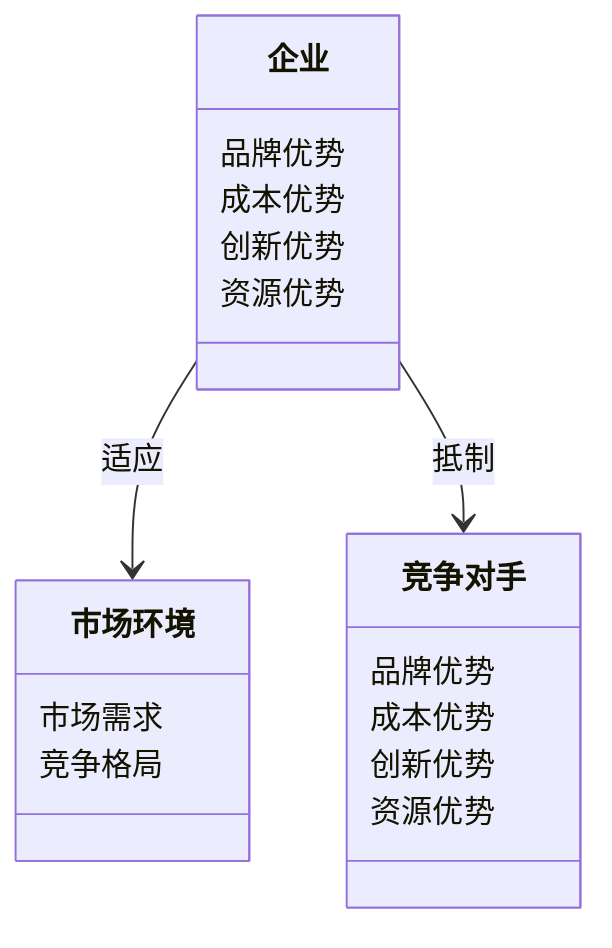
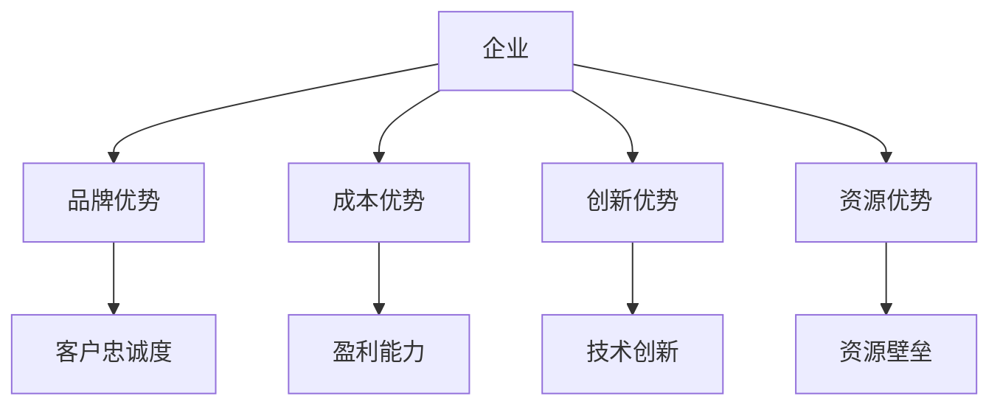
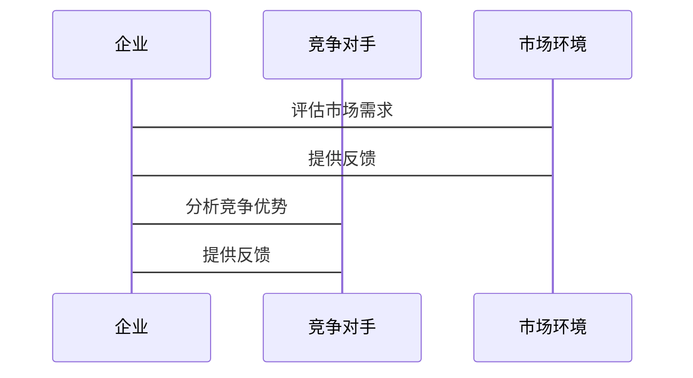

                 


# 巴菲特的护城河理论：寻找持久竞争优势

## 关键词：巴菲特，护城河，竞争优势，投资策略，企业战略

## 摘要：  
巴菲特的护城河理论是投资学中的核心概念，旨在通过识别企业的持久竞争优势来预测其长期盈利能力。本文从理论背景、核心概念、识别方法、评估模型、构建策略等方面进行详细分析，结合实际案例，探讨如何在现代商业环境中应用这一理论，以帮助投资者和企业管理者制定科学的决策。

---

## 第一部分：护城河理论的背景与核心概念

### 第1章：护城河理论的起源与发展

#### 1.1 护城河理论的起源  
护城河理论由投资大师沃伦·巴菲特提出，最初源于他对企业长期竞争优势的思考。他将“护城河”定义为一种能够防止竞争对手侵入企业核心业务的屏障，这种屏障可以是技术优势、品牌影响力、成本优势或网络效应等。

#### 1.2 护城河理论的核心概念  
护城河的核心在于企业能否在长期的竞争中保持优势地位。以下是护城河的几个关键属性：  
- **可持续性**：护城河必须能够在未来一段时间内持续发挥作用。  
- **防御性**：护城河能够有效抵御竞争对手的进攻。  
- **可扩展性**：护城河能够随着企业规模的扩大而增强。  

#### 1.3 护城河理论的特点  
护城河理论与传统的企业竞争优势理论有所不同。传统理论更多关注短期竞争优势，而护城河理论则强调长期性和防御性。  

---

### 第2章：护城河的核心要素与属性

#### 2.1 护城河的核心要素  
护城河的核心要素包括：  
1. **品牌优势**：强大的品牌可以为企业带来更高的客户忠诚度和定价能力。  
2. **成本优势**：企业通过技术创新或规模效应降低生产成本。  
3. **资源优势**：拥有独特的资源或数据，使竞争对手难以复制。  
4. **创新优势**：持续的技术创新或商业模式创新。  

#### 2.2 护城河的属性对比  
以下是护城河属性的对比分析：  
| 属性       | 可持续性 | 防御性 | 可扩展性 |  
|------------|----------|---------|----------|  
| 品牌优势   | 高       | 高       | 中       |  
| 成本优势   | 中       | 高       | 高       |  

---

### 第3章：护城河理论与其他竞争优势理论的对比

#### 3.1 与迈克尔·波特的五力分析模型的对比  
迈克尔·波特的五力分析模型关注行业竞争结构，而护城河理论更关注企业内部的竞争优势。  

#### 3.2 与竞争优势的动态演进模型的对比  
竞争优势的动态演进模型强调灵活性和适应性，而护城河理论更强调稳定性和防御性。  

---

## 第二部分：护城河的识别与评估

### 第4章：护城河的识别与评估

#### 4.1 护城河识别的关键指标  
以下是识别护城河的关键指标：  
1. **市场占有率**：高市场占有率通常意味着强大的品牌影响力。  
2. **净资产收益率（ROE）**：ROE高表明企业具有较强的盈利能力。  
3. **企业利润率**：高利润率可能意味着企业具有成本优势或定价能力。  

#### 4.2 护城河的评估方法  
以下是护城河的评估方法：  
1. **五力分析法**：用于评估行业竞争结构。  
2. **价值链分析法**：用于分析企业内部的价值链效率。  
3. **战略定位法**：用于评估企业战略的定位是否具有防御性。  

---

### 第5章：护城河的构建与维护

#### 5.1 护城河构建的核心策略  
1. **品牌建设**：通过广告、营销和客户体验提升品牌影响力。  
2. **成本控制**：通过技术创新和规模效应降低生产成本。  
3. **创新驱动**：通过持续的技术创新保持竞争优势。  
4. **资源整合**：通过资源整合增强企业的资源优势。  

#### 5.2 护城河的维护与优化  
1. **定期评估**：定期评估护城河的有效性，及时调整策略。  
2. **创新优化**：持续优化企业的产品和服务，以应对市场变化。  

---

## 第三部分：护城河理论的系统分析与架构设计

### 第6章：系统分析与架构设计方案

#### 6.1 问题场景介绍  
本文将护城河理论应用于实际企业分析，构建一个完整的分析框架。  

#### 6.2 项目介绍  
以某互联网企业为例，分析其护城河的构建与优化过程。  

#### 6.3 系统功能设计（领域模型）  
以下是领域模型的Mermaid类图：  


#### 6.4 系统架构设计（架构图）  
以下是系统架构的Mermaid图：  


#### 6.5 系统交互设计（序列图）  
以下是系统交互的Mermaid序列图：  


---

## 第四部分：项目实战

### 第7章：项目实战

#### 7.1 环境安装  
以下是分析工具的安装步骤：  
```bash
# 安装Python和相关库
pip install numpy pandas matplotlib
```

#### 7.2 核心实现代码  
以下是护城河识别的Python代码：  
```python
import pandas as pd

def calculate_roe(revenue, equity):
    return (net_profit / equity) * 100

data = {
    '公司': ['公司A', '公司B', '公司C'],
    '营收': [100, 200, 150],
    '净利润': [20, 30, 25],
    '股东权益': [50, 100, 75]
}

df = pd.DataFrame(data)
df['ROE'] = df.apply(lambda x: calculate_roe(x['营收'], x['股东权益']), axis=1)
print(df)
```

#### 7.3 案例分析  
以某互联网公司为例，分析其护城河的构建与优化过程。  

#### 7.4 项目小结  
通过本案例分析，我们可以看到护城河理论在实际应用中的重要性。  

---

## 第五部分：最佳实践与总结

### 第8章：最佳实践

#### 8.1 小结  
护城河理论是投资学和企业管理中的重要工具，能够帮助企业识别和构建持久的竞争优势。  

#### 8.2 注意事项  
在实际应用中，需要注意护城河的动态变化，及时调整策略。  

#### 8.3 拓展阅读  
推荐阅读巴菲特的《聪明的投资者》以及迈克尔·波特的竞争战略理论。  

---

## 总结  
巴菲特的护城河理论为企业提供了重要的竞争优势分析工具。通过本文的详细分析，读者可以更好地理解如何在实际投资和企业管理中应用这一理论。

