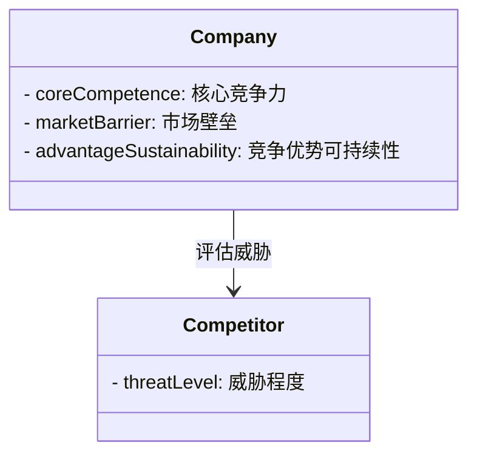

                 


# 巴菲特的护城河理论：寻找持久竞争优势

## 关键词：护城河理论，竞争优势，企业价值，可持续发展，网络效应，技术壁垒

## 摘要

在商业和技术领域，持久的竞争优势是企业长期成功的关键。巴菲特的护城河理论提供了一种方法，帮助投资者和企业管理者识别和构建这些优势。本文从技术视角深入分析护城河理论，探讨其在企业战略中的应用，结合实际案例，展示如何通过技术手段构建和维护护城河。

---

## 正文

### 第一部分：巴菲特护城河理论的背景与核心概念

#### 第1章：护城河理论的基本概念

##### 1.1 护城河理论的定义与背景

护城河理论由巴菲特提出，强调企业通过建立持久竞争优势来防止竞争对手侵蚀利润。在技术领域，这表现为通过技术创新、网络效应和成本控制等手段构建市场壁垒。

##### 1.2 问题背景与问题描述

企业在竞争激烈的市场中，常常面临被竞争对手取代的风险。护城河理论帮助识别那些能够维持高利润率和市场份额的企业。

##### 1.3 护城河理论的核心要素

- 核心竞争力：企业的独特优势，如技术专利或商业模式。
- 市场准入壁垒：防止竞争对手进入市场的障碍，如专利或品牌忠诚度。
- 可持续竞争优势：企业能够持续保持的竞争优势，如网络效应。

#### 第2章：护城河的核心概念与联系

##### 2.1 不同类型的护城河

| 护城河类型 | 特征 | 示例 |
|------------|------|------|
| 成本优势 | 低成本生产 | 制造业企业 |
| 品牌优势 | 强大品牌影响力 | 可口可乐 |
| 网络效应 | 用户数量增加，价值提升 | 社交媒体平台 |
| 技术壁垒 | 专有技术 | 软件企业 |

##### 2.2 护城河类型对比分析

使用Mermaid绘制的ER实体关系图，展示不同类型护城河的关联：

```mermaid
erDiagram
  customer[消费者]
  competitor[竞争对手]
  company[企业]
  costAdvantage<--cost: 具有成本优势
  brandAdvantage<--brand: 具有品牌优势
  networkEffect<--network: 具有网络效应
  techBarrier<--tech: 具有技术壁垒
```

### 第二部分：护城河理论的算法原理

#### 第3章：护城河评估的数学模型

##### 3.1 护城河强度评估模型

护城河强度可以通过以下公式计算：

$$
\text{护城河强度} = \frac{\text{核心竞争力} + \text{市场壁垒} + \text{竞争优势可持续性}}{3}
$$

其中：
- 核心竞争力：0-10分
- 市场壁垒：0-10分
- 竞争优势可持续性：0-10分

例如，若某企业得分为8/10/9，护城河强度为：

$$
\frac{8 + 10 + 9}{3} = 8.33
$$

##### 3.2 护城河构建的步骤

1. 识别核心竞争力
2. 分析市场准入壁垒
3. 评估竞争优势的可持续性

### 第三部分：系统分析与架构设计

#### 第4章：系统架构设计

##### 4.1 问题场景介绍

企业需要通过技术手段构建护城河，如开发专有技术或增强品牌影响力。

##### 4.2 系统功能设计

使用Mermaid绘制的领域模型类图：



##### 4.3 系统架构设计

使用Mermaid绘制的架构图：


### 第四部分：项目实战

#### 第5章：项目实战分析

##### 5.1 环境安装与核心实现

使用Python代码实现护城河强度评估模型：

```python
def calculate_h护城河强度(core_competence, market_barrier, advantage_sustainability):
    return (core_competence + market_barrier + advantage_sustainability) / 3

# 示例
core_competence = 8
market_barrier = 10
advantage_sustainability = 9
强度 = calculate_h护城河强度(core_competence, market_barrier, advantage_sustainability)
print(f"护城河强度: {强度}")
```

##### 5.2 代码应用解读与分析

解释代码如何帮助企业评估护城河强度，指导技术决策。

#### 第5.3 案例分析：亚马逊的护城河

分析亚马逊如何通过技术壁垒和网络效应构建护城河，展示其竞争优势的可持续性。

### 第五部分：最佳实践、小结与展望

#### 第6章：最佳实践与小结

##### 6.1 最佳实践

- 持续创新技术
- 加强品牌建设
- 优化成本控制

##### 6.2 小结

护城河理论在技术领域的重要性，通过构建强大的技术壁垒和网络效应，企业能够维持竞争优势。

#### 6.3 注意事项与未来展望

- 定期评估护城河强度
- 技术创新在护城河构建中的关键作用
- 人工智能在护城河分析中的应用潜力

---

## 结语

巴菲特的护城河理论在技术和商业领域具有深远影响。通过系统分析和实际案例，我们可以看到，护城河理论不仅是投资决策的工具，更是企业战略的重要组成部分。未来，随着技术的发展，护城河的构建将更加依赖于创新和数字化转型，企业需持续努力以维持竞争优势。

