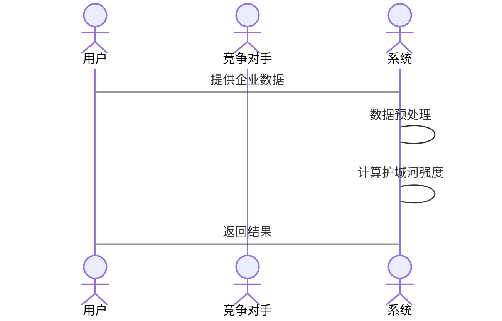

                 


# 巴菲特的护城河理论：寻找持久竞争优势

## 关键词：巴菲特，护城河，竞争优势，商业模式，投资策略

## 摘要：  
巴菲特的护城河理论是企业竞争优势的核心思想，通过识别和构建持久的竞争优势，企业能够在激烈的市场中立于不败之地。本文深入探讨护城河的四大要素，分析其数学模型，设计护城河评估算法，并通过实际案例展示其应用，帮助读者理解如何在商业决策中运用这一理论。

---

## 第一部分：护城河理论的背景与核心概念

### 第1章：护城河理论的定义与背景

#### 1.1 巴菲特投资理念的形成  
巴菲特的投资理念强调长期价值，护城河理论是其核心之一。护城河帮助企业抵御竞争对手，确保长期收益。  

#### 1.2 护城河理论的核心思想  
护城河是企业在市场中的竞争优势，包括成本优势、差异化、网络效应和品牌忠诚度。  

#### 1.3 护城河理论在现代商业中的应用  
企业通过护城河建立长期优势，避免市场份额被侵蚀。  

---

### 第2章：护城河的核心要素

#### 2.1 成本优势  
通过规模经济和专有技术降低成本，形成价格优势。  

#### 2.2 差异化优势  
提供独特的产品或服务，满足特定客户需求。  

#### 2.3 网络效应  
用户数量增加带来价值提升，形成正反馈循环。  

#### 2.4 品牌忠诚度  
通过长期信任和优质服务，培养客户忠诚度。  

---

## 第二部分：护城河的识别与评估

### 第3章：护城河识别的关键指标

#### 3.1 市场地位分析  
市场占有率高，竞争对手难以超越。  

#### 3.2 财务表现评估  
盈利能力稳定，财务状况健康。  

#### 3.3 竞争对手分析  
竞争对手难以复制的核心优势。  

#### 3.4 行业环境评估  
行业进入壁垒高，竞争压力小。  

---

### 第4章：护城河的构建与强化

#### 4.1 创新驱动型护城河  
通过持续创新保持技术领先。  

#### 4.2 规模效应型护城河  
利用规模经济降低成本。  

#### 4.3 技术壁垒型护城河  
通过专利和技术封锁形成壁垒。  

#### 4.4 品牌忠诚型护城河  
通过品牌建设赢得客户信任。  

---

## 第三部分：护城河的失效与重构

### 第5章：护城河失效的常见原因

#### 5.1 技术进步的冲击  
新技术出现，原有优势被取代。  

#### 5.2 市场需求变化  
消费者偏好改变，原有优势不再适用。  

#### 5.3 竞争策略调整  
竞争对手采取新的策略，削弱护城河。  

#### 5.4 内部管理问题  
内部效率低下，无法维持竞争优势。  

---

## 第四部分：护城河理论的数学模型与分析方法

### 第6章：护城河强度评估模型

#### 6.1 模型的构建与公式推导  
护城河强度 = (成本优势 + 差异化优势 + 网络效应 + 品牌忠诚度) / 4  

#### 6.2 模型的变量定义与假设  
- 成本优势：企业相对于竞争对手的成本优势程度。  
- 差异化优势：产品或服务的独特性。  
- 网络效应：用户数量与价值的关系。  
- 品牌忠诚度：客户对品牌的信任度。  

#### 6.3 模型的应用与验证  
通过实际案例验证模型的有效性。  

---

### 第7章：护城河分析系统的功能设计

#### 7.1 系统需求分析  
- 数据采集模块：收集企业数据。  
- 数据处理模块：清洗和转换数据。  
- 模型评估模块：计算护城河强度。  
- 可视化模块：展示评估结果。  

#### 7.2 系统功能模块划分  
- 数据采集模块  
- 数据处理模块  
- 模型评估模块  
- 可视化模块  

#### 7.3 系统架构设计  
- 使用分层架构：数据层、业务逻辑层、表现层。  

#### 7.4 系统接口设计  
- RESTful API接口：提供数据接口服务。  

---

## 第五部分：护城河理论的系统架构与实现

### 第8章：护城河分析系统的实现

#### 8.1 项目实战：环境安装  
- Python 3.8及以上版本  
- 安装必要的库：pandas、numpy、scikit-learn  

#### 8.2 核心实现代码  

```python
import pandas as pd
from sklearn.metrics import mean_squared_error

# 数据预处理
def preprocess_data(data):
    # 删除缺失值
    data = data.dropna()
    # 标准化处理
    data = (data - data.mean()) / data.std()
    return data

# 护城河强度评估模型
def calculate_h competitive_strength(data):
    cost_adv = data['cost_adv']
    diff_adv = data['diff_adv']
    network = data['network']
    brand = data['brand']
    return (cost_adv + diff_adv + network + brand) / 4

# 模型验证
def model_validation(data, actual_labels):
    predicted_labels = calculate_h competitive_strength(data)
    mse = mean_squared_error(actual_labels, predicted_labels)
    return mse

# 示例数据
data = pd.DataFrame({
    'cost_adv': [0.8, 0.6, 0.7],
    'diff_adv': [0.9, 0.5, 0.6],
    'network': [0.7, 0.8, 0.6],
    'brand': [0.8, 0.7, 0.9]
})

actual_labels = [0.75, 0.6, 0.65]
mse = model_validation(data, actual_labels)
print(f"均方误差：{mse}")
```

#### 8.3 系统交互设计  
使用Mermaid序列图展示系统交互流程：  



---

## 第六部分：总结与展望

### 第9章：总结与展望

#### 9.1 核心要点回顾  
护城河理论帮助企业识别和构建持久的竞争优势。  

#### 9.2 实际应用中的注意事项  
定期评估和维护护城河，应对市场变化。  

#### 9.3 未来研究方向  
探索护城河在数字化转型和可持续发展中的应用。  

---

## 参考文献  
1. 巴菲特股东大会讲话  
2. 《巴菲特投资策略》  
3. 相关学术论文  

---

通过以上结构和内容的详细阐述，这篇文章系统地介绍了巴菲特的护城河理论，从理论到实践，帮助读者全面理解并应用这一理论。

