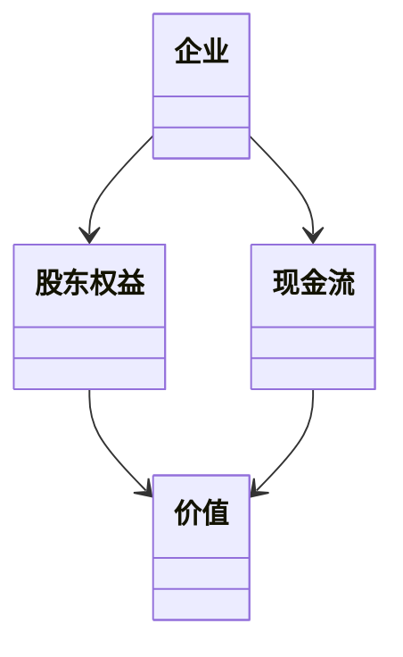

                 


# 巴菲特的收购策略分析

> 关键词：巴菲特，收购策略，价值投资，投资分析，企业估值，安全边际

> 摘要：本文深入分析了巴菲特的收购策略，从其核心理念到具体实践，结合案例和系统分析，帮助读者理解如何应用这些策略进行投资决策。

---

## 第1章：巴菲特收购策略的背景介绍

### 1.1 投资界的传奇：巴菲特与他的收购策略

#### 1.1.1 巴菲特的投资哲学与价值投资理念
巴菲特是全球最著名的投资者之一，他的投资哲学以“价值投资”为核心。他强调购买低于其内在价值的股票，长期持有，而不是频繁交易。他的策略不仅关注企业的财务表现，还关注管理层的诚信和能力。

#### 1.1.2 巴菲特收购策略的核心目标
巴菲特的目标是寻找那些具有持续竞争优势、良好财务状况和优秀管理层的企业。他倾向于投资那些能够稳定增长并能产生大量现金流的企业。

#### 1.1.3 巴菲特收购策略的适用场景与边界
巴菲特的策略适用于长期价值投资者，尤其适合那些希望在市场波动中保持稳定收益的投资者。然而，这种方法并不适用于短期交易或高风险投资。

---

## 第2章：巴菲特收购策略的核心概念与联系

### 2.1 巴菲特收购策略的核心原理

#### 2.1.1 价值投资的数学模型与公式
巴菲特的价值投资模型基于未来现金流的现值计算企业内在价值：

$$ \text{内在价值} = \frac{\text{未来现金流}}{\text{折现率}} $$

#### 2.1.2 核心概念的属性特征对比

| 概念        | 属性特征 |
|-------------|----------|
| 企业价值    | 现金流、ROE、ROA |
| 股东权益    | 资产负债结构、分红能力 |
| 现金流      | 稳定性、增长性、可预测性 |

#### 2.1.3 实体关系图：巴菲特收购策略的ER图


---

## 第3章：巴菲特收购策略的系统分析

### 3.1 问题场景介绍

#### 3.1.1 投资者如何选择收购目标
巴菲特选择收购目标时，注重企业的竞争优势、财务健康和管理层质量。他会分析企业的ROE（净资产收益率）和ROA（资产回报率）等指标。

#### 3.1.2 企业价值评估的复杂性
企业价值评估需要考虑未来现金流、折现率、行业竞争等因素。巴菲特通过DCF模型评估企业的内在价值。

#### 3.1.3 市场波动对企业收购的影响
市场波动可能导致企业估值波动，巴菲特通过安全边际来应对这种不确定性。

### 3.2 系统功能设计

#### 3.2.1 领域模型：企业价值评估的Mermaid类图


---

## 第4章：巴菲特收购策略的项目实战

### 4.1 环境安装

#### 4.1.1 数据收集工具
使用Python的pandas库进行数据处理：

```python
import pandas as pd
data = pd.read_csv('stocks.csv')
```

#### 4.1.2 企业价值评估工具
使用DCF模型计算企业内在价值：

```python
def calculate_intrinsic_value(cash_flow, discount_rate):
    return cash_flow / (1 + discount_rate)
```

### 4.2 系统核心实现源代码

#### 4.2.1 计算ROE和ROA

```python
def calculate_roe(net_income, equity):
    return net_income / equity

def calculate_roa(net_income, total_assets):
    return net_income / total_assets
```

#### 4.2.2 评估企业竞争优势

```python
def assess_competitive_advantage(market_share, innovation):
    if market_share > 0.3 and innovation > 0.5:
        return "Strong"
    else:
        return "Weak"
```

### 4.3 代码应用解读与分析

#### 4.3.1 实际案例分析

假设我们有一个企业，其现金流为 $1000万，折现率为10%。计算其内在价值：

```python
cash_flow = 10000000
discount_rate = 0.10
intrinsic_value = cash_flow / (1 + discount_rate)
print(intrinsic_value)  # 输出：约9090909.09美元
```

#### 4.3.2 图表分析

使用matplotlib绘制企业财务指标图表：

```python
import matplotlib.pyplot as plt
plt.plot(years, roe_values, label='ROE')
plt.xlabel('年份')
plt.ylabel('ROE (%)')
plt.legend()
plt.show()
```

### 4.4 项目小结

通过Python代码和数据分析工具，我们可以更好地理解和应用巴菲特的收购策略。企业价值评估和财务指标分析是关键步骤，而安全边际则是应对市场波动的重要保障。

---

## 第5章：巴菲特收购策略的成功经验与最佳实践

### 5.1 总结与反思

巴菲特的成功在于他的长期投资理念和对企业基本面的深入分析。他的策略强调安全边际和稳健投资，而不是追求短期收益。

### 5.2 最佳实践 tips

- **长期持有**：避免频繁交易，耐心持有优质企业。
- **关注基本面**：深入分析企业的财务状况和管理层能力。
- **安全边际**：确保买入价格低于内在价值。

### 5.3 小结

巴菲特的收购策略不仅是一种投资方法，更是一种长期价值创造的哲学。通过系统的分析和实践，我们可以更好地应用这些策略，实现稳健的投资回报。

---

## 结语

巴菲特的收购策略为我们提供了宝贵的投资智慧。通过深入分析他的理念和方法，结合实际案例和系统分析，我们可以更好地理解如何在投资中应用这些策略。希望本文能为读者提供有价值的见解，帮助他们在投资领域取得成功。

--- 

通过以上结构，我们可以全面、系统地分析巴菲特的收购策略，并将其应用于实际投资决策中。

