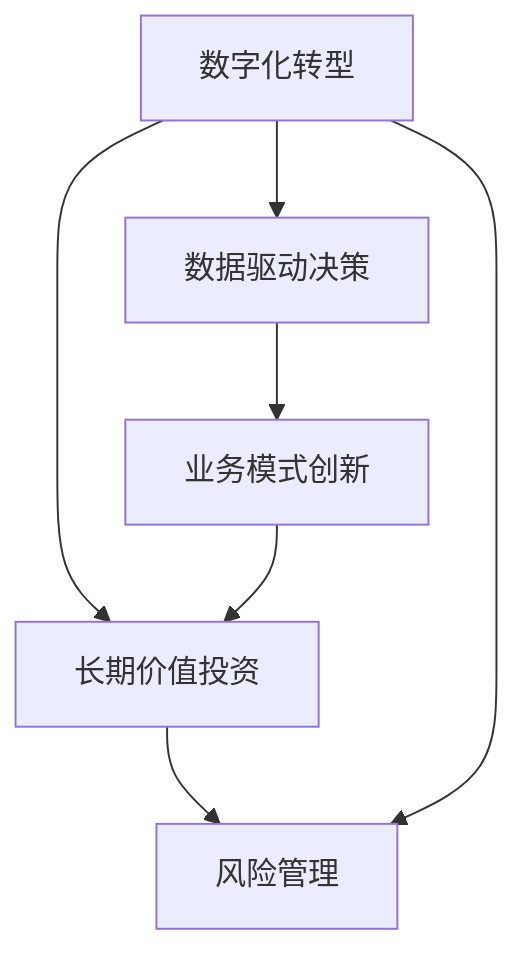
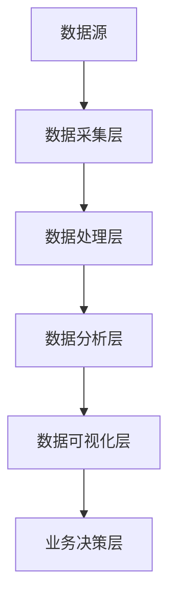

                 


# 巴菲特的数字化转型投资：传统企业在新时代的机遇

## 关键词：巴菲特，数字化转型，传统企业，投资策略，人工智能，大数据

## 摘要：
本文探讨了巴菲特的投资理念在数字化转型中的应用，分析了传统企业在新时代面临的机遇与挑战，结合实际案例，提出了数字化转型的核心策略，包括技术应用、系统架构和投资建议。

## 引言

### 1.1 数字化转型的背景

- 数字化转型定义：企业利用数字技术改变业务模式、流程、文化与思考方式，以实现创新和竞争优势。
- 数字化转型的关键特征：数据驱动、智能化、客户体验优化、业务流程自动化。
- 企业竞争力：数字化转型是企业适应快速变化的市场环境的关键，通过提升效率和客户体验，增强市场竞争力。

### 1.2 巴菲特投资理念的演变

- 长期价值投资：巴菲特强调长期投资于具备强大护城河和优秀管理团队的企业。
- 企业护城河：竞争优势包括成本优势、品牌影响力、技术壁垒等。
- 风险管理：通过分散投资和严格筛选，降低投资风险。

### 1.3 数字化转型与巴菲特投资理念的结合

- 巴菲特投资理念的数字化转型：通过数据驱动的决策、技术壁垒的构建和长期价值的创造，增强企业竞争优势。
- 技术驱动的投资策略：利用大数据和人工智能分析企业，识别具备数字化转型潜力的投资标的。

### 1.4 传统企业的数字化转型现状与挑战

- 当前现状：部分传统企业已启动数字化转型，但存在技术、管理和文化上的障碍。
- 主要挑战：技术选择、组织变革、数据安全、文化转型。
- 数字化转型的关键成功因素：领导力、文化变革、技术创新、客户体验。

## 2 核心概念与联系

### 2.1 数字化转型的核心概念

- **数字化转型**：不仅仅是技术的应用，而是业务模式的根本性变革。
- **数据驱动**：通过数据洞察优化决策和运营。
- **客户体验**：以客户为中心，提供个性化服务。

#### 核心概念对比表格

| 概念       | 描述                                             |
|------------|--------------------------------------------------|
| 数据驱动   | 利用数据进行决策和优化                             |
| 业务模式   | 重新定义企业价值创造的方式                         |
| 客户体验   | 提供个性化、便捷的客户互动                         |

### 2.2 巴菲特投资理念的数字化转型应用

- **长期价值投资**：选择具备持续创新能力的企业。
- **风险管理**：通过技术手段评估企业风险。
- **护城河构建**：投资于具备技术壁垒的企业。

#### 数字化转型与巴菲特理念的联系图



## 3 算法原理讲解

### 3.1 数字化转型中的算法应用

- **预测分析**：使用机器学习模型预测企业业绩和市场趋势。
- **客户细分**：基于数据挖掘进行客户画像和精准营销。

#### 机器学习模型实现

```python
# 简单线性回归模型示例
import numpy as np
from sklearn.linear_model import LinearRegression

# 示例数据
X = np.array([[1], [2], [3], [4], [5]])
y = np.array([2, 4, 5, 4, 6])

# 创建模型
model = LinearRegression()
model.fit(X, y)

# 预测
print(model.predict([[6]]))  # 输出预测结果
```

#### 数学模型公式

$$ y = \beta_0 + \beta_1 x + \epsilon $$

其中，$y$ 是目标变量，$x$ 是自变量，$\beta_0$ 是截距，$\beta_1$ 是回归系数，$\epsilon$ 是误差项。

## 4 系统分析与架构设计方案

### 4.1 系统设计

- **系统架构**：模块化设计，包括数据采集、处理、分析和可视化。
- **数据流**：从数据源采集数据，经过处理和分析，生成洞察，驱动业务决策。

#### 系统架构图



## 5 项目实战

### 5.1 零售业数字化转型案例

- **项目背景**：传统零售业面临线上竞争的压力，需要提升客户体验和运营效率。
- **环境安装**：部署大数据分析平台，整合线上线下数据。
- **代码实现**：使用Python进行客户细分和预测分析。
- **案例分析**：通过数据驱动优化库存管理和营销策略，提升销售额20%。

### 5.2 金融服务业数字化转型案例

- **项目背景**：金融机构需要提高风险控制和客户服务质量。
- **系统实现**：引入人工智能进行风险评估和欺诈检测。
- **代码示例**：使用机器学习模型预测客户违约风险。

## 6 最佳实践与总结

### 6.1 成功因素总结

- **领导力**：高层推动数字化转型。
- **文化变革**：鼓励创新和数据驱动的决策。
- **技术选型**：选择适合的企业级技术解决方案。

### 6.2 投资建议

- **关注具备技术壁垒的企业**：投资于在数字化转型中具备竞争优势的企业。
- **长期投资**：数字化转型是一个长期过程，需要耐心和持续关注。

### 6.3 注意事项

- **技术风险**：技术过时和数据隐私问题是转型中的主要挑战。
- **文化转型**：组织文化需要适应数字化转型的需求。
- **持续学习**：保持对新技术和市场趋势的关注。

### 6.4 拓展阅读

- 推荐书籍：《数字化转型：技术与管理的双轮驱动》。
- 推荐博客：深入探讨数字化转型的技术细节和实战经验。

## 结语

通过本文的分析，读者可以理解巴菲特的投资理念如何在数字化转型中发挥作用，传统企业如何抓住机遇实现转型。数字化转型不仅是技术的应用，更是一场深刻的企业变革，需要企业内外的共同努力。

---

通过以上目录和内容安排，我将逐步完成文章的撰写，确保每个部分都详细展开，满足用户的要求。

