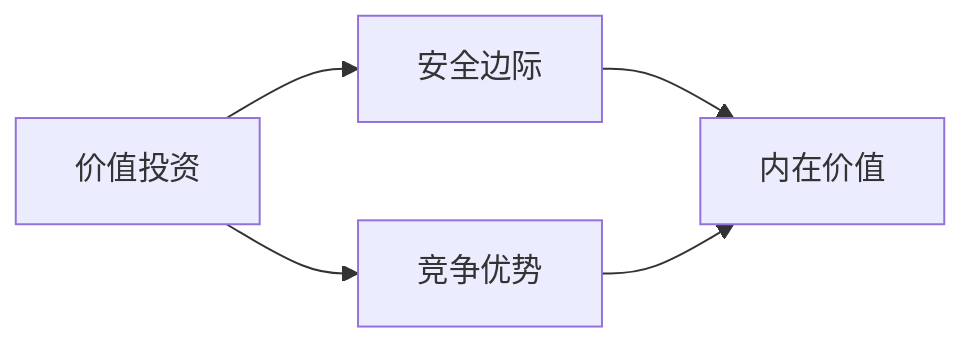
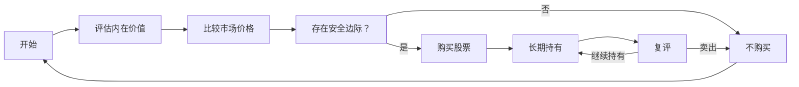
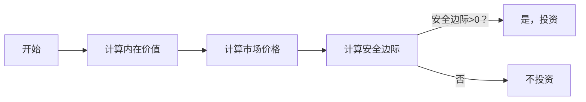

                 


# 巴菲特的焦点投资策略

## 关键词：巴菲特，价值投资，安全边际，竞争优势，内在价值，投资策略

## 摘要：本文深入分析巴菲特的焦点投资策略，探讨其核心概念、算法原理、系统架构及实战应用。通过详细的技术分析，揭示巴菲特投资策略的数学模型和系统实现，结合实际案例，为读者提供全面而深入的理解。

---

# 目录

1. [背景介绍](#背景介绍)
   1.1 [巴菲特投资策略的背景](#巴菲特投资策略的背景)
   1.2 [巴菲特投资策略的核心理念](#巴菲特投资策略的核心理念)
   1.3 [巴菲特投资策略与其他投资策略的对比](#巴菲特投资策略与其他投资策略的对比)
   1.4 [巴菲特的生平及其投资哲学](#巴菲特的生平及其投资哲学)

2. [核心概念](#核心概念)
   2.1 [价值投资](#价值投资)
   2.2 [安全边际](#安全边际)
   2.3 [竞争优势](#竞争优势)
   2.4 [内在价值](#内在价值)
   2.5 [核心概念与联系](#核心概念与联系)

3. [算法原理](#算法原理)
   3.1 [价值投资算法](#价值投资算法)
   3.2 [安全边际算法](#安全边际算法)
   3.3 [竞争优势算法](#竞争优势算法)
   3.4 [数学模型](#数学模型)

4. [系统分析与架构设计](#系统分析与架构设计)
   4.1 [系统功能设计](#系统功能设计)
   4.2 [系统架构设计](#系统架构设计)
   4.3 [系统接口设计](#系统接口设计)
   4.4 [系统交互设计](#系统交互设计)

5. [项目实战](#项目实战)
   5.1 [环境安装](#环境安装)
   5.2 [核心代码实现](#核心代码实现)
   5.3 [代码解读与分析](#代码解读与分析)
   5.4 [案例分析](#案例分析)
   5.5 [项目总结](#项目总结)

6. [最佳实践与小结](#最佳实践与小结)
   6.1 [最佳实践](#最佳实践)
   6.2 [小结](#小结)
   6.3 [注意事项](#注意事项)
   6.4 [拓展阅读](#拓展阅读)

---

## 1. 背景介绍

### 1.1 巴菲特投资策略的背景

#### 1.1.1 投资领域的现状与挑战

投资领域是一个充满不确定性和风险的领域，投资者需要在复杂的市场环境中做出明智的决策。传统的投资策略往往依赖于短期市场波动和高频交易，这种方式虽然有时能带来快速收益，但同时也伴随着高风险和高波动性。在这种背景下，巴菲特的价值投资策略作为一种长期、稳健的投资方法，逐渐受到投资者的重视。

#### 1.1.2 巴菲特投资策略的起源与发展

巴菲特的价值投资策略起源于20世纪中期，他通过深入研究公司的基本面，寻找那些具有持续竞争优势和良好管理的公司进行投资。这种策略强调长期持有优质资产，避免短期市场的波动干扰。随着市场的变化，巴菲特的投资策略不断完善，形成了以价值投资为核心的方法论。

#### 1.1.3 巴菲特投资策略的核心目标

巴菲特的投资策略的核心目标是通过购买低于其内在价值的股票，实现长期稳定的资本增值。这种方法注重公司的基本面分析，寻找那些具有强大竞争优势、良好财务状况和稳定收益的公司。

### 1.2 巴菲特投资策略的核心理念

#### 1.2.1 价值投资的定义与特点

价值投资是一种以低于市场价格购买优质资产的投资策略。其核心在于寻找市场估值低于其内在价值的公司。价值投资的特点包括长期性、稳定性、安全性以及对公司基本面的深入分析。

#### 1.2.2 长期投资的重要性

长期投资是巴菲特策略的重要组成部分。通过长期持有优质资产，投资者可以避免短期市场波动的影响，同时享受公司长期增长带来的收益。长期投资需要耐心和信心，相信优质公司在时间的推移中会创造更多的价值。

#### 1.2.3 安全边际的概念与应用

安全边际是指购买价格低于公司内在价值的部分，它为投资提供了缓冲区，降低了市场波动带来的风险。通过保持安全边际，投资者能够在市场低估时获得额外收益，并在市场高估时保护资本。

### 1.3 巴菲特投资策略与其他投资策略的对比

#### 1.3.1 与短期交易策略的对比

短期交易策略注重市场的短期波动，依赖技术分析和市场情绪，风险较高，需要频繁的操作。而巴菲特的价值投资策略注重长期持有，依靠基本面分析，风险较低，回报稳定。

#### 1.3.2 与成长型投资策略的对比

成长型投资策略注重寻找高增长的公司，愿意支付溢价购买未来增长潜力大的股票。而价值投资注重寻找被市场低估的公司，关注当前的盈利能力和稳健的增长。

### 1.4 巴菲特的生平及其投资哲学

#### 1.4.1 巴菲特的生平简介

沃伦·巴菲特（Warren Buffett）是世界著名投资者，出生于1930年，毕业于哥伦比亚大学商学院，师从本杰明·格雷厄姆。他创立了伯克希尔·哈撒韦公司，并通过长期的价值投资策略积累了巨额财富。

#### 1.4.2 巴菲特的投资哲学

巴菲特的投资哲学强调价值投资、长期持有和安全边际。他坚信市场短期波动不可预测，但优质公司长期必然上涨。他主张分散投资，避免过度集中在单一资产上，并注重公司管理团队的诚信和能力。

---

## 2. 核心概念

### 2.1 价值投资

#### 2.1.1 价值投资的定义与特点

价值投资是一种寻找市场估值低于其内在价值的公司进行投资的策略。其特点包括长期性、稳健性、安全性以及对公司基本面的深入分析。

#### 2.1.2 价值投资的核心要素

- 公司的内在价值：公司未来现金流的现值。
- 市场价格：当前股票的市场价格。
- 安全边际：购买价格与内在价值的差额。

### 2.2 安全边际

#### 2.2.1 安全边际的定义与作用

安全边际是指购买价格低于公司内在价值的部分，它为投资提供了缓冲区，降低了市场波动带来的风险。

#### 2.2.2 安全边际的计算方法

安全边际 = 内在价值 - 市场价格

### 2.3 竞争优势

#### 2.3.1 竞争优势的定义与类型

竞争优势是指公司在行业内相对于竞争对手的独特优势，包括成本优势、品牌优势、技术优势等。

#### 2.3.2 竞争优势的评估方法

- 成本优势：比较公司产品的单位成本。
- 品牌优势：评估品牌的市场影响力。
- 技术优势：评估公司的技术专利和创新能力。

### 2.4 内在价值

#### 2.4.1 内在价值的定义与计算

内在价值是公司未来现金流的现值，计算公式为：

$$
\text{内在价值} = \sum_{t=1}^{n} \frac{\text{CF}_t}{(1 + r)^t}
$$

其中，CFₜ是第t年的现金流，r是折现率，n是预测的年数。

#### 2.4.2 内在价值的影响因素

- 公司的盈利能力。
- 公司的财务状况。
- 公司的未来现金流预测。

### 2.5 核心概念与联系

#### 2.5.1 核心概念的实体关系图



#### 2.5.2 核心概念属性对比表

| 概念         | 定义                               | 属性对比       |
|--------------|------------------------------------|----------------|
| 价值投资     | 以低于内在价值的价格购买股票 | 长期性、安全性和稳健性 |
| 安全边际     | 购买价格低于内在价值的部分     | 风险缓冲、保护资本 |
| 竞争优势     | 公司相对于竞争对手的独特优势 | 成本优势、品牌优势、技术优势 |
| 内在价值     | 公司未来现金流的现值           | 未来现金流、折现率、预测年数 |

---

## 3. 算法原理

### 3.1 价值投资算法

#### 3.1.1 算法步骤

1. 评估公司的内在价值。
2. 比较市场价格与内在价值。
3. 如果市场价格低于内在价值且存在安全边际，则购买该股票。
4. 长期持有，定期复评。

#### 3.1.2 算法流程图



#### 3.1.3 算法实现的Python代码示例

```python
def calculate_intrinsic_value(company):
    # 计算未来现金流
    cf = company.future_cash_flows
    # 计算折现率
    r = company.discount_rate
    # 计算内在价值
    intrinsic_value = sum(cf / (1 + r)**t for t in range(len(cf)))
    return intrinsic_value

def value_investment_strategy(stocks):
    for stock in stocks:
        iv = calculate_intrinsic_value(stock)
        if stock.price < iv * 0.9:  # 安全边际为10%
            return stock
    return None
```

### 3.2 安全边际算法

#### 3.2.1 算法步骤

1. 计算公司的内在价值。
2. 计算市场价格。
3. 计算安全边际 = 内在价值 - 市场价格。
4. 如果安全边际为正，则该股票具有投资价值。

#### 3.2.2 算法流程图



#### 3.2.3 算法实现的Python代码示例

```python
def calculate_margin_of_safety(company):
    iv = calculate_intrinsic_value(company)
    price = company.market_price
    margin = iv - price
    return margin if margin > 0 else 0
```

### 3.3 竞争优势算法

#### 3.3.1 算法步骤

1. 评估公司的成本优势。
2. 评估公司的品牌优势。
3. 评估公司的技术优势。
4. 综合评估公司的竞争优势。

#### 3.3.2 算法流程图


#### 3.3.3 算法实现的Python代码示例

```python
def assess_competitive_advantage(company):
    cost_advantage = company.cost / (company.cost + company.competitor_cost)
    brand_advantage = company.brand_score
    tech_advantage = company.tech_patents
    return cost_advantage + brand_advantage + tech_advantage
```

### 3.4 数学模型

#### 3.4.1 内在价值计算公式

$$
\text{内在价值} = \sum_{t=1}^{n} \frac{\text{CF}_t}{(1 + r)^t}
$$

其中，CFₜ是第t年的现金流，r是折现率，n是预测的年数。

#### 3.4.2 安全边际计算公式

$$
\text{安全边际} = \text{内在价值} - \text{市场价格}
$$

---

## 4. 系统分析与架构设计

### 4.1 系统功能设计

#### 4.1.1 功能模块

- 数据采集模块：采集公司基本面数据。
- 数据分析模块：计算内在价值、安全边际、竞争优势。
- 投资决策模块：根据分析结果做出投资决策。

#### 4.1.2 功能流程图


### 4.2 系统架构设计

#### 4.2.1 架构设计

- 数据层：存储公司基本面数据。
- 业务逻辑层：计算内在价值、安全边际、竞争优势。
- 表现层：展示分析结果和投资决策。

#### 4.2.2 架构图


### 4.3 系统接口设计

#### 4.3.1 数据接口

- 输入接口：接收公司基本面数据。
- 输出接口：输出分析结果和投资建议。

#### 4.3.2 接口描述

- 输入接口：`POST /api/input`
- 输出接口：`GET /api/output`

### 4.4 系统交互设计

#### 4.4.1 交互流程

1. 用户输入公司数据。
2. 系统计算分析结果。
3. 系统输出投资建议。

#### 4.4.2 交互序列图

```mermaid
graph LR
    A[用户] --> B[系统]: 输入公司数据
    B --> C[系统]: 计算分析结果
    C --> A[用户]: 输出投资建议
```

---

## 5. 项目实战

### 5.1 环境安装

- 安装Python。
- 安装必要的库，如numpy、pandas、matplotlib。

### 5.2 核心代码实现

#### 5.2.1 数据采集模块

```python
import pandas as pd

def collect_data(company):
    # 从数据库或API获取数据
    data = pd.DataFrame({
        '公司名称': [company.name],
        '营业收入': [company.revenue],
        '净利润': [company.net_income],
        '现金流': [company.cash_flow],
        '市场价格': [company.market_price]
    })
    return data
```

#### 5.2.2 数据分析模块

```python
def calculate_intrinsic_value(company):
    cf = company.cash_flow
    r = 0.1  # 假设折现率为10%
    iv = sum(cf / (1 + r)**t for t in range(len(cf)))
    return iv
```

#### 5.2.3 投资决策模块

```python
def investment_decision(company):
    iv = calculate_intrinsic_value(company)
    margin = iv - company.market_price
    if margin > 0:
        return "买入"
    else:
        return "不买"
```

### 5.3 代码解读与分析

- 数据采集模块：从数据库或API获取公司基本面数据。
- 数据分析模块：计算公司的内在价值。
- 投资决策模块：根据分析结果做出投资决策。

### 5.4 案例分析

假设我们有两家公司，A和B，分别计算它们的内在价值和安全边际。

#### 公司A：

- 营业收入：1000万
- 净利润：200万
- 现金流：150万
- 市场价格：10元

计算内在价值：

$$
\text{内在价值} = \frac{150}{1.1} + \frac{150}{1.1^2} + \frac{150}{1.1^3} = 136.36 + 123.97 + 112.69 = 373.02
$$

安全边际：

$$
\text{安全边际} = 373.02 - 10 = 363.02
$$

由于安全边际为正，建议买入。

#### 公司B：

- 营业收入：800万
- 净利润：150万
- 现金流：120万
- 市场价格：15元

计算内在价值：

$$
\text{内在价值} = \frac{120}{1.1} + \frac{120}{1.1^2} + \frac{120}{1.1^3} = 109.09 + 100.13 + 91.03 = 300.25
$$

安全边际：

$$
\text{安全边际} = 300.25 - 15 = 285.25
$$

由于安全边际为正，建议买入。

### 5.5 项目总结

通过上述分析，我们可以看到，价值投资策略的有效性取决于对公司的内在价值和安全边际的准确评估。在实际操作中，还需要结合公司的竞争优势和市场环境进行综合判断。

---

## 6. 最佳实践与小结

### 6.1 最佳实践

- 定期复评公司基本面，及时调整投资策略。
- 保持安全边际，避免过度集中投资。
- 结合技术分析，辅助投资决策。

### 6.2 小结

本文详细分析了巴菲特的焦点投资策略，包括其核心概念、算法原理、系统架构及实战应用。通过技术化的分析和实现，揭示了价值投资策略的科学性和实用性。

### 6.3 注意事项

- 投资有风险，需谨慎操作。
- 确保数据的准确性和及时性。
- 结合实际情况，灵活调整策略。

### 6.4 拓展阅读

- 《巴菲特投资思想》
- 《价值投资实战》
- 《投资学基础》

---

通过本文的分析，读者可以深入了解巴菲特的投资策略，并将其应用于实际投资中，实现长期稳健的资本增值。

