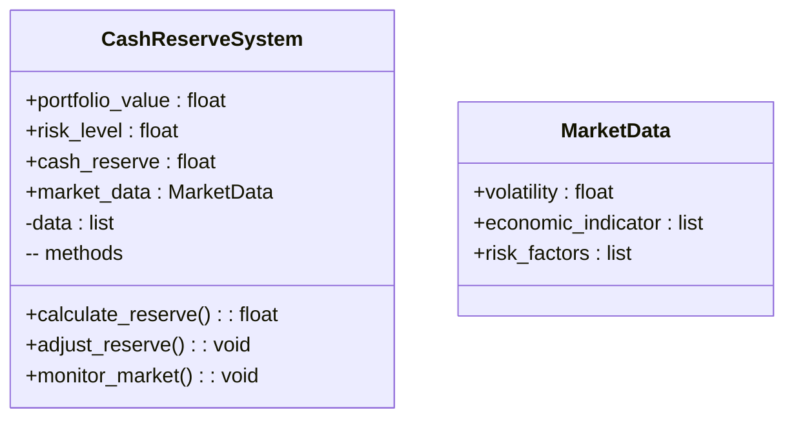
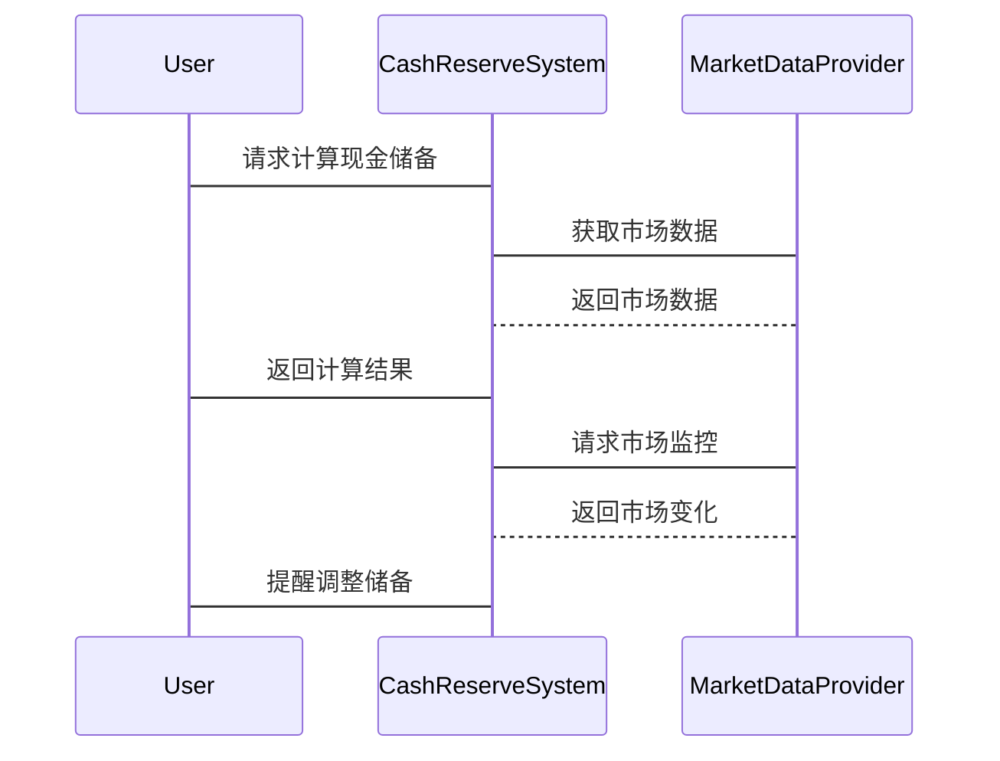

                 


### 第二部分: 巴菲特现金储备策略的核心概念与联系

## 第4章: 现金储备策略的核心概念

### 4.1 现金储备策略的原理

#### 现金储备的原理

现金储备策略的原理基于以下几点：
- **流动性支持**：现金作为流动性最强的资产，能够迅速满足支付需求。
- **风险管理**：通过持有现金，投资者可以降低市场波动带来的风险，避免被迫出售其他资产。
- **投资机会**：充足的现金储备能够在市场低估时进行战略性投资，捕捉超额收益。

#### 现金储备的原理与巴菲特投资理念的结合

巴菲特的投资理念强调长期持有优质资产，而现金储备则是这一理念的重要补充。他在市场恐慌时增加现金储备，以便在低价时买入优质资产，体现了他对内在价值的重视和对市场机会的把握。

### 4.2 现金储备策略的核心概念对比

#### 现金储备与其他投资策略的对比

| 策略类型       | 现金储备           | 股票投资             | 债券投资             |
|----------------|--------------------|----------------------|----------------------|
| 风险水平       | 低                 | 高                   | 中                   |
| 流动性         | 高                 | 低                   | 中                   |
| 收益潜力       | 低                 | 高                   | 中                   |
| 适用场景       | 应对不确定性，抓住机会 | 长期增值，分享企业成长 | 稳定收益，风险较低     |

#### 现金储备与其他风险管理工具的对比

| 工具类型       | 现金储备           | 保险                 | 衍生品（如期权）     |
|----------------|--------------------|----------------------|----------------------|
| 成本           | 较低               | 较高                 | 中等                 |
| 灵活性         | 高                 | 低                   | 高                   |
| 适用范围       | 应对流动性需求和投资机会 | 转移特定风险         | 投资于市场波动        |

### 4.3 现金储备策略的ER实体关系图

以下是现金储备策略的ER实体关系图：

```mermaid
erDiagram
    user(User) {
        +id : integer
        +name : string
        +cash_reserve : float
    }
    investment_strategy(InvestmentStrategy) {
        +id : integer
        +name : string
        +risk_level : integer
        +cash_reserve_level : float
    }
    opportunity(Opportunity) {
        +id : integer
        +type : string
        +value : float
        +risk : string
    }
    relation(Has) {
        +user_id : integer
        +investment_strategy_id : integer
        +opportunity_id : integer
    }
    User --> Has
    InvestmentStrategy --> Has
    Opportunity --> Has
```

### 第5章: 现金储备策略的算法原理

#### 算法原理概述

现金储备策略的算法主要涉及以下几个步骤：
1. **风险评估**：评估当前市场环境和投资组合的风险水平。
2. **目标设定**：根据风险评估结果，设定现金储备的目标水平。
3. **资产分配**：将现金分配到不同的资产类别中，以优化风险和收益。
4. **动态调整**：定期评估市场变化和投资目标，调整现金储备水平。

#### 现金储备策略的数学模型

以下是计算最佳现金储备水平的模型：

$$
\text{最佳现金储备} = \frac{\text{投资组合价值} \times \text{风险系数}}{\text{市场波动率} + \text{流动性需求}}
$$

其中：
- 投资组合价值：当前投资组合的总价值。
- 风险系数：根据市场环境设定的系数，通常在0.5到1之间。
- 市场波动率：当前市场的波动率指标，通常使用标准差来衡量。
- 流动性需求：根据投资者的流动性需求设定的系数，通常在0.3到0.7之间。

#### 算法实现步骤

以下是使用Python实现的算法步骤：

```python
def calculate_cash_reserve(portfolio_value, risk_coefficient, market_volatility, liquidity_need):
    return (portfolio_value * risk_coefficient) / (market_volatility + liquidity_need)

# 示例使用
portfolio_value = 1000000  # 投资组合价值
risk_coefficient = 0.7      # 风险系数
market_volatility = 0.15     # 市场波动率
liquidity_need = 0.5        # 流动性需求

cash_reserve = calculate_cash_reserve(portfolio_value, risk_coefficient, market_volatility, liquidity_need)
print(f"最佳现金储备水平为：${cash_reserve:.2f}")
```

#### 算法优化与改进

为了进一步优化算法，可以考虑引入更多的市场指标，如经济增长率、通货膨胀率等。此外，动态调整模型可以实时跟踪市场变化，及时调整现金储备水平。

### 第6章: 现金储备策略的系统分析与架构设计方案

#### 系统架构设计

以下是现金储备策略的系统架构图：


#### 系统功能设计

以下是现金储备管理系统的功能模块：



#### 系统接口设计

以下是系统的接口设计：



### 第7章: 现金储备策略的项目实战

#### 环境安装

为了实现现金储备策略的系统，需要安装以下软件和工具：
- Python编程语言
- 数据分析库（如Pandas、NumPy）
- 可视化库（如Matplotlib、Seaborn）
- 项目管理工具（如Git）

#### 核心代码实现

以下是实现现金储备策略的核心代码：

```python
import pandas as pd
import numpy as np
import matplotlib.pyplot as plt

def calculate_reserve(portfolio_value, risk_coefficient, market_volatility, liquidity_need):
    return (portfolio_value * risk_coefficient) / (market_volatility + liquidity_need)

def adjust_reserve(current_reserve, target_reserve, portfolio_value):
    adjustment = target_reserve - current_reserve
    return adjustment

# 示例数据
portfolio_value = 1000000
risk_coefficient = 0.7
market_volatility = 0.15
liquidity_need = 0.5

# 计算最佳现金储备
target_reserve = calculate_reserve(portfolio_value, risk_coefficient, market_volatility, liquidity_need)
print(f"最佳现金储备水平为：${target_reserve:.2f}")

# 模拟市场变化
market_data = pd.DataFrame({
    'date': pd.date_range('2023-01-01', '2023-12-31'),
    'volatility': np.random.normal(0.15, 0.05, 365)
})

# 动态调整储备
current_reserve = 500000
target_reserve = calculate_reserve(portfolio_value, risk_coefficient, market_data['volatility'].iloc[-1], liquidity_need)
adjustment = adjust_reserve(current_reserve, target_reserve, portfolio_value)
print(f"储备需要调整：${adjustment:.2f}")
```

#### 代码应用解读与分析

上述代码首先定义了计算最佳现金储备水平的函数，然后通过示例数据计算并输出结果。接下来，模拟了市场变化，并根据变化动态调整现金储备水平。代码还使用了Pandas和NumPy进行数据处理和分析，能够适应不同的市场环境。

#### 实际案例分析

假设当前投资组合价值为1,000,000美元，风险系数为0.7，市场波动率为15%，流动性需求为50%。计算得出的最佳现金储备水平为：

$$
\text{最佳现金储备} = \frac{1,000,000 \times 0.7}{0.15 + 0.5} = \frac{700,000}{0.65} \approx 1,076,923.08
$$

这意味着最佳现金储备水平约为1,076,923.08美元。在市场波动率上升到20%时，新的最佳储备水平为：

$$
\text{最佳现金储备} = \frac{1,000,000 \times 0.7}{0.2 + 0.5} = \frac{700,000}{0.7} = 1,000,000
$$

储备水平需要减少约76,923.08美元。

### 第八章: 现金储备策略的最佳实践、小结、注意事项和拓展阅读

#### 最佳实践

- **定期评估**：定期评估市场环境和投资目标，动态调整现金储备水平。
- **分散投资**：将现金分配到不同的资产类别中，降低风险。
- **关注市场信号**：密切关注市场信号，及时调整储备策略。

#### 小结

通过本文的分析，我们可以看到，巴菲特的现金储备策略是一种有效的应对全球经济不确定性的工具。它不仅能够在市场波动中提供流动性支持，还能在市场低估时抓住投资机会。投资者可以根据自身的风险承受能力和投资目标，灵活运用这一策略。

#### 注意事项

- **风险管理**：现金储备虽然能够降低风险，但也需要关注其收益潜力较低的问题，特别是在通胀较高的环境下。
- **动态调整**：市场环境不断变化，现金储备策略需要根据实际情况进行动态调整。
- **专业管理**：对于个人投资者，建议在专业投资顾问的指导下进行现金储备管理。

#### 拓展阅读

- 《巴菲特致股东的信》：深入了解巴菲特的投资理念和现金储备策略。
- 《投资学基础》：学习投资学的基本原理，更好地理解现金储备策略的理论基础。
- 《风险管理与金融创新》：探索更多风险管理工具和策略，丰富投资组合的管理手段。

---

通过以上详细分析和实际案例，我们可以看出，巴菲特的现金储备策略是一种灵活且有效的工具，能够帮助投资者应对全球经济不确定性，实现长期的财务安全和投资收益。希望本文能够为读者提供有价值的见解和实用的指导。

