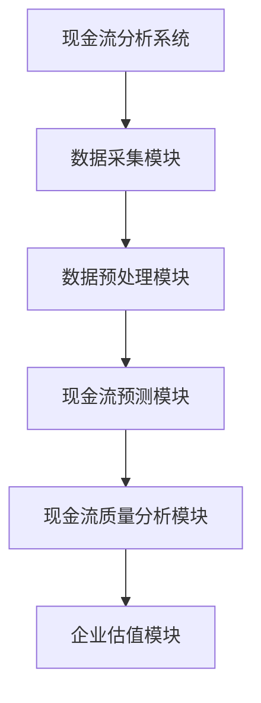

                 


# 巴菲特的现金流分析在SaaS企业中的新解读

## 关键词：现金流分析, SaaS企业, 巴菲特投资理念, 企业估值, 订阅经济

## 摘要：现金流分析是巴菲特评估企业价值的核心方法之一，本文将探讨这一方法在SaaS企业中的应用。通过分析现金流的独特性，结合SaaS模式的特点，本文提出了新的现金流分析模型，并通过实例验证了其在企业估值和运营策略中的有效性。

---

## 第一部分：现金流分析的背景与重要性

### 第1章：现金流分析的核心概念

#### 1.1 现金流的定义与分类

现金流是指企业在一定时期内通过各项业务活动所产生的现金流入和流出。根据来源和用途，现金流可以分为以下三类：

- **经营活动现金流**：来自日常业务活动的现金流。
- **投资活动现金流**：来自投资活动的现金流，如购买或出售资产。
- **筹资活动现金流**：来自筹资活动的现金流，如发行债券或偿还贷款。

现金流是企业财务健康状况的重要指标，反映了企业的盈利能力和偿债能力。

#### 1.2 SaaS模式的特点与现金流的独特性

SaaS（软件即服务）模式是一种基于互联网的商业模式，通过订阅制提供软件服务。其特点包括：

- **按需付费**：客户按月或按年支付订阅费用。
- **低客户获取成本**：通过互联网销售，降低了客户的获取成本。
- **高客户保留率**：SaaS企业通常注重客户体验，客户保留率较高。

在SaaS模式下，现金流的独特性体现在订阅收入的稳定性、客户生命周期价值（CLV）的计算以及客户获取成本（CAC）的回收周期。

#### 1.3 巴菲特投资理念中的现金流分析

巴菲特认为，企业的价值取决于其未来现金流的现值。他强调现金流的质量和可持续性，而非仅仅关注利润表上的数字。以下是巴菲特现金流分析的关键点：

- **自由现金流（FCF）**：企业产生的现金流在满足再投资需求后剩余的部分。
- **现金流质量**：现金流是否稳定、可预测且来自核心业务。
- **现金流健康度**：通过现金流比率（如现金流量比率、现金流量利息保障倍数）评估企业的现金流健康状况。

---

## 第2章：现金流分析的核心指标与模型

### 2.1 现金流分析的核心指标

#### 2.1.1 自由现金流（FCF）

自由现金流公式为：

$$\text{FCF} = \text{经营现金流} - \text{资本支出}$$

自由现金流是评估企业价值的重要指标，反映了企业在不依赖外部融资的情况下，能够产生的现金流。

#### 2.1.2 现金流比率

现金流量比率用于衡量企业的短期偿债能力，公式为：

$$\text{现金流量比率} = \frac{\text{经营现金流}}{\text{流动负债}}$$

比率越高，企业的偿债能力越强。

#### 2.1.3 现金流质量

现金流质量反映了现金流的来源和稳定性。高质量的现金流通常来自核心业务活动。

### 2.2 SaaS企业现金流分析的特殊性

#### 2.2.1 订阅收入与现金流的关系

在SaaS模式下，订阅收入是企业主要的收入来源。订阅收入的稳定性直接影响企业的现金流。例如，假设一家SaaS企业的月度订阅收入为100万元，客户保留率为90%，则每月的收入相对稳定。

#### 2.2.2 客户获取成本（CAC）与现金流的关联

客户获取成本（CAC）是指企业获取一个新客户的平均成本。在SaaS模式下，CAC的回收周期直接影响企业的现金流。例如，如果CAC为2000元，客户生命周期价值（CLV）为5000元，则CAC回收周期为2.5个月。

#### 2.2.3 客户生命周期价值（CLV）对现金流的影响

客户生命周期价值（CLV）是指客户在企业生命周期内为企业带来的总收入。CLV的计算公式为：

$$\text{CLV} = \text{ARPU} \times \text{客户生命周期长度}$$

其中，ARPU（每用户平均收入）是客户每月或每年为服务支付的费用。

### 2.3 现金流分析模型

#### 2.3.1 传统现金流分析模型

传统现金流分析模型主要关注企业的历史现金流数据，通过贴现率计算企业价值。公式为：

$$\text{企业价值} = \sum_{t=1}^{n} \frac{\text{现金流}_t}{(1 + r)^t}$$

其中，\( r \) 为贴现率，\( n \) 为预测年数。

#### 2.3.2 SaaS企业现金流预测模型

针对SaaS企业，现金流预测模型需要考虑订阅收入的稳定性、客户保留率以及客户获取成本。公式为：

$$\text{现金流}_t = \text{收入}_t - \text{成本}_t$$

其中，收入 \( t \) 期的现金流可以预测为：

$$\text{收入}_t = \text{月度订阅收入} \times \text{客户数}_t$$

客户数 \( t \) 期的预测可以基于历史数据和增长率。

#### 2.3.3 现金流贴现模型（DCF）

现金流贴现模型（DCF）是评估企业价值的常用方法，公式为：

$$\text{企业价值} = \frac{\text{自由现金流}}{\text{贴现率} - \text{增长率}}$$

在SaaS企业中，DCF模型需要考虑订阅收入的稳定性以及客户获取成本的回收周期。

---

## 第3章：巴菲特的现金流分析方法与SaaS企业的结合

### 3.1 巴菲特现金流分析方法的演变

巴菲特早期的投资理念注重企业的盈利能力，后来逐渐转向现金流分析。他认为，企业价值的核心是未来现金流的现值。

### 3.2 SaaS企业现金流分析的独特性

在SaaS企业中，现金流分析需要考虑订阅收入的稳定性、客户保留率以及客户获取成本的回收周期。以下是几个关键点：

- **订阅收入的稳定性**：SaaS企业的收入主要来自订阅，收入波动较小，现金流相对稳定。
- **客户保留率**：高客户保留率意味着客户生命周期长，现金流稳定。
- **客户获取成本（CAC）**：CAC的回收周期影响企业的现金流健康。例如，如果CAC为2000元，客户生命周期价值为5000元，则CAC回收周期为2.5个月。

### 3.3 巴菲特现金流分析方法在SaaS企业的应用

#### 3.3.1 现金流质量分析

现金流质量分析需要考虑现金流的来源和稳定性。例如，SaaS企业的现金流主要来自订阅收入，现金流质量较高。

#### 3.3.2 现金流健康度分析

现金流健康度分析需要考虑现金流比率和现金流贴现率。例如，使用现金流比率公式：

$$\text{现金流量比率} = \frac{\text{经营现金流}}{\text{流动负债}}$$

比率越高，企业的偿债能力越强。

#### 3.3.3 企业估值与现金流分析

企业估值需要考虑未来现金流的现值。例如，使用DCF模型公式：

$$\text{企业价值} = \frac{\text{自由现金流}}{\text{贴现率} - \text{增长率}}$$

在SaaS企业中，现金流预测需要考虑订阅收入的稳定性以及客户保留率。

---

## 第4章：现金流分析的系统架构与算法实现

### 4.1 系统功能需求

现金流分析系统需要实现以下功能：

- **现金流预测**：基于历史数据预测未来现金流。
- **现金流质量分析**：评估现金流的来源和稳定性。
- **企业估值**：基于现金流预测计算企业价值。

### 4.2 系统架构设计

以下是现金流分析系统的架构图：



### 4.3 算法实现

以下是现金流预测算法的Python代码：

```python
import pandas as pd
import numpy as np
from sklearn.linear_model import LinearRegression

# 数据准备
data = pd.DataFrame({
    'month': range(1, 13),
    'revenue': [100, 105, 110, 115, 120, 125, 130, 135, 140, 145, 150, 155]
})

# 现金流预测模型
model = LinearRegression()
model.fit(data[['month']], data['revenue'])

# 预测未来现金流
future_months = np.array([[13], [14], [15]])
predicted_revenue = model.predict(future_months)
print(predicted_revenue)
```

---

## 第5章：现金流分析的实战案例

### 5.1 实战案例分析

假设我们有一个SaaS企业，月度订阅收入为100万元，客户保留率为90%，客户获取成本（CAC）为2000元。

#### 5.1.1 计算客户生命周期价值（CLV）

客户生命周期价值（CLV）计算公式为：

$$\text{CLV} = \frac{\text{月度订阅收入} \times 12}{\text{客户流失率}}$$

假设客户流失率为10%，则：

$$\text{CLV} = \frac{100 \times 12}{0.1} = 12000 \text{元}$$

#### 5.1.2 计算CAC回收周期

CAC回收周期计算公式为：

$$\text{CAC回收周期} = \frac{\text{CAC}}{\text{月度订阅收入}}$$

即：

$$\text{CAC回收周期} = \frac{2000}{100} = 2 \text{个月}$$

---

## 第6章：现金流分析的总结与展望

### 6.1 总结

现金流分析是评估企业价值的核心方法之一。在SaaS企业中，现金流分析需要考虑订阅收入的稳定性、客户保留率以及客户获取成本的回收周期。通过现金流分析，企业可以更好地进行估值和制定运营策略。

### 6.2 展望

未来，现金流分析在SaaS企业中的应用将更加广泛。随着人工智能和大数据技术的发展，现金流分析将更加精准和智能化。同时，新兴的SaaS商业模式也将对现金流分析提出新的挑战和机遇。

---

## 附录：最佳实践与注意事项

- **最佳实践**：
  - 定期监控现金流数据，确保现金流健康。
  - 优化客户获取成本，提高客户生命周期价值。
  - 使用现金流预测模型进行企业估值。

- **注意事项**：
  - 现金流分析需要结合企业的实际情况，避免过于理论化。
  - 注意数据的准确性和完整性，确保分析结果的可靠性。

---

通过本文的分析，我们可以看到现金流分析在SaaS企业中的重要性。未来，随着技术的进步和商业模式的创新，现金流分析将在SaaS企业的估值和运营中发挥更大的作用。

