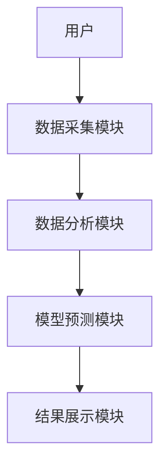

                 


# 巴菲特的现金流分析：代币经济学下的新指标

---

## 关键词：
- 巴菲特
- 现金流分析
- 代币经济学
- 现金流指标
- 区块链

---

## 摘要：
本文深入探讨了巴菲特的现金流分析方法在代币经济学中的应用。通过结合传统金融分析与区块链技术，提出了新的现金流分析指标，为投资者和企业在代币经济环境下的决策提供了理论支持和实践指导。

---

# 第1章 巴菲特的现金流分析概述

## 1.1 巴菲特投资理念的核心

### 1.1.1 巴菲特的价值投资哲学
巴菲特的价值投资哲学强调长期稳健的投资策略，核心在于寻找具有持续竞争优势的企业，并以合理的价格买入并长期持有。现金流是其评估企业内在价值的重要指标。

### 1.1.2 现金流在巴菲特投资中的重要性
巴菲特认为，自由现金流是企业创造利润的能力的直接体现。自由现金流的持续增长是企业健康发展的关键。

### 1.1.3 现金流分析的基本原理
现金流分析是通过对企业的现金流入和流出的分析，评估其财务健康状况和未来盈利能力。

---

## 1.2 现金流分析的定义与分类

### 1.2.1 现金流的定义
现金流是指企业在一定时期内通过经营或其他活动所获得或支付的现金和现金等价物。

### 1.2.2 现金流的分类
1. **经营活动现金流**：企业日常经营活动中产生的现金流。
2. **投资活动现金流**：与长期资产和投资相关的现金流。
3. **筹资活动现金流**：与企业筹资活动相关的现金流。

### 1.2.3 现金流分析的意义
现金流分析有助于评估企业的财务健康状况、流动性、盈利能力和未来发展的潜力。

---

## 1.3 巴菲特现金流分析的指标体系

### 1.3.1 自由现金流的定义
自由现金流（Free Cash Flow，FCF）是指企业在扣除所有运营成本、税费和资本支出后的剩余现金流。

### 1.3.2 自由现金流的计算公式
$$\text{自由现金流} = \text{营业收入} - \text{运营成本} - \text{税费} - \text{资本支出}$$

### 1.3.3 自由现金流与企业价值的关系
自由现金流是企业价值的核心驱动因素，高自由现金流的企业通常具有更强的抗风险能力和更高的投资价值。

---

# 第2章 代币经济学的基本原理

## 2.1 代币经济的定义与特点

### 2.1.1 代币经济的定义
代币经济是以区块链技术为基础，通过代币（Token）作为价值载体和交易媒介的经济体系。

### 2.1.2 代币经济的核心特征
1. **去中心化**：通过区块链技术实现去中心化的价值转移和价值存储。
2. **可编程性**：代币可以嵌入智能合约，实现自动化交易和价值转移。

### 2.1.3 代币经济与传统经济的区别
代币经济通过区块链技术实现了价值的去中心化和透明化，传统经济依赖于中心化的金融机构和信任机制。

---

## 2.2 代币经济的核心概念

### 2.2.1 代币的类型
1. **支付型代币**：用于支付的代币，如比特币（BTC）。
2. **平台型代币**：用于特定平台的代币，如以太坊（ETH）。
3. **资产型代币**：代表特定资产的代币，如房地产代币。

### 2.2.2 代币的发行机制
1. **首次代币发行（ICO）**：通过区块链技术发行代币的融资方式。
2. **空投**：将代币免费分配给用户的行为。

### 2.2.3 代币的价值评估
代币的价值取决于其用途、流通量、技术实现和市场需求。

---

# 第3章 现金流分析的代币经济学扩展

## 3.1 代币经济对现金流的影响

### 3.1.1 代币经济如何影响企业现金流
1. **降低交易成本**：通过区块链技术，企业可以降低传统金融体系中的交易成本。
2. **提高资金流动性**：代币的流通性提高了企业的资金流动性。

### 3.1.2 代币经济对传统现金流分析的挑战
1. **去中心化的影响**：传统现金流分析依赖于中心化的金融机构，而代币经济去中心化的特点对分析方法提出了新的要求。
2. **代币价值波动性**：代币价格的波动性对现金流预测带来了挑战。

### 3.1.3 代币经济下的现金流新特征
1. **实时性**：代币经济下的现金流可以实时追踪和记录。
2. **透明性**：区块链技术保证了现金流的透明性和不可篡改性。

---

## 3.2 代币现金流分析的数学模型

### 3.2.1 传统现金流分析公式
$$\text{现金流} = \text{营业收入} - \text{运营成本} - \text{税费} - \text{资本支出}$$

### 3.2.2 代币经济下的现金流调整模型
$$\text{调整后的现金流} = \text{自由现金流} + \text{代币经济影响因素}$$

### 3.2.3 代币现金流与企业价值的关系
$$\text{企业价值} = \text{自由现金流} \times \text{折现率}$$

---

# 第4章 代币现金流分析的算法与实现

## 4.1 现金流分析的算法原理

### 4.1.1 现金流预测的算法选择
常用算法包括线性回归、时间序列分析和机器学习算法。

### 4.1.2 代币经济下的现金流预测模型
1. **线性回归模型**：用于预测现金流的趋势。
2. **时间序列模型**：用于预测现金流的短期变化。

### 4.1.3 算法实现的步骤与流程
1. 数据收集：收集企业的财务数据和代币经济数据。
2. 数据预处理：清洗数据并进行特征工程。
3. 模型训练：选择合适的算法进行训练。
4. 模型评估：通过回测和交叉验证评估模型的准确性。
5. 模型部署：将模型应用于实际的现金流预测。

---

## 4.2 现金流分析的系统架构

### 4.2.1 系统功能设计
1. **数据采集模块**：采集企业的财务数据和代币经济数据。
2. **数据分析模块**：对数据进行处理和分析。
3. **模型预测模块**：使用算法模型进行现金流预测。
4. **结果展示模块**：将预测结果可视化展示。

### 4.2.2 系统架构图


### 4.2.3 系统接口设计
1. API接口：提供数据接口供其他系统调用。
2. 用户界面：提供友好的操作界面供用户使用。

---

## 4.3 算法实现的代码示例

### 4.3.1 线性回归模型实现
```python
import pandas as pd
import numpy as np
from sklearn.linear_model import LinearRegression

# 数据预处理
data = pd.read_csv('cash_flow.csv')
X = data[['营业收入', '运营成本', '税费', '资本支出']]
y = data['现金流']

# 模型训练
model = LinearRegression()
model.fit(X, y)

# 模型预测
predictions = model.predict(X)
print(predictions)
```

### 4.3.2 时间序列模型实现
```python
from statsmodels.tsa.arima_model import ARIMA

# 数据预处理
data = pd.read_csv('cash_flow.csv')
train_data = data[:'2022']
test_data = data['2023':]

# 模型训练
model = ARIMA(train_data, order=(1, 1, 1))
model_fit = model.fit()

# 模型预测
predictions = model_fit.forecast(steps=len(test_data))
print(predictions)
```

---

# 第5章 代币现金流分析的实战案例

## 5.1 实际案例分析

### 5.1.1 案例背景介绍
某区块链企业发行了一种新的代币，希望通过现金流分析评估其代币经济对企业的财务状况的影响。

### 5.1.2 现金流分析过程
1. 数据收集：收集企业的财务数据和代币经济数据。
2. 数据分析：使用线性回归模型和时间序列模型进行现金流预测。
3. 结果解读：分析预测结果，评估代币经济对现金流的影响。

### 5.1.3 分析结果与启示
1. 代币经济的引入显著提高了企业的现金流。
2. 代币价格的波动性对现金流预测带来了挑战。

---

## 5.2 代币经济下的现金流管理策略

### 5.2.1 代币经济下的现金流管理
1. **风险控制**：通过智能合约实现自动化的风险管理。
2. **流动性管理**：优化代币的流动性以提高资金周转率。

### 5.2.2 代币经济下的投资策略
1. **长期投资**：选择具有持续竞争优势的企业进行长期投资。
2. **分散投资**：通过多元化投资降低风险。

---

## 5.3 项目实战总结

### 5.3.1 项目总结
通过实际案例分析，我们验证了代币经济对现金流分析的影响，并提出了新的现金流分析指标。

### 5.3.2 经验与教训
1. **数据的重要性**：高质量的数据是现金流分析的基础。
2. **模型的选择**：选择合适的算法模型可以提高预测的准确性。

---

# 第6章 结论与展望

## 6.1 结论
本文探讨了巴菲特的现金流分析方法在代币经济中的应用，提出了新的现金流分析指标，并通过实际案例验证了其有效性。

## 6.2 未来展望
未来，随着区块链技术的不断发展，代币经济将对现金流分析提出更多的挑战和机遇。我们需要进一步研究和优化现金流分析的方法，以适应新的经济环境。

---

# 参考文献

（此处列出相关的书籍、论文和资源）

---

通过本文的分析，我们不仅了解了传统现金流分析的原理，还探讨了代币经济对现金流分析的影响，为投资者和企业在代币经济环境下的决策提供了理论支持和实践指导。

