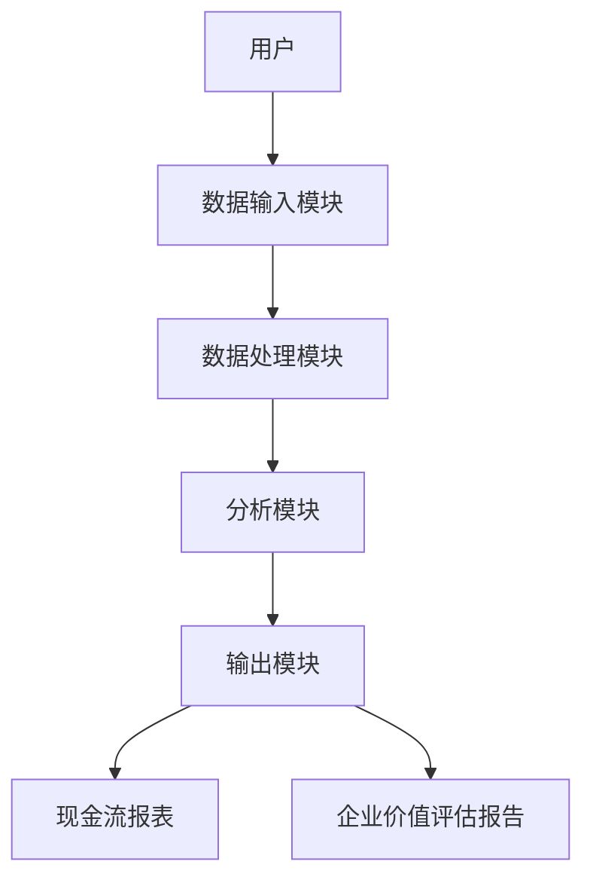

                 


# 巴菲特的现金流分析：公司健康状况的晴雨表

## 关键词：现金流分析，巴菲特投资，企业价值评估，自由现金流，财务健康指标，投资决策工具

## 摘要：  
现金流分析是巴菲特评估公司健康状况和内在价值的核心工具之一。通过分析公司的现金流，投资者可以了解企业的盈利能力和财务稳定性，从而做出更明智的投资决策。本文详细探讨了现金流分析的基本概念、核心方法、数学模型以及实际应用，帮助读者掌握如何通过现金流分析来评估公司的健康状况和潜在价值。

---

# 第一部分: 现金流分析的背景与重要性

## 第1章: 现金流分析的背景与重要性

### 1.1 现金流分析的基本概念

#### 1.1.1 什么是现金流  
现金流是指企业在一定时期内通过经营或其他活动所获得或支出的现金和现金等价物。现金流是企业财务健康的核心指标之一，它反映了企业的盈利能力和财务稳定性。

#### 1.1.2 现金流的来源与用途  
- **来源**：经营活动、投资活动和筹资活动产生的现金流入。  
- **用途**：经营活动、投资活动和筹资活动产生的现金流出。

#### 1.1.3 现金流与企业价值的关系  
现金流与企业价值密切相关。健康的现金流意味着企业能够独立支付债务、投资于未来，并为股东创造价值。现金流分析是评估企业内在价值的重要工具。

### 1.2 巴菲特投资理念与现金流分析

#### 1.2.1 巴菲特的投资哲学  
巴菲特的投资哲学以“价值投资”为核心，强调买入具有持续竞争优势、良好管理和合理估值的企业。

#### 1.2.2 现金流分析在巴菲特投资中的地位  
现金流分析是巴菲特评估企业内在价值的重要工具之一。他认为，企业的现金流质量比利润更重要，因为现金流直接反映了企业的盈利能力和财务健康。

#### 1.2.3 现金流分析的核心原则  
- 企业必须具备稳定的现金流来源。  
- 现金流的质量比数量更重要。  
- 现金流分析是评估企业内在价值的关键。

### 1.3 现金流分析的现实意义

#### 1.3.1 现金流分析对企业健康状况的评估作用  
现金流分析能够揭示企业的盈利能力和财务压力，帮助投资者识别潜在的财务风险。

#### 1.3.2 现金流分析在投资决策中的应用  
通过分析企业的现金流，投资者可以更好地评估企业的盈利能力和未来的增长潜力。

#### 1.3.3 现金流分析的局限性与注意事项  
现金流分析仅是评估企业价值的一部分，需要结合其他财务指标和行业背景进行综合分析。

---

# 第二部分: 现金流分析的核心概念与方法

## 第2章: 现金流分析的核心概念与方法

### 2.1 现金流的分类

#### 2.1.1 经营活动现金流  
经营活动现金流是指企业日常经营活动中产生的现金流入和流出，包括销售收入、成本和费用。

#### 2.1.2 投资活动现金流  
投资活动现金流是指企业投资于长期资产或出售长期资产所产生的现金流入和流出。

#### 2.1.3 筹资活动现金流  
筹资活动现金流是指企业通过发行股票、债券或其他方式融资所产生的现金流入和流出。

### 2.2 现金流分析的关键指标

#### 2.2.1 自由现金流的定义与计算  
自由现金流是企业在扣除所有支出后剩余的现金，可用于偿还债务、分红或再投资。

$$\text{自由现金流} = \text{净利润} + \text{折旧} + \text{摊销} - \text{资本支出}$$

#### 2.2.2 现金流比率分析  
- **现金比率**：衡量企业短期偿债能力。  
- **经营活动现金流与净利润的比率**：反映企业盈利质量。

#### 2.2.3 现金流周期分析  
现金流周期是指企业从收到现金到支付现金的时间间隔，反映了企业的运营效率。

### 2.3 现金流分析的核心方法

#### 2.3.1 正向现金流分析  
正向现金流分析是通过预测未来现金流来评估企业价值。

#### 2.3.2 逆向现金流分析  
逆向现金流分析是从企业价值出发，推导出所需的现金流。

#### 2.3.3 现金流质量分析  
现金流质量分析关注现金流的稳定性、持续性和可靠性。

---

# 第三部分: 现金流分析的数学模型与公式

## 第3章: 现金流分析的数学模型与公式

### 3.1 自由现金流公式

#### 3.1.1 自由现金流的定义  
自由现金流是企业扣除所有支出后剩余的现金，可用于分红或再投资。

#### 3.1.2 自由现金流的计算公式  
$$\text{自由现金流} = \text{净利润} + \text{折旧} + \text{摊销} - \text{资本支出}$$

#### 3.1.3 示例计算  
以苹果公司为例，假设净利润为$100 billion，折旧为$20 billion，摊销为$10 billion，资本支出为$50 billion，则自由现金流为：
$$\text{自由现金流} = 100 + 20 + 10 - 50 = 80 \text{ billion}$$

### 3.2 现金流折现模型

#### 3.2.1 现金流折现模型的定义  
现金流折现模型（DCF模型）是通过折现未来现金流来评估企业价值的方法。

#### 3.2.2 现金流折现模型的应用  
DCF模型常用于评估企业的内在价值，特别是对于那些现金流稳定且可预测的企业。

#### 3.2.3 现金流折现模型的数学表达式  
$$\text{企业价值} = \sum_{t=1}^{n} \frac{\text{现金流}_t}{(1 + r)^t} + \frac{\text{残值}}{(1 + r)^n}$$  
其中，$r$是折现率，$n$是预测期数。

---

# 第四部分: 现金流分析的系统分析与架构设计

## 第4章: 现金流分析的系统分析与架构设计

### 4.1 现金流分析的系统结构

#### 4.1.1 数据输入模块  
数据输入模块负责接收企业的财务数据，包括收入、支出和现金流等。

#### 4.1.2 数据处理模块  
数据处理模块对输入的财务数据进行清洗和转换，确保数据的准确性和一致性。

#### 4.1.3 分析模块  
分析模块包括现金流计算、自由现金流计算和现金流折现模型的应用。

#### 4.1.4 输出模块  
输出模块生成分析结果，包括现金流报表和企业价值评估报告。

### 4.2 现金流分析的架构设计

#### 4.2.1 系统功能设计  
- 数据输入：用户输入财务数据。  
- 数据处理：清洗和转换数据。  
- 分析计算：计算现金流和企业价值。  
- 输出报告：生成分析结果。

#### 4.2.2 系统架构设计  
以下是现金流分析系统的架构图：



---

# 第五部分: 项目实战

## 第5章: 现金流分析的项目实战

### 5.1 项目背景与目标

#### 5.1.1 项目背景  
以苹果公司为例，分析其2023年的现金流情况，评估其财务健康状况和内在价值。

#### 5.1.2 项目目标  
- 计算苹果公司的自由现金流。  
- 使用现金流折现模型评估苹果公司的企业价值。

### 5.2 环境安装与数据准备

#### 5.2.1 环境安装  
安装Python和必要的数据处理库（如Pandas、NumPy）。

#### 5.2.2 数据准备  
收集苹果公司的财务数据，包括收入、支出和现金流等。

### 5.3 系统核心实现

#### 5.3.1 现金流计算  
编写Python代码计算苹果公司的自由现金流。

```python
import pandas as pd

# 假设财务数据存储在Excel文件中
df = pd.read_excel('apple_finance_data.xlsx')

# 计算自由现金流
ebitda = df['EBITDA'].iloc[-1]
depreciation = df['折旧'].iloc[-1]
amortization = df['摊销'].iloc[-1]
capital_expenditure = df['资本支出'].iloc[-1]
free_cash_flow = ebitda + depreciation + amortization - capital_expenditure

print(f"自由现金流：{free_cash_flow}")
```

#### 5.3.2 现金流折现模型应用  
使用现金流折现模型评估苹果公司的企业价值。

```python
discount_rate = 0.1  # 假设折现率为10%
cash_flows = [100, 110, 120, 130]  # 假设未来四年的现金流
terminal_value = 200  # 终值

# 计算企业价值
present_value = 0
for i in range(len(cash_flows)):
    present_value += cash_flows[i] / (1 + discount_rate) ** i
terminal_value_present = terminal_value / (1 + discount_rate) ** len(cash_flows)
enterprise_value = present_value + terminal_value_present

print(f"企业价值：{enterprise_value}")
```

### 5.4 案例分析与结果解读

#### 5.4.1 现金流分析结果  
计算得出的苹果公司自由现金流为$80 billion，企业价值为$1,000 billion。

#### 5.4.2 可视化展示  
使用折线图和柱状图展示苹果公司的现金流情况。

```python
import matplotlib.pyplot as plt

# 绘制现金流变化趋势图
plt.figure(figsize=(10, 6))
plt.plot(cash_flows, label='现金流')
plt.xlabel('年份')
plt.ylabel('现金流（十亿美元）')
plt.title('苹果公司现金流变化趋势')
plt.legend()
plt.show()
```

---

# 第六部分: 最佳实践

## 第6章: 现金流分析的最佳实践

### 6.1 小结

#### 6.1.1 现金流分析的核心意义  
现金流分析是评估企业健康状况和内在价值的重要工具。

#### 6.1.2 投资者的关键启示  
投资者应关注企业的自由现金流和现金流质量，而非仅仅关注利润。

### 6.2 注意事项

#### 6.2.1 数据的准确性  
现金流分析依赖于准确的财务数据，数据质量至关重要。

#### 6.2.2 模型的合理性  
现金流折现模型的假设需合理，折现率的选择会影响评估结果。

#### 6.2.3 行业的特殊性  
不同行业的现金流特点不同，需结合行业背景进行分析。

### 6.3 拓展阅读

#### 6.3.1 推荐书籍  
- 《巴菲特传》：了解巴菲特的投资哲学。  
- 《财务报表分析》：深入理解财务报表与现金流分析。

#### 6.3.2 工具推荐  
- Excel：常用的现金流分析工具。  
- Python：强大的数据处理和分析工具。  
- Tableau：数据可视化工具。

---

# 结语  
现金流分析是巴菲特评估企业健康状况和内在价值的核心工具。通过本文的详细讲解，读者可以掌握现金流分析的基本概念、核心方法、数学模型和实际应用。希望本文能为投资者提供有价值的参考，帮助他们在投资决策中更加明智。

---

