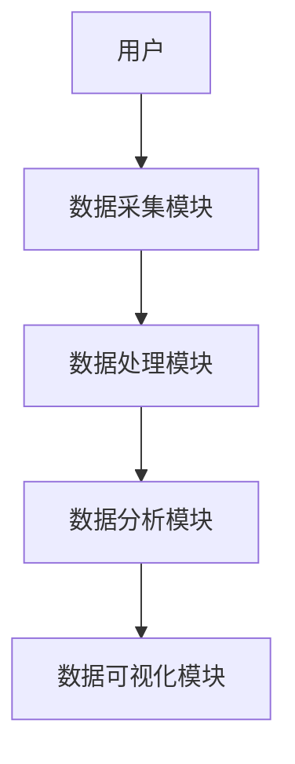

                 


# 巴菲特的现金流分析：订阅经济模式下的新指标

## 关键词：现金流分析，巴菲特，订阅经济，财务指标，投资分析，商业模式

## 摘要：现金流分析是评估企业价值的核心指标，尤其在订阅经济模式下，现金流的预测和管理变得尤为重要。本文将介绍现金流分析的基本概念，巴菲特的现金流分析方法，以及在订阅经济模式下的新指标和应用。通过详细讲解现金流预测模型、客户生命周期分析和系统架构设计，本文为读者提供一套完整的现金流分析方法，帮助他们在订阅经济中做出更明智的投资决策。

---

## 第一部分：现金流分析基础

### 第1章：现金流分析的基本概念

#### 1.1 现金流分析的定义与作用
现金流分析是评估企业财务健康状况的重要工具，它关注企业在一定时期内现金的流入和流出情况。现金流可以分为经营活动、投资活动和筹资活动三类。通过分析现金流，投资者可以了解企业的盈利能力和流动性，进而评估其财务风险和投资价值。

巴菲特特别强调现金流的重要性，他认为企业的价值在于其未来现金流的现值。现金流分析可以帮助投资者识别企业的核心盈利能力，避免仅依赖利润表进行评估的局限性。

#### 1.2 巴菲特的现金流分析方法
巴菲特的现金流分析方法以自由现金流为核心，他关注企业的自由现金流是否能够持续增长，并且是否能够支撑企业的股息支付和再投资需求。他认为，只有具备稳定自由现金流的企业才具备长期投资价值。

#### 1.3 订阅经济模式的基本特征
订阅经济是一种基于订阅模式的商业模式，企业通过提供持续的数字产品或服务，按月或按年收取费用。订阅经济的特点是客户生命周期长、收入稳定、边际成本低。然而，订阅经济也带来了现金流预测的挑战，因为客户可能随时取消订阅，导致收入波动。

---

### 第2章：订阅经济模式的兴起

#### 2.1 订阅经济的基本特征
订阅经济是一种以客户为中心的商业模式，通过提供持续的价值来锁定客户。与传统的一次性销售模式不同，订阅经济依赖于客户的留存率和净收入保留率（NRR）。订阅经济的成功关键在于客户的满意度和忠诚度。

#### 2.2 订阅经济中的现金流特点
订阅经济的现金流具有周期性，收入主要来自定期订阅费用，而成本则集中在客户获取和产品开发阶段。现金流的质量取决于客户留存率和客户获取成本（CAC）的比率。高留存率和低CAC意味着更高的现金流质量。

#### 2.3 订阅经济的商业模式
订阅经济的商业模式包括免费试用、按需付费、分级订阅等多种形式。企业通过不断优化产品和服务，提高客户满意度，从而提高客户留存率和订阅续订率。

---

### 第3章：现金流分析的核心指标

#### 3.1 自由现金流（Free Cash Flow）
自由现金流是企业在支付了所有运营和资本支出之后剩余的现金，是评估企业财务健康状况的重要指标。自由现金流公式为：
$$ \text{自由现金流} = \text{营业收入} - \text{运营成本} - \text{资本支出} $$

在订阅经济中，自由现金流的计算需要考虑客户获取成本和研发投入。企业需要通过提高客户留存率和降低客户获取成本来增加自由现金流。

#### 3.2 现金流质量分析
现金流质量是指企业现金流的稳定性和可持续性。高质量的现金流来源于稳定的收入和低财务杠杆。现金流质量分析需要关注企业的客户生命周期、收入结构和财务风险。

#### 3.3 订阅经济中的现金流质量
在订阅经济中，现金流质量取决于客户的留存率和净收入保留率。高留存率意味着客户对产品或服务的依赖性强，从而保证了现金流的稳定性。

---

### 第4章：订阅经济下的现金流分析模型

#### 4.1 订阅经济中的现金流预测模型
现金流预测模型需要考虑客户获取、客户留存和收入增长等多个因素。以下是现金流预测的步骤：

1. **数据收集**：收集历史订阅数据，包括客户获取成本、客户留存率和收入。
2. **数据处理**：清洗数据，提取关键指标。
3. **模型建立**：使用时间序列分析或机器学习模型预测未来的现金流。
4. **结果分析**：评估模型的准确性，并根据实际情况进行调整。

#### 4.2 订阅经济中的客户生命周期模型
客户生命周期模型帮助企业理解客户在不同阶段的现金流贡献。以下是客户生命周期的四个阶段：

1. **获取阶段**：客户首次订阅，现金流为负，因为客户获取成本较高。
2. **成长阶段**：客户逐渐贡献正现金流，但成本仍在增加。
3. **成熟阶段**：客户稳定贡献现金流，成本趋于稳定。
4. **衰退阶段**：客户取消订阅，现金流下降。

---

### 第5章：现金流分析的数学模型与公式

#### 5.1 现金流分析的基本公式
1. **净现值（NPV）**：
$$ \text{NPV} = \sum_{t=0}^{n} \frac{\text{现金流}_t}{(1 + r)^t} $$
其中，$r$ 是折现率，$t$ 是时间。

2. **内部收益率（IRR）**：
IRR是使净现值为零的折现率，公式为：
$$ 0 = \sum_{t=0}^{n} \frac{\text{现金流}_t}{(1 + \text{IRR})^t} $$

#### 5.2 订阅经济中的现金流预测公式
1. **客户留存率（CLTV）**：
$$ \text{客户生命周期价值} = \frac{\text{平均收入} \times \text{客户留存率}}{\text{客户流失率}} $$

2. **客户获取成本（CAC）**：
$$ \text{CAC} = \frac{\text{客户获取成本}}{\text{新增客户数}} $$

---

### 第6章：现金流分析的系统架构设计

#### 6.1 系统功能模块
1. **数据采集模块**：收集订阅数据，包括客户信息和交易记录。
2. **数据处理模块**：清洗和转换数据，提取关键指标。
3. **数据分析模块**：使用机器学习模型预测现金流。
4. **数据可视化模块**：生成图表和报告，展示分析结果。

#### 6.2 系统架构图


---

## 第二部分：项目实战

### 第7章：环境安装与系统实现

#### 7.1 环境安装
需要安装Python、Pandas、NumPy、Scikit-learn和Matplotlib库：
```bash
pip install pandas numpy scikit-learn matplotlib
```

#### 7.2 核心实现代码
以下是现金流预测的Python代码示例：
```python
import pandas as pd
import numpy as np
from sklearn.linear_model import LinearRegression
import matplotlib.pyplot as plt

# 加载数据
data = pd.read_csv('subscription_data.csv')

# 数据预处理
X = data[['revenue', 'costs']]
y = data['cash_flow']

# 建立线性回归模型
model = LinearRegression()
model.fit(X, y)

# 预测现金流
predicted_cash_flow = model.predict(X)

# 可视化结果
plt.scatter(y, predicted_cash_flow)
plt.xlabel('实际现金流')
plt.ylabel('预测现金流')
plt.show()
```

---

### 第8章：案例分析与总结

#### 8.1 案例分析
以一家订阅制SaaS公司为例，分析其现金流情况。假设公司有以下数据：
- 平均收入：$100/月
- 客户留存率：80%
- 客户获取成本：$50/客户

计算客户生命周期价值（CLTV）：
$$ \text{CLTV} = \frac{100 \times 0.8}{1 - 0.8} = 400 \text{美元} $$

---

## 第三部分：最佳实践

### 第9章：小结与注意事项

#### 9.1 小结
现金流分析是评估企业价值的核心指标，尤其在订阅经济模式下，现金流的预测和管理变得尤为重要。通过分析自由现金流、客户生命周期和现金流质量，投资者可以更好地评估企业的财务健康状况。

#### 9.2 注意事项
- 现金流分析需要结合企业的实际业务情况。
- 现金流预测模型需要不断优化和调整。
- 现金流分析需要关注客户留存率和客户获取成本的比率。

---

### 第10章：拓展阅读

#### 10.1 推荐书籍
- 《巴菲特的选股艺术》
- 《现金流思维：财务自由的关键》

#### 10.2 推荐博客与资源
- 巴菲特投资思想的深度分析
- 订阅经济模式的最新动态

---

## 结语
通过本文的介绍，读者可以掌握现金流分析的核心概念和方法，特别是在订阅经济模式下的新指标和应用。希望本文能够帮助读者更好地理解和应用现金流分析，做出更明智的投资决策。

