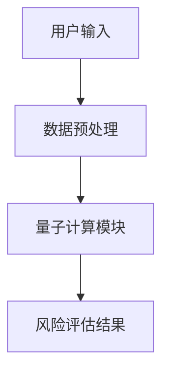

                 


# 巴菲特的现金流分析：量子金融衍生品的风险评估

---

## 关键词：
- 巴菲特
- 现金流分析
- 量子金融
- 金融衍生品
- 风险评估
- 量化投资

---

## 摘要：
现金流分析是巴菲特投资哲学的核心工具之一，而量子金融衍生品的复杂性和不确定性为风险评估带来了新的挑战。本文通过深入分析现金流分析的量子模型，结合金融衍生品的风险评估方法，探讨如何利用量子计算的优势，构建更高效、更精准的风险评估系统。文章从基础概念到高级算法，系统性地阐述了现金流分析与量子金融的结合，为投资者和金融从业者提供了新的视角和实践指导。

---

## 第一部分：背景介绍

### 第1章：现金流分析概述

#### 1.1 现金流分析的核心概念

现金流是企业经营活动中产生的现金流入和流出，反映了企业的财务健康状况和盈利能力。巴菲特认为，现金流是企业价值的核心驱动因素，因为稳定的现金流意味着企业能够持续创造价值，而现金流的质量和稳定性是评估企业的重要指标。

#### 1.2 巴菲特的现金流分析方法

巴菲特的现金流分析方法注重以下几个方面：
1. **自由现金流（Free Cash Flow）**：自由现金流是企业在扣除所有支出后的剩余现金流，反映了企业实际可分配的利润。
2. **现金流质量**：现金流质量高意味着企业的收入和支出结构健康，现金流波动小。
3. **未来现金流预测**：通过分析企业的历史现金流，预测未来的现金流变化，评估企业的成长潜力。

#### 1.3 现金流分析在量子金融中的应用

量子金融是利用量子计算技术对金融市场进行分析和预测的新兴领域。现金流分析在量子金融中的应用主要体现在以下几个方面：
1. **复杂金融衍生品的定价**：量子计算能够快速处理复杂的数学模型，准确评估金融衍生品的价值。
2. **风险管理**：通过量子算法，可以实时监控和预测现金流波动，优化风险控制策略。
3. **投资决策支持**：利用量子计算的强大计算能力，提高现金流分析的精度和效率，为投资决策提供支持。

---

### 第2章：量子金融衍生品的特性

#### 2.1 量子金融的定义与特点

量子金融是结合量子计算和金融学的交叉领域，利用量子计算机的并行计算能力，解决传统金融模型中的复杂问题。量子金融的特点包括：
1. **超强计算能力**：量子计算机能够处理海量数据，快速求解复杂的金融模型。
2. **实时性**：量子计算可以在极短时间内完成传统计算机需要很长时间的计算任务。
3. **创新性**：量子金融为金融衍生品的定价和风险管理提供了新的思路和技术。

#### 2.2 金融衍生品的风险评估

金融衍生品（如期权、期货、掉期等）是基于标的资产价格波动的金融工具，其价值取决于市场波动性和时间因素。传统的金融衍生品风险评估方法主要包括：
1. **波动率模型**：如Black-Scholes模型。
2. **VaR（风险价值）模型**：评估在一定置信水平下可能的最大损失。

#### 2.3 量子金融衍生品的独特性

量子金融衍生品的独特性主要体现在以下几个方面：
1. **量子叠加效应**：利用量子叠加效应，可以同时考虑多个市场情景，提高风险评估的全面性。
2. **量子纠缠效应**：通过量子纠缠，可以捕捉市场变量之间的复杂关联，提高模型的准确性。
3. **计算效率**：量子计算机能够快速求解复杂的优化问题，显著提高风险评估的效率。

---

## 第二部分：现金流分析的量子模型

### 第3章：现金流分析的量子模型构建

#### 3.1 量子模型的构建原理

现金流分析的量子模型构建主要基于以下步骤：
1. **数据准备**：收集企业的历史现金流数据，包括收入、支出、净利润等。
2. **量子化处理**：将现金流数据转化为量子态，利用量子叠加效应进行并行处理。
3. **模型训练**：利用量子机器学习算法，训练模型以预测未来的现金流。
4. **风险评估**：通过量子算法计算现金流的波动性和相关性，评估潜在风险。

#### 3.2 量子模型的优势

量子模型在现金流分析中的优势主要体现在以下几个方面：
1. **计算速度**：量子计算机能够快速处理大规模数据，显著提高分析效率。
2. **精度提升**：量子算法能够捕捉数据中的非线性关系，提高预测的准确性。
3. **实时性**：量子模型可以在实时数据流中快速更新，提供动态的风险评估。

---

### 第4章：现金流分析的量子算法

#### 4.1 量子算法的核心原理

现金流分析的量子算法主要基于量子傅里叶变换（QFT）和量子优化算法（如量子模拟退火）。通过量子傅里叶变换，可以将现金流数据转化为频域表示，提取隐含的信息；通过量子模拟退火，可以优化现金流预测模型。

#### 4.2 量子算法的实现步骤

1. **数据量子化**：将现金流数据转化为量子态。
2. **量子傅里叶变换**：对数据进行频域分析，提取关键特征。
3. **量子优化**：利用量子模拟退火优化现金流预测模型。
4. **风险评估**：根据优化后的模型，评估现金流的波动性和相关性。

---

## 第三部分：风险评估的数学模型

### 第5章：现金流分析的数学模型

#### 5.1 现金流分析的基本公式

现金流分析的核心公式包括：
1. **净现值（NPV）**：
   $$ NPV = \sum_{t=1}^{n} \frac{CF_t}{(1 + r)^t} $$
   其中，$CF_t$ 是第 t 年的现金流，$r$ 是折现率。

2. **内部收益率（IRR）**：
   $$ IRR = r \text{ 使得 } NPV = 0 $$

#### 5.2 量子金融衍生品的风险评估公式

量子金融衍生品的风险评估公式包括：
1. **风险价值（VaR）**：
   $$ VaR = \text{Max}(0, \text{资产价值} - \text{负债价值}) $$
2. **期权定价模型**：
   $$ C = S_0 \cdot e^{-qT} \cdot \text{Black-Scholes公式} $$
   其中，$S_0$ 是标的资产价格，$q$ 是股息率，$T$ 是到期时间。

---

### 第6章：量子模型的数学推导

#### 6.1 量子模型的数学框架

现金流分析的量子模型可以表示为：
$$ \psi = \sum_{i=1}^{N} \alpha_i |i\rangle $$
其中，$|i\rangle$ 是量子态，$\alpha_i$ 是对应的系数。

#### 6.2 量子算法的数学实现

量子傅里叶变换的数学表达式为：
$$ QFT: |x\rangle \rightarrow \frac{1}{\sqrt{2^n}} \sum_{y=0}^{2^n - 1} e^{2\pi i xy / 2^n} |y\rangle $$
其中，$n$ 是量子位数，$x$ 和 $y$ 是整数。

---

## 第四部分：系统分析与架构设计

### 第7章：系统架构设计

#### 7.1 系统功能设计

现金流分析的量子系统主要包括以下几个功能模块：
1. **数据输入**：接收企业的现金流数据。
2. **量子计算**：利用量子计算机进行数据处理和模型训练。
3. **风险评估**：输出现金流的风险评估结果。

#### 7.2 系统架构图



---

## 第五部分：项目实战与应用

### 第8章：项目实战

#### 8.1 环境配置

需要配置以下环境：
1. **量子计算机**：如IBM Q或Google Quantum。
2. **编程语言**：Python，使用Qiskit库。
3. **数据源**：企业历史现金流数据。

#### 8.2 核心代码实现

以下是Python代码示例：

```python
from qiskit import QuantumCircuit, execute, Aer
from qiskit.visualization import plot_histogram

# 定义量子电路
qc = QuantumCircuit(2, 2)
qc.h(0)
qc.cx(0, 1)
qc.measure(0, 0)
qc.measure(1, 1)

# 模拟执行
simulator = Aer.get_backend('qasm_simulator')
job = execute(qc, simulator)
result = job.result()
counts = result.get_counts(qc)

# 可视化结果
plot_histogram(counts)
```

#### 8.3 实际案例分析

以某公司为例，假设其历史现金流数据如下：
$$ CF_t = [100, 150, 200, 250, 300] $$
通过量子模型预测未来的现金流，并评估其波动性。

---

## 第六部分：总结与展望

### 第9章：总结与展望

#### 9.1 总结

本文详细介绍了现金流分析的量子模型，探讨了量子金融在衍生品风险评估中的应用。通过量子计算的强大能力，我们可以更高效、更准确地进行现金流分析，优化投资决策和风险管理。

#### 9.2 展望

未来，随着量子计算技术的不断发展，现金流分析的量子模型将更加成熟，应用场景也将更加广泛。量子金融将成为金融领域的重要工具，为投资者和企业创造更大的价值。

---

## 参考文献：
1. 巴菲特《投资之道》
2. 《量子计算与金融》
3. Black-Scholes模型相关文献

---

通过本文的详细分析和实践指导，读者可以深入了解现金流分析的量子模型，并将其应用于实际的金融投资和风险管理中。

