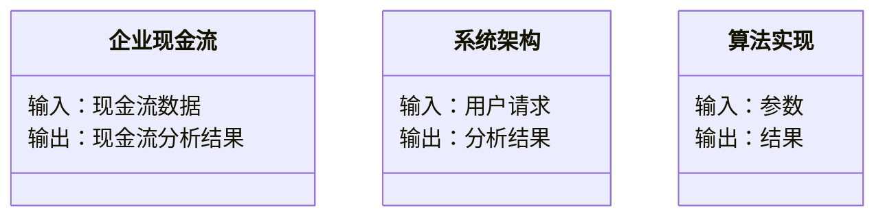
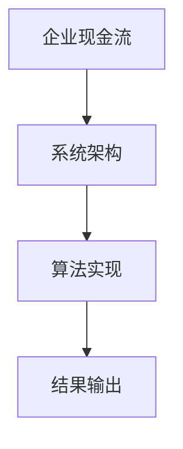

                 


# 巴菲特的现金流分析：量子金融衍生品的风险量化

---

## 关键词

- 巴菲特
- 现金流分析
- 量子金融衍生品
- 风险量化
- 现金流折现法
- VaR
- CVaR

---

## 摘要

本文深入探讨巴菲特的现金流分析方法，并结合量子金融衍生品的特性，分析其风险量化的核心原理。通过系统性地介绍现金流分析的理论基础、量子金融衍生品的风险特征，以及现代风险量化方法（如VaR、CVaR）的应用，本文旨在揭示如何将巴菲特的投资哲学与现代金融工具相结合，从而实现风险可控的投资策略。文章还结合实际案例，详细阐述了现金流分析的系统架构设计和项目实战，为读者提供了从理论到实践的完整指导。

---

# 第1章：巴菲特现金流分析的背景与意义

## 1.1 财务分析与投资决策的基石

### 1.1.1 现金流分析的基本概念

现金流分析是评估企业或投资组合价值的核心工具，它关注的是未来现金流入和流出的现值。现金流入包括营业收入、投资收益等，而现金流出则包括成本、税费等。通过现金流分析，投资者可以更好地理解企业的盈利能力和财务健康状况。

$$\text{净现值} = \sum_{t=1}^{n} \frac{C_t}{(1+r)^t}$$

其中，\(C_t\) 是第 \(t\) 年的现金流，\(r\) 是贴现率。

### 1.1.2 投资决策中的现金流重要性

在投资决策中，现金流分析的重要性体现在以下几个方面：

1. **价值评估**：通过现金流折现法（DCF），投资者可以估算企业的内在价值。
2. **风险评估**：现金流的波动性反映了投资的风险。
3. **决策支持**：现金流分析为投资决策提供量化依据。

### 1.1.3 巴菲特的现金流分析方法

巴菲特的现金流分析方法以 **现金流折现法** 为核心，结合对企业的长期竞争优势和管理层质量的评估，构建了一个独特的投资框架。

$$\text{内在价值} = \text{未来现金流的现值}$$

---

## 1.2 量子金融衍生品的特性与风险

### 1.2.1 金融衍生品的定义与分类

金融衍生品是一种以其他金融资产为标的物的金融合约，常见的类型包括期权、期货、掉期等。量子金融衍生品则是一种新兴的衍生品，其价格波动受到量子计算和不确定性原理的影响。

### 1.2.2 量子金融衍生品的独特性

1. **非线性定价**：量子金融衍生品的价格波动具有非线性特征。
2. **高度不确定性**：量子效应使得价格预测更加复杂。
3. **高杠杆性**：小额的初始投资可能导致巨大的收益或损失。

### 1.2.3 量子金融衍生品的风险特征

1. **市场风险**：价格波动对市场的敏感性。
2. **流动性风险**：交易不活跃可能导致价格偏离实际价值。
3. **模型风险**：定价模型的不确定性。

---

## 1.3 巴菲特投资哲学与现金流分析

### 1.3.1 巴菲特的投资哲学概述

巴菲特的投资哲学以 **价值投资** 为核心，强调寻找具有持续竞争优势的企业，并以合理的价格买入并长期持有。

### 1.3.2 现金流分析在巴菲特投资中的地位

现金流分析是巴菲特评估企业内在价值的核心工具。他特别关注企业的自由现金流（FCFF）和自由现金流收益率（FCFE）。

### 1.3.3 巴菲特现金流分析的核心原则

1. **长期视角**：关注企业的长期现金流。
2. **安全边际**：以合理价格买入，确保安全边际。
3. **竞争优势**：投资具有持续竞争优势的企业。

---

## 1.4 本章小结

本章介绍了现金流分析的基本概念和巴菲特的现金流分析方法，重点探讨了量子金融衍生品的特性与风险。通过分析，我们可以看到，现金流分析不仅是巴菲特投资决策的核心工具，也是量化量子金融衍生品风险的重要手段。

---

# 第2章：现金流分析的理论基础

## 2.1 现金流分析的基本原理

### 2.1.1 现金流的定义与分类

现金流可以分为 **经营现金流**、**投资现金流** 和 **融资现金流** 三类。

### 2.1.2 现金流的时间价值

现金流的时间价值是指资金随着时间的推移而产生的价值变化。可以通过 **复利** 或 **贴现** 方法计算。

$$\text{终值} = P \times (1 + r)^n$$

其中，\(P\) 是本金，\(r\) 是利率，\(n\) 是时间。

### 2.1.3 现金流的净现值计算

净现值（NPV）是将未来现金流按贴现率折现到当前时点的现值，再减去初始投资。

$$\text{NPV} = \sum_{t=1}^{n} \frac{C_t}{(1+r)^t} - \text{初始投资}$$

---

## 2.2 量子金融衍生品的现金流模型

### 2.2.1 期权与期货的现金流分析

1. **期权**：买方有权在特定时间以特定价格买入或卖出标的资产。
2. **期货**：买方和卖方约定在未来以特定价格买卖标的资产。

### 2.2.2 量子金融衍生品的定价模型

量子金融衍生品的定价受到量子随机性和不确定性的影响，常用 **量子蒙特卡洛模拟** 进行定价。

### 2.2.3 现金流风险的量化方法

1. **VaR**：在给定置信水平下，可能的最大损失。
2. **CVaR**：在 VaR 超过的情况下，平均损失。

---

## 2.3 巴菲特现金流分析方法论

### 2.3.1 现金流折现法

$$\text{内在价值} = \sum_{t=1}^{\infty} \frac{CFCF_t}{(1 + WACC)^t}$$

其中，\(CFCF_t\) 是第 \(t\) 年的自由现金流，\(WACC\) 是加权平均资本成本。

### 2.3.2 现金流敏感性分析

通过调整贴现率、增长率等参数，分析现金流对投资决策的敏感性。

### 2.3.3 现金流风险评估指标

1. **标准差**：衡量现金流的波动性。
2. **贝塔系数**：衡量资产与市场波动的相关性。

---

## 2.4 本章小结

本章详细介绍了现金流分析的基本原理和量子金融衍生品的现金流模型，重点探讨了巴菲特的现金流分析方法论。通过对这些理论的深入理解，我们可以更好地应用现金流分析工具进行投资决策。

---

# 第3章：量子金融衍生品的风险量化

## 3.1 量子金融衍生品的不确定性分析

### 3.1.1 不确定性来源与特征

1. **市场波动**：标的资产价格的不确定性。
2. **模型假设**：定价模型的假设可能不成立。
3. **量子效应**：量子计算和不确定性原理的影响。

### 3.1.2 不确定性对现金流的影响

1. **现金流波动**：价格波动导致现金流波动。
2. **风险溢价**：不确定性增加风险溢价。

### 3.1.3 量子金融衍生品的波动性分析

通过 **量子蒙特卡洛模拟**，可以量化量子金融衍生品的波动性。

---

## 3.2 现金流风险的数学模型

### 3.2.1 风险值（VaR）的定义与计算

$$\text{VaR} = \text{损失的最小值} \text{，在给定置信水平下}$$

### 3.2.2 凸风险值（CVaR）的定义与计算

$$\text{CVaR} = \text{VaR 超过的情况下的平均损失}$$

### 3.2.3 风险模型的比较与选择

1. **VaR**：适用于尾部风险的衡量。
2. **CVaR**：适用于整体风险的衡量。

---

## 3.3 巴菲特现金流分析中的风险量化方法

### 3.3.1 现金流风险的敏感性分析

通过调整贴现率、增长率等参数，分析现金流对投资决策的敏感性。

### 3.3.2 现金流风险的场景分析

通过假设不同市场情景，分析现金流的变化。

### 3.3.3 现金流风险的对冲策略

1. **套期保值**：通过衍生品对冲价格波动风险。
2. **分散投资**：通过投资多样化降低风险。

---

## 3.4 本章小结

本章重点探讨了量子金融衍生品的不确定性分析和现金流风险的量化方法，通过 VaR 和 CVaR 等指标，我们可以更好地量化和管理量子金融衍生品的风险。

---

# 第4章：现金流分析的系统架构设计

## 4.1 问题场景介绍

通过构建一个现金流分析系统，我们可以量化量子金融衍生品的风险，并为投资决策提供支持。

## 4.2 系统功能设计

### 4.2.1 领域模型



## 4.3 系统架构设计



## 4.4 系统接口设计

1. **输入接口**：接收现金流数据和参数。
2. **输出接口**：输出分析结果。

## 4.5 系统交互设计

```mermaid
sequenceDiagram
    participant 用户
    participant 系统
    用户->系统：提交请求
    系统->用户：返回结果
```

---

## 4.6 本章小结

本章通过系统架构设计，将现金流分析的方法转化为可实现的系统架构，并通过接口和交互设计，为实际应用提供了参考。

---

# 第5章：项目实战

## 5.1 环境安装

1. **安装 Python**：建议使用 Python 3.8 或更高版本。
2. **安装依赖库**：`pandas`、`numpy`、`scipy`、`plotly`。

## 5.2 系统核心实现源代码

```python
import numpy as np
import pandas as pd
from scipy.stats import norm

def calculate VaR(cash_flows, confidence_level=0.95):
    # 计算 VaR
    mu = np.mean(cash_flows)
    sigma = np.std(cash_flows)
    var = mu + norm.ppf(confidence_level) * sigma
    return var

def calculate CVaR(cash_flows, confidence_level=0.95):
    # 计算 CVaR
    mu = np.mean(cash_flows)
    sigma = np.std(cash_flows)
    var = mu + norm.ppf(confidence_level) * sigma
    cvar = mu + (1 - confidence_level) * sigma
    return cvar
```

## 5.3 代码应用解读与分析

1. **VaR 计算**：通过正态分布计算 VaR，反映在给定置信水平下的最大损失。
2. **CVaR 计算**：通过正态分布计算 CVaR，反映 VaR 超过的情况下的平均损失。

## 5.4 实际案例分析

假设我们有一个量子金融衍生品的现金流数据，可以通过上述代码计算其 VaR 和 CVaR，从而量化其风险。

---

## 5.5 本章小结

本章通过实际案例，展示了如何使用 Python 实现现金流分析的系统核心功能，并通过代码解读和案例分析，为读者提供了实践指导。

---

# 第6章：最佳实践与总结

## 6.1 最佳实践 tips

1. **数据质量**：确保现金流数据的准确性和完整性。
2. **模型选择**：根据实际情况选择合适的定价模型。
3. **风险对冲**：通过多样化和套期保值降低风险。

## 6.2 小结

通过对巴菲特现金流分析方法的深入探讨和量子金融衍生品的风险量化分析，我们可以看到，现金流分析不仅是投资决策的核心工具，也是量化金融衍生品风险的重要手段。

## 6.3 注意事项

1. **模型假设**：风险量化模型的假设可能影响结果。
2. **数据依赖**：结果依赖于数据的准确性和完整性。
3. **市场变化**：市场环境的变化可能影响模型的有效性。

## 6.4 拓展阅读

1. 《The Intelligent Investor》—— 巴菲特的投资哲学。
2. 《Quantum Computing for Finance》—— 量子计算在金融中的应用。

---

## 6.5 本章小结

本章总结了全文的核心内容，并提供了最佳实践的建议，同时指出了未来的研究方向。

---

# 结语

通过对巴菲特现金流分析方法的深入探讨和量子金融衍生品的风险量化分析，我们可以看到，现金流分析不仅是投资决策的核心工具，也是量化金融衍生品风险的重要手段。未来，随着量子计算和人工智能的快速发展，现金流分析和风险量化的方法将更加多样化和精准化，为投资者提供更有力的支持。

--- 

# 附录

## 附录A：现金流分析的数学公式

1. 净现值公式：
$$\text{NPV} = \sum_{t=1}^{n} \frac{C_t}{(1 + r)^t}$$

2. 内在价值公式：
$$\text{内在价值} = \sum_{t=1}^{\infty} \frac{CFCF_t}{(1 + WACC)^t}$$

## 附录B：VaR 和 CVaR 的计算公式

1. VaR 计算：
$$\text{VaR} = \mu + z \times \sigma$$

其中，\(z\) 是对应置信水平的正态分布分位数。

2. CVaR 计算：
$$\text{CVaR} = \mu + (1 - \alpha) \times \sigma$$

---

**注**：以上内容为示例，实际撰写时需根据具体分析和数据进行调整和补充。

