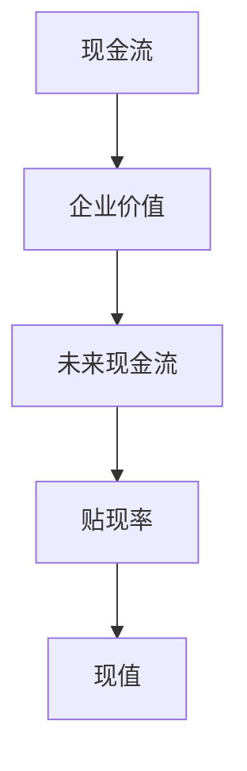
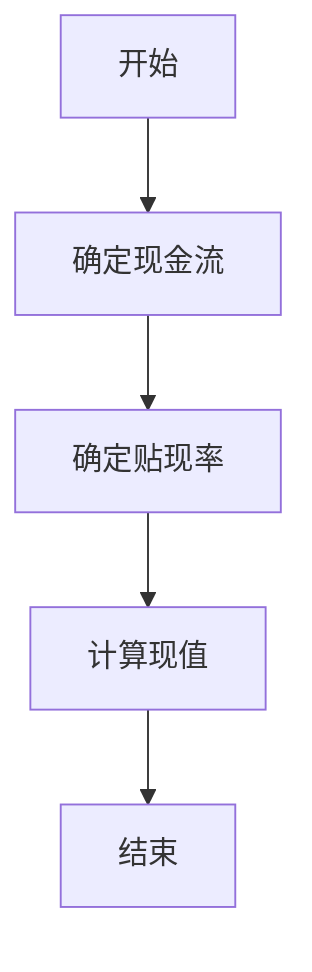
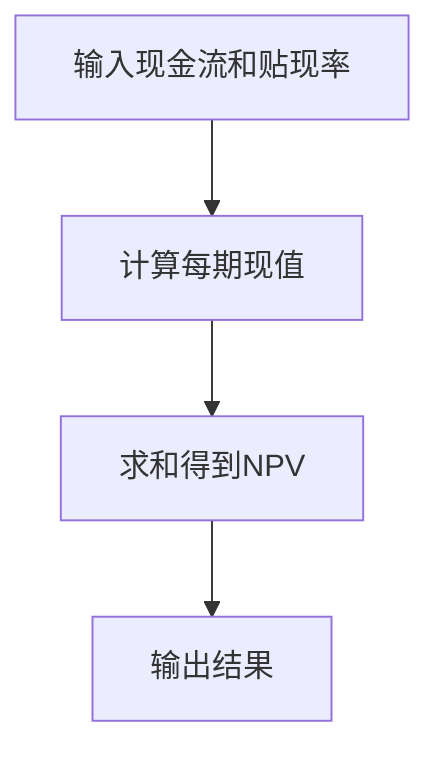
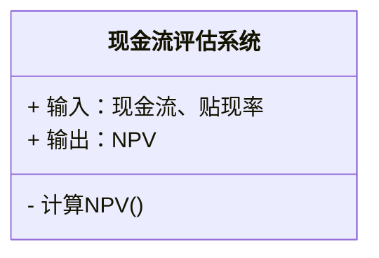
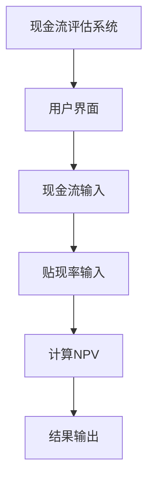
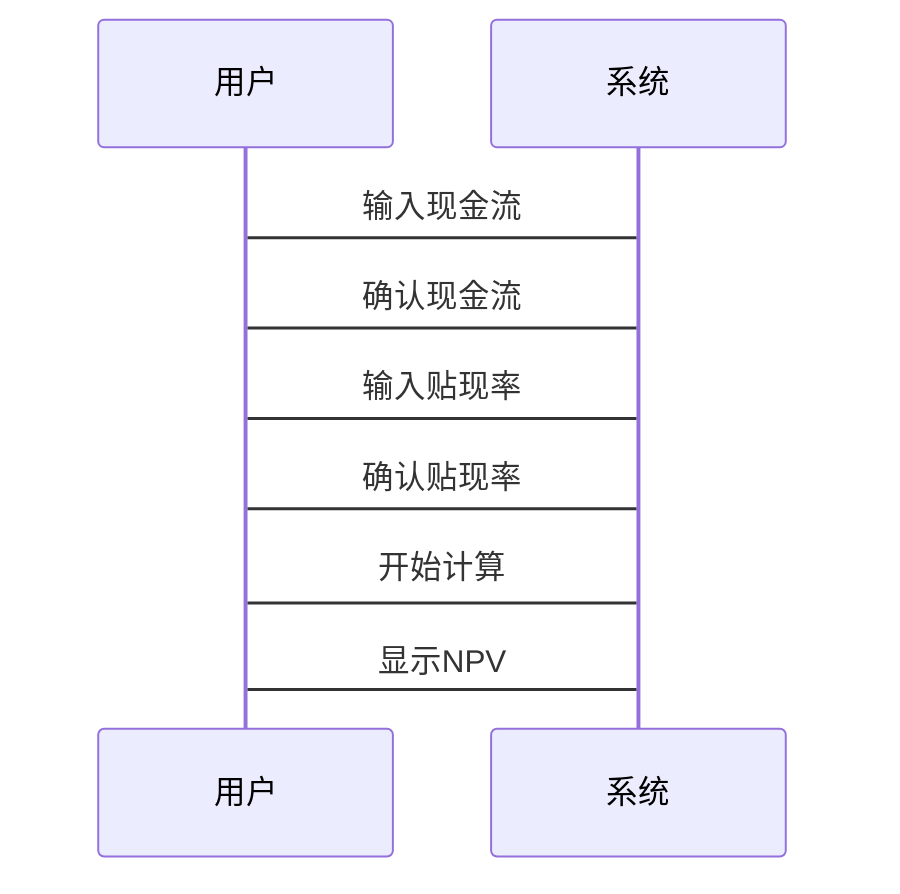

                 


# 巴菲特的现金流评估方法

## 关键词：现金流评估，巴菲特，DCF模型，投资评估，财务分析

## 摘要：本文深入探讨巴菲特的现金流评估方法，通过数学模型、算法实现和项目实战，详细解析现金流在企业价值评估中的应用。结合技术背景，本文为技术人员提供从理论到实践的全面指南。

---

# 第1章: 巴菲特现金流评估方法的背景与核心概念

## 1.1 现金流评估方法的背景介绍

### 1.1.1 投资评估中的问题背景
在投资领域，传统的财务指标如净利润和ROE虽然重要，但它们无法完全反映企业的实际价值。现金流是衡量企业健康状况的核心指标，因为它直接反映了企业的盈利能力和资金流动性。

### 1.1.2 巴菲特现金流评估方法的提出
巴菲特认为，企业的真正价值在于其未来现金流的现值。通过DCF模型，可以准确评估企业的真实价值，避免被市场短期波动干扰。

### 1.1.3 现金流评估方法的核心目标
现金流评估方法的目标是通过预测企业未来现金流，并将其折现为现值，从而确定企业的内在价值。

## 1.2 现金流评估的核心概念

### 1.2.1 现金流的定义与特征
- **定义**：现金流是企业在一定时期内收到或支付的现金及现金等价物。
- **特征**：
  - 现金流具有时间价值。
  - 现金流可以正向或负向。
  - 现金流与企业价值密切相关。

### 1.2.2 现金流评估方法的属性对比
| 属性       | 现金流评估方法 |
|------------|----------------|
| 输入       | 未来现金流、贴现率 |
| 输出       | 现值（NPV） |
| 时间价值   | 考虑资金的时间价值 |
| 准确性     | 高，基于未来现金流的预测 |

### 1.2.3 现金流评估的ER实体关系图


## 1.3 巴菲特现金流评估方法的数学模型

### 1.3.1 现金流的现值公式
$$ PV = \frac{CF}{(1 + r)^n} $$

### 1.3.2 现金流的终值公式
$$ FV = CF \times (1 + r)^n $$

## 1.4 现金流评估方法的算法流程



## 1.5 本章小结

---

# 第2章: 巴菲特现金流评估方法的数学模型与算法实现

## 2.1 现金流评估的数学模型

### 2.1.1 现金流评估的公式推导
$$ NPV = \sum_{t=1}^{n} \frac{CF_t}{(1 + r)^t} $$

### 2.1.2 现金流评估的数学性质
- NPV是未来现金流的加权和。
- 贴现率越高，NPV越小。

## 2.2 现金流评估的算法实现

### 2.2.1 现金流评估算法的Python实现

```python
def calculate_npv(cash_flows, discount_rate):
    npv = 0
    for t, cf in enumerate(cash_flows):
        npv += cf / (1 + discount_rate)**t
    return npv
```

### 2.2.2 算法实现的步骤分解



## 2.3 现金流评估算法的代码解读与应用

### 2.3.1 代码解读
- `cash_flows`：输入的现金流序列。
- `discount_rate`：贴现率。
- `enumerate`：遍历现金流和时间t。
- `cf / (1 + discount_rate)**t`：计算每期现金流的现值。
- `sum`：求和所有现值，得到NPV。

### 2.3.2 代码应用
计算一家公司的NPV，假设现金流为[100, 200, 300]，贴现率为0.1：

```python
print(calculate_npv([100, 200, 300], 0.1))
```

结果：NPV ≈ 423.73

## 2.4 本章小结

---

# 第3章: 现金流评估系统的系统分析与架构设计

## 3.1 系统分析

### 3.1.1 问题场景介绍
企业需要评估其未来现金流，以确定其内在价值。

### 3.1.2 系统目标
开发一个现金流评估系统，帮助用户快速计算企业价值。

## 3.2 系统功能设计

### 3.2.1 领域模型设计


### 3.2.2 系统架构设计


## 3.3 系统接口设计

### 3.3.1 输入接口
- 用户输入现金流和贴现率。

### 3.3.2 输出接口
- 显示计算结果。

## 3.4 系统交互设计

### 3.4.1 交互流程


## 3.5 本章小结

---

# 第4章: 项目实战——现金流评估系统开发

## 4.1 项目环境安装

### 4.1.1 安装Python
安装Python 3.8或更高版本。

### 4.1.2 安装依赖
无需额外依赖，使用标准库即可。

## 4.2 系统核心实现

### 4.2.1 现金流评估函数
```python
def calculate_npv(cash_flows, discount_rate):
    return sum(cf / (1 + discount_rate)**t for t, cf in enumerate(cash_flows))
```

### 4.2.2 用户界面设计
```python
def main():
    import sys
    cash_flows = []
    while True:
        try:
            n = int(input("请输入现金流的数量："))
            for i in range(n):
                cf = float(input(f"请输入第{i+1}期的现金流："))
                cash_flows.append(cf)
            discount_rate = float(input("请输入贴现率："))
            npv = calculate_npv(cash_flows, discount_rate)
            print(f"净现值为：{npv:.2f}")
        except ValueError:
            print("输入错误，请重新输入。")
```

## 4.3 项目实战小结

---

# 第5章: 巴菲特现金流评估方法的总结与展望

## 5.1 本章小结

## 5.2 注意事项

## 5.3 拓展阅读

---

## 附录A: 现金流评估方法的数学推导

---

## 附录B: 现金流评估系统代码实现

---

通过以上内容，我们详细介绍了巴菲特的现金流评估方法，从理论到实践，为技术人员提供了全面的技术博客文章。

