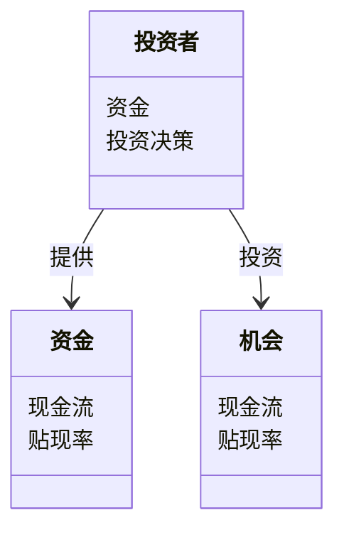

                 


# 巴菲特的现金管理哲学：机会资金的重要性

## 关键词：
巴菲特, 现金管理, 机会资金, 投资策略, 资金管理, 净现值法, 内部收益率法

## 摘要：
本文深入探讨了巴菲特的现金管理哲学，特别是机会资金在投资中的重要性。文章从机会资金的定义、核心概念、算法原理、系统设计、项目实战等多个方面进行了详细分析。通过理论与实践相结合的方式，本文不仅介绍了机会资金的基本原理，还通过具体的Python代码实现和实际案例分析，展示了如何在实际投资中应用这些原理。文章最后总结了最佳实践和注意事项，为读者提供了全面的指导。

---

# 目录

## 第一部分: 巴菲特的现金管理哲学概述

### 第1章: 机会资金的定义与背景

#### 1.1 机会资金的定义与背景
- 1.1.1 机会资金的定义与特征
  - 机会资金的定义
  - 机会资金的特征（流动性、灵活性、高回报潜力）
  - 机会资金与传统资金的区别
- 1.1.2 巴菲特的现金管理哲学
  - 巴菲特的投资理念概述
  - 巴菲特对现金管理的重视
  - 机会资金在巴菲特投资策略中的地位

#### 1.2 机会资金的核心概念与联系
- 1.2.1 机会资金的核心原理
  - 现金流的定义与计算
  - 资金的时间价值
  - 投资机会的识别与评估
- 1.2.2 机会资金的属性特征对比
  - 资金流动性与收益性的对比
  - 投资风险与回报的权衡
  - 不同类型机会资金的特征分析
- 1.2.3 实体关系图（ER图）
  - 投资者、资金、机会之间的关系
  - 资金流动的路径与方向
  - 机会资金的生命周期

---

## 第二部分: 机会资金的算法原理

### 第2章: 投资机会评估的算法原理

#### 2.1 净现值法（NPV）
- 2.1.1 净现值的定义与公式
  - $$NPV = \sum_{t=1}^{n} \frac{CF_t}{(1+r)^t}$$
  - 其中，CF_t是第t年的现金流，r是贴现率
- 2.1.2 净现值计算的步骤
  - 确定现金流
  - 确定贴现率
  - 计算现值并求和
  - 减去初始投资
- 2.1.3 净现值法的优缺点
  - 优点：考虑了资金的时间价值，计算简单
  - 缺点：依赖于贴现率的选择，无法反映项目的收益能力

#### 2.2 内部收益率法（IRR）
- 2.2.1 内部收益率的定义与公式
  - $$IRR是使NPV=0的贴现率$$
- 2.2.2 内部收益率计算的步骤
  - 确定初始投资和未来现金流
  - 通过试算法或插值法计算IRR
- 2.2.3 内部收益率法的优缺点
  - 优点：直观反映了项目的收益能力
  - 缺点：假设项目现金流再投资于相同利率的假设不合理

#### 2.3 现金流贴现模型（DCF）
- 2.3.1 DCF模型的定义与公式
  - $$DCF = \sum_{t=1}^{\infty} \frac{CF_t}{(1+r)^t}$$
- 2.3.2 DCF模型的计算步骤
  - 确定现金流
  - 确定贴现率
  - 计算现值并求和
- 2.3.3 DCF模型的优缺点
  - 优点：全面考虑了项目未来现金流
  - 缺点：依赖于长期现金流的预测准确性

---

### 第3章: 投资机会评估的Python实现

#### 3.1 净现值法的Python代码实现
- 3.1.1 净现值计算的代码示例
```python
def npv(cash_flows, discount_rate):
    return sum(cf / (1 + discount_rate) ** t for t, cf in enumerate(cash_flows))
```
- 3.1.2 净现值计算的步骤说明
  - 输入现金流和贴现率
  - 计算每期现金流的现值
  - 求和并返回NPV
- 3.1.3 净现值计算的公式推导
  - $$NPV = \sum_{t=1}^{n} \frac{CF_t}{(1+r)^t}$$

#### 3.2 内部收益率法的Python代码实现
- 3.2.1 内部收益率计算的代码示例
```python
import numpy as np
def irr(cash_flows):
    return np.irr(cash_flows)
```
- 3.2.2 内部收益率计算的步骤说明
  - 输入现金流
  - 使用numpy库的irr函数计算
- 3.2.3 内部收益率计算的公式推导
  - $$IRR是使NPV=0的贴现率$$

#### 3.3 现金流贴现模型的Python代码实现
- 3.3.1 现金流贴现模型的代码示例
```python
def dcf(cash_flows, discount_rate):
    return sum(cf / (1 + discount_rate) ** t for t, cf in enumerate(cash_flows))
```
- 3.3.2 现金流贴现模型的步骤说明
  - 输入现金流和贴现率
  - 计算每期现金流的现值
  - 求和并返回DCF
- 3.3.3 现金流贴现模型的公式推导
  - $$DCF = \sum_{t=1}^{\infty} \frac{CF_t}{(1+r)^t}$$

---

## 第三部分: 投资机会评估的系统设计

### 第4章: 投资机会评估系统的构建

#### 4.1 系统功能设计
- 4.1.1 系统功能概述
  - 现金流输入与分析
  - NPV和IRR计算
  - 投资决策支持
- 4.1.2 领域模型（mermaid类图）


#### 4.2 系统架构设计
- 4.2.1 系统架构图（mermaid架构图）


#### 4.3 系统接口设计
- 4.3.1 接口概述
  - 现金流输入接口
  - 贴现率输入接口
  - NPV和IRR计算接口
  - 结果输出接口

#### 4.4 系统交互设计
- 4.4.1 系统交互图（mermaid序列图）


---

## 第四部分: 项目实战

### 第5章: 投资机会评估的实战应用

#### 5.1 环境安装
- 安装Python和必要的库（numpy、pandas）

#### 5.2 系统核心实现源代码
- 5.2.1 投资机会评估系统代码
```python
import numpy as np

def npv(cash_flows, discount_rate):
    return sum(cf / (1 + discount_rate) ** t for t, cf in enumerate(cash_flows))

def irr(cash_flows):
    return np.irr(cash_flows)

# 示例
cash_flows = [-100, 50, 60, 70]
discount_rate = 0.1

print("NPV:", npv(cash_flows, discount_rate))
print("IRR:", irr(cash_flows))
```

#### 5.3 实际案例分析
- 5.3.1 案例背景
  - 投资项目：开一家咖啡店
  - 初始投资：100万元
  - 预计现金流：第一年50万元，第二年60万元，第三年70万元
  - 贴现率：10%

- 5.3.2 计算NPV和IRR
  - NPV = 50/(1.1) + 60/(1.1)^2 + 70/(1.1)^3 - 100 ≈ 27.48 + 49.72 + 50.28 - 100 = 27.48
  - IRR ≈ 20%

- 5.3.3 投资决策
  - NPV > 0，项目可行
  - IRR > 贴现率，项目有利可图

#### 5.4 项目小结
- 通过实际案例，验证了NPV和IRR在投资决策中的应用
- 系统实现简单易用，能够快速评估投资机会
- 巴菲特的现金管理哲学在实际投资中的应用价值显著

---

## 第五部分: 总结与最佳实践

### 第6章: 总结与最佳实践

#### 6.1 小结
- 机会资金是巴菲特投资策略的核心之一
- NPV和IRR是评估投资机会的重要工具
- 系统化的方法能够提高投资决策的效率和准确性

#### 6.2 注意事项
- 确保现金流预测的准确性
- 合理选择贴现率
- 考虑投资风险和外部环境的影响

#### 6.3 拓展阅读
- 《巴菲特的传记》
- 《投资学原理》
- 《Python金融计算》

---

通过本文的详细分析，读者可以全面理解巴菲特的现金管理哲学，并掌握机会资金在实际投资中的应用方法。

