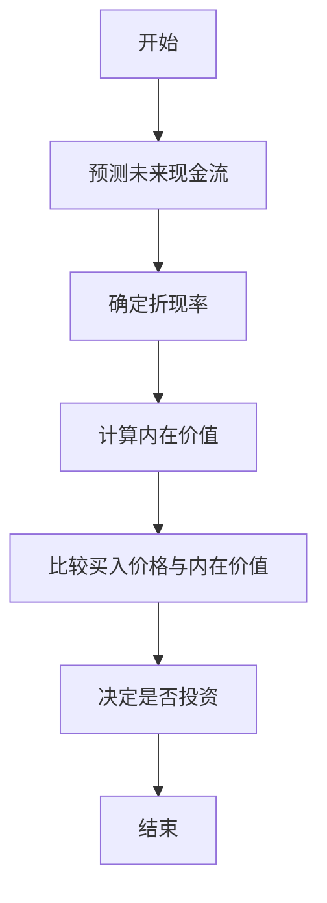
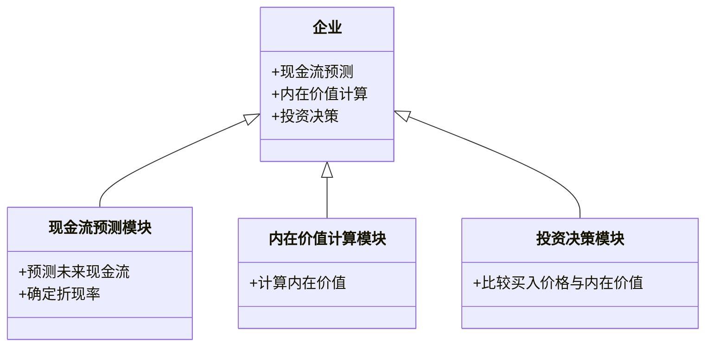
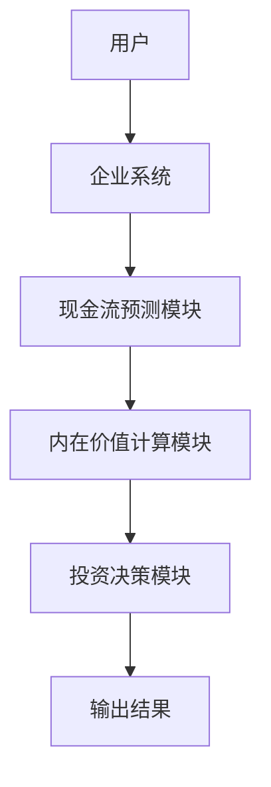
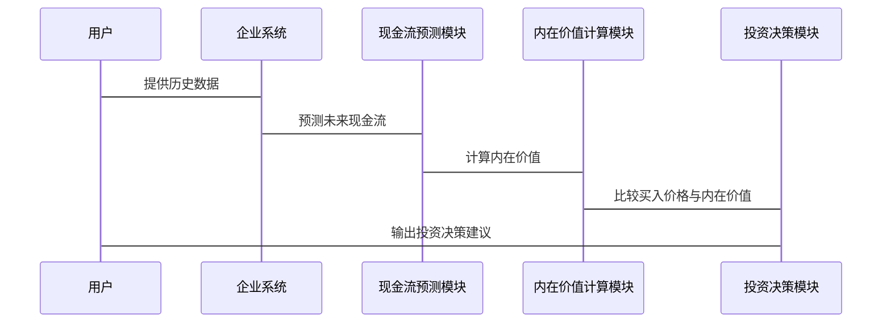

                 


# 巴菲特的现金管理策略

## 关键词：巴菲特，现金管理，投资策略，价值投资，风险管理，财务分析

## 摘要

本文深入分析了巴菲特的现金管理策略，探讨了其价值投资理念、现金管理的核心原则、数学模型与算法、系统架构设计，以及实际项目案例。文章通过详细讲解巴菲特的“先生存，后繁荣”理念、安全边际概念、内在价值评估，结合数学模型和系统架构，为读者提供全面的现金管理策略分析。

---

## 第1章 巴菲特的投资理念与现金管理概述

### 1.1 巴菲特的投资哲学

#### 1.1.1 价值投资的定义与核心理念

价值投资是一种以低于其内在价值的价格购买优质股票的投资策略。巴菲特的核心理念是寻找那些具有持续竞争优势、良好管理团队和合理估值的企业。

#### 1.1.2 巴菲特的价值投资原则

- **长期投资**：巴菲特强调长期持有优质资产，避免频繁交易。
- **安全边际**：买入价格低于内在价值，确保投资的安全性。
- **竞争优势**：投资具有持续竞争优势的企业。

#### 1.1.3 巴菲特的长期投资策略

巴菲特认为，长期投资能够最大化复利效应，避免短期市场的波动影响。

### 1.2 现金管理的核心概念

#### 1.2.1 现金管理的定义与目标

现金管理是通过合理分配和控制现金流量，以实现投资目标的过程。

#### 1.2.2 巴菲特的现金管理策略特点

- **保守性**：保持足够的现金储备以应对市场波动。
- **长期性**：注重企业的长期现金流预测。
- **安全性**：确保投资本金的安全。

#### 1.2.3 现金管理在投资组合中的作用

现金管理是投资组合的重要组成部分，能够平衡风险和收益。

### 1.3 巴菲特的现金管理策略背景

#### 1.3.1 美国投资市场的现状

美国市场成熟，巴菲特的投资策略在该环境下得到了验证。

#### 1.3.2 巴菲特的市场周期分析

巴菲特关注市场的周期性变化，调整现金管理策略。

#### 1.3.3 现金管理策略的演变

随着市场的变化，巴菲特不断优化现金管理策略。

---

## 第2章 巴菲特的现金管理核心原则

### 2.1 巴菲特的“先生存，后繁荣”理念

#### 2.1.1 现金储备的重要性

保持充足的现金储备以应对市场危机。

#### 2.1.2 现金储备的动态调整

根据市场变化调整现金持有量。

#### 2.1.3 现金储备与投资机会的关系

在保证流动性的同时抓住优质投资机会。

### 2.2 巴菲特的安全边际概念

#### 2.2.1 安全边际的定义

安全边际是买入价格低于内在价值的部分。

#### 2.2.2 安全边际在现金管理中的应用

通过安全边际确保投资的安全性。

#### 2.2.3 安全边际与投资风险的平衡

合理控制安全边际以平衡风险和收益。

### 2.3 巴菲特的内在价值评估

#### 2.3.1 内在价值的定义

内在价值是企业未来现金流的现值。

#### 2.3.2 内在价值的计算方法

使用DCF模型计算企业内在价值。

#### 2.3.3 内在价值与市场价值的对比

内在价值是长期投资的依据，市场价值受短期波动影响。

---

## 第3章 巴菲特的现金管理策略分析

### 3.1 巴菲特的现金分配策略

#### 3.1.1 现金分配的层次

- **核心层**：用于维持企业运营。
- **发展层**：用于企业扩张。
- **储备层**：用于应对危机。

#### 3.1.2 现金分配的动态调整

根据企业经营状况和市场环境调整现金分配。

#### 3.1.3 现金分配与投资组合的关系

现金分配影响投资组合的整体风险和收益。

### 3.2 巴菲特的现金流预测模型

#### 3.2.1 现金流预测的定义

现金流预测是基于企业未来经营状况的预测。

#### 3.2.2 现金流预测的关键指标

- **自由现金流**：企业经营活动产生的现金流。
- **资本支出**：企业投资于固定资产的资金。
- **营运资本变化**：企业营运资本的变动。

#### 3.2.3 现金流预测的数学模型

使用DCF模型预测企业未来现金流。

### 3.3 巴菲特的现金管理策略的优缺点

#### 3.3.1 策略的优点

- **安全性高**：注重本金安全。
- **长期收益**：注重长期复利效应。
- **风险可控**：通过安全边际控制风险。

#### 3.3.2 策略的缺点

- **流动性风险**：在市场低谷时可能面临流动性问题。
- **机会成本**：在现金持有期间可能错失投资机会。
- **市场依赖**：策略效果依赖于市场环境。

#### 3.3.3 策略的适用场景

适用于长期投资者，特别是那些能够长期持有优质资产的投资者。

---

## 第4章 巴菲特现金管理策略的数学模型与算法

### 4.1 巴菲特现金流预测的数学模型

#### 4.1.1 DCF模型

$$
\text{内在价值} = \sum_{t=1}^{n} \frac{\text{现金流}_t}{(1 + r)^t} + \frac{\text{残值}}{(1 + r)^n}
$$

其中：
- 现金流t：第t年的现金流。
- r：折现率。
- 残值：第n年后的残值。

#### 4.1.2 现金流预测的步骤

1. **预测未来现金流**：基于企业历史数据和行业趋势。
2. **确定折现率**：使用适当的折现率（如长期国债利率）。
3. **计算内在价值**：将未来现金流折现，计算内在价值。

### 4.2 巴菲特现金管理策略的算法实现

#### 4.2.1 算法流程图



#### 4.2.2 Python代码实现

```python
def calculate_intrinsic_value(cash_flows, discount_rate, residual_value):
    n = len(cash_flows)
    intrinsic_value = 0
    for t in range(n):
        if t == 0:
            continue
        cash_flow = cash_flows[t]
        intrinsic_value += cash_flow / (1 + discount_rate) ** t
    intrinsic_value += residual_value / (1 + discount_rate) ** n
    return intrinsic_value

# 示例数据
cash_flows = [100, 120, 130, 140, 150]
discount_rate = 0.08
residual_value = 200

intrinsic_value = calculate_intrinsic_value(cash_flows, discount_rate, residual_value)
print(f"内在价值为：{intrinsic_value:.2f}")
```

#### 4.2.3 代码解读

- **函数定义**：`calculate_intrinsic_value` 函数计算企业内在价值。
- **输入参数**：`cash_flows`（未来现金流）、`discount_rate`（折现率）、`residual_value`（残值）。
- **计算过程**：遍历每一年的现金流，计算其现值，并累加到内在价值中。最后加上残值的现值。
- **示例计算**：使用示例数据计算企业内在价值。

---

## 第5章 巴菲特现金管理策略的系统架构设计

### 5.1 系统功能设计

#### 5.1.1 领域模型



#### 5.1.2 系统架构设计



#### 5.1.3 系统接口设计

- **输入接口**：接收企业的历史数据和市场数据。
- **输出接口**：输出内在价值和投资决策建议。

#### 5.1.4 系统交互设计



---

## 第6章 巴菲特定投可口可乐的现金管理策略分析

### 6.1 项目背景

#### 6.1.1 企业介绍

可口可乐是全球知名的饮料公司，具有强大的市场竞争力和稳定的现金流。

#### 6.1.2 投资背景

巴菲特在2005年买入可口可乐股票，长期持有。

### 6.2 投资策略实施

#### 6.2.1 现金流预测

$$
\text{现金流}_t = \text{营业收入}_t - \text{营业成本}_t - \text{税费}_t
$$

#### 6.2.2 内在价值评估

使用DCF模型计算可口可乐的内在价值。

#### 6.2.3 投资决策

比较可口可乐的内在价值与市场价，决定是否买入。

### 6.3 投资效果分析

#### 6.3.1 投资收益

计算投资收益，验证巴菲特策略的有效性。

#### 6.3.2 市场环境变化

分析市场环境变化对投资策略的影响。

#### 6.3.3 风险管理

评估投资中的风险，并采取相应的风险管理措施。

### 6.4 代码实现与分析

#### 6.4.1 现金流预测代码

```python
def calculate_cash_flows( revenues, costs, taxes ):
    cash_flows = []
    for i in range(len(revenues)):
        cash_flow = revenues[i] - costs[i] - taxes[i]
        cash_flows.append(cash_flow)
    return cash_flows

# 示例数据
revenues = [1000, 1200, 1300, 1400, 1500]
costs = [600, 700, 750, 800, 850]
taxes = [100, 120, 130, 140, 150]

cash_flows = calculate_cash_flows(revenues, costs, taxes)
print("现金流序列:", cash_flows)
```

#### 6.4.2 内在价值计算代码

```python
def calculate_intrinsic_value(cash_flows, discount_rate, residual_value):
    n = len(cash_flows)
    intrinsic_value = 0
    for t in range(n):
        cash_flow = cash_flows[t]
        intrinsic_value += cash_flow / (1 + discount_rate) ** t
    intrinsic_value += residual_value / (1 + discount_rate) ** n
    return intrinsic_value

# 示例数据
cash_flows = [100, 120, 130, 140, 150]
discount_rate = 0.08
residual_value = 200

intrinsic_value = calculate_intrinsic_value(cash_flows, discount_rate, residual_value)
print(f"内在价值为：{intrinsic_value:.2f}")
```

#### 6.4.3 代码解读

- **现金流预测**：计算每期的现金流，考虑收入、成本和税费。
- **内在价值计算**：使用现金流预测结果和残值，计算企业的内在价值。
- **投资决策**：比较内在价值与市场价，决定是否投资。

---

## 第7章 巴菲特现金管理策略的最佳实践

### 7.1 最佳实践

#### 7.1.1 制定明确的投资计划

- 确定投资目标和策略。
- 分析市场环境和企业基本面。

#### 7.1.2 重视风险管理

- 设定止损点。
- 保持足够的现金储备。

#### 7.1.3 持续学习与进化

- 关注市场变化。
- 更新投资策略。

### 7.2 小结

巴菲特的现金管理策略是一种长期、稳健的投资方法，通过内在价值评估和风险管理，实现投资的安全性和长期收益。

### 7.3 注意事项

- **市场风险**：投资需谨慎，市场波动可能导致损失。
- **信息获取**：确保数据的准确性和及时性。
- **策略调整**：根据市场变化，适时调整策略。

### 7.4 拓展阅读

- 巴菲特的其他投资策略。
- 其他投资者的现金管理策略。

---

## 总结

本文详细分析了巴菲特的现金管理策略，从投资理念到数学模型，再到实际案例，为读者提供了全面的指导。通过理解巴菲特的策略，投资者可以更好地进行现金管理，实现长期稳健的投资收益。

