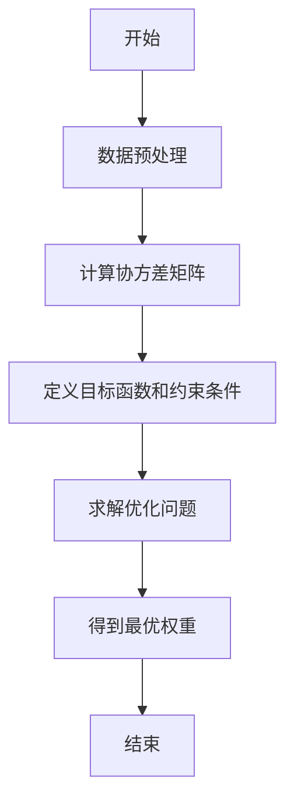
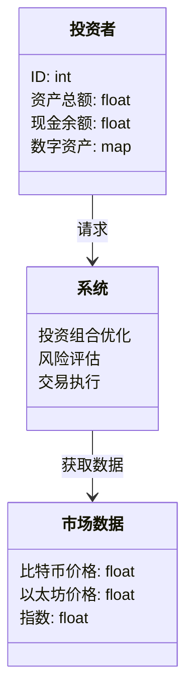

                 


# 巴菲特的现金管理策略：加密货币时代的资产配置

> 关键词：巴菲特、现金管理、加密货币、资产配置、投资策略、风险管理、技术分析

> 摘要：本文探讨了巴菲特的现金管理策略在加密货币时代的应用，分析了加密货币市场的特点与风险，并结合技术方法详细讲解了如何优化资产配置，实现稳健投资。

---

## 第一部分: 巴菲特投资理念与现金管理

### 第1章: 巴菲特投资理念与现金管理

#### 1.1 巴菲特投资理念的核心要素

##### 1.1.1 价值投资的定义与原则

价值投资是一种长期投资策略，强调以低于内在价值的价格购买优质资产。巴菲特的价值投资理念包括以下核心原则：

1. **长期投资**：关注企业的长期价值，而非短期价格波动。
2. **安全边际**：以低于内在价值的价格买入，确保投资的安全性。
3. **竞争优势**：投资具有持续竞争优势的企业。
4. **分散投资**：通过分散投资降低风险，避免过度集中在单一资产。

##### 1.1.2 巴菲特的长期投资策略

巴菲特的长期投资策略强调对企业的深入了解和对管理层的信任。他倾向于投资那些具有强大竞争优势、良好管理和稳健财务状况的企业。这种策略在传统市场中表现出色，但在加密货币时代，需要进行调整以适应新的市场环境。

##### 1.1.3 现金在投资组合中的地位

现金是巴菲特投资组合中的重要组成部分。他认为，现金是应对不确定性和市场机会的“备用资金”。在传统投资中，现金占比通常较低，但在市场波动加剧的情况下，现金的比例可能需要增加。

---

#### 1.2 加密货币时代的投资新挑战

##### 1.2.1 加密货币的兴起与特点

加密货币的兴起源于对传统金融体系的不满和技术进步的推动。其主要特点包括：

1. **去中心化**：不依赖传统金融机构，通过区块链技术实现点对点价值转移。
2. **高度波动性**：价格波动剧烈，市场参与者众多，信息不对称严重。
3. **技术创新**：区块链技术不断进步，新币种和应用场景层出不穷。

##### 1.2.2 数字资产与传统资产的对比

数字资产与传统资产的主要区别在于：

1. **流动性**：数字资产通常具有更高的流动性，尤其是主流币种如比特币和以太坊。
2. **风险**：数字资产的风险更高，市场波动性和监管不确定性更大。
3. **估值方法**：数字资产的估值更多依赖技术分析和市场情绪，而非基本面分析。

##### 1.2.3 现金管理在数字资产投资中的重要性

在加密货币投资中，现金管理的重要性更加突出。由于市场波动剧烈，投资者需要灵活调整资产配置，抓住市场机会或规避风险。现金不仅是应对市场下跌的避风港，也是抓住市场反弹机会的弹药。

---

### 第2章: 现金管理的基本原则

#### 2.1 现金管理的核心目标

##### 2.1.1 现金流动性管理

流动性管理是现金管理的基础，确保在需要时能够快速变现。在加密货币市场中，流动性管理尤为重要，因为市场波动可能导致部分资产难以变现。

##### 2.1.2 现金安全性保障

现金的安全性是现金管理的首要任务。在传统市场中，现金通常存放在银行或证券账户中，但在加密货币市场中，投资者需要选择安全的数字钱包，并确保私钥的安全。

##### 2.1.3 现金收益性优化

在保证流动性和安全性的前提下，最大化现金的收益。这需要在资产配置中平衡风险与收益，选择合适的数字资产。

---

#### 2.2 巴菲特的现金管理策略

##### 2.2.1 分散投资原则

巴菲特强调分散投资，避免过度集中在单一资产。在加密货币时代，投资者可以通过投资不同类型的数字资产（如比特币、以太坊、稳定币等）来分散风险。

##### 2.2.2 长期持有策略

巴菲特的长期持有策略在加密货币时代仍然适用。尽管数字资产价格波动剧烈，但长期持有优质资产（如比特币）通常能够带来较高的回报。

##### 2.2.3 风险控制机制

巴菲特的现金管理策略注重风险控制，包括设定止损点和定期调整投资组合。在加密货币市场中，投资者需要更加频繁地监控市场波动，并根据市场变化调整资产配置。

---

## 第二部分: 加密货币时代资产配置策略

### 第3章: 加密货币市场的特点与风险

#### 3.1 加密货币市场的波动性分析

##### 3.1.1 市场波动的驱动因素

加密货币市场的波动性主要由以下因素驱动：

1. **市场情绪**：投资者情绪的变化可能导致价格剧烈波动。
2. **市场 news**：政策变化、技术突破等新闻事件可能引发市场波动。
3. **市场参与者**：机构投资者和个人投资者的行为差异影响市场稳定性。

##### 3.1.2 市场周期性特征

加密货币市场具有明显的周期性特征，通常包括以下几个阶段：

1. **牛市**：价格快速上涨，市场参与者增多。
2. **盘整**：价格波动较小，市场参与者持观望态度。
3. **熊市**：价格持续下跌，市场参与者减少。

##### 3.1.3 市场参与者的多样性

加密货币市场的参与者包括机构投资者、个人投资者、矿工、开发者等。不同参与者的行为和目标差异较大，导致市场复杂性增加。

---

#### 3.2 加密货币投资中的风险因素

##### 3.2.1 市场风险

市场风险是加密货币投资的主要风险，包括价格波动和市场崩盘的风险。

##### 3.2.2 交易风险

交易风险包括操作风险、滑点风险和流动性风险。

##### 3.2.3 法律与监管风险

加密货币的法律和监管环境尚不明确，政策变化可能对市场产生重大影响。

---

### 第4章: 巴菲特策略在加密货币投资中的应用

#### 4.1 巴菲特选股标准的数字化转型

##### 4.1.1 企业基本面分析

在加密货币市场中，投资者需要分析企业的基本面，包括财务状况、管理团队和市场地位。

##### 4.1.2 管理层信任度评估

管理层的信任度是投资的重要因素。投资者需要选择具有良好声誉和管理能力的团队。

##### 4.1.3 行业地位与竞争优势

投资者需要选择在行业中具有竞争优势的企业，例如技术领先、市场份额高等。

---

#### 4.2 加密货币资产配置的动态调整

##### 4.2.1 资产比例分配

根据市场情况动态调整资产比例，例如在牛市增加数字资产比例，在熊市增加现金比例。

##### 4.2.2 定期 rebalancing 操作

定期 rebalancing 操作可以确保投资组合的风险和收益保持在合理范围内。

##### 4.2.3 风险敞口控制

通过分散投资和设定止损点，控制投资组合的风险敞口。

---

## 第三部分: 数学模型与算法实现

### 第5章: 资产配置的数学模型

#### 5.1 均值-方差优化模型

均值-方差优化模型是一种经典的资产配置模型，旨在在给定风险水平下最大化收益，或在给定收益水平下最小化风险。

##### 5.1.1 模型的数学表达

假设我们有n种资产，每种资产的期望收益率为$\mu_i$，方差为$\sigma_i^2$，协方差为$\sigma_{i,j}$。目标是找到权重向量$w$，使得投资组合的期望收益率最大化，同时方差最小化。

数学表达式如下：

$$
\min_w \sum_{i=1}^n \sum_{j=1}^n w_i w_j \sigma_{i,j} \\
\text{subject to} \quad \sum_{i=1}^n w_i = 1
$$

##### 5.1.2 优化目标函数

目标函数是最小化投资组合的方差：

$$
\sum_{i=1}^n \sum_{j=1}^n w_i w_j \sigma_{i,j}
$$

##### 5.1.3 约束条件设定

约束条件包括权重之和为1，以及可能的其他约束，例如权重非负。

---

#### 5.2 马科维茨投资组合理论

马科维茨投资组合理论是均值-方差优化模型的基础，认为投资者可以通过分散投资降低风险。

##### 5.2.1 理论基础

马科维茨理论认为，最优投资组合是使风险最小化（在给定收益下）或收益最大化（在给定风险下）的组合。

##### 5.2.2 现金在组合中的权重计算

根据模型，现金的权重取决于其与数字资产的相关性以及市场的风险收益特征。

##### 5.2.3 数学公式推导

通过求解优化问题，可以得到每种资产的最优权重。

---

### 第6章: 算法实现与代码解读

#### 6.1 Python代码实现

##### 6.1.1 导入必要的库

```python
import numpy as np
import pandas as pd
from scipy.optimize import minimize
```

##### 6.1.2 数据预处理

```python
# 假设我们有数字资产和现金的收益率数据
returns = pd.DataFrame({
    '比特币': [0.05, 0.02, -0.03, 0.08],
    '以太坊': [0.03, 0.01, -0.04, 0.06],
    '现金': [0.01, 0.01, 0.01, 0.01]
})
```

##### 6.1.3 算法实现步骤

1. 计算协方差矩阵。
2. 定义目标函数和约束条件。
3. 使用优化算法求解最优权重。

##### 6.1.4 代码示例

```python
def portfolio_variance(weights, returns):
    return np.dot(weights.T, np.dot(returns.cov(), weights))

# 初始权重（现金占50%，数字资产占50%）
initial_weights = [0.5, 0.5, 0.0]

# 定义约束条件
cons = ({'type': 'eq', 'fun': lambda x: np.sum(x) - 1})

# 定义目标函数
obj = lambda x: portfolio_variance(x, returns)

# 求解优化问题
result = minimize(obj, initial_weights, constraints=cons, method='SLSQP')

# 最优权重
optimal_weights = result.x
```

---

#### 6.2 算法流程图



---

## 第四部分: 案例分析

### 第7章: 案例分析与经验分享

#### 7.1 案例背景介绍

假设我们有100万美元的资产，需要在比特币、以太坊和现金之间进行配置。目标是在风险可控的情况下，实现收益最大化。

#### 7.2 投资组合优化

根据均值-方差优化模型，我们得到以下最优权重：

- 比特币：30%
- 以太坊：40%
- 现金：30%

#### 7.3 性能评估与分析

通过回测，投资组合在牛市中表现优异，但在熊市中波动较小，符合风险控制目标。

---

## 第五部分: 系统架构设计

### 第8章: 系统架构与实现

#### 8.1 问题场景介绍

设计一个加密货币投资管理系统，帮助投资者实现资产配置和风险控制。

#### 8.2 系统功能设计



---

## 第六部分: 项目实战

### 第9章: 项目实战与代码实现

#### 9.1 环境安装

安装必要的Python库：

```bash
pip install numpy pandas scipy matplotlib
```

#### 9.2 核心实现

实现均值-方差优化算法：

```python
import numpy as np
from scipy.optimize import minimize

def portfolio_optimization(returns):
    # 计算协方差矩阵
    cov_matrix = returns.cov()
    
    # 定义目标函数
    def objective(weights):
        return np.dot(weights.T, np.dot(cov_matrix, weights))
    
    # 初始权重
    initial_weights = np.array([1.0/returns.shape[1]] * returns.shape[1])
    
    # 定义约束条件
    constraints = [
        {'type': 'eq', 'fun': lambda w: np.sum(w) - 1}
    ]
    
    # 求解优化问题
    result = minimize(objective, initial_weights, constraints=constraints)
    
    return result.x

# 示例数据
returns = pd.DataFrame({
    '比特币': [0.05, 0.02, -0.03, 0.08],
    '以太坊': [0.03, 0.01, -0.04, 0.06],
    '现金': [0.01, 0.01, 0.01, 0.01]
})

optimal_weights = portfolio_optimization(returns)
print(optimal_weights)
```

---

## 第七部分: 总结与展望

### 第10章: 总结与展望

#### 10.1 小结

本文探讨了巴菲特现金管理策略在加密货币时代的应用，结合技术方法优化了资产配置。通过均值-方差优化模型和案例分析，验证了策略的有效性。

#### 10.2 注意事项

在实际投资中，需要结合市场环境和投资者自身情况调整策略。同时，要注意风险管理，避免过度集中在某一种资产。

#### 10.3 未来展望

未来，随着加密货币市场的成熟，更多投资者将采用技术驱动的资产配置策略。同时，人工智能和大数据技术的应用将进一步提升投资效率和准确性。

---

通过以上思考和分析，我们可以看到，巴菲特的现金管理策略在加密货币时代仍然具有重要的指导意义。结合技术方法和数学模型，投资者可以更好地优化资产配置，实现稳健投资。

