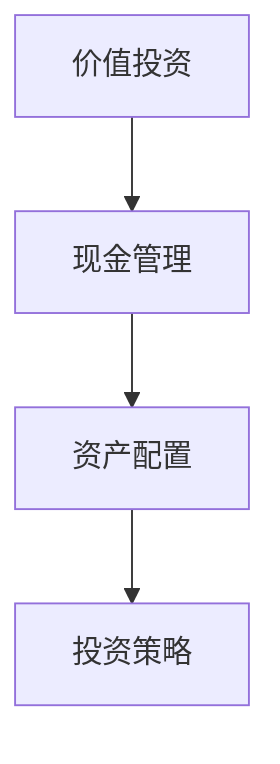
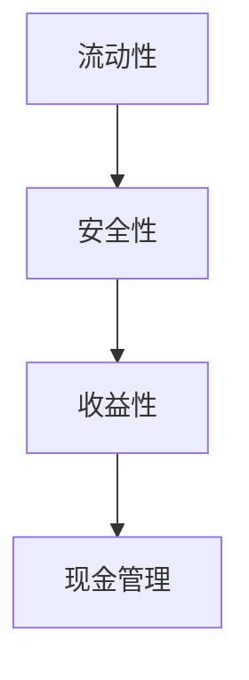

                 

# 巴菲特的现金管理策略：在低利率环境中的调整

---

## 关键词：
- 巴菲特
- 现金管理
- 低利率环境
- 投资策略
- 资产配置
- 价值投资

---

## 摘要：
本文深入探讨了巴菲特在低利率环境下的现金管理策略，分析了其核心理念、资产配置原则以及应对低利率挑战的具体方法。通过经典案例和数学模型，揭示了巴菲特如何在低利率环境下优化现金储备、选择债券投资，并动态调整资产配置，以实现稳健收益。文章还提供了实际操作建议和最佳实践，帮助投资者在当前低利率环境下优化现金管理。

---

## 第1章: 巴菲特投资理念与现金管理基础

### 1.1 巴菲特投资理念的核心思想

#### 1.1.1 价值投资的定义与原则
- **价值投资**：寻找市场低估的优质企业，长期持有，获得超额收益。
- **原则**：安全边际、长期视角、集中投资。

#### 1.1.2 巴菲特投资理念的核心要素
- **安全边际**：买入价格低于内在价值，降低投资风险。
- **长期视角**：关注企业的长期竞争优势，而非短期波动。
- **集中投资**：投资于少数优质企业，降低组合风险。

#### 1.1.3 价值投资与现金管理的联系
- 现金管理是价值投资的重要组成部分，确保资金的安全性和流动性，为寻找低估资产提供弹药。

#### 1.1.4 核心概念关系图（Mermaid）

---

### 1.2 现金管理的基本概念与重要性

#### 1.2.1 现金管理的定义
- 现金管理：对现金及现金等价物进行计划和控制的过程，以实现资金的流动性、安全性和收益性。

#### 1.2.2 现金管理在投资中的作用
- 作为防御性资产，应对突发事件和市场机会。
- 优化资产配置，平衡风险与收益。

#### 1.2.3 巴菲特对现金管理的重视
- 巴菲特认为现金是企业“血液”，必须保持充足流动性。

---

## 第2章: 低利率环境下的投资挑战

### 2.1 低利率环境的定义与特征

#### 2.1.1 利率的定义与分类
- 利率：借贷资金的成本，分为短期和长期利率。

#### 2.1.2 当前全球低利率环境的现状
- 多国央行降低基准利率，甚至实施负利率政策。

#### 2.1.3 低利率环境对经济的影响
- 刺激借贷和投资，但也可能导致资产泡沫和通货膨胀。

#### 2.1.4 低利率环境下的现金管理难点
- 现金收益率下降，资产贬值风险增加。

---

## 第3章: 巴菲特现金管理策略的核心原则

### 3.1 现金管理的三要素：流动性、安全性与收益性

#### 3.1.1 流动性的定义与实现
- 现金及短期债券，确保随时可变现。

#### 3.1.2 安全性的保障措施
- 投资于高信用评级债券，避免本金损失。

#### 3.1.3 收益性的实现方式
- 通过优质债券和股票，获得稳定收益。

#### 3.1.4 现金管理三要素关系图（Mermaid）

---

### 3.2 巴菲特的资产配置策略

#### 3.2.1 股票与债券的配置比例
- 根据市场环境调整，通常债券占比在10%-20%之间。

#### 3.2.2 高质量债券的选择标准
- 评级高、期限短、发行人信誉良好。

#### 3.2.3 现金储备的动态调整
- 根据市场变化和企业需求，灵活调整现金持有量。

---

## 第4章: 巴菲特现金管理策略的实施步骤

### 4.1 确定投资目标与风险承受能力

#### 4.1.1 投资目标的设定
- 确定投资期限、收益目标和风险偏好。

#### 4.1.2 风险承受能力的评估
- 根据财务状况和心理承受能力，评估风险承受能力。

#### 4.1.3 投资期限的规划
- 长期投资注重资产增值，短期投资注重流动性。

---

## 第5章: 巴菲特现金管理策略的案例分析

### 5.1 巴菲特的经典投资案例

#### 5.1.1 可口可乐的投资案例
- 长期持有优质股票，获得稳定股息收入。

#### 5.1.2 伯克希尔 Hathaway 的投资策略
- 专注于具有持续竞争优势的企业，长期投资。

---

## 第6章: 低利率环境下的现金管理应对策略

### 6.1 应对低利率环境的现金管理工具

#### 6.1.1 现金管理工具的种类
- 活期存款、短期债券、货币市场基金。

#### 6.1.2 各种工具的优缺点对比
- 活期存款流动性高，收益低；债券收益稳定，流动性稍差。

---

## 第7章: 总结与展望

### 7.1 核心观点回顾
- 巴菲特的现金管理策略强调安全性、流动性和收益性。
- 低利率环境下，需优化资产配置，注重债券投资。

### 7.2 对未来投资环境的展望
- 低利率环境可能持续，投资者需灵活调整策略，抓住优质资产机会。

---

## 附录：巴菲特经典语录

- “在别人贪婪时恐惧，在别人恐惧时贪婪。”
- “只有当潮水退去，才能看到谁在裸泳。”

---

通过以上内容，我们全面分析了巴菲特的现金管理策略，特别是在低利率环境下的调整方法。希望本文能为投资者提供有价值的见解和实用的建议。

