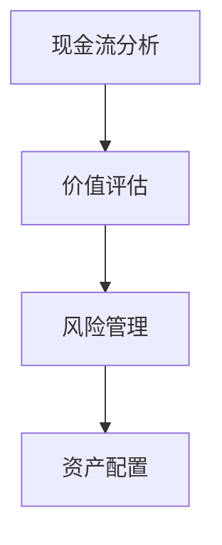
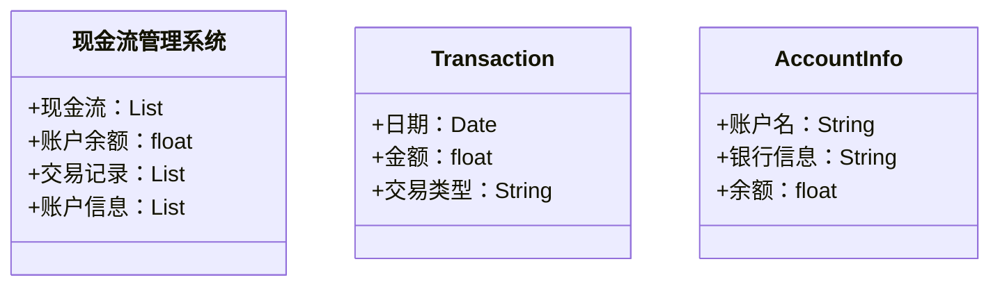
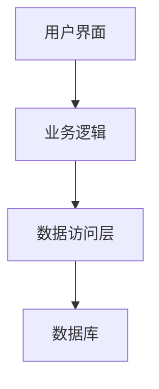
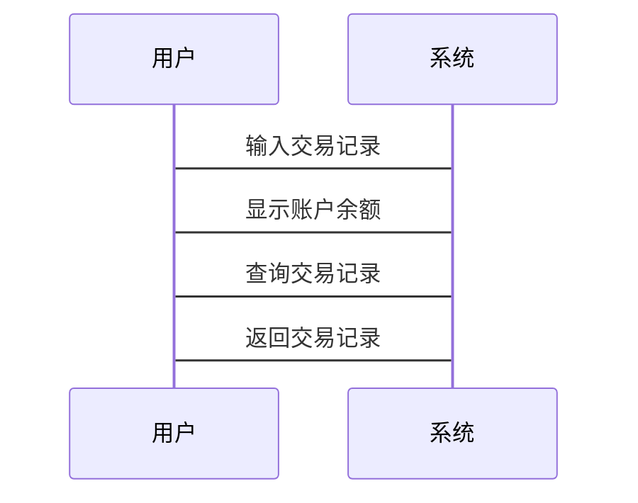

                 


# 巴菲特的现金管理策略：负利率环境下的资金配置

## 关键词
- 巴菲特
- 现金管理策略
- 负利率
- 资金配置
- 投资策略
- 现金流分析
- 股息贴现模型

## 摘要
本文详细探讨了巴菲特的现金管理策略，特别是在负利率环境下的资金配置。通过分析巴菲特的投资理念、现金管理的核心原则以及应对负利率环境的具体策略，本文为读者提供了从理论到实践的全面指导。文章结合数学模型和实际案例，深入剖析了巴菲特的现金管理策略，并提出了在负利率环境下优化资金配置的具体建议。

---

# 第一部分: 巴菲特的现金管理策略概述

## 第1章: 巴菲特投资理念与现金管理概述

### 1.1 巴菲特的生平与投资理念

#### 1.1.1 巴菲特的生平简介
沃伦·巴菲特（Warren Buffett）是全球著名的投资家、企业家和慈善家。他于1934年出生在美国 Omaha 市，毕业于哥伦比亚大学，并在哈佛大学教授Ben Graham的影响下，形成了自己的投资哲学。巴菲特以其长期投资、价值投资和安全边际原则闻名，被誉为“股神”。

#### 1.1.2 巴菲特的投资哲学
巴菲特的投资哲学以价值投资为核心，强调购买低于其内在价值的股票，并长期持有。他认为市场波动是投资的敌人，而时间是优秀企业的朋友。他的投资理念可以总结为以下几点：
1. **长期投资**：巴菲特性长期持有优质资产，避免频繁交易。
2. **价值投资**：寻找具有持续竞争优势的企业，以低于其内在价值的价格买入。
3. **安全边际**：在投资决策中留出足够的安全边际，以应对市场的不确定性。

#### 1.1.3 巴菲特对现金管理的重视
巴菲特认为，现金是企业的“氧气”，在市场低迷时尤为重要。他强调在企业运营中保持充足的现金流，以应对突发事件和市场波动。

---

### 1.2 现金管理的核心概念

#### 1.2.1 现金管理的定义
现金管理是指对企业的现金流入和流出进行计划、控制和监控，以确保企业在任何时候都能满足其财务需求。有效的现金管理可以帮助企业降低财务风险，优化资金使用效率。

#### 1.2.2 现金管理的核心原则
1. **流动性**：确保企业有足够的流动性来应对短期债务和突发事件。
2. **安全性**：保证现金资产的安全性，避免因管理不当导致的损失。
3. **收益性**：在保证流动性和安全性的前提下，尽可能提高现金资产的收益率。

#### 1.2.3 现金管理的边界与外延
现金管理不仅包括企业内部的现金流动，还涉及与外部银行、投资者等的互动。其外延包括资金筹集、投资决策和风险管理等多个方面。

---

### 1.3 负利率环境下的资金配置

#### 1.3.1 负利率的定义与特征
负利率是指中央银行将基准利率降至零以下，甚至通过量化宽松等手段向市场注入流动性。其特征包括：
1. **低利率环境**：市场利率接近或低于零。
2. **货币贬值**：负利率可能导致货币贬值，影响企业的财务状况。
3. **资产价格泡沫**：负利率可能推高资产价格，增加市场的不稳定性。

#### 1.3.2 负利率对现金管理的影响
负利率环境下，现金资产的收益率下降，企业需要重新调整资产配置策略。同时，负利率可能导致市场波动加剧，增加风险管理的难度。

#### 1.3.3 负利率环境下的投资机会
尽管负利率对传统现金管理构成挑战，但也带来了一些新的投资机会，例如：
1. **长期债券**：在负利率环境下，长期债券可能具有较高的吸引力。
2. **优质股票**：巴菲特长期看好的优质企业股票可能在负利率环境下表现优异。
3. **另类投资**：包括房地产、基础设施等领域可能成为新的投资热点。

---

### 1.4 巴菲特现金管理策略的框架

#### 1.4.1 现金管理的框架结构
巴菲特的现金管理框架包括以下关键要素：
1. **现金流分析**：通过现金流分析评估企业的财务健康状况。
2. **价值评估**：基于企业的内在价值进行投资决策。
3. **风险管理**：通过分散投资和安全边际降低风险。

#### 1.4.2 现金管理的逻辑模型
以下是巴菲特现金管理逻辑模型的Mermaid图：



#### 1.4.3 现金管理的核心要素
1. **现金流**：企业经营活动、投资活动和筹资活动的现金流入与流出。
2. **价值评估**：基于DCF模型（现金流贴现法）对企业内在价值进行评估。
3. **风险管理**：通过分散投资和安全边际降低市场风险。

---

## 第2章: 巴菲特现金管理策略的核心原则

### 2.1 价值投资原则

#### 2.1.1 价值投资的定义
价值投资是一种投资策略，旨在以低于企业内在价值的价格买入股票。巴菲特认为，市场先生的情绪波动为理性投资者提供了低价买入优质资产的机会。

#### 2.1.2 价值投资的核心要素
1. **企业基本面**：包括盈利能力、财务状况和竞争优势。
2. **安全边际**：买入价格低于企业内在价值的部分。
3. **长期视角**：关注企业的长期增长潜力。

#### 2.1.3 巴菲特对价值投资的诠释
巴菲特的价值投资策略可以总结为“买入并持有”，即买入具有强大竞争优势和良好管理的企业股票，并长期持有。

---

### 2.2 安全边际原则

#### 2.2.1 安全边际的定义
安全边际是指买入价格与企业内在价值之间的差距。通过留出足够的安全边际，投资者可以降低市场波动带来的风险。

#### 2.2.2 安全边际的计算方法
安全边际 = 企业内在价值 - 股票市场价格

#### 2.2.3 安全边际在现金管理中的应用
在负利率环境下，巴菲特通过安全边际原则选择具有稳定收益和较低风险的资产。

---

### 2.3 分散投资原则

#### 2.3.1 分散投资的定义
分散投资是指将资金分配到多个不同的资产类别或行业中，以降低投资风险。

#### 2.3.2 分散投资的优缺点
**优点**：
- 降低投资风险。
- 优化资产配置。

**缺点**：
- 可能降低投资收益。

#### 2.3.3 巴菲特分散投资的实践
巴菲特通过投资指数基金和分散投资于不同行业的优质企业，实现资产的多元化配置。

---

### 2.4 长期投资原则

#### 2.4.1 长期投资的定义
长期投资是指将资金投入具有长期增长潜力的资产，如优质股票和房地产。

#### 2.4.2 长期投资的策略
1. **选择优质企业**：投资具有强大竞争优势和良好管理的企业。
2. **长期持有**：避免频繁交易，降低交易成本。

#### 2.4.3 巴菲特长期投资的成功案例
巴菲特长期持有可口可乐和苹果等优质企业股票，取得了巨大的投资收益。

---

## 第3章: 负利率环境下的现金管理挑战与策略

### 3.1 负利率对传统现金管理的影响

#### 3.1.1 负利率对银行存款的影响
在负利率环境下，银行存款的收益率可能低于通胀率，导致实际收益为负。

#### 3.1.2 负利率对债券投资的影响
负利率可能导致债券价格波动加剧，增加投资风险。

#### 3.1.3 负利率对股票投资的影响
负利率可能推高股票估值，增加市场的不稳定性。

---

### 3.2 负利率环境下的投资策略调整

#### 3.2.1 股票投资策略的调整
在负利率环境下，巴菲特建议投资者选择具有稳定收益和较强竞争优势的股票。

#### 3.2.2 债券投资策略的调整
由于负利率可能导致债券收益率下降，投资者可以考虑缩短债券投资期限或选择高信用评级的债券。

#### 3.2.3 其他资产配置的调整
投资者可以考虑增加对房地产、基础设施等实物资产的投资。

---

### 3.3 巴菲特在负利率环境下的应对策略

#### 3.3.1 巴菲特对负利率环境的分析
巴菲特认为，负利率环境下，现金管理的难度增加，但优质企业的长期投资价值依然存在。

#### 3.3.2 巴菲特的应对策略
1. **增加对优质企业的投资**：选择具有稳定收益和强大竞争优势的企业。
2. **优化资产配置**：通过分散投资降低风险。
3. **加强风险管理**：通过安全边际原则降低投资风险。

#### 3.3.3 巴菲特策略的实际应用案例
在2008年金融危机期间，巴菲特通过买入优先股和可转换债券，成功应对了市场风险。

---

## 第4章: 巴菲特现金管理策略的数学模型与算法

### 4.1 现金流分析模型

#### 4.1.1 现金流分析的定义
现金流分析是通过对企业的经营活动、投资活动和筹资活动的现金流入与流出进行分析，评估企业的财务健康状况。

#### 4.1.2 现金流分析的公式
$$ \text{净现金流} = \text{现金流入} - \text{现金流出} $$

#### 4.1.3 现金流分析的案例
某企业经营活动的现金流入为1000万元，现金流出为800万元，则净现金流为：
$$ \text{净现金流} = 1000 - 800 = 200 \text{万元} $$

---

### 4.2 股息贴现模型（DDM）

#### 4.2.1 股息贴现模型的定义
股息贴现模型（DDM）是一种用于评估股票内在价值的模型，通过将未来股息的现值加总，得出股票的理论价值。

#### 4.2.2 股息贴现模型的公式
$$ V = \frac{D}{k - g} $$
其中：
- \( V \)：股票的内在价值
- \( D \)：第一年的股息
- \( k \)：折现率
- \( g \)：股息增长率

#### 4.2.3 股息贴现模型的案例
假设某股票第一年股息为1元，折现率为10%，股息增长率5%，则股票的内在价值为：
$$ V = \frac{1}{0.10 - 0.05} = 20 \text{元} $$

---

## 第5章: 巴菲特现金管理策略的系统分析与架构设计

### 5.1 项目介绍
本章将从系统架构的角度分析巴菲特的现金管理策略，通过构建一个现金流管理系统，实现对企业现金流入和流出的全面监控和管理。

---

### 5.2 系统功能设计

#### 5.2.1 领域模型设计
以下是现金流管理的领域模型类图：



---

#### 5.2.2 系统架构设计
以下是现金流管理系统的架构图：



---

### 5.3 系统接口设计
系统接口设计包括用户输入、数据访问和外部系统集成三部分。

---

### 5.4 系统交互设计
以下是用户与现金流管理系统的交互序列图：



---

## 第6章: 项目实战

### 6.1 环境安装
以下是现金流管理系统的安装步骤：
1. 安装Python和相关库（如pandas、numpy）。
2. 下载现金流管理系统源代码。

---

### 6.2 系统核心实现源代码
以下是现金流管理系统的Python源代码：

```python
import pandas as pd
import numpy as np

class Transaction:
    def __init__(self, date, amount, type):
        self.date = date
        self.amount = amount
        self.type = type

class CashFlowSystem:
    def __init__(self):
        self.cash_flows = []
        self.account_balance = 0.0

    def record_transaction(self, date, amount, type):
        transaction = Transaction(date, amount, type)
        self.cash_flows.append(transaction)
        if type == '收入':
            self.account_balance += amount
        else:
            self.account_balance -= amount

    def display_balance(self):
        print(f"当前账户余额：${self.account_balance:.2f}")

    def analyze_flows(self):
        inflows = [tx.amount for tx in self.cash_flows if tx.type == '收入']
        outflows = [tx.amount for tx in self.cash_flows if tx.type == '支出']
        net_flow = sum(inflows) - sum(outflows)
        print(f"净现金流：${net_flow:.2f}")
```

---

### 6.3 代码应用解读与分析
以下是代码的主要功能：
1. **记录交易**：通过`record_transaction`方法记录收入和支出。
2. **显示余额**：通过`display_balance`方法显示当前账户余额。
3. **分析现金流**：通过`analyze_flows`方法计算净现金流。

---

### 6.4 实际案例分析
假设某企业记录了以下交易：
1. 收入：$1000，日期：2023-01-01
2. 支出：$500，日期：2023-01-02
3. 收入：$2000，日期：2023-01-03

运行代码后，系统显示：
- 当前账户余额：$2500
- 净现金流：$2500

---

### 6.5 项目小结
通过本项目，读者可以了解现金流管理系统的实现过程，并能够实际操作现金流的记录和分析。

---

## 第7章: 巴菲特现金管理策略的最佳实践与总结

### 7.1 最佳实践 tips
1. **长期投资**：选择具有稳定收益和强大竞争优势的企业。
2. **安全边际**：在投资决策中留出足够的安全边际。
3. **分散投资**：通过分散投资降低风险。

### 7.2 小结
本文从巴菲特的现金管理策略出发，分析了负利率环境下的资金配置，并通过数学模型和系统设计提供了实践指导。读者可以结合实际情况，灵活运用这些策略优化自己的现金管理。

### 7.3 注意事项
1. **市场波动**：注意市场波动对投资的影响。
2. **风险管理**：定期评估和调整投资组合。
3. **信息获取**：及时获取市场信息，做出明智的投资决策。

### 7.4 拓展阅读
1. 《巴菲特致股东的信》
2. 《投资最重要的少数事》
3. 《股市长线思维》

---

通过本文的详细分析和实践案例，读者可以全面了解巴菲特的现金管理策略，并在负利率环境下做出明智的资金配置决策。

