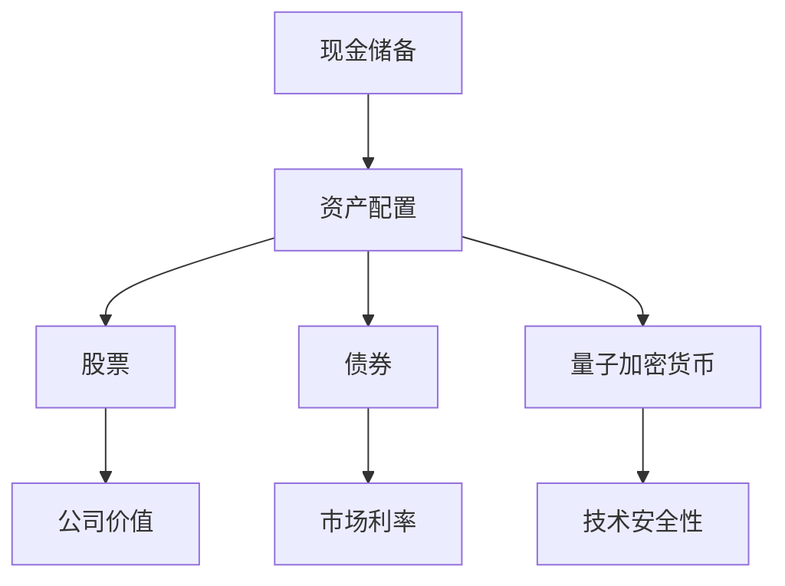
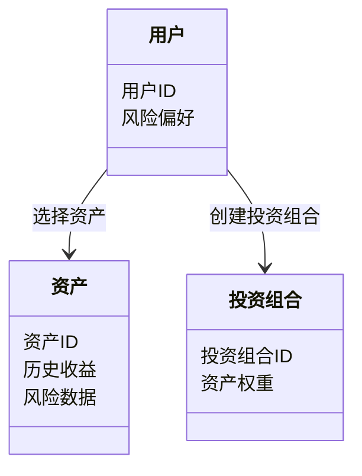
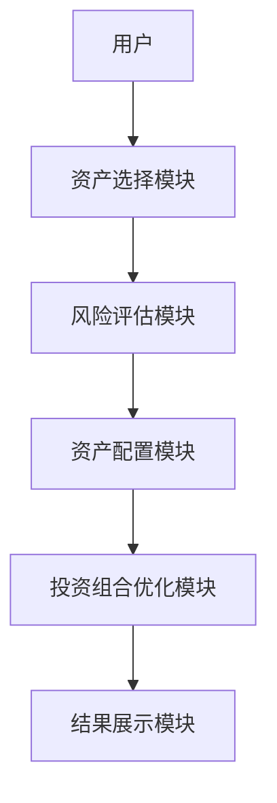

                 


# 巴菲特的现金管理策略：量子加密货币时代的资产配置

## 关键词：巴菲特，现金管理策略，量子加密货币，资产配置，投资策略，风险管理

## 摘要： 
本文探讨了巴菲特的现金管理策略在量子加密货币时代的演变与应用。通过分析量子加密货币的特点及其对传统现金管理策略的影响，结合资产配置的核心概念、算法原理和系统架构设计，提出了一种在量子加密货币环境下优化资产配置的新方法。文章还提供了具体的实现方案和实际案例分析，为投资者在新兴技术背景下进行资产配置提供了参考。

---

# 第一部分：背景与基础

## 第1章：巴菲特现金管理策略的背景与基础

### 1.1 巴菲特现金管理策略的演变

#### 1.1.1 传统现金管理策略的核心思想
传统的现金管理策略强调稳健性，巴菲特的投资理念以价值投资为核心，注重长期持有优质资产，避免短期波动带来的风险。现金储备被视为应对市场波动和把握投资机会的重要工具。

#### 1.1.2 巴菲特投资理念的形成与特点
巴菲特的投资理念基于基本面分析和长期价值判断，强调企业内在价值和安全边际。他主张通过分散投资和长期持有来降低风险，追求稳定的投资回报。

#### 1.1.3 现金储备在巴菲特投资体系中的地位
现金储备是巴菲特投资体系中的重要组成部分，用于应对市场恐慌、把握优质投资机会以及防范潜在风险。他认为，保持适度的现金储备是投资组合的重要组成部分。

---

### 1.2 量子加密货币的兴起与特性

#### 1.2.1 量子计算与加密货币的关系
量子计算的快速发展对传统加密货币构成了威胁。传统加密货币（如比特币）依赖于基于经典计算的哈希函数，而量子计算机可以通过量子算法（如Shor算法）快速破解这些哈希函数，从而威胁到传统加密货币的安全性。

#### 1.2.2 量子加密货币的技术特点与优势
量子加密货币是一种基于量子计算技术的加密货币，其安全性依赖于量子力学原理。与传统加密货币不同，量子加密货币利用量子纠缠和不可分割性，确保了交易的安全性和不可篡改性。

#### 1.2.3 量子加密货币对传统金融体系的挑战
量子加密货币的出现对传统金融体系提出了挑战，传统的货币发行和交易方式可能面临颠覆性变革。量子加密货币的去中心化特性使其成为传统金融体系的一种潜在替代方案。

---

### 1.3 资产配置在现金管理中的重要性

#### 1.3.1 资产配置的基本概念与分类
资产配置是指将资金分配到不同资产类别（如股票、债券、房地产、加密货币等）以实现风险分散和收益最大化的过程。资产配置的核心在于根据市场环境和个人风险偏好调整各类资产的权重。

#### 1.3.2 不同市场环境下的资产配置策略
在不同的市场环境下，资产配置策略需要动态调整。例如，在经济衰退期，债券和现金的权重可能需要增加；而在经济繁荣期，股票和风险资产的权重可能需要提高。

#### 1.3.3 巴菲特资产配置理念的现代发展
随着量子加密货币的兴起，巴菲特的资产配置理念也在发生变化。他开始关注量子加密货币的潜在价值，并将其纳入其现金管理策略中。

---

## 第2章：巴菲特现金管理策略的核心概念与联系

### 2.1 核心概念原理

#### 2.1.1 价值投资与资产配置的关系
价值投资强调购买价格低于内在价值的资产，而资产配置则注重在不同资产类别之间分配资金。两者相辅相成，价值投资为资产配置提供了方向，而资产配置则为价值投资提供了风险控制手段。

#### 2.1.2 现金储备在资产配置中的作用
现金储备是资产配置的重要组成部分，用于应对突发事件和把握投资机会。在量子加密货币时代，现金储备不仅包括传统货币，还可能包括量子加密货币。

#### 2.1.3 量子加密货币的波动性与风险控制
量子加密货币的市场价格波动较大，因此在资产配置中需要特别注意风险控制。巴菲特的策略是通过分散投资和长期持有来降低风险。

---

### 2.2 核心概念对比分析

#### 2.2.1 传统现金管理与量子加密货币管理的对比
| 特性                | 传统现金管理          | 量子加密货币管理       |
|---------------------|-----------------------|-----------------------|
| 技术基础            | 经典计算             | 量子计算             |
| 安全性              | 可能被量子攻击       | 具有抗量子攻击特性   |
| 交易速度            | 较慢                | 较快                 |
| 去中心化程度        | 中心化              | 去中心化             |

#### 2.2.2 不同资产类别在配置中的权重分配
在量子加密货币时代，资产配置的权重可能需要重新调整。例如，传统股票和债券的权重可能会下降，而量子加密货币和新兴科技企业的权重可能会上升。

#### 2.2.3 巴菲特策略与其他投资策略的异同
巴菲特的现金管理策略与其他策略（如趋势投资、技术分析）的共同点在于都强调风险控制和长期投资。不同点在于巴菲特更注重价值投资和分散投资。

---

### 2.3 ER实体关系图



---

## 第3章：资产配置算法原理与数学模型

### 3.1 资产配置模型的数学表达

#### 3.1.1 现代投资组合理论（MPT）概述
现代投资组合理论（MPT）由Harry Markowitz提出，其核心思想是通过优化资产组合的风险和收益来实现最优配置。MPT假设资产价格服从正态分布，并且投资者是风险厌恶的。

#### 3.1.2 均值-方差优化模型
均值-方差优化模型是最常用的资产配置模型之一。其目标是通过优化投资组合的期望收益和方差，找到最优的风险收益比。

$$\text{Minimize } \sigma^2 \text{ subject to } \mu \cdot w = r$$

其中：
- $\sigma^2$ 是投资组合的方差（风险）
- $\mu$ 是资产的期望收益向量
- $w$ 是投资权重向量
- $r$ 是目标收益

---

### 3.2 资产配置算法的实现

#### 3.2.1 算法流程
1. 确定可选资产及其历史收益和风险数据
2. 估计资产的期望收益和协方差矩阵
3. 使用均值-方差优化模型计算最优投资权重
4. 调整权重以满足风险偏好和市场环境变化

#### 3.2.2 Python实现代码

```python
import numpy as np
import pandas as pd

def portfolio_optimization(returns, risk_aversion=1):
    # 计算协方差矩阵
    cov_matrix = returns.cov()
    # 计算期望收益向量
    mu = returns.mean()
    # 使用均值-方差优化模型
    n = len(returns.columns)
    # 初始化权重向量
    w = np.ones(n) / n
    # 优化权重
    for _ in range(100):
        # 计算投资组合收益和风险
        portfolio_return = w.dot(mu)
        portfolio_variance = w.dot(cov_matrix.dot(w))
        # 调整权重以最小化风险
        w = w * (1 - risk_aversion * portfolio_variance)
        w = w / np.sum(w)
    return w

# 示例数据
data = {'股票': [0.1, 0.08, 0.05, 0.02, 0.01],
        '债券': [0.02, 0.03, 0.05, 0.07, 0.08],
        '量子加密货币': [0.15, 0.1, 0.08, 0.03, 0.02]}
returns = pd.DataFrame(data)
weights = portfolio_optimization(returns)
print("最优权重：", weights)
```

---

## 第4章：系统分析与架构设计

### 4.1 问题场景介绍
在量子加密货币时代，传统的现金管理策略需要进行数字化转型。投资者需要一种能够实时监控市场变化、动态调整资产配置的系统。

---

### 4.2 系统功能设计

#### 4.2.1 领域模型


#### 4.2.2 系统架构


---

## 第5章：项目实战

### 5.1 环境安装
需要安装Python、NumPy、Pandas和Matplotlib等库。

### 5.2 核心代码实现

```python
import numpy as np
import pandas as pd
import matplotlib.pyplot as plt

# 示例数据
data = {'股票': [0.1, 0.08, 0.05, 0.02, 0.01],
        '债券': [0.02, 0.03, 0.05, 0.07, 0.08],
        '量子加密货币': [0.15, 0.1, 0.08, 0.03, 0.02]}
returns = pd.DataFrame(data)

# 计算最优权重
weights = portfolio_optimization(returns)

# 可视化结果
plt.bar(returns.columns, weights)
plt.title('最优资产配置权重')
plt.show()
```

---

## 第6章：总结与展望

### 6.1 最佳实践
在量子加密货币时代，投资者需要灵活调整资产配置策略，同时注重风险控制和长期投资。

### 6.2 小结
本文详细探讨了巴菲特现金管理策略在量子加密货币时代的演变与应用，提出了基于现代投资组合理论的资产配置模型，并提供了具体的实现方案。

### 6.3 注意事项
投资者在实际操作中需要结合市场环境和自身风险偏好，合理调整资产配置权重。

### 6.4 拓展阅读
推荐阅读Harry Markowitz的《Portfolio Selection》和巴菲特的《The Intelligent Investor》。

--- 

希望这篇文章能够为读者在量子加密货币时代的资产配置提供有价值的参考！

