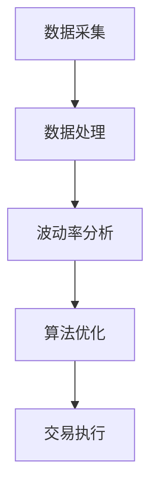

                 


# 巴菲特的现金管理策略：量子加密资产时代的流动性优化

## 关键词：巴菲特、现金管理、流动性优化、量子加密资产、投资策略、价值投资

## 摘要：本文探讨巴菲特的现金管理策略在量子加密资产时代的应用，分析流动性优化的方法，并结合技术背景进行详细阐述。

---

# 第1章 巴菲特现金管理策略概述

## 1.1 巴菲特投资理念的核心要素

### 1.1.1 价值投资的基本原则

价值投资是巴菲特的核心理念，强调购买价格低于内在价值的资产。这包括对企业的深入分析，关注其财务状况、行业地位和盈利能力。现金管理在此过程中起到关键作用，确保在市场波动时有足够的流动性抓住投资机会。

### 1.1.2 股票分析中的现金管理策略

巴菲特在股票分析中注重现金流，认为企业产生的自由现金流是其价值的重要指标。他倾向于投资那些现金流稳定、持续增长的企业，这与量子加密资产的流动性管理有相似之处。

### 1.1.3 巴菲特的长期投资策略

巴菲特强调长期投资，避免频繁交易以减少摩擦成本。这种策略在量子加密资产时代同样适用，但需要考虑其高波动性和技术特性。

## 1.2 现金管理在巴菲特投资体系中的重要性

### 1.2.1 现金储备在投资组合中的作用

现金储备作为缓冲，用于在市场低谷时加仓优质资产。巴菲特定期评估现金储备，确保在必要时能够迅速行动。

### 1.2.2 巴菲特的流动性管理原则

流动性管理确保在需要时能够快速变现，避免流动性风险。巴菲特注重分散投资，降低单一资产的风险，这在量子加密资产中尤为重要。

### 1.2.3 现金管理与风险控制的结合

现金管理是风险控制的重要部分，巴菲通常通过多元化投资和严格的风险评估来管理风险，确保投资组合的稳定性。

---

# 第2章 量子加密资产的基本概念与特性

## 2.1 量子计算对加密技术的影响

量子计算的出现对传统加密技术构成威胁，但同时也催生了更安全的加密方法，如量子密钥分发和后量子密码学。这些技术为量子加密资产的安全性提供了保障。

## 2.2 量子加密资产的分类与属性

量子加密资产包括量子密钥分发设备、后量子加密算法和量子签名等。它们具有高安全性和抗量子攻击的特点，适用于金融交易和数据保护。

## 2.3 量子加密资产与传统加密资产的对比

传统加密资产如比特币依赖于区块链技术，而量子加密资产则利用量子计算技术，提供更高的安全性和效率。两者在应用场景和风险管理上有明显区别。

---

# 第3章 巴菲特策略在量子加密资产中的应用

## 3.1 巴菲特传统策略的适用性分析

### 3.1.1 价值投资的适用性

量子加密资产的价值评估需要考虑技术成熟度、市场需求和行业前景。巴菲特定价收购的原则可以应用于选择优质的量子加密项目。

### 3.1.2 现金储备的管理

巴菲特的现金储备策略在量子加密资产时代同样重要，需确保有足够的流动性应对市场波动。

## 3.2 量子加密资产流动性管理的特殊性

### 3.2.1 市场波动性

量子加密资产价格波动剧烈，需要更灵活的流动性管理策略。

### 3.2.2 技术风险

量子计算的发展可能导致现有加密算法失效，需提前规划应对措施。

### 3.2.3 监管环境

不同国家对量子加密资产的监管政策差异大，需关注政策变化。

## 3.3 巴菲特策略的优化与调整

### 3.3.1 现金储备的动态调整

根据市场情况和项目需求，动态调整现金储备比例，确保流动性。

### 3.3.2 投资组合的多样化

增加量子加密资产在投资组合中的比例，分散风险，同时保持对传统资产的配置。

---

# 第4章 量子加密资产流动性管理的核心算法

## 4.1 流动性优化的数学模型

流动性管理模型通常涉及多个变量，如资产流动性、市场波动率和交易成本。以下是一个简化的模型：

$$
\text{流动性} = \frac{\text{资产流动性} + \text{市场波动率}}{\text{交易成本} + 1}
$$

## 4.2 量子加密资产的波动率分析

波动率是影响流动性管理的重要因素。量子加密资产的波动率通常较高，需通过算法优化来降低风险。

## 4.3 算法优化的步骤与方法

### 4.3.1 数据收集与分析

收集量子加密资产的历史数据，分析其波动性和相关性。

### 4.3.2 模型建立与测试

建立数学模型，测试其在不同情境下的表现。

### 4.3.3 算法优化与实施

通过参数调整和优化，提高模型的预测能力和稳定性。

---

# 第5章 量子加密资产流动性管理的系统设计

## 5.1 系统功能模块划分

系统主要模块包括数据采集、波动率分析、算法优化和交易执行。每个模块都有明确的功能和接口。

## 5.2 系统架构的Mermaid图



## 5.3 系统接口设计与交互流程

系统接口包括API调用和数据传输，确保各模块之间的高效协作。

---

# 第6章 项目实战

## 6.1 环境安装与配置

安装必要的开发工具和依赖库，如Python、NumPy、Pandas和QuantLib。

## 6.2 核心算法实现

以下是一个简化的价格预测算法：

```python
def predict_price(prices, window=30):
    import numpy as np
    return np.mean(prices[-window:])
```

## 6.3 代码解读与分析

代码通过滑动窗口计算平均值，预测未来价格。实际应用中需考虑更多因素。

---

# 第7章 案例分析与经验总结

## 7.1 典型案例分析

分析一个量子加密资产项目，评估其流动性和风险管理情况。

## 7.2 经验总结与改进建议

总结经验，提出改进建议，如加强风险监控和优化算法模型。

## 7.3 未来发展趋势展望

预测量子加密资产的发展趋势，强调技术创新和监管的重要性。

---

# 第8章 总结与最佳实践

## 8.1 主要观点回顾

总结文章的核心观点，强调流动性管理的重要性。

## 8.2 最佳实践的总结

提出最佳实践，如动态调整现金储备和多样化投资。

## 8.3 未来的研究方向与建议

建议未来的研究方向，如量子加密资产的长期稳定性分析和监管框架的完善。

---

通过以上结构和内容，文章详细探讨了巴菲特的现金管理策略在量子加密资产时代的应用，结合技术背景和实际案例，提供了全面的分析和见解。

