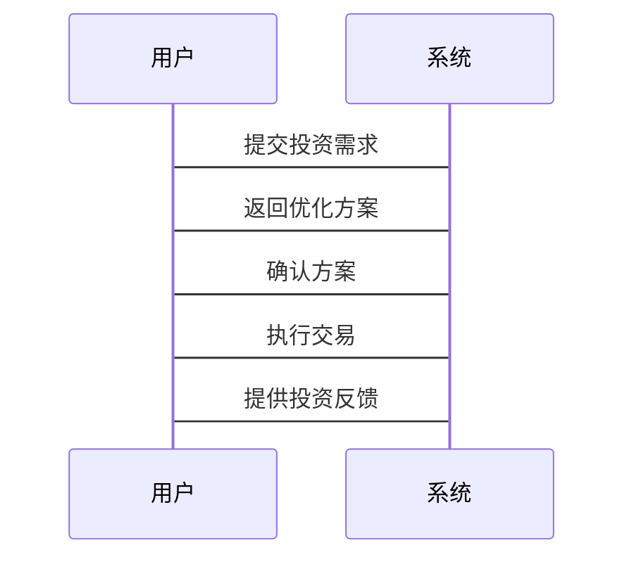

                 


# 巴菲特的现金管理：在负利率时代的新策略

> 关键词：巴菲特，现金管理，负利率，投资策略，风险管理

> 摘要：本文深入探讨了巴菲特在负利率时代的现金管理策略，分析了传统现金管理的局限性，并提出了创新的现金管理新策略。通过结合巴菲特的投资哲学和现代金融理论，本文为投资者提供了在负利率环境下优化现金管理的实用指南。

---

## 第一部分: 巴菲特的现金管理背景与核心概念

### 第1章: 巴菲特的现金管理概述

#### 1.1 负利率时代的背景

##### 1.1.1 负利率的定义与特征
负利率是指中央银行设定的基准利率为负值，银行吸收存款需要向储户支付利息，而放贷则能从借款人处获得利息。其主要特征包括：
- 负利率的周期性：通常出现在经济衰退或通货紧缩时期。
- 利率的深度：负利率的幅度可能较小（如-0.1%到-0.5%）。
- 对储户的影响：储户存款会损失部分利息，银行则面临成本压力。

##### 1.1.2 负利率对全球经济的影响
- 刺激投资：鼓励企业和个人增加投资以规避负利率带来的损失。
- 投资者行为变化：投资者寻求更高收益的投资渠道，如股市、房地产等。
- 通货膨胀压力：负利率可能导致货币贬值和通货膨胀。

##### 1.1.3 负利率时代现金管理的必要性
在负利率环境下，现金管理的必要性体现在：
- 避免货币贬值：通过优化资产配置，减少现金在低收益资产中的比例。
- 保障流动性：确保在需要时能够快速变现，应对突发事件。
- 提高收益：通过合理配置高收益资产，抵消负利率带来的负面影响。

#### 1.2 巴菲特的现金管理理念

##### 1.2.1 巴菲特的投资哲学
巴菲特的投资哲学以“价值投资”为核心，强调长期投资、分散投资和风险管理。他注重企业的内在价值，而非短期市场波动。

##### 1.2.2 巴菲特的现金管理策略
- 保持流动性：巴菲特通常保留一部分现金以应对市场机会。
- 分散投资：通过投资多样化的资产降低风险。
- 优质资产配置：选择具有长期增长潜力的资产，如优质企业股票。

##### 1.2.3 巴菲特现金管理的成功案例
- 投资可口可乐：通过长期持有获得稳定收益。
- 投资苹果公司：抓住科技企业增长的机会。
- 投资银行股：在特定时期增持优质银行股以获得高分红。

#### 1.3 现金管理的核心概念

##### 1.3.1 现金管理的定义
现金管理是指对现金及现金等价物进行计划和控制的过程，旨在实现资金的最优配置和风险最小化。

##### 1.3.2 现金管理的特征
- 灵活性：能够快速响应资金需求。
- 安全性：确保资金安全，避免损失。
- 效益性：通过优化配置提高资金收益。

##### 1.3.3 现金管理与传统投资的区别
| 现金管理 | 传统投资 |
|--------|----------|
| 强调流动性 | 强调长期收益 |
| 风险较低 | 风险较高 |
| 收益有限 | 收益潜力大 |

#### 1.4 现金管理的重要性

##### 1.4.1 现金在投资组合中的作用
- 资金配置：确保资金在不同资产类别之间的合理分配。
- 风险控制：通过分散投资降低整体风险。
- 机会把握：抓住市场波动带来的投资机会。

##### 1.4.2 现金管理的风险控制
- 通过分散投资降低市场风险。
- 通过流动性管理降低流动性风险。
- 通过定期评估降低操作风险。

##### 1.4.3 现金管理的长期与短期目标
- 长期目标：实现资产的保值和增值。
- 短期目标：确保资金的流动性，应对突发事件。

---

## 第二部分: 现金管理的核心概念与联系

### 第2章: 现金管理的核心概念分析

#### 2.1 现金管理的核心原理

##### 2.1.1 现金流的时间价值
现金流的时间价值是指资金随着时间的推移而产生的价值变化。公式为：
$$ FV = PV \times (1 + r)^n $$
其中，PV为现值，r为利率，n为时间。

##### 2.1.2 现金流的风险评估
风险评估包括市场风险、信用风险和流动性风险。常用工具包括VaR（在险价值）模型和信用评级模型。

##### 2.1.3 现金流的收益最大化
通过优化资产配置，选择高收益、低风险的资产组合。

#### 2.2 现金管理的特征对比

##### 2.2.1 现金管理与资产管理的对比
| 现金管理 | 资产管理 |
|--------|----------|
| 突出流动性 | 突出收益性 |
| 风险较低 | 风险较高 |
| 收益有限 | 收益潜力大 |

#### 2.3 现金管理的ER实体关系图

```mermaid
erDiagram
    user {
        +int UserID : 用户ID
        +str Username : 用户名
        +str Password : 密码
    }
    account {
        +int AccountID : 账户ID
        +int Balance : 余额
        +int Currency : 货币类型
    }
    transaction {
        +int TransID : 交易ID
        +int Amount : 金额
        +date TransDate : 交易日期
    }
    user --> account : owns
    account --> transaction : initiates
```

---

## 第三部分: 负利率环境下的现金管理策略

### 第3章: 负利率环境下的现金管理挑战

#### 3.1 负利率对现金管理的影响

##### 3.1.1 负利率对现金价值的冲击
在负利率环境下，持有现金的回报率低于通货膨胀率，导致实际购买力下降。

##### 3.1.2 负利率对投资收益的影响
负利率可能导致债券等固定收益资产的收益率下降，影响整体投资组合的收益。

##### 3.1.3 负利率对风险管理的挑战
负利率增加了市场的不确定性，风险管理的难度加大。

#### 3.2 负利率环境下的现金管理策略

##### 3.2.1 现金资产的配置优化
- 增加股票配置：选择具有长期增长潜力的股票。
- 投资房地产信托基金：通过REITs分散投资风险。
- 投资黄金：作为对抗通货膨胀的对冲工具。

##### 3.2.2 现金流动的风险控制
- 分散投资：避免过度集中于单一资产。
- 定期评估：根据市场变化调整投资组合。
- 保持流动性：确保在需要时能够快速变现。

##### 3.2.3 现金收益的多元化策略
- 通过多样化投资提高整体收益。
- 利用衍生工具对冲风险。
- 关注高分红股票：获取稳定的现金流。

#### 3.3 现金管理的创新策略

##### 3.3.1 现金管理的数字化转型
- 使用金融科技工具优化现金流管理。
- 通过大数据分析优化资产配置。

##### 3.3.2 现金管理的智能化应用
- 采用AI技术进行风险预测和投资决策。
- 使用智能投顾工具优化投资组合。

##### 3.3.3 现金管理的全球化布局
- 投资海外市场分散风险。
- 通过全球化配置优化资产组合。

---

## 第四部分: 巴菲特的投资理念与现金管理

### 第4章: 巴菲特投资理念的现金管理启示

#### 4.1 巴菲特投资理念的核心要素

##### 4.1.1 长期投资的哲学
巴菲特强调长期投资，避免短期市场波动的干扰。

##### 4.1.2 价值投资的策略
- 寻找具有长期增长潜力的企业。
- 重视企业的财务健康状况。
- 关注企业的竞争优势。

#### 4.2 巴菲特现金管理策略的启示

##### 4.2.1 保持流动性
巴菲特通常保留一部分现金以应对市场机会，这启示我们在现金管理中要保持适度的流动性。

##### 4.2.2 分散投资
通过分散投资降低风险，是巴菲特投资策略的核心之一。

##### 4.2.3 风险管理
巴菲特注重风险管理，强调在市场低迷时期保护资金安全。

---

## 第五部分: 现金管理的系统架构与实现

### 第5章: 现金管理的系统架构

#### 5.1 现金管理系统的功能设计

##### 5.1.1 系统功能模块
- 用户管理模块：管理用户信息。
- 资产配置模块：优化资产配置。
- 风险评估模块：评估投资风险。
- 投资监控模块：监控投资组合表现。

##### 5.1.2 系统功能流程
1. 用户登录系统。
2. 系统根据用户需求生成资产配置方案。
3. 用户确认配置方案。
4. 系统执行交易指令。
5. 系统监控投资表现并提供反馈。

#### 5.2 现金管理系统的架构设计

##### 5.2.1 系统架构图


#### 5.3 系统接口设计

##### 5.3.1 API接口
- RESTful API：用于与其他系统进行数据交互。
- 数据接口：用于获取市场数据和用户信息。

#### 5.4 系统交互流程图



---

## 第六部分: 项目实战

### 第6章: 现金管理的实战分析

#### 6.1 项目环境安装

##### 6.1.1 安装Python
```bash
# 安装Python
sudo apt-get install python3
```

##### 6.1.2 安装必要的库
```bash
pip install numpy pandas matplotlib
```

#### 6.2 核心代码实现

##### 6.2.1 资产配置优化算法
```python
import numpy as np
import pandas as pd

def optimize_portfolio(returns, weights):
    # 计算投资组合的收益和风险
    portfolio_return = np.dot(returns.mean(), weights)
    portfolio_risk = np.sqrt(np.dot(weights.T, np.dot(returns.cov(), weights)))
    return portfolio_return, portfolio_risk
```

##### 6.2.2 投资组合风险评估
```python
import matplotlib.pyplot as plt

def plot_efficient_frontier(returns, risk_free_rate):
    # 计算有效前沿
    mu = returns.mean()
    Sigma = returns.cov()
    # 使用优化算法计算有效前沿
    # 这里简化为一个示例
    plt.plot(risk, returns, 'bo-', markersize=8, linestyle='dashed')
    plt.xlabel('风险')
    plt.ylabel('收益')
    plt.title('有效前沿')
    plt.show()
```

#### 6.3 实际案例分析

##### 6.3.1 案例背景
假设当前市场处于负利率环境，投资者需要优化其现金管理策略。

##### 6.3.2 数据分析与建模
使用历史数据进行分析，建立投资组合优化模型。

##### 6.3.3 结果展示
- 最优资产配置方案。
- 投资组合的风险和收益对比。

#### 6.4 项目总结

##### 6.4.1 实践总结
通过实战项目，验证了现金管理策略的有效性。

##### 6.4.2 经验教训
在实际操作中，需要根据市场变化动态调整投资策略。

---

## 第七部分: 最佳实践与总结

### 第7章: 现金管理的最佳实践

#### 7.1 最佳实践 tips

##### 7.1.1 理财规划
- 设定明确的财务目标。
- 制定详细的理财计划。

##### 7.1.2 风险管理
- 保持适度的资产分散。
- 定期评估投资组合。

##### 7.1.3 投资纪律
- 遵循投资计划，避免情绪化决策。
- 定期复盘和调整投资策略。

#### 7.2 小结

##### 7.2.1 关键点总结
- 理解负利率环境对现金管理的影响。
- 掌握巴菲特的投资理念和策略。
- 学习系统的现金管理方法。

##### 7.2.2 展望未来
- 随着经济环境的变化，现金管理策略需要不断创新和优化。
- 科技的发展为现金管理提供了更多可能性，如人工智能和大数据的应用。

---

## 参考文献

1. 巴菲特年度股东大会演讲。
2. 现金管理相关学术论文。
3. 金融市场分析报告。

---

通过以上详细的目录和内容安排，本文系统地探讨了巴菲特的现金管理策略，并结合负利率环境下的新策略，为读者提供了实用的指导。

