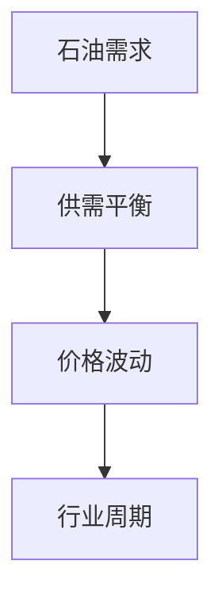
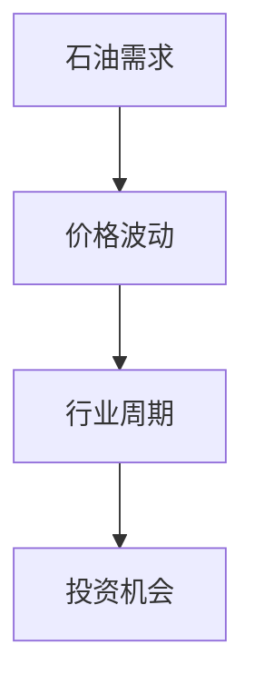
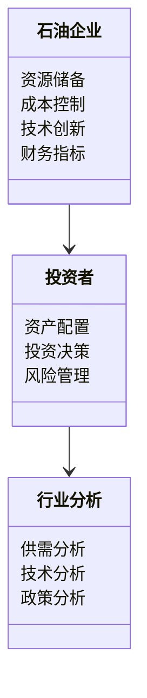
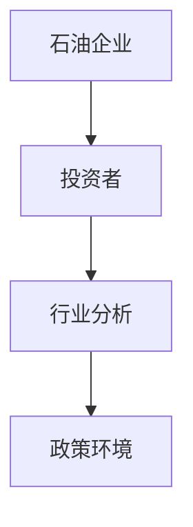
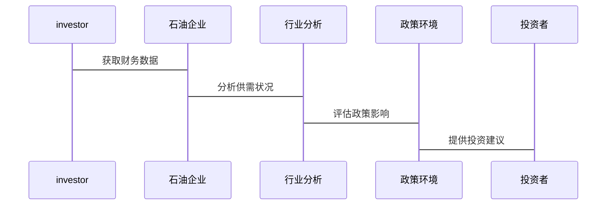

                 


# 巴菲特的石油行业投资逻辑：必需品的魅力

## 关键词：巴菲特，石油行业，投资逻辑，必需品，长期价值，行业分析，投资策略

## 摘要：本文深入分析了巴菲特在石油行业的投资逻辑，探讨了石油作为必需品的战略价值，结合具体案例和数学模型，揭示了巴菲特如何通过价值投资和风险管理实现长期收益。文章还提供了系统的分析框架和实战指南，帮助投资者理解和应用巴菲特的投资策略。

---

## 第1章 巴菲特的投资理念与石油行业的结合

### 1.1 巴菲特的价值投资理念

#### 1.1.1 价值投资的核心思想
- **核心概念**：价值投资强调购买低于内在价值的股票，长期持有，等待市场重新评估。
- **背景介绍**：巴菲特的价值投资理念源于格雷厄姆的“烟屁股”理论，注重安全边际和内在价值。
- **公式**：内在价值 = 永久性资产 / （长期资本成本 + 管理成本）。

#### 1.1.2 巴菲特的投资风格与特点
- **风格特点**：注重企业的财务健康、竞争优势和管理团队。
- **案例**：投资ExxonMobil，因其稳定的股息和强大的竞争优势被选中。

#### 1.1.3 石油行业的战略地位
- **必需品属性**：石油作为全球能源的核心，需求稳定且长期增长。

### 1.2 石油行业的特点与投资机遇

#### 1.2.1 行业周期性分析
- **周期性波动**：石油价格受供需影响，呈现周期性波动。
- **mermaid流程图**：


#### 1.2.2 供需关系分析
- **供给**：OPEC产量控制和非OPEC产量增长。
- **需求**：全球经济增长和能源转型影响。

#### 1.2.3 技术与政策影响
- **技术创新**：页岩油技术提升产量。
- **政策**：环保政策和碳中和目标影响行业。

---

## 第2章 石油行业的核心竞争力分析

### 2.1 核心竞争力分析

#### 2.1.1 资源储备与储量
- **资源储备**：企业拥有的探明储量决定了其长期生产能力。
- **公式**：储量价值 = 现金流量折现值。

#### 2.1.2 成本控制与运营效率
- **成本控制**：低生产成本企业更具竞争力。
- **效率分析**：通过单位成本分析评估企业效率。

#### 2.1.3 技术创新与研发能力
- **技术优势**：高效开采技术提升竞争力。

### 2.2 财务指标分析

#### 2.2.1 市盈率与市净率
- **市盈率（P/E）**：衡量企业价值，公式为股价/每股收益。
- **市净率（P/B）**：衡量资产价值，公式为股价/每股净资产。

#### 2.2.2 股息率与分红政策
- **股息率**：高股息率企业稳定回报。

#### 2.2.3 净利润率与ROE分析
- **净利润率**：反映企业盈利能力。
- **ROE（净资产收益率）**：衡量股东权益的回报效率。

---

## 第3章 巴菲特的投资策略与石油行业分析

### 3.1 投资策略概述

#### 3.1.1 长期投资与价值发现
- **长期视角**：石油行业的周期性波动中寻求长期价值。
- **价值发现**：寻找被市场低估的石油企业。

#### 3.1.2 高质量企业筛选标准
- **财务健康**：低债务、高现金流。
- **竞争优势**：强大的品牌、技术壁垒。

#### 3.1.3 风险管理与组合优化
- **风险管理**：分散投资、对冲风险。
- **组合优化**：平衡成长与价值投资。

### 3.2 石油行业的长期投资价值

#### 3.2.1 必需品的不可替代性
- **需求刚性**：石油在能源结构转型中仍具重要地位。

#### 3.2.2 供需平衡预测
- **供给预测**：基于技术进步和产能扩展。
- **需求预测**：全球经济增长驱动需求增长。

#### 3.2.3 政策环境分析
- **政策影响**：环保政策推动行业转型，同时可能带来新的投资机会。

### 3.3 巴菲特对石油行业的未来展望

#### 3.3.1 行业周期性波动
- **周期性波动**：价格波动带来投资机会。
- **mermaid流程图**：


#### 3.3.2 替代品的威胁与机遇
- **替代威胁**：可再生能源的崛起。
- **技术进步**：提高传统石油企业的竞争力。

#### 3.3.3 可持续发展与技术创新
- **技术创新**：提高效率和降低成本。
- **可持续发展**：符合环保政策和碳中和目标。

---

## 第4章 巴菲特投资逻辑的数学模型与分析

### 4.1 投资逻辑的数学模型

#### 4.1.1 模型构建
- **公式**：内在价值 = 股息贴现模型（DDM）计算的现值。
  $$ V = \frac{D}{k - g} $$
  其中，D为股息，k为贴现率，g为股息增长率。

#### 4.1.2 案例分析
- **ExxonMobil案例**：
  - 股息率：5%
  - 贴现率：8%
  - 股息增长率：2%
  - 内在价值计算：
  $$ V = \frac{2.5}{0.08 - 0.02} = 33.33 $$

### 4.2 石油企业财务指标的权重分配

#### 4.2.1 财务指标权重
- 股息率（30%）、市盈率（20%）、ROE（25%）、成本控制（25%）。

#### 4.2.2 权重分配模型
- **公式**：综合评分 = Σ（指标得分 × 权重）。

---

## 第5章 系统分析与架构设计

### 5.1 领域模型类图



### 5.2 系统架构图



### 5.3 接口与交互序列图



---

## 第6章 项目实战

### 6.1 环境安装

- **工具**：Python、Pandas、Matplotlib。
- **安装命令**：
  ```bash
  pip install pandas matplotlib
  ```

### 6.2 核心实现源代码

```python
import pandas as pd
import matplotlib.pyplot as plt

# 示例数据：石油企业的财务指标
data = {'公司': ['ExxonMobil', 'Phillips 66', 'Chevron'],
        '市盈率': [15, 20, 18],
        '市净率': [1.5, 2.0, 1.8],
        'ROE': [12, 15, 14],
        '股息率': [5, 4, 6]}
df = pd.DataFrame(data)

# 绘制柱状图
df.plot(kind='bar', x='公司', y='股息率')
plt.title('石油企业股息率对比')
plt.show()
```

### 6.3 实际案例分析

- **ExxonMobil案例**：分析其财务指标和市场表现。
- **Phillips 66案例**：评估其投资价值和风险。

---

## 第7章 最佳实践

### 7.1 投资理念总结

- **长期投资**：耐心持有优质企业。
- **价值发现**：寻找低估企业。
- **风险管理**：分散投资，控制风险。

### 7.2 小结与注意事项

- **行业周期**：关注行业周期波动。
- **政策变化**：警惕政策风险。
- **技术变革**：关注技术创新带来的投资机会。

### 7.3 拓展阅读

- 巴菲特的《投资的艺术》。
- 石油行业分析书籍推荐。

---

## 总结

巴菲特的石油行业投资逻辑以价值投资为核心，注重企业的长期价值和竞争优势。通过系统的分析框架和数学模型，投资者可以更好地理解和应用这些策略。石油作为必需品，具备长期投资价值，但需关注行业周期、政策和技术变化，以实现稳健的投资回报。

