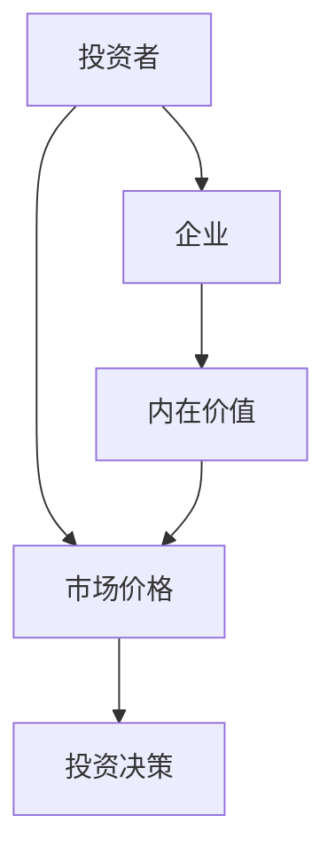
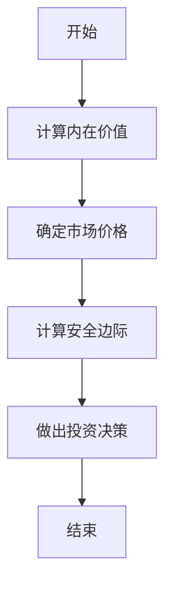
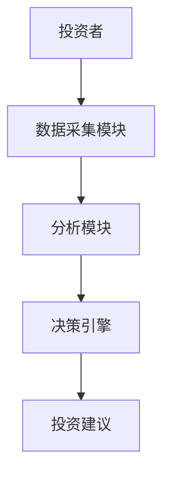
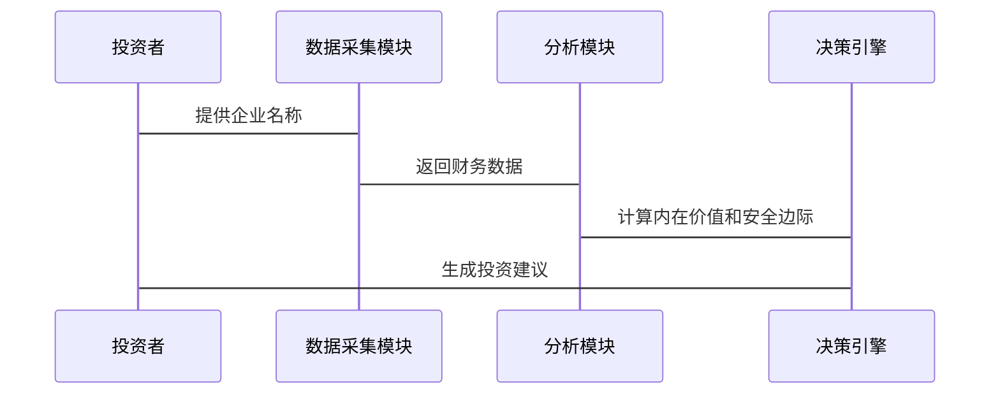

                 


# 巴菲特的简单投资哲学：复杂中寻找简单

---

## 关键词：
巴菲特，投资哲学，价值投资，安全边际，长期投资，简单思维，复杂系统

---

## 摘要：
本文通过分析巴菲特的投资哲学，探讨其如何在复杂市场中提炼出简单而有效的投资策略。文章从巴菲特的背景与核心理念出发，详细阐述价值投资与安全边际的核心概念，结合算法原理与系统架构，展示如何将巴菲特的哲学应用于实际投资决策。最后，通过项目实战案例，验证巴菲特投资哲学的实践价值，并总结其在复杂市场中的简单思维模式。

---

## 第一部分: 巴菲特的简单投资哲学概述

### 第1章: 巴菲特投资哲学的背景与核心理念

#### 1.1 巴菲特的生平与投资历程

##### 1.1.1 巴菲特的早年经历与职业起点
沃伦·巴菲特（Warren Buffett）出生于1930年，从小就展现出对数字和投资的浓厚兴趣。他在高中时期开始接触股票投资，通过阅读《格拉姆斯》（The Grahamstown）报纸上的股票信息，自学股票交易。19岁时，巴菲特进入哥伦比亚大学，师从本杰明·格拉姆斯（Benjamin Graham），学习价值投资的基本原理。

##### 1.1.2 巴菲特的投资哲学形成过程
巴菲特的投资哲学深受导师本杰明·格拉姆斯的影响，格拉姆斯的价值投资理论强调以低于内在价值的价格购买优质股票。巴菲特在此基础上，进一步发展出自己的投资策略，特别强调长期持有和安全边际的重要性。

##### 1.1.3 巴菲特投资哲学的核心思想
巴菲特的核心思想可以总结为：寻找那些具有持续竞争优势、良好治理结构和稳定盈利的企业，以合理价格买入并长期持有。他强调，投资的本质是寻找企业的内在价值，而不是市场的短期波动。

#### 1.2 投资哲学的演变与现状

##### 1.2.1 传统投资理念的局限性
传统投资理念往往注重短期收益和市场趋势，容易受到市场情绪的影响。这种策略在市场波动剧烈时往往表现不佳，且难以长期稳定盈利。

##### 1.2.2 巴菲特投资哲学的创新与突破
巴菲特的投资哲学突破了传统投资的短期导向，提出了“价值投资”的概念。他强调以企业的内在价值为基准，寻找被市场低估的投资标的，从而实现长期稳定的收益。

##### 1.2.3 当前投资领域的复杂性与挑战
当前投资领域充满了复杂性，信息不对称、市场波动剧烈、金融工具多样化等，使得投资者面临更大的挑战。在这种环境下，巴菲特的简单投资哲学显得尤为可贵。

### 第2章: 巴菲特投资哲学的核心概念

#### 2.1 价值投资的定义与特征

##### 2.1.1 价值投资的定义
价值投资是一种以低于企业内在价值的价格买入优质股票的投资策略。其核心在于寻找市场低估的企业，而不是关注市场的短期波动。

##### 2.1.2 价值投资的核心特征对比表

| 特征               | 价值投资             | 传统投资             |
|--------------------|----------------------|----------------------|
| 投资目标           | 寻找低估企业           | 追逐短期收益           |
| 投资期限           | 长期持有               | 短期交易               |
| 风险控制           | 强调安全边际           | 依赖市场趋势           |
| 估值方法           | 基于内在价值           | 基于市场情绪           |

##### 2.1.3 价值投资的ER实体关系图（Mermaid流程图）



#### 2.2 安全边际的概念与应用

##### 2.2.1 安全边际的定义
安全边际是指买入价格与企业内在价值之间的差距，是巴菲特在投资中用来控制风险的重要工具。

##### 2.2.2 安全边际的计算方法
安全边际 = 内在价值 - 市场价格

##### 2.2.3 安全边际在投资决策中的应用
巴菲特建议投资者在买入股票时，确保安全边际至少为20%以上，以降低投资风险。

### 第3章: 巴菲特投资哲学的算法原理

#### 3.1 价值投资的数学模型

##### 3.1.1 价值投资的核心公式
$$ V = \frac{E}{k} $$
其中，V为内在价值，E为预期收益，k为折现率。

##### 3.1.2 内在价值的计算流程
1. 估算企业的未来现金流。
2. 选择合适的折现率。
3. 计算内在价值。
4. 比较市场价格与内在价值，确定投资决策。

#### 3.2 安全边际的计算流程

##### 3.2.1 安全边际计算流程图（Mermaid流程图）



### 第4章: 巴菲特投资哲学的系统分析与架构设计

#### 4.1 投资决策系统的需求分析

##### 4.1.1 问题场景介绍
投资者需要一个系统来帮助他们快速找到低估企业，并做出投资决策。

##### 4.1.2 项目目标与范围
开发一个基于巴菲特投资哲学的自动化投资决策系统，实现对企业内在价值和安全边际的计算。

##### 4.1.3 系统功能需求
- 数据采集模块：获取企业财务数据。
- 分析模块：计算内在价值和安全边际。
- 决策引擎：生成投资建议。

#### 4.2 投资决策系统的架构设计

##### 4.2.1 系统架构图（Mermaid架构图）



##### 4.2.2 核心模块设计
- 数据采集模块：负责获取企业财务数据。
- 分析模块：计算内在价值和安全边际。
- 决策引擎：根据计算结果生成投资建议。

##### 4.2.3 接口设计与交互流程（Mermaid序列图）



### 第5章: 巴菲特投资哲学的项目实战

#### 5.1 项目环境与工具安装

##### 5.1.1 系统环境要求
- 操作系统：Windows/Mac/Linux
- Python版本：3.6+

##### 5.1.2 工具安装与配置
- 安装Python
- 安装Pandas、NumPy等数据分析库
- 安装Plotly或Matplotlib用于可视化

##### 5.1.3 数据源获取与处理
从公开的财务报表中获取企业的收入、利润等数据。

#### 5.2 核心算法实现

##### 5.2.1 价值评估模型的代码实现

```python
import pandas as pd

def calculate_intrinsic_value(enterprise_data):
    # 计算预期收益
    e = enterprise_data['expected_profit']
    # 选择合适的折现率
    k = 0.1
    # 计算内在价值
    v = e / k
    return v
```

##### 5.2.2 安全边际计算的代码实现

```python
def calculate_margin_of_safety(v, p):
    # v为内在价值，p为市场价格
    margin = v - p
    return margin
```

#### 5.3 实际案例分析

##### 5.3.1 案例背景与数据收集
假设我们分析一家企业的财务数据，计算其内在价值和安全边际。

##### 5.3.2 数据分析与模型应用
1. 收集企业的财务数据，包括收入、利润等。
2. 使用上述算法计算内在价值和安全边际。
3. 比较市场价格与内在价值，做出投资决策。

##### 5.3.3 投资决策与结果解读
根据计算结果，如果安全边际为正，建议买入；否则建议卖出。

### 第6章: 巴菲特投资哲学的最佳实践与小结

#### 6.1 巴菲特投资哲学的总结

##### 6.1.1 投资哲学的核心思想
巴菲特的投资哲学强调长期持有、寻找低估企业，通过安全边际控制风险。

##### 6.1.2 价值投资的实践意义
价值投资是一种简单而有效的投资策略，能够在复杂市场中实现稳定收益。

#### 6.2 最佳实践 tips

##### 6.2.1 小结
巴菲特的投资哲学告诉我们，在复杂市场中寻找简单的方法，坚持长期投资，注重安全边际。

##### 6.2.2 注意事项
- 投资者需要具备一定的财务知识和市场分析能力。
- 投资决策需要结合市场环境和企业实际情况。

##### 6.2.3 拓展阅读
推荐书籍：
- 《巴菲特致股东的信》
- 《价值投资：从思想到实践》

---

## 结语：
巴菲特的投资哲学不仅是一种投资方法，更是一种简单而深刻的思维模式。通过本文的分析，我们可以看到，复杂市场中寻找简单的方法，往往能够带来更稳定的收益和更低的风险。

