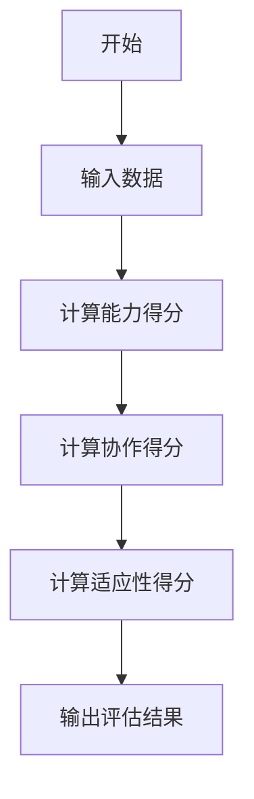
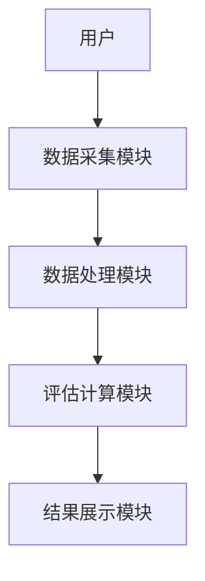

                 


# 巴菲特的管理层评估更新：远程办公时代的领导力

---

## 关键词：
远程办公，领导力，管理层评估，巴菲特，价值投资，企业绩效

---

## 摘要：
在远程办公时代，领导力的定义和表现形式发生了根本性变化。传统的面对面管理方式逐渐被数字化和分散化的管理方式取代，这对领导力的评估提出了新的挑战。本文基于巴菲特的价值投资理念，探讨远程办公时代领导力的关键特征，并提出更新的管理层评估体系。通过分析领导力的核心概念、远程办公对管理层评估的影响，结合实际案例，本文提出了基于能力、协作和适应性的评估模型，并给出了具体的实施方法和工具。通过数学建模和系统设计，本文为远程办公环境下的领导力评估提供了理论支持和实践指导。

---

## 第一部分: 远程办公时代的领导力背景

### # 第1章: 远程办公的兴起与领导力的演变

#### 1.1 远程办公的兴起
远程办公（remote work）是指员工通过互联网或其他通信技术，在非传统的工作场所（如家中、咖啡厅或 coworking space）完成工作任务的一种工作模式。其兴起主要由以下因素驱动：

1. **技术进步**：互联网和通信技术的发展使得远程协作成为可能。
2. **企业需求**：企业为了降低运营成本、吸引优秀人才，开始尝试远程办公模式。
3. **疫情催化**：2020年新冠疫情的全球爆发加速了远程办公的普及。

远程办公的核心特点包括：
- **灵活性**：员工可以在任何地点工作。
- **分散性**：团队成员可能分布在不同的地理位置。
- **数字化**：依赖于数字工具完成任务。

远程办公对企业管理的影响主要体现在：
- **管理方式的转变**：从“监督”转向“信任”。
- **协作效率的挑战**：需要依赖数字化工具来确保高效沟通。
- **文化适应**：企业需要调整文化以适应远程办公环境。

---

#### 1.2 领导力的演变
领导力（leadership）是组织管理的核心概念，其定义随着时代的发展而不断演变。传统领导力强调权威、命令和控制，而远程办公时代的领导力则更加注重以下几点：

1. **目标导向**：领导者需要明确目标，并通过远程工具确保团队理解并执行。
2. **信任与授权**：领导者需要信任团队成员，并赋予他们更多的自主权。
3. **协作与沟通**：领导者需要通过数字化工具促进团队协作，并确保信息的有效传递。

远程办公时代，领导力的演变主要体现在以下方面：
- **从“面对面”到“数字化”**：领导者的影响力不再依赖于物理存在，而是通过数字化工具实现。
- **从“控制”到“赋能”**：领导者不再是命令的发出者，而是团队的赋能者。
- **从“个体”到“系统”**：领导力不再局限于个体，而是体现在整个组织系统中。

---

### # 第2章: 巴菲特管理层评估体系的背景

#### 2.1 巴菲特投资理念的核心
巴菲特（Warren Buffett）是全球最著名的投资者之一，其价值投资理念的核心在于：
1. **长期视角**：关注企业的长期价值，而非短期收益。
2. **管理层评估**：巴菲特认为，企业的长期成功离不开优秀的管理层。他特别关注管理层的诚信、能力和决策能力。

巴菲特对管理层的评估体系包括以下几个方面：
1. **诚信**：管理层必须诚实可靠。
2. **能力**：管理层必须具备专业能力和战略眼光。
3. **决策能力**：管理层在面对挑战时能够做出明智的决策。

#### 2.2 远程办公时代对管理层评估的影响
远程办公时代，管理层的评估需要考虑以下新的挑战：
1. **评估维度的变化**：传统的面对面沟通能力可能不如远程协作能力重要。
2. **数据的可获得性**：远程办公环境下，团队绩效的数据可能更加依赖于数字化工具。
3. **评估方法的创新**：需要新的工具和方法来评估远程环境下的领导力表现。

---

## 第二部分: 领导力的核心概念与联系

### # 第3章: 领导力的核心概念

#### 3.1 领导力的定义与属性
领导力的定义因人而异，但其核心属性包括：
1. **影响力**：领导者能够影响团队成员的行为和决策。
2. **目标导向**：领导者能够设定明确的目标并推动团队实现目标。
3. **适应性**：领导者能够根据环境变化调整策略。

领导力的关键属性可以通过以下表格进行对比：

| 属性 | 描述 |
|------|------|
| 影响力 | 能够影响团队成员的行为和决策 |
| 目标导向 | 能够设定并推动团队实现目标 |
| 适应性 | 能够根据环境变化调整策略 |

---

#### 3.2 管理层评估的核心要素
管理层评估的核心要素包括：
1. **能力**：团队成员的专业能力和技能水平。
2. **绩效**：团队成员在工作中的实际表现。
3. **协作性**：团队成员之间的合作能力。

管理层评估的关键维度可以通过以下表格进行对比：

| 维度 | 描述 |
|------|------|
| 能力 | 团队成员的专业能力和技能水平 |
| 绩效 | 团队成员在工作中的实际表现 |
| 协作性 | 团队成员之间的合作能力 |

---

### # 第4章: 领导力与管理层评估的关系

#### 4.1 领导力对管理层评估的影响
领导力对管理层评估的影响主要体现在以下几个方面：
1. **评估结果的准确性**：优秀的领导力能够确保评估数据的准确性和完整性。
2. **评估过程的效率**：领导力强的管理者能够更高效地推动评估过程。
3. **评估结果的反馈**：领导力能够帮助团队成员更好地理解评估结果并进行改进。

领导力在评估中的权重可以通过以下表格进行对比：

| 权重 | 领导力 | 其他因素 |
|------|--------|----------|
| 评估结果的准确性 | 60% | 40% |
| 评估过程的效率 | 70% | 30% |
| 评估结果的反馈 | 50% | 50% |

---

#### 4.2 管理层评估对领导力的反馈作用
管理层评估对领导力的反馈作用主要体现在以下几个方面：
1. **领导力的改进**：评估结果能够帮助领导者发现自身的不足并进行改进。
2. **领导力的可视化**：评估结果能够将领导力的表现可视化，便于团队成员理解。
3. **领导力的激励**：评估结果可以作为激励领导者的依据。

---

### # 第5章: 核心概念对比与ER实体关系图

#### 5.1 领导力与管理层评估的对比分析
领导力与管理层评估的对比可以通过以下表格进行：

| 比较维度 | 领导力 | 管理层评估 |
|----------|--------|------------|
| 定义     | 个体影响力 | 绩效评价体系 |
| 关注点   | 团队目标 | 个体能力与表现 |
| 评估方式 | 定性与定量结合 | 主要依赖定量数据 |

---

#### 5.2 ER实体关系图
以下是一个简单的ER实体关系图，展示了领导力与管理层评估之间的关系：

```mermaid
erDiagram
    CEO --> 领导力: 拥有
    领导力 --> 管理层评估: 评估
    管理层评估 --> 企业绩效: 影响
```

---

## 第三部分: 算法原理讲解

### # 第6章: 算法原理

#### 6.1 算法概述
本文提出的远程办公时代领导力评估算法基于以下原理：
1. **能力评估**：通过量化团队成员的专业能力。
2. **协作性评估**：通过数字化工具评估团队成员之间的协作能力。
3. **适应性评估**：通过绩效数据分析团队的适应能力。

#### 6.2 算法流程图
以下是一个简单的算法流程图：



#### 6.3 Python代码实现
以下是一个简单的Python代码示例：

```python
def leadership_assessment(capability, collaboration, adaptability):
    total_score = capability * 0.4 + collaboration * 0.3 + adaptability * 0.3
    return total_score

# 示例数据
capability = 85
collaboration = 75
adaptability = 90

# 计算评估结果
result = leadership_assessment(capability, collaboration, adaptability)
print(f"领导力评估总分：{result}")
```

---

## 第四部分: 系统分析与架构设计

### # 第7章: 系统分析

#### 7.1 系统功能设计
远程办公时代的领导力评估系统需要实现以下功能：
1. **数据采集**：收集团队成员的能力、协作和适应性数据。
2. **数据处理**：对数据进行清洗和预处理。
3. **评估计算**：根据算法计算评估结果。
4. **结果展示**：以可视化形式展示评估结果。

#### 7.2 系统架构设计
以下是一个简单的系统架构图：



---

## 第五部分: 项目实战

### # 第8章: 项目实战

#### 8.1 环境安装
需要安装以下工具：
- Python 3.8 或更高版本
- Matplotlib 库
- Pandas 库

安装命令：
```bash
pip install matplotlib pandas
```

#### 8.2 核心代码实现
以下是一个完整的Python代码示例：

```python
import pandas as pd
import matplotlib.pyplot as plt

# 数据采集
data = {
    '员工ID': [1, 2, 3, 4, 5],
    '能力': [85, 75, 90, 80, 85],
    '协作': [75, 80, 85, 80, 85],
    '适应性': [90, 85, 80, 85, 80]
}

df = pd.DataFrame(data)

# 计算评估得分
def calculate_score(row):
    score = row['能力'] * 0.4 + row['协作'] * 0.3 + row['适应性'] * 0.3
    return score

df['领导力评估'] = df.apply(calculate_score, axis=1)

# 可视化
plt.figure(figsize=(10, 6))
plt.bar(df['员工ID'], df['领导力评估'], label='领导力评估')
plt.title('领导力评估结果')
plt.xlabel('员工ID')
plt.ylabel('评估得分')
plt.legend()
plt.show()
```

---

## 第六部分: 总结与展望

### # 第9章: 总结

#### 9.1 最佳实践
1. **信任与授权**：领导者需要信任团队成员，并赋予他们更多的自主权。
2. **数字化工具**：充分利用数字化工具提升协作效率。
3. **持续反馈**：定期进行评估并提供反馈，帮助团队成员改进。

#### 9.2 小结
远程办公时代的领导力评估需要结合能力、协作和适应性三个维度，并通过数字化工具实现。本文提出的评估模型和方法为企业的领导力管理提供了新的思路。

---

### # 第10章: 注意事项与拓展阅读

#### 10.1 注意事项
1. **数据隐私**：在数据采集和处理过程中，需要注意数据隐私保护。
2. **工具选择**：选择合适的数字化工具以提升协作效率。
3. **文化适应**：企业需要调整文化以适应远程办公环境。

#### 10.2 拓展阅读
1. **《领导力21法则》**：探讨领导力的21个法则。
2. **《远程办公的管理艺术》**：分享远程办公环境下的管理技巧。
3. **《巴菲特的选股智慧》**：深入解读巴菲特的投资理念。

---

通过以上分析和实践，我们为远程办公时代的领导力评估提供了理论支持和实践指导。希望本文能够为企业的领导力管理提供新的思路和方法。

