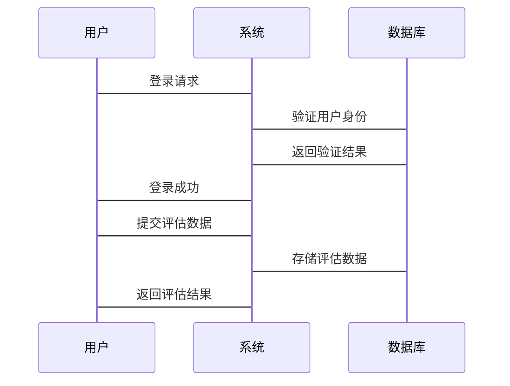
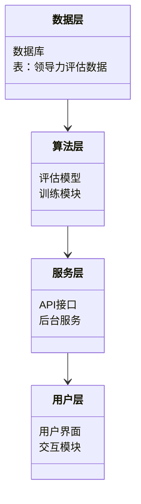

                 

# 巴菲特的管理层评估：人机协作时代的领导力新标准

---

## 关键词：巴菲特、领导力、人机协作、评估标准、人工智能、管理哲学、系统架构

---

## 摘要

本文探讨了巴菲特的领导力理念在人机协作时代的演变，分析了传统领导力评估的局限性，并提出了基于人机协作的新领导力评估标准。通过系统分析和实际案例，本文重构了领导力评估模型，并展望了未来领导力发展的方向。

---

## 第1章 巴菲特的领导力理念与投资哲学

### 1.1 巴菲特的投资哲学与管理智慧

巴菲特的价值投资理念强调长期、安全和边际，这些原则同样适用于领导力评估。他的管理智慧包括团队管理、决策能力和风险管理，这些在人机协作时代需要重新审视。

### 1.2 巴菲特领导力的演变

从传统管理到现代领导力，巴菲特的领导力理念在人机协作时代面临新的挑战。我们需要分析这些变化，并探讨未来的发展方向。

---

## 第2章 人机协作时代领导力的核心内涵

### 2.1 领导力的核心要素

领导力不同于管理，其核心要素包括战略思维、决策能力、团队协作、风险管理、创新能力、沟通能力和适应能力。在人机协作时代，这些要素需要赋予新的内涵。

### 2.2 人机协作时代领导力的特点

人机协作时代领导力的特点包括数据驱动、分布式决策和动态适应。领导者需要具备快速决策能力，并善于利用数据和AI工具。

---

## 第3章 领导力评估标准的重构

### 3.1 传统评估维度的局限性

传统领导力评估主要关注主观指标，忽视了数据驱动能力和决策速度等关键维度。我们需要重新设计评估标准。

### 3.2 新的评估维度

提出新的评估维度，包括数据驱动能力、决策速度、团队协作能力、适应性、创新能力和风险管理能力。

### 3.3 领导力评估模型的设计

设计一个基于人机协作的领导力评估模型，包括数据输入、特征提取、模型训练、评分计算和结果输出。

---

## 第4章 系统分析与架构设计

### 4.1 系统建设背景

介绍系统建设的背景、目标和范围，强调领导力评估在人机协作时代的必要性。

### 4.2 系统架构设计

设计系统架构，包括数据层、算法层、服务层和用户层，并用Mermaid图展示系统架构。

### 4.3 系统功能设计

详细描述系统功能设计，包括数据采集、特征提取、模型训练、评分计算和结果展示。

### 4.4 系统交互设计

设计系统交互流程，包括用户登录、数据输入、评估执行和结果展示，并用Mermaid图展示交互流程。

---

## 第5章 项目实战

### 5.1 环境安装与配置

指导读者安装开发环境，包括选择开发工具、安装数据库和Python库。

### 5.2 核心代码实现

提供核心代码实现，包括数据预处理、特征提取、模型训练和评估计算。

### 5.3 实际案例分析

通过具体案例分析，展示如何应用该模型评估领导者，并总结项目的成功经验。

---

## 第6章 结论与展望

### 6.1 结论

回顾巴菲特领导力评估在人机协作时代的演变，强调系统架构和算法设计的重要性。

### 6.2 未来展望

展望未来领导力发展的方向，提出进一步研究的建议，如动态调整评估模型和加强数据隐私保护。

---

## 附录：数学公式与算法代码

### 3.3 领导力评估模型的数学表达

$$ \text{评估分数} = \alpha \cdot \text{数据能力} + \beta \cdot \text{决策速度} + \gamma \cdot \text{团队协作} $$

其中，$\alpha + \beta + \gamma = 1$，确保权重合理分配。

### 4.3 系统交互流程

---

## 附录：系统架构图

---

通过以上结构，我们系统地分析了巴菲特的领导力评估在人机协作时代的演变，并提出了新的评估标准和系统架构，为未来的领导力研究提供了参考。

