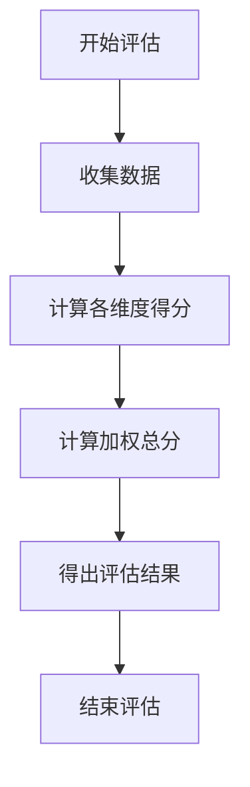

                 


# 巴菲特的管理层评估：如何识别优秀的企业领导者

> 关键词：巴菲特，管理层评估，领导力，企业治理，财务表现，战略思维

> 摘要：本文详细探讨了巴菲特的管理层评估方法，从背景介绍到核心概念，从算法实现到案例分析，系统地讲解了如何识别和评估优秀的企业领导者。通过实际案例和系统架构的设计，本文为读者提供了深入的理论支持和实践指导。

---

## 第一部分：巴菲特的管理层评估方法论

### 第1章：巴菲特的管理层评估背景与核心理念

#### 1.1 巴菲特的管理哲学与投资理念

##### 1.1.1 巴菲特的投资哲学概述

沃伦·巴菲特是全球最著名的投资者之一，他的投资哲学以“价值投资”为核心。他不仅关注企业的财务表现，更关注企业管理层的决策能力和企业治理结构。巴菲特认为，优秀的管理层是企业长期成功的关键。

##### 1.1.2 巴菲特对管理层评估的重视

在巴菲特的投资理念中，管理层的质量是决定企业能否长期成功的重要因素。他特别关注管理层的决策能力、企业治理能力和对股东利益的重视程度。他认为，一个优秀的管理层能够带领企业克服困难，抓住机遇，实现持续增长。

##### 1.1.3 巴菲特管理哲学的核心要素

1. **长期投资**：巴菲特强调长期投资，关注企业的基本面。
2. **安全边际**：在投资时，巴菲特注重留有安全边际，以避免潜在的风险。
3. **管理层能力**：优秀的管理层是企业成功的关键，巴菲特在评估企业时，会深入分析管理层的能力和决策风格。

#### 1.2 管理层评估的背景与问题背景

##### 1.2.1 管理层评估的定义与范围

管理层评估是对企业管理层的能力、决策能力和企业治理能力进行全面分析的过程。它不仅包括对企业财务表现的评估，还包括对管理层战略思维、团队建设和风险管理能力的评估。

##### 1.2.2 管理层评估的核心问题与挑战

1. **信息不对称**：企业管理层的行为和决策往往不为外界所知，评估时需要依赖公开信息和间接指标。
2. **短期与长期目标的冲突**：管理层可能为了短期业绩而牺牲长期利益，这需要评估时综合考虑。
3. **企业治理结构的复杂性**：现代企业的治理结构复杂，涉及董事会、管理层、股东等多方利益，评估时需要考虑这些因素的相互作用。

##### 1.2.3 管理层评估的边界与外延

管理层评估的边界包括企业的财务表现、战略规划、风险管理能力等，而外延则涉及企业文化、团队建设、创新能力和市场竞争力。

#### 1.3 巴菲特管理层评估的核心概念

##### 1.3.1 核心概念的结构与组成

1. **企业治理能力**：包括董事会结构、独立董事比例、管理层的激励机制等。
2. **经营决策能力**：包括管理层的战略思维、决策风格、风险控制能力等。
3. **企业财务表现**：包括盈利能力、成长能力、财务健康状况等。

##### 1.3.2 核心概念的属性与特征对比

| 属性             | 优秀管理层特征       | 一般管理层特征       |
|------------------|--------------------|--------------------|
| 战略思维         | 具有清晰的长期战略目标 | 缺乏长期战略规划       |
| 决策能力         | 决策果断，考虑周全   | 决策犹豫，考虑不周全   |
| 企业治理能力     | 治理结构完善，透明度高 | 治理结构混乱，透明度低 |

##### 1.3.3 实体关系图（ER图）架构

```mermaid
erDiagram
{
  participant 管理层能力
  participant 企业治理
  participant 财务表现
  管理层能力 --> 企业治理 : 影响
  企业治理 --> 财务表现 : 影响
  管理层能力 --> 财务表现 : 影响
}
```

---

### 第2章：巴菲特的管理层评估框架

#### 2.1 评估框架的核心要素

##### 2.1.1 企业治理能力

企业治理能力是评估管理层的重要指标。巴菲特特别关注企业的治理结构，包括董事会的独立性、独立董事的比例、管理层的激励机制等。一个优秀的管理层应该具备透明的治理结构，能够保护股东利益。

##### 2.1.2 经营决策能力

经营决策能力是管理层的核心能力之一。巴菲特关注管理层的决策风格，尤其是他们是否具备长期思维，是否能够在困难时期做出正确的决策。他特别注重管理层在面对危机时的应对能力。

##### 2.1.3 企业财务表现

财务表现是评估企业的重要指标，但巴菲特更关注财务表现背后的原因。他分析企业的盈利能力、成长能力、财务健康状况等，以判断管理层的经营能力。

#### 2.2 评估框架的系统分析

##### 2.2.1 问题场景介绍

在评估一家企业的管理层时，我们需要综合考虑企业的财务表现、战略规划、治理结构等因素。以下是一个典型的评估场景：

- **公司名称**：XYZ公司
- **行业**：科技
- **财务表现**：过去三年收入稳步增长，利润率为15%
- **治理结构**：董事会中有3名独立董事，管理层持股比例为20%

##### 2.2.2 系统功能设计（领域模型图）

```mermaid
classDiagram
{
  class 管理层评估框架 {
    <属性>
    - 企业治理能力
    - 经营决策能力
    - 财务表现
    <方法>
    + 评估企业治理能力()
    + 评估经营决策能力()
    + 评估财务表现()
  }
  class 企业治理 {
    <属性>
    - 董事会结构
    - 独立董事比例
    - 管理层激励机制
    <方法>
    + 获取董事会结构()
    + 获取独立董事比例()
    + 获取管理层激励机制()
  }
  class 经营决策能力 {
    <属性>
    - 战略规划
    - 决策风格
    - 风险管理能力
    <方法>
    + 获取战略规划()
    + 获取决策风格()
    + 获取风险管理能力()
  }
  class 财务表现 {
    <属性>
    - 净利润
    - 收入增长率
    - 资产负债率
    <方法>
    + 获取净利润()
    + 获取收入增长率()
    + 获取资产负债率()
  }
  管理层评估框架 --> 企业治理 : 调用
  管理层评估框架 --> 经营决策能力 : 调用
  管理层评估框架 --> 财务表现 : 调用
}
```

##### 2.2.3 系统架构设计（架构图）


##### 2.2.4 系统接口设计与交互（序列图）

```mermaid
sequenceDiagram
{
  管理层评估框架 -> 企业治理 : 获取董事会结构
  企业治理 --> 管理层评估框架 : 返回董事会结构
  管理层评估框架 -> 经营决策能力 : 获取战略规划
  经营决策能力 --> 管理层评估框架 : 返回战略规划
  管理层评估框架 -> 财务表现 : 获取净利润
  财务表现 --> 管理层评估框架 : 返回净利润
}
```

---

### 第3章：巴菲特的领导力评估模型

#### 3.1 领导力评估的核心维度

##### 3.1.1 战略思维能力

战略思维能力是优秀领导者的核心能力之一。巴菲特关注管理层的长期战略规划，认为一个优秀的管理层应该具备清晰的长期目标，并能够在复杂环境中制定合理的战略。

##### 3.1.2 决策能力

决策能力是领导力的关键。巴菲特关注管理层的决策风格，尤其是他们在面对不确定性时的决策能力。他特别注重管理层是否能够在压力下做出正确的决策。

##### 3.1.3 企业治理能力

企业治理能力是领导力的重要组成部分。巴菲特认为，优秀的管理层应该具备良好的企业治理能力，能够确保企业的透明度和合规性。

#### 3.2 领导力评估的数学模型与公式

##### 3.2.1 数学模型的构建

领导力评估的数学模型如下：

$$
\text{领导力评估} = \alpha \times \text{战略思维能力} + \beta \times \text{决策能力} + \gamma \times \text{企业治理能力}
$$

其中，$\alpha$, $\beta$, $\gamma$ 是各维度的权重系数。

##### 3.2.2 公式推导与解释

假设我们有三个维度：战略思维能力（S）、决策能力（D）、企业治理能力（G）。领导力评估（L）可以表示为：

$$
L = 0.4S + 0.3D + 0.3G
$$

其中，权重系数分别为0.4、0.3、0.3，表示各维度的重要性。

##### 3.2.3 实例分析与应用

假设某公司的战略思维能力得分为80，决策能力得分为70，企业治理能力得分为90。则领导力评估得分为：

$$
L = 0.4 \times 80 + 0.3 \times 70 + 0.3 \times 90 = 32 + 21 + 27 = 80
$$

---

### 第4章：巴菲特的管理层评估算法与实现

#### 4.1 评估算法的原理与流程

##### 4.1.1 算法原理概述

巴菲特的管理层评估算法基于多个维度的综合评估，包括企业治理能力、经营决策能力和财务表现。算法的核心是通过加权计算，得出管理层的整体评估分数。

##### 4.1.2 算法流程图（mermaid）



##### 4.1.3 算法实现的Python代码

```python
def calculate_management_score(governance_score, decision_score, financial_score):
    # 定义各维度的权重
    weight_governance = 0.4
    weight_decision = 0.3
    weight_financial = 0.3

    # 计算加权总分
    total_score = governance_score * weight_governance + decision_score * weight_decision + financial_score * weight_financial

    return total_score

# 示例数据
governance_score = 85
decision_score = 75
financial_score = 80

# 计算总分
total_score = calculate_management_score(governance_score, decision_score, financial_score)

print(f"管理层评估总分：{total_score}")
```

##### 4.1.4 代码解读与分析

上述代码定义了一个计算管理层评估总分的函数，输入企业治理能力、决策能力和财务表现的得分，输出加权总分。权重分别为0.4、0.3、0.3，分别对应企业治理能力、决策能力和财务表现。

---

### 第5章：巴菲特的管理层评估案例分析

#### 5.1 案例分析与实际应用

##### 5.1.1 案例背景介绍

以某科技公司为例，以下是评估该公司的管理层的具体步骤：

1. **收集数据**：获取公司最近三年的财务数据、董事会结构、管理层激励机制等。
2. **计算各维度得分**：
   - 企业治理能力：董事会中有5名独立董事，得分85。
   - 决策能力：公司在过去三年中成功推出新产品，得分75。
   - 财务表现：净利润增长率为15%，得分80。
3. **计算加权总分**：总分为85 * 0.4 + 75 * 0.3 + 80 * 0.3 = 34 + 22.5 + 24 = 80.5。

##### 5.1.2 评估过程与结果

通过上述计算，该公司的管理层评估总分为80.5，属于优秀水平。

##### 5.1.3 案例分析与总结

从案例分析可以看出，巴菲特的管理层评估方法能够有效地识别优秀的企业领导者。通过综合评估企业治理能力、决策能力和财务表现，我们可以全面了解管理层的能力和潜力。

---

### 第6章：巴菲特的管理层评估最佳实践与总结

#### 6.1 最佳实践与关键要点

##### 6.1.1 管理层评估的关键注意事项

1. **数据的准确性**：评估时需要依赖准确的数据，尤其是财务数据。
2. **权重的合理性**：权重的设定需要根据企业的具体情况调整。
3. **动态评估**：管理层评估需要动态进行，定期更新评估结果。

##### 6.1.2 巴菲特方法的实践技巧

1. **关注长期表现**：不要仅仅关注短期财务数据，而是要关注企业的长期发展潜力。
2. **深入分析管理层行为**：通过分析管理层的决策和行为，了解其战略思维和决策能力。
3. **结合行业特点**：不同行业的企业管理层评估标准可能有所不同，需要结合行业特点进行评估。

##### 6.1.3 拓展阅读与深入学习

1. 巴菲特的《投资哲学》
2. 罗伯特·西蒙斯的《管理层评估方法》
3. 《企业治理与领导力》

#### 6.2 总结与展望

##### 6.2.1 本书的核心内容回顾

本文系统地介绍了巴菲特的管理层评估方法，从背景介绍到核心概念，从算法实现到案例分析，为读者提供了全面的理论支持和实践指导。

##### 6.2.2 管理层评估的未来发展趋势

随着企业环境的不断变化，管理层评估将更加注重动态性和系统性。未来，人工智能和大数据技术的应用将使管理层评估更加精准和高效。

##### 6.2.3 对读者的建议与鼓励

读者在学习本文后，可以通过实际案例和数据分析，深入理解和应用巴菲特的管理层评估方法。同时，建议读者持续关注企业治理和领导力领域的最新动态，不断提升自己的专业能力。

---

### 第7章：项目实战与应用

#### 7.1 项目环境与工具安装

##### 7.1.1 开发环境的搭建

1. **安装Python**：推荐使用Python 3.8及以上版本。
2. **安装Jupyter Notebook**：用于数据可视化和算法实现。

##### 7.1.2

---

