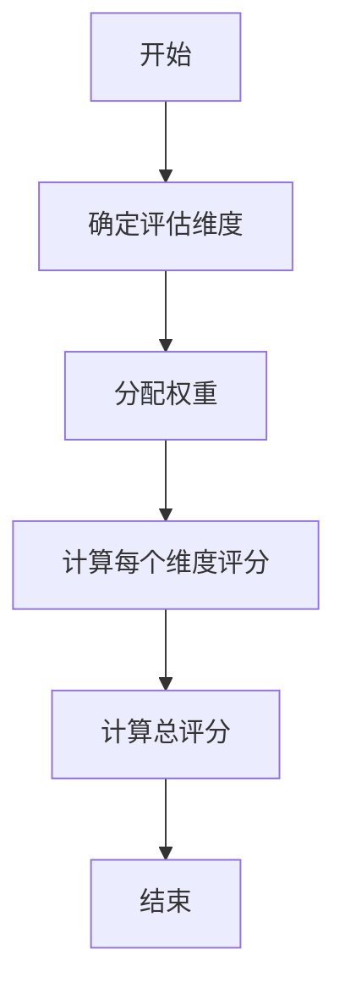
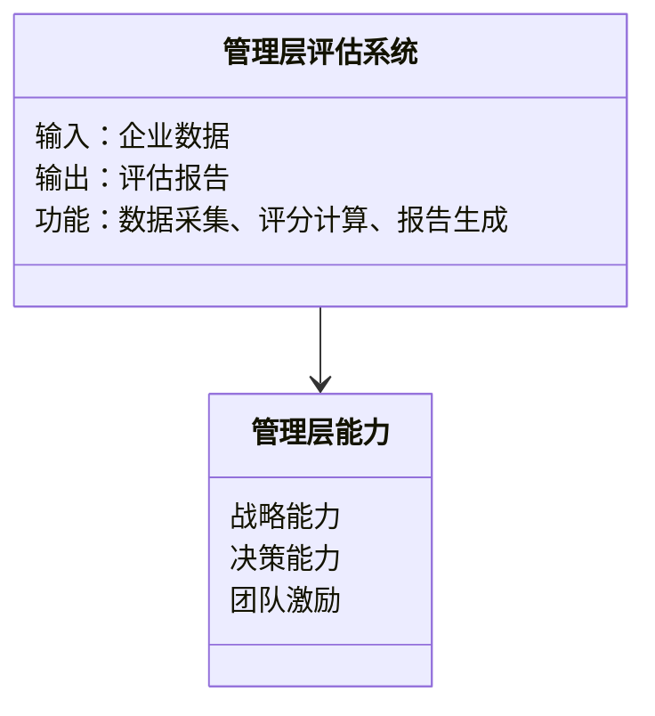
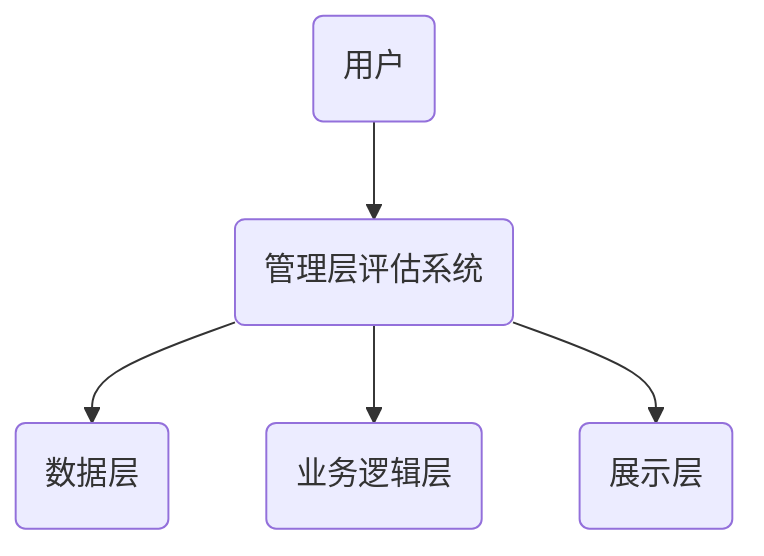
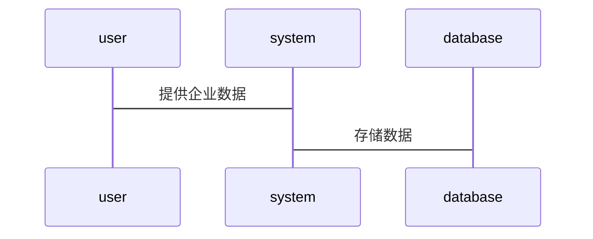
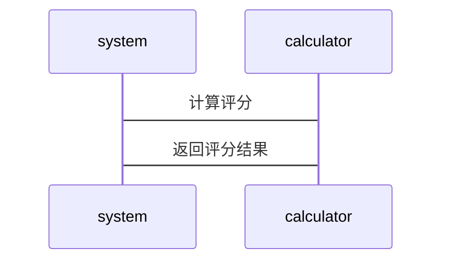

                 


# 巴菲特的管理层评估：量子领导力时代的新标准

## 关键词：量子领导力，管理层评估，巴菲特，领导力算法，系统架构

## 摘要：在传统领导力评估逐渐暴露出其局限性的背景下，量子领导力作为一种新兴的领导力理论，为管理层评估提供了全新的视角和方法。本文将探讨量子领导力的核心原理、其与传统领导力的对比，以及如何将量子领导力的理念融入到巴菲特的管理层评估体系中。通过构建量子领导力评估模型和系统架构设计，本文旨在为企业管理者和投资者提供一套更全面、更高效的管理层评估方法。

---

## 第1章：背景介绍

### 1.1 问题背景与演变

#### 1.1.1 传统领导力的局限性
传统领导力评估方法通常关注单一维度的领导能力，如决策能力、团队管理能力等，但忽视了领导力的动态性和整体性。这种评估方式难以全面捕捉管理层的真实能力。

#### 1.1.2 量子领导力的起源与发展
量子领导力起源于21世纪初，强调领导力的系统性、动态性和不确定性。它借鉴了量子力学的思想，认为领导力是相互关联、动态变化的系统。

#### 1.1.3 巴菲特投资理念中的领导力要素
巴菲特的投资哲学强调管理层的质量，认为优秀的企业管理层是企业长期成功的关键。他关注管理层的战略思维、决策能力和团队激励机制。

---

## 第2章：量子领导力的核心原理

### 2.1 核心原理分析

#### 2.1.1 系统性思维的运用
量子领导力强调系统性思维，认为领导力是系统的一部分，受外部环境和内部因素的共同影响。

#### 2.1.2 战略性决策的动态调整
量子领导力注重在复杂环境中灵活调整战略，强调动态决策能力。

#### 2.1.3 团队激励与文化塑造
量子领导力认为，领导者的激励机制和企业文化建设是提升团队凝聚力和创新能力的关键。

### 2.2 核心要素对比表
以下是量子领导力与传统领导力的核心要素对比：

| **要素**            | **传统领导力**                 | **量子领导力**                 |
|----------------------|-------------------------------|-------------------------------|
| **关注点**           | 单一维度，如决策能力           | 系统性、动态性和整体性         |
| **评估方法**         | 定量评估，如KPI                | 定性与定量结合，注重系统评估   |
| **目标**             | 提升个体领导能力               | 提升整体系统领导力             |
| **适用场景**         | 稳定环境                      | 复杂、动态环境                 |

### 2.3 量子领导力的核心要素

#### 2.3.1 系统性思维
领导者需要从整体出发，考虑各个因素之间的相互作用。

#### 2.3.2 动态性
领导力在不同环境和阶段中的表现不同，需要灵活调整。

#### 2.3.3 团队激励
通过激励机制和企业文化提升团队的凝聚力和创新能力。

---

## 第3章：量子领导力评估模型的数学模型

### 3.1 模型概述
量子领导力评估模型通过系统性地分析管理层的关键能力，提供一个综合评分。模型包括以下几个步骤：

1. 确定关键评估维度。
2. 给每个维度分配权重。
3. 计算每个维度的得分。
4. 综合计算总得分。

### 3.2 模型的数学表达

假设管理层有 $n$ 个评估维度，每个维度的权重为 $w_i$，评分为 $s_i$。总评分为：

$$
\text{总评分} = \sum_{i=1}^{n} w_i \times s_i
$$

其中，$w_i$ 是第 $i$ 个维度的权重，$s_i$ 是第 $i$ 个维度的评分。

### 3.3 算法流程图



---

## 第4章：系统架构设计

### 4.1 问题场景介绍
本文设计一个基于量子领导力的管理层评估系统，旨在帮助企业投资者和管理层进行自我评估和优化。

### 4.2 领域模型



### 4.3 系统架构设计



### 4.4 接口设计

#### 4.4.1 数据采集接口


#### 4.4.2 评分计算接口


---

## 第5章：项目实战

### 5.1 环境安装

#### 5.1.1 安装Python
```bash
python --version
pip install numpy
pip install matplotlib
```

### 5.2 核心代码实现

```python
def quantum_leadership_score(dimensions, weights):
    total_score = 0
    for i in range(len(dimensions)):
        total_score += weights[i] * dimensions[i]
    return total_score

# 示例数据
dimensions = [90, 85, 95]  # 战略能力、决策能力、团队激励
weights = [0.4, 0.3, 0.3]

score = quantum_leadership_score(dimensions, weights)
print(f"总评分为：{score}")
```

### 5.3 实际案例分析

假设某公司管理层的评估维度如下：

- 战略能力：90
- 决策能力：85
- 团队激励：95

权重分配为：

- 战略能力：0.4
- 决策能力：0.3
- 团队激励：0.3

计算总评分：
$$
\text{总评分} = 0.4 \times 90 + 0.3 \times 85 + 0.3 \times 95 = 36 + 25.5 + 28.5 = 90
$$

---

## 第6章：最佳实践与总结

### 6.1 小结
量子领导力为管理层评估提供了更全面的视角，结合系统的动态性和整体性，能够更好地捕捉领导者的综合能力。

### 6.2 注意事项
在实际应用中，需注意数据的准确性和模型的适应性，定期更新评估维度和权重。

### 6.3 未来展望
随着人工智能和大数据技术的发展，量子领导力评估模型将更加智能化和精准化。

### 6.4 拓展阅读
推荐阅读《量子领导力：重新定义未来的领导力》和《巴菲特投资策略解析》。

---

## 结语

量子领导力时代的到来，为管理层评估提供了新的标准和工具。通过本文的分析和实践，我们能够更好地理解和应用量子领导力理念，为企业的可持续发展提供有力支持。

