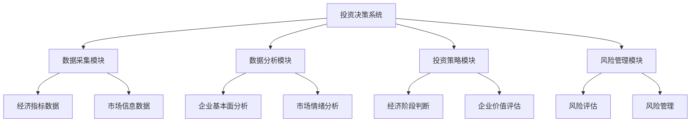

                 


# 巴菲特的经济周期投资法则：如何在不同阶段获利

## 关键词：巴菲特，经济周期，价值投资，投资策略，风险管理

## 摘要：本文详细探讨巴菲特的经济周期投资法则，分析如何在不同经济阶段获利。通过系统分析和实际案例，揭示价值投资的核心要素，帮助投资者制定有效的投资策略，管理风险，实现长期收益。

---

## 第一部分：经济周期与巴菲特投资法则概述

### 第1章：经济周期的基本概念

#### 1.1 经济周期的定义与特征

- **经济周期的定义**：经济周期是指经济活动在时间上的波动，通常分为复苏、繁荣、衰退和萧条四个阶段。  
- **四个阶段的特征**：
  - **复苏阶段**：经济开始回升，企业利润逐步恢复。
  - **繁荣阶段**：经济高速增长，市场情绪乐观。
  - **衰退阶段**：经济增长放缓，企业利润下降。
  - **萧条阶段**：经济低迷，市场情绪悲观。

- **经济周期的驱动因素**：包括货币政策、财政政策、市场情绪和技术进步等因素。

#### 1.2 巴菲特投资理念的核心思想

- **巴菲特的生平简介**：沃伦·巴菲特是世界著名投资者，倡导价值投资，注重企业的基本面分析和长期投资。
- **巴菲特的投资哲学**：强调安全边际、长期投资和分散风险。
- **价值投资的核心理论**：寻找被市场低估的企业，长期持有，分享企业成长的成果。

### 第2章：巴菲特经济周期投资法则的背景

#### 2.1 经济周期对投资的影响

- **经济周期对股市的影响**：股市波动与经济周期密切相关，繁荣期股市上涨，衰退期股市下跌。
- **经济周期对行业的影响**：不同行业在不同阶段的表现差异显著，如周期性行业和防御性行业的区别。
- **经济周期对个人投资决策的影响**：投资者需根据经济阶段调整投资策略，避免盲目跟风。

#### 2.2 巴菲特投资法则的适用性

- **普适性**：巴菲特的投资法则适用于不同经济阶段，但需灵活调整。
- **局限性**：在极端市场情况下，如金融危机，可能需要额外的风险管理。
- **长期有效性**：长期来看，巴菲特的价值投资策略表现优异。

---

## 第二部分：巴菲特经济周期投资法则的核心概念

### 第3章：巴菲特经济周期投资法则的核心要素

#### 3.1 价值投资的核心要素

- **企业的内在价值**：评估企业的盈利能力、财务状况和竞争优势。
- **财务健康状况**：关注企业的负债情况、现金流和利润率。
- **竞争优势**：分析企业的市场地位、品牌价值和创新能力。

#### 3.2 经济周期对投资策略的影响

- **经济周期与投资策略的关系**：不同阶段采用不同的投资策略。
- **不同阶段的投资策略**：
  - **复苏阶段**：关注低估值的周期性股票。
  - **繁荣阶段**：选择高增长的成长股。
  - **衰退阶段**：寻找被市场错杀的优质股。
  - **萧条阶段**：耐心等待市场反转。

### 第4章：巴菲特投资法则与经济周期的关系

#### 4.1 巴菲特投资法则在经济繁荣期的应用

- **繁荣期的投资机会**：高增长行业和优质企业的股票表现优异。
- **繁荣期的风险**：市场泡沫和估值过高可能导致投资风险。
- **巴菲特的策略**：选择具有持续竞争优势的企业，避免盲目追高。

#### 4.2 巴菲特投资法则在经济衰退期的应用

- **衰退期的投资机会**：市场恐慌导致优质企业股票被低估。
- **衰退期的风险**：经济下行可能导致企业盈利下降。
- **巴菲特的策略**：寻找基本面良好但被市场忽视的企业，进行长期投资。

---

## 第三部分：巴菲特经济周期投资法则的系统分析与架构设计

### 第5章：巴菲特投资法则的系统架构

#### 5.1 投资决策系统的构成

- **数据采集模块**：收集经济指标、企业财务数据和市场信息。
- **数据分析模块**：分析企业价值、行业趋势和市场情绪。
- **投资策略模块**：根据经济周期和企业基本面制定投资策略。
- **风险管理模块**：评估投资风险并制定应对措施。

#### 5.2 系统功能设计

- **数据采集与处理**：获取实时经济数据和市场信息。
- **经济周期分析**：判断当前经济所处阶段。
- **投资策略生成**：基于经济阶段和企业分析结果制定投资策略。
- **风险评估与管理**：量化投资风险，制定止损和止盈策略。

### 第6章：系统架构图



---

## 第四部分：项目实战

### 第6章：项目实战与案例分析

#### 6.1 环境安装

- **工具安装**：安装Python、Pandas、Matplotlib和相关数据接口库。
- **数据源**：获取历史经济数据和股票数据。

#### 6.2 核心实现代码

```python
import pandas as pd
import numpy as np
import matplotlib.pyplot as plt

# 示例数据：假设我们有一个包含经济指标和股票数据的DataFrame
data = pd.DataFrame({
    '日期': ['2020-01', '2020-02', '2020-03', '2020-04'],
    'GDP增长率': [2.0, 1.8, 2.2, 2.1],
    '失业率': [3.5, 3.6, 3.4, 3.5],
    '标普500指数': [3100, 3150, 3200, 3250]
})

# 绘制经济周期分析图
plt.figure(figsize=(10, 6))
plt.plot(data['日期'], data['GDP增长率'], label='GDP增长率', color='blue')
plt.plot(data['日期'], data['失业率'], label='失业率', color='red')
plt.title('经济周期分析')
plt.xlabel('日期')
plt.ylabel('数值')
plt.legend()
plt.show()
```

#### 6.3 实际案例分析

- **案例背景**：2020年新冠疫情导致全球经济衰退，标普500指数在2020年3月达到低点后迅速反弹。
- **策略应用**：在衰退阶段，巴菲特会选择基本面良好的企业进行投资，如苹果、可口可乐等。
- **结果分析**：长期持有优质企业股票，在经济复苏后获得超额收益。

---

## 第五部分：最佳实践与小结

### 第7章：最佳实践与经验总结

#### 7.1 投资策略调整

- 根据经济周期灵活调整投资策略，避免固定模式。
- 在繁荣期控制仓位，减少风险；在衰退期寻找低估机会。

#### 7.2 风险管理

- 设置止损点，避免重大损失。
- 分散投资，降低单一资产的风险。

#### 7.3 长期投资

- 长期持有优质企业股票，避免频繁交易。
- 定期审视投资组合，及时调整。

### 7.4 小结

巴菲特的经济周期投资法则强调对企业基本面的深入分析和对经济周期的准确判断。投资者应根据当前经济阶段调整投资策略，寻找具有长期竞争优势的企业，耐心持有，避免短期波动的影响。

### 7.5 注意事项

- **市场风险**：经济周期波动可能导致市场短期大幅波动，需谨慎应对。
- **信息滞后**：数据和信息可能存在滞后性，影响投资决策的及时性。
- **个人能力**：投资者需具备一定的分析能力和市场理解，避免盲目跟风。

### 7.6 拓展阅读

- 《巴菲特致股东的信》：深入理解巴菲特的投资理念。
- 《投资最重要的事情》：学习价值投资的核心原则。

---

通过系统分析和实际案例，本文详细阐述了巴菲特的经济周期投资法则，帮助投资者在不同经济阶段制定有效的投资策略，实现长期稳健的收益。

