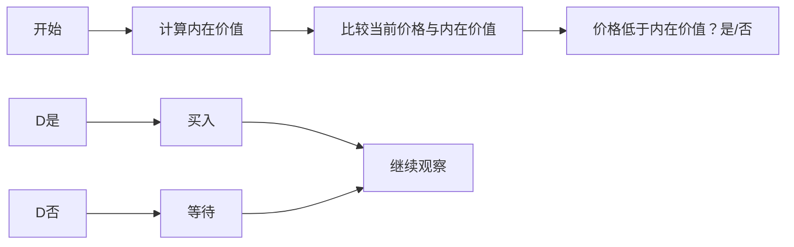
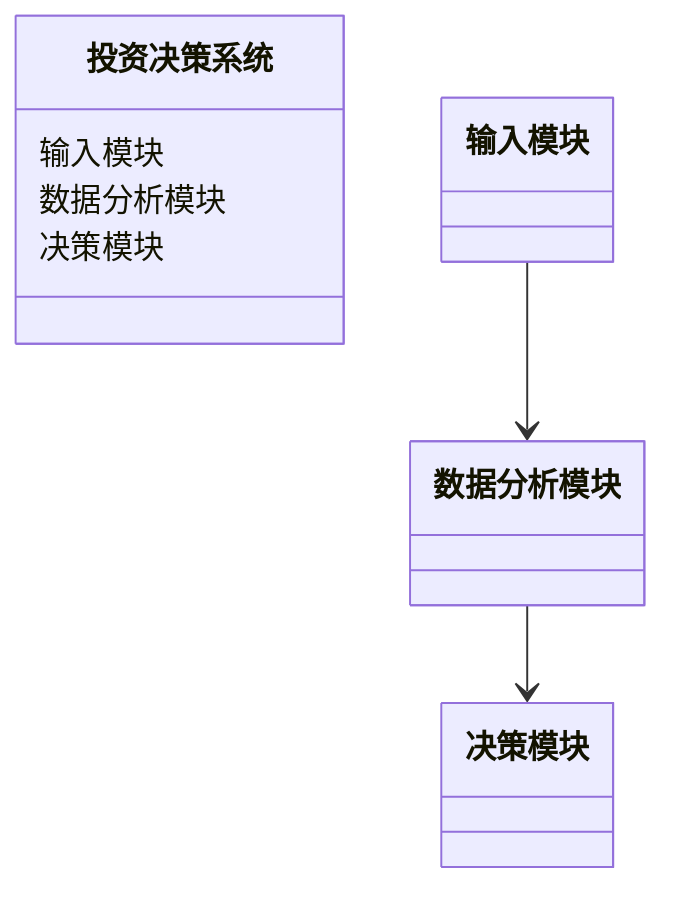

                 

# 巴菲特的经济周期投资法则：数字经济周期的特点

---

## 关键词：
- 巴菲特投资法则
- 经济周期
- 数字经济
- 投资策略
- 数字经济周期
- 投资模型
- 数学建模

---

## 摘要：
本文深入探讨了巴菲特的经济周期投资法则及其在数字经济周期中的应用特点。通过分析经济周期的基本概念、巴菲特投资理念的核心思想以及数字经济周期的独特性，本文揭示了如何将巴菲特的投资策略与数字经济发展相结合。文章还详细介绍了数字经济周期中的投资策略、数学建模方法、系统架构设计以及实际案例分析，帮助读者更好地理解和应用这些投资法则。

---

## 第一部分：巴菲特的经济周期投资法则概述

### 第1章：经济周期与投资的基本概念

#### 1.1 经济周期的基本概念
经济周期是指经济活动在一定时间内经历的波动和变化，通常分为扩张期、衰退期、收缩期和复苏期。经济周期的波动对投资决策有重要影响，投资者需要根据经济周期的阶段调整投资策略。

#### 1.2 巴菲特投资理念的核心思想
巴菲特的价值投资理念强调长期持有优质资产，注重企业基本面分析。他主张在经济周期的低谷期寻找被低估的投资标的，在高峰期避免过度投机。

---

### 第2章：巴菲特的经济周期投资法则

#### 2.1 巴菲特经济周期投资法则的背景
经济周期的波动对投资收益有直接影响。巴菲特通过研究经济周期的特点，提出了独特的投资法则，旨在帮助投资者在不同经济环境下做出最优决策。

#### 2.2 巴菲特经济周期投资法则的原理
- **经济周期波动的识别与预测**：通过分析经济指标（如GDP、失业率、通胀率）预测经济周期的变化。
- **企业价值评估与周期的关系**：企业价值在不同经济周期阶段的表现不同，投资者需要根据周期阶段调整估值方法。
- **投资决策的时机选择**：在经济衰退期寻找价值投资机会，在经济繁荣期警惕过度投资风险。

---

## 第二部分：数字经济周期的特点

### 第3章：数字经济的基本概念

#### 3.1 数字经济的定义与范围
数字经济是以数字化技术为核心驱动力的经济形态，涵盖互联网、人工智能、大数据、区块链等领域。

#### 3.2 数字经济的发展阶段
数字经济经历了萌芽期、成长期和成熟期，不同阶段的投资机会和风险也有所不同。

#### 3.3 数字经济与传统经济的区别
数字经济具有数据驱动、高增长、创新性强等特点，与传统经济在增长模式、投资逻辑等方面存在显著差异。

---

### 第4章：数字经济周期的独特性

#### 4.1 数字经济周期的波动规律
数字经济周期具有短周期、高频波动的特点，技术创新和市场变化对经济周期的影响更加显著。

#### 4.2 数字经济周期与传统经济周期的差异
数字经济周期更依赖技术创新和数字化转型，投资机会和风险分布与传统经济周期有明显不同。

#### 4.3 数字经济周期对投资的影响
数字经济周期中的投资机会更加多样化，但也伴随着更高的不确定性和风险。

---

## 第三部分：巴菲特法则在数字经济周期中的应用

### 第5章：巴菲特法则在数字经济中的适用性

#### 5.1 数字经济中的价值投资机会
尽管数字经济领域变化快，但优质企业依然具备长期投资价值。巴菲特法则强调对企业基本面的分析，这一点在数字经济中同样适用。

#### 5.2 数字经济周期中的风险与挑战
数字经济周期的波动性较强，技术创新和市场变化可能导致投资标的价值快速波动，投资者需要具备较强的风控能力。

#### 5.3 巴菲特法则的调整与优化
在数字经济周期中，巴菲特法则需要结合数字化工具和数据分析方法进行优化，以适应新的投资环境。

---

### 第6章：数字经济周期中的投资策略

#### 6.1 投资时机的选择
在数字经济周期中，投资者需要根据经济指标和市场趋势判断投资时机，避免在市场高点盲目投资。

#### 6.2 投资组合的构建与优化
数字经济周期中的投资组合需要多样化，涵盖不同领域的优质资产，同时根据市场变化进行动态调整。

#### 6.3 风险管理与收益平衡
投资者需要在数字经济周期中平衡风险与收益，通过分散投资和严格的风险控制实现长期稳定的收益。

---

## 第四部分：数学建模与算法实现

### 第7章：经济周期波动的数学建模

#### 7.1 经济周期波动的数学表达
经济周期波动可以用时间序列模型（如ARIMA）进行建模，通过历史数据预测未来趋势。

#### 7.2 经济指标的量化分析
利用经济指标（如GDP增长率、失业率）构建指标体系，量化分析经济周期的变化。

#### 7.3 经济周期预测的算法模型
通过机器学习算法（如LSTM）对经济周期进行预测，提升预测的准确性和时效性。

---

### 第8章：巴菲特法则的算法实现

#### 8.1 投资价值评估的数学公式
$$ P \leq V $$
其中，P为股票价格，V为股票的内在价值。

#### 8.2 投资决策的逻辑算法

#### 8.3 投资组合优化的数学模型
$$ \text{最大化收益} = \sum w_i r_i $$
$$ \text{最小化风险} = \sum w_i^2 \sigma_i^2 $$
其中，\( w_i \)为投资权重，\( r_i \)为预期收益，\( \sigma_i \)为风险。

---

## 第五部分：系统分析与架构设计

### 第9章：投资决策系统的架构设计

#### 9.1 系统功能设计

#### 9.2 系统架构设计

---

## 第六部分：项目实战与案例分析

### 第10章：数字经济周期中的投资案例分析

#### 10.1 经典投资案例解读
以某科技公司为例，分析其在数字经济周期中的投资价值和投资机会。

#### 10.2 数字经济周期中的投资机会
通过具体案例分析，展示如何在数字经济周期中寻找优质投资标的。

---

## 第七部分：最佳实践与总结

### 第11章：最佳投资实践

#### 11.1 长期投资的重要性
坚持巴菲特的长期投资理念，避免短期市场波动的干扰。

#### 11.2 风险管理策略
制定科学的风险管理计划，确保投资组合的稳定性和安全性。

#### 11.3 持续学习与优化
不断学习新的投资知识和技术，优化投资策略，适应数字经济周期的变化。

---

## 第八部分：总结与展望

### 第12章：总结与展望

#### 12.1 文章总结
本文系统地介绍了巴菲特的经济周期投资法则及其在数字经济周期中的应用特点，为投资者提供了理论依据和实践指导。

#### 12.2 未来展望
随着数字经济的快速发展，巴菲特法则的应用将更加广泛和深入，投资者需要结合新的技术和市场环境不断优化投资策略。

---

通过以上内容，我们可以看到，巴菲特的经济周期投资法则在数字经济周期中具有重要的指导意义。投资者需要结合经济周期的特点和数字经济的独特性，制定科学的投资策略，实现长期稳定的收益。

