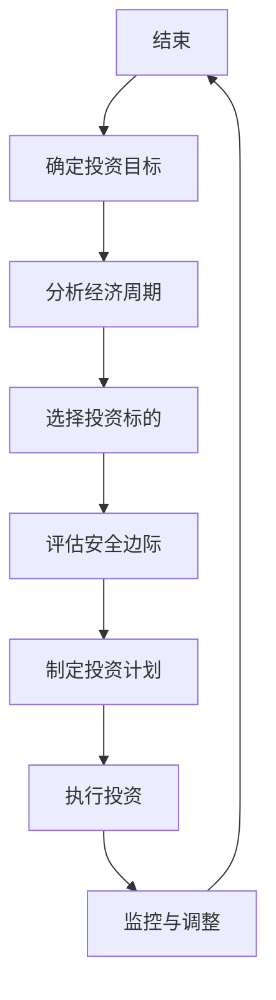
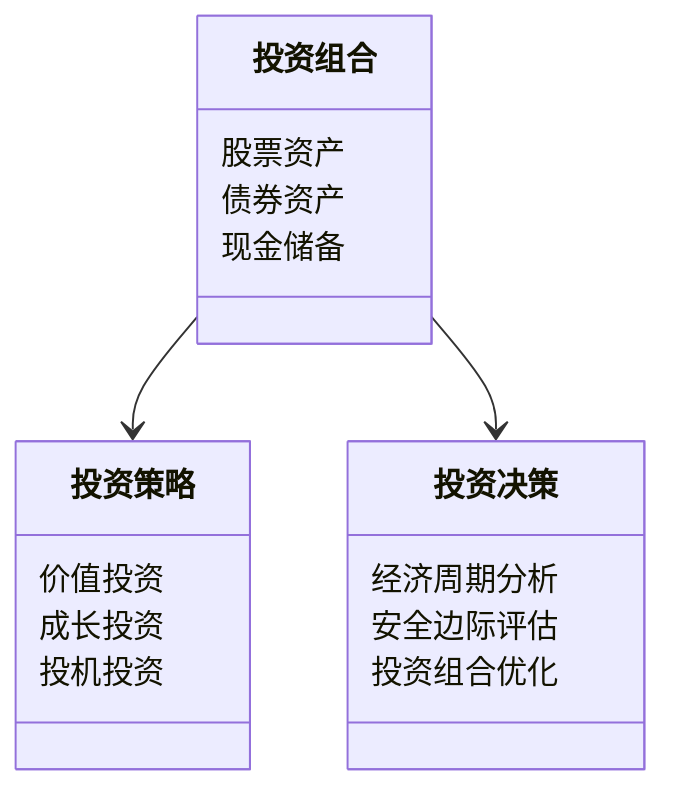
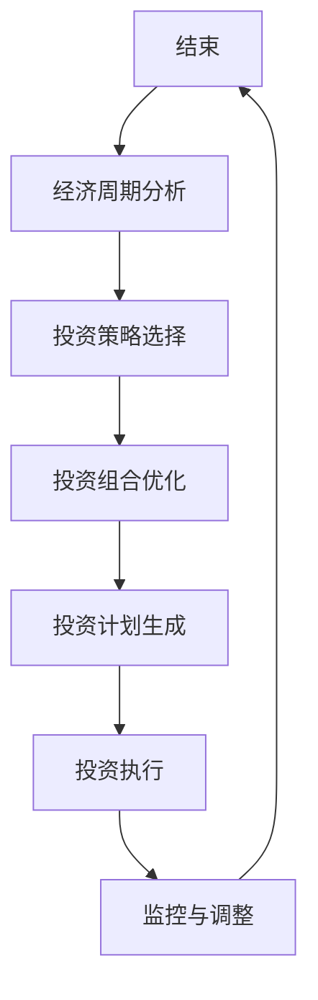

                 


# 巴菲特的经济周期投资策略

> 关键词：巴菲特，经济周期，投资策略，价值投资，安全边际，股票估值，投资组合

> 摘要：本文深入分析了巴菲特的经济周期投资策略，探讨了其核心理念、价值投资方法、安全边际概念以及在不同经济周期中的应用。通过系统的分析和实战案例，本文揭示了巴菲特投资策略的数学模型、算法原理及其在实际投资中的具体应用。文章还结合技术语言，详细阐述了投资决策的系统化框架，为读者提供了全面而深入的见解。

---

# 第一部分: 巴菲特的经济周期投资策略背景介绍

## 第1章: 巴菲特投资策略概述

### 1.1 巴菲特的生平与投资理念

#### 1.1.1 巴菲特的生平简介
沃伦·巴菲特（Warren Buffett）是世界上最著名的投资者之一，被誉为“股神”。他于1934年出生在美国奥马哈市，毕业于哥伦比亚大学，师从本杰明·格雷厄姆（Benjamin Graham）。巴菲特的投资理念深受格雷厄姆价值投资理论的影响，并在此基础上发展出了自己的投资策略。

#### 1.1.2 巴菲特的投资哲学
巴菲特的投资哲学可以总结为“价值投资”。他认为，股票不仅仅是一个交易代码，而是代表一家企业的所有权。投资的最终目标是找到那些具有持续竞争优势、良好管理团队和合理估值的企业，并长期持有它们。

#### 1.1.3 巴菲特的价值投资理念
价值投资的核心在于寻找市场价格低于内在价值的股票。巴菲特强调，投资者应该关注企业的基本面，包括盈利能力、财务状况、竞争优势和管理团队等因素。他主张在市场恐慌时买入优质资产，在市场狂热时卖出。

### 1.2 经济周期的基本概念

#### 1.2.1 经济周期的定义与特征
经济周期是指经济活动的波动，通常分为四个阶段：衰退、萧条、复苏和繁荣。每个阶段的特点不同，对投资的影响也不同。

| 阶段 | 特征 | 投资影响 |
|------|------|----------|
| 衰退 | 经济增长放缓，企业盈利下降 | 适合买入优质资产 |
| 萧条 | 经济活动低靡，企业盈利大幅下降 | 适合长期投资 |
| 复苏 | 经济逐渐恢复，企业盈利开始回升 | 适合增加股票配置 |
| 繁荣 | 经济高速增长，企业盈利达到顶峰 | 适合卖出部分资产 |

#### 1.2.2 经济周期的阶段划分
经济周期的阶段划分可以通过GDP增长率、失业率、通胀率等指标来判断。例如，当GDP增长率持续下降，失业率上升，经济可能进入衰退阶段；当GDP增长率回升，失业率下降，经济可能进入复苏阶段。

#### 1.2.3 经济周期对投资的影响
在不同的经济周期阶段，巴菲特的投资策略有所不同。例如，在衰退阶段，他倾向于买入廉价的优质资产；在繁荣阶段，他倾向于卖出部分资产以锁定利润。

### 1.3 巴菲特与经济周期投资策略

#### 1.3.1 巴菲特对经济周期的理解
巴菲特认为，经济周期是不可预测的，但可以通过对企业基本面的深入分析来应对经济波动。他强调，投资者应该关注企业的内在价值，而不是市场的短期波动。

#### 1.3.2 巴菲特投资策略的核心思想
巴菲特的投资策略的核心思想是：在经济周期的低点买入优质资产，在高点卖出部分资产。他强调长期投资，避免频繁交易。

#### 1.3.3 巴菲特投资策略的边界与外延
巴菲特的投资策略主要适用于股票投资，但也适用于其他资产类别。他强调，投资者应该根据自身的风险承受能力和投资目标来调整策略。

## 第2章: 巴菲特投资策略的核心概念

### 2.1 价值投资的核心要素

#### 2.1.1 价值投资的定义与特点
价值投资是一种以寻找市场价格低于内在价值的股票为核心的投资策略。其特点包括：注重企业基本面、长期持有、逆向投资。

#### 2.1.2 价值投资的核心要素分析
价值投资的核心要素包括企业盈利能力、财务状况、竞争优势和管理团队。巴菲特强调，投资者应该选择那些具有持续竞争优势和良好管理团队的企业。

#### 2.1.3 价值投资与成长投资的对比
| 对比维度 | 价值投资 | 成长投资 |
|----------|----------|----------|
| 投资目标 | 寻找价格低于价值的股票 | 寻找具有高成长潜力的股票 |
| 投资期限 | 长期持有 | 短期持有 |
| 风险承受 | 低风险 | 高风险 |

### 2.2 安全边际的概念与应用

#### 2.2.1 安全边际的定义
安全边际是指市场价格与内在价值之间的差距。巴菲特认为，安全边际是投资成功的关键因素之一。

#### 2.2.2 安全边际的计算方法
安全边际 = 内在价值 - 市场价格

#### 2.2.3 安全边际在投资决策中的应用
在投资决策中，巴菲特建议投资者选择那些具有较大安全边际的股票。例如，当一只股票的内在价值为100美元，市场价格为80美元时，安全边际为20美元，适合买入。

### 2.3 股票估值的核心模型

#### 2.3.1 股票估值的定义与意义
股票估值是指对股票内在价值的评估。准确的估值可以帮助投资者做出正确的投资决策。

#### 2.3.2 股票估值的主要模型
股票估值的主要模型包括：
- 市盈率（P/E）：市盈率 = 股价 / 每股收益
- 市净率（P/B）：市净率 = 股价 / 每股净资产
- 内在价值模型：内在价值 = 未来现金流的现值

#### 2.3.3 巴菲特估值模型的数学公式与应用
巴菲特的估值模型是一种内在价值评估方法，公式如下：
$$ V = \frac{C}{(1 + r)^n} $$
其中，$C$ 是未来现金流，$r$ 是折现率，$n$ 是时间跨度。

例如，假设某企业未来5年的现金流分别为100万、120万、150万、180万和200万，折现率为10%。那么，其内在价值为：
$$ V = \frac{100}{1.1^1} + \frac{120}{1.1^2} + \frac{150}{1.1^3} + \frac{180}{1.1^4} + \frac{200}{1.1^5} $$

### 第3章: 巴菲特投资策略的数学模型与算法原理

#### 3.1 股票内在价值的计算
股票内在价值的计算是巴菲特投资策略的核心。以下是计算内在价值的步骤：

1. 确定企业的未来现金流。
2. 选择适当的折现率。
3. 将未来现金流折现，计算其现值。

#### 3.2 股东权益收益率（ROE）的计算
股东权益收益率（ROE）是衡量企业盈利能力的重要指标。公式如下：
$$ ROE = \frac{\text{净利润}}{\text{股东权益}} $$

例如，某企业净利润为500万元，股东权益为2000万元，其ROE为：
$$ ROE = \frac{500}{2000} = 0.25 = 25\% $$

#### 3.3 股票价格与内在价值的关系
股票价格与内在价值的关系可以用以下步骤分析：

1. 计算股票的内在价值。
2. 比较股票的市场价格与内在价值。
3. 如果市场价格低于内在价值，适合买入；如果市场价格高于内在价值，适合卖出。

### 第4章: 巴菲特投资策略的系统分析与架构设计

#### 4.1 投资决策的系统化框架
投资决策的系统化框架可以用以下流程图表示：



#### 4.2 投资组合的构建与管理
投资组合的构建与管理可以用以下类图表示：



### 第5章: 巴菲特投资策略的项目实战

#### 5.1 环境安装与配置
要实现巴菲特投资策略的系统化框架，需要安装以下工具：

1. Python编程语言
2. 数据分析库（如Pandas、NumPy）
3. 可视化工具（如Matplotlib、Seaborn）
4. 股票数据源（如Yahoo Finance、Quandl）

#### 5.2 核心实现源代码

以下是一个简单的股票估值模型的Python代码示例：

```python
import pandas as pd
import numpy as np

# 定义内在价值计算函数
def calculate_intrinsic_value(cash_flows, discount_rate):
    return np.sum(cash_flows / (1 + discount_rate) ** np.arange(len(cash_flows)))

# 示例数据
cash_flows = [100, 120, 150, 180, 200]
discount_rate = 0.10

# 计算内在价值
intrinsic_value = calculate_intrinsic_value(cash_flows, discount_rate)
print("内在价值：", intrinsic_value)

# 计算市盈率和市净率
data = pd.DataFrame({
    '净利润': [500],
    '股东权益': [2000]
})
data['市盈率'] = data['净利润'] / data['股价']
data['市净率'] = data['股价'] / data['股东权益']
print(data)
```

#### 5.3 系统架构与交互

以下是一个投资决策系统的架构图：



### 第6章: 总结与展望

#### 6.1 总结
本文深入分析了巴菲特的经济周期投资策略，探讨了其核心理念、价值投资方法、安全边际概念以及在不同经济周期中的应用。通过系统的分析和实战案例，本文揭示了巴菲特投资策略的数学模型、算法原理及其在实际投资中的具体应用。

#### 6.2 展望
未来，随着人工智能和大数据技术的发展，巴菲特的投资策略可以进一步优化和扩展。例如，可以利用机器学习算法预测经济周期，优化投资组合的构建和管理。

---

通过本文的分析，读者可以更好地理解巴菲特的经济周期投资策略，并将其应用于实际投资中。

