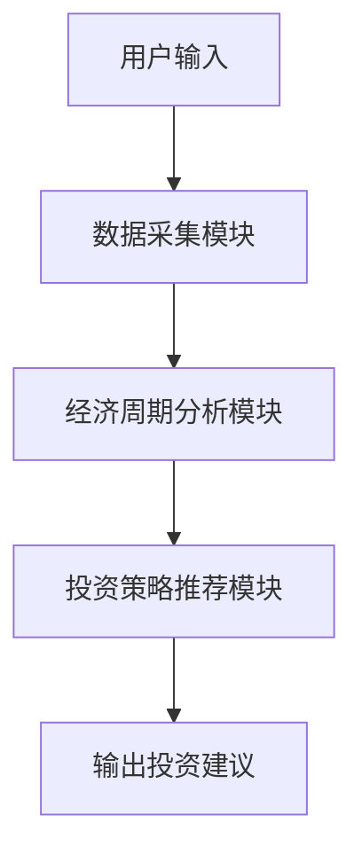

                 


# 巴菲特的经济周期投资：如何在不同阶段调整策略

> 关键词：巴菲特，经济周期，投资策略，价值投资，风险管理

> 摘要：本文将探讨巴菲特如何在不同的经济周期阶段调整其投资策略，分析其投资理念的核心要素，以及如何根据经济周期的特征优化投资组合。通过详细分析繁荣期、衰退期、复苏期和稳定期的投资策略，本文旨在为投资者提供在不同经济环境下优化投资组合的实用指导。

---

## 第一部分：经济周期与巴菲特投资策略概述

### 第1章：经济周期的基本概念

#### 1.1 经济周期的定义与阶段划分
- **经济周期的定义**：经济周期是指经济活动在时间上的波动，通常包括繁荣、衰退、复苏和稳定四个阶段。
- **经济周期的阶段划分**：
  1. **繁荣期**：经济增长迅速，市场估值高。
  2. **衰退期**：经济增长放缓，市场估值下降。
  3. **复苏期**：经济开始恢复，市场估值逐步回升。
  4. **稳定期**：经济平稳增长，市场估值合理。
- **经济周期的影响因素**：
  - 经济政策（如货币政策、财政政策）
  - 市场情绪
  - 行业基本面

#### 1.2 巴菲特投资理念的核心要素
- **巴菲特的投资哲学**：长期投资、价值投资、安全边际。
- **价值投资的定义与原则**：
  - 买入低于内在价值的股票。
  - 长期持有优质企业。
- **安全边际的概念与重要性**：通过买入价格低于内在价值的股票，确保投资的安全性。

### 第2章：巴菲特与经济周期投资策略
- **巴菲特的经济周期分析方法**：
  - 通过分析经济指标（如GDP增长率、失业率、通胀率）判断经济周期阶段。
  - 识别行业和企业的周期性特征。
- **巴菲特投资策略的演变**：
  - 根据经济周期调整投资策略，但始终坚持价值投资原则。
  - 在不同经济周期阶段，调整投资组合的行业配置和资产分配。

---

## 第二部分：不同经济周期阶段的投资策略

### 第3章：繁荣期的投资策略
- **繁荣期的市场特征**：
  - 市场估值高，股票价格可能被高估。
  - 投资者情绪乐观，市场波动率低。
- **繁荣期的投资策略调整**：
  - 选择具有强大竞争优势和良好管理的高质量企业。
  - 减少低质量股票的配置，增加防御性行业的投资。
  - 保持适度的股票集中度，避免过度分散。

### 第4章：衰退期的投资策略
- **衰退期的市场特征**：
  - 市场估值低，股票价格可能被低估。
  - 投资者情绪悲观，市场波动率高。
- **衰退期的投资策略调整**：
  - 寻找具有估值优势的企业，尤其是那些在衰退期表现稳定的行业。
  - 增加防御性行业的配置，如公用事业、医疗保健等。
  - 提高股票配置比例，抓住市场低估的机会。

### 第5章：复苏期的投资策略
- **复苏期的市场特征**：
  - 市场估值逐步回升，股票价格逐渐恢复。
  - 投资者情绪逐渐乐观，市场波动率有所下降。
- **复苏期的投资策略调整**：
  - 逐步增加股票配置，优化投资组合结构。
  - 寻找那些在复苏期表现优异的行业和企业。
  - 保持适度的分散投资，降低风险。

### 第6章：稳定期的投资策略
- **稳定期的市场特征**：
  - 市场估值合理，股票价格波动较小。
  - 投资者情绪稳定，市场波动率低。
- **稳定期的投资策略调整**：
  - 维持适度的股票配置，优化投资组合结构。
  - 寻找那些具有长期竞争优势的企业。
  - 保持长期投资的纪律性，避免短期波动影响决策。

---

## 第三部分：系统分析与架构设计

### 第7章：经济周期分析的系统架构

#### 7.1 系统功能设计
- **经济周期分析模块**：
  - 数据采集：收集经济指标（GDP、失业率、通胀率等）。
  - 数据分析：通过统计模型判断经济周期阶段。
  - 策略推荐：根据经济周期阶段推荐投资策略。

#### 7.2 系统架构设计


#### 7.3 系统接口设计
- **输入接口**：经济指标数据接口。
- **输出接口**：投资策略报告。

---

## 第四部分：项目实战

### 第8章：经济周期投资策略的实战应用

#### 8.1 环境安装
- **工具安装**：安装Python、Pandas、NumPy等工具。

#### 8.2 核心实现源代码
```python
import pandas as pd
import numpy as np

# 示例：根据GDP增长率判断经济周期阶段
def determine_economic_phase(gdp_growth):
    if gdp_growth > 4:
        return "繁荣期"
    elif gdp_growth < -2:
        return "衰退期"
    elif -2 <= gdp_growth <= 1:
        return "复苏期"
    else:
        return "稳定期"

# 示例：根据股票价格波动率调整投资策略
def adjust_strategy(stock_volatility, economic_phase):
    if stock_volatility < 0.1 and economic_phase == "稳定期":
        return "增加股票配置"
    elif stock_volatility > 0.2 and economic_phase == "衰退期":
        return "减少股票配置"
    else:
        return "保持当前配置"
```

#### 8.3 实际案例分析
- **案例1**：2008年金融危机期间，巴菲特在衰退期选择增加对银行股的投资。
- **案例2**：2020年新冠疫情期间，巴菲特在衰退期选择投资医疗保健行业。

---

## 第五部分：总结与展望

### 第9章：巴菲特投资智慧的总结
- **长期投资的重要性**：巴菲特的成功在于长期持有优质企业，而非短期交易。
- **风险管理的核心作用**：在不同经济周期阶段，通过调整投资组合优化风险管理。

### 第10章：未来投资策略的展望
- **智能化投资的趋势**：利用大数据和人工智能技术优化经济周期分析。
- **全球化投资的机遇**：在不同国家和地区的经济周期中寻找投资机会。

---

## 参考资料
- 巴菲特股东大会演讲
- 《巴菲特传》
- 《价值投资入门》
- 经济周期相关学术论文

---

通过本文的详细分析和策略建议，投资者可以更好地理解巴菲特的经济周期投资理念，并在实际投资中灵活运用这些策略，优化投资组合，实现长期稳健的投资回报。

