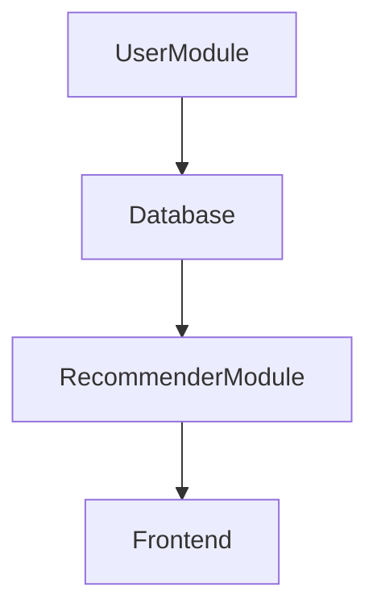

                 


# 巴菲特的经济护城河更新：平台经济时代的竞争优势

## 关键词：
- 巴菲特
- 经济护城河
- 平台经济
- 网络效应
- 数据驱动
- 竞争优势

## 摘要：
在平台经济迅速崛起的时代，传统的经济护城河理论需要与时俱进。本文探讨了巴菲特的经济护城河理论在平台经济中的新特征，分析了平台经济的商业模式和竞争优势，详细讲解了数据驱动、网络效应等关键要素在护城河构建中的作用，并通过实际案例展示了如何在平台经济时代维护和增强经济护城河。

---

## 第1章：经济护城河概述

### 1.1 经济护城河的核心要素
经济护城河是指企业竞争对手难以复制的竞争优势，包括成本优势、差异化优势和网络效应。

#### 核心概念与联系
- **成本优势**：企业以更低的成本生产高质量产品或服务。
- **差异化优势**：通过独特的产品或服务吸引用户。
- **网络效应**：用户数量增加，平台价值提升，形成正向循环。

### 1.2 平台经济时代的新特征
平台经济依赖于双边市场的网络效应和数据驱动，与传统经济护城河不同。

---

## 第2章：平台经济的商业模式分析

### 2.1 平台经济的核心要素
- **双边市场**：连接两个或多个用户群体，如买家和卖家。
- **网络效应**：用户数量越多，平台价值越高。

#### 实例分析
以淘宝为例，淘宝通过连接买家和卖家，形成双边市场，利用网络效应吸引大量用户。

---

## 第3章：数据驱动的护城河

### 3.1 数据作为核心要素
- 数据收集、存储和分析是平台经济的关键。

#### 技术实现
- 数据挖掘和机器学习算法用于分析用户行为，优化推荐系统。

### 3.2 数据安全与隐私
- 数据安全是护城河的重要部分，需加强隐私保护。

---

## 第4章：网络效应与平台生态

### 4.1 网络效应的放大作用
- 用户数量增加，平台价值提升。

#### 实例
以微信为例，用户数量的增加增强了平台的生态系统。

---

## 第5章：算法与系统架构

### 5.1 推荐算法
- 使用协同过滤算法推荐商品或内容。

#### 代码实现
```python
def collaborative_filtering(user_id):
    # 获取用户相似性
    similar_users = find_similar_users(user_id)
    # 推荐物品
    recommendations = []
    for user in similar_users:
        recommendations.extend(users[user]['items'])
    return recommendations
```

### 5.2 系统架构设计
- **用户模块**：管理用户注册、登录。
- **数据模块**：存储和处理用户数据。
- **推荐模块**：基于算法生成推荐结果。

#### 架构图


---

## 第6章：项目实战

### 6.1 环境安装
- 安装Python和相关库：numpy、pandas、scikit-learn。

### 6.2 核心代码
```python
from sklearn.metrics.pairwise import cosine_similarity

def compute_similarity(matrix):
    return cosine_similarity(matrix)
```

### 6.3 实例分析
- 以电商推荐系统为例，展示如何利用协同过滤算法提高推荐准确性。

---

## 第7章：总结与展望

### 7.1 总结
平台经济时代，经济护城河需结合数据驱动和网络效应，构建可持续的竞争优势。

### 7.2 展望
未来，人工智能和区块链技术将进一步影响平台经济，护城河构建需不断创新。

---

通过以上内容，文章详细分析了平台经济时代经济护城河的构建策略，结合实际案例和技术细节，为读者提供了深入的见解和实用的指导。

