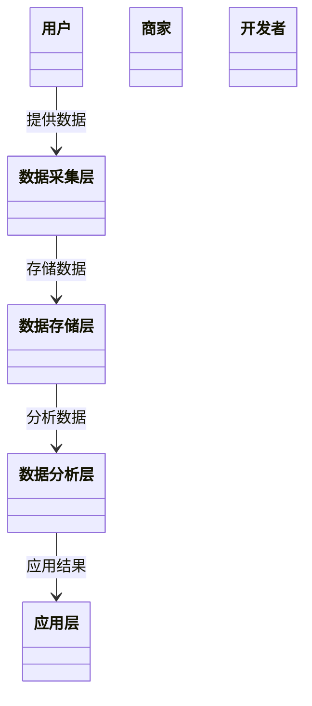

                 


# 巴菲特的经济护城河更新：数字时代的竞争优势

> 关键词：经济护城河、数字时代、竞争优势、数据分析、网络效应、系统架构、商业模式

> 摘要：本文探讨了巴菲特的经济护城河在数字时代的演变与竞争优势的重构。通过分析传统经济护城河的局限性，揭示了数据驱动、网络效应等新型护城河的重要性，并结合实际案例，提出了构建和强化数字时代经济护城河的战略与方法。

---

## # 第一部分：引言

## # 第1章：经济护城河的概念与重要性

### 1.1 经济护城河的定义

#### 1.1.1 传统经济护城河的内涵
- 成本优势：通过规模经济和经验曲线降低生产成本，形成价格竞争优势。
- 品牌优势：强大的品牌忠诚度和认知价值，吸引消费者持续选择。
- 技术优势：专利和技术壁垒防止竞争对手快速复制。

#### 1.1.2 数字时代下经济护城河的演变
- 数据驱动：数据作为新的生产要素，成为企业的核心资产。
- 网络效应：用户越多，平台价值越大，形成正反馈循环。
- 技术平台：基于AI、大数据和云技术构建的平台型护城河。

#### 1.1.3 经济护城河对企业长期价值的影响
- 护城河确保企业长期竞争优势，提升股东价值。
- 护城河的深度和广度决定企业的抗风险能力和增长潜力。

### 1.2 为什么需要更新经济护城河

#### 1.2.1 数字化转型对企业竞争优势的挑战
- 技术革新加速，传统护城河容易被复制或颠覆。
- 数字化平台的崛起，用户需求趋向个性化和实时化。

#### 1.2.2 传统护城河的局限性与失效风险
- 成本优势难以抵御新兴技术带来的颠覆。
- 品牌优势在信息碎片化时代难以有效触达用户。
- 技术优势被快速迭代和技术开源削弱。

#### 1.2.3 技术驱动下商业模式的变化对企业护城河的要求
- 数据化、智能化和平台化成为新商业模式的核心。
- 快速响应和创新能力成为护城河的重要组成部分。

---

## # 第2章：传统经济护城河的分析

### 2.1 传统经济护城河的类型

#### 2.1.1 成本优势：规模经济与经验曲线
- 规模经济：通过扩大生产规模降低单位成本。
- 经验曲线：通过积累经验和技术改进降低成本。

#### 2.1.2 品牌优势：品牌忠诚度与认知价值
- 品牌忠诚度：消费者对企业品牌的情感依赖。
- 认知价值：品牌在市场中的高端定位和形象。

#### 2.1.3 技术优势：专利与专有技术的应用
- 专利保护：通过法律手段防止技术被复制。
- 专有技术：独特的技术能力形成市场壁垒。

### 2.2 传统护城河的局限性

#### 2.2.1 技术快速迭代下的过时风险
- 新兴技术的出现使得传统技术优势迅速失效。
- 开源技术和技术共享降低了技术壁垒。

#### 2.2.2 市场竞争加剧下的可复制性
- 竞争对手通过模仿和创新快速复制传统护城河。
- 价格战和技术战使得传统成本优势难以持续。

#### 2.2.3 数字化颠覆对企业传统优势的冲击
- 数字技术改变了消费者的消费习惯和需求。
- 数字平台颠覆了传统的销售渠道和商业模式。

### 2.3 传统护城河的转型策略

#### 2.3.1 技术驱动的护城河升级路径
- 投资于人工智能和大数据技术，增强数据分析能力。
- 利用云技术构建弹性化、可扩展的IT架构。

#### 2.3.2 数字化转型中的护城河重构
- 将数据作为核心资产，建立数据中台。
- 构建以用户体验为中心的数字化平台。

#### 2.3.3 从单一优势到综合竞争优势的转变
- 综合运用成本、品牌和技术优势，形成协同效应。
- 通过创新和合作，构建多元化竞争优势。

---

## # 第3章：数字时代的新型经济护城河

### 3.1 数据驱动的护城河

#### 3.1.1 数据资产的积累与价值挖掘
- 数据收集：通过物联网、传感器等技术获取实时数据。
- 数据分析：利用大数据技术挖掘数据中的价值。

#### 3.1.2 数据分析与预测对企业决策的支持
- 数据驱动的决策：通过数据分析优化运营和营销策略。
- 预测性分析：利用机器学习预测市场趋势和用户行为。

#### 3.1.3 数据安全与隐私保护对护城河的影响
- 数据安全是数据价值的基础，确保数据资产的安全性。
- 遵守数据隐私法规，增强用户信任。

### 3.2 网络效应与平台经济

#### 3.2.1 网络效应的定义与特征
- 网络效应：用户数量的增加导致平台价值指数级增长。
- 正反馈循环：用户越多，平台越有价值，吸引更多用户。

#### 3.2.2 平台经济的商业模式
- 多边平台：同时服务多个利益相关者，创造多方共赢。
- 双边市场：通过连接不同的用户群体，创造更大的价值。

#### 3.2.3 网络效应的构建与强化
- 提供优质服务，吸引初始用户群体。
- 建立用户社区，增强用户粘性和参与度。

### 3.3 技术平台与生态系统

#### 3.3.1 技术平台的构建
- 开放API：通过开放接口吸引第三方开发者，构建生态系统。
- 平台集成：将不同技术和服务集成到统一平台，提供一站式解决方案。

#### 3.3.2 生态系统的构建与管理
- 合作伙伴管理：建立战略合作伙伴关系，共同推动平台发展。
- 用户参与：鼓励用户参与内容生成和创新，形成共创模式。

#### 3.3.3 技术平台的优势
- 快速迭代：通过敏捷开发和技术共享加速创新。
- 规模效应：平台的扩展性强，能够快速覆盖市场。

---

## # 第4章：构建数字时代经济护城河的战略

### 4.1 战略制定与实施

#### 4.1.1 明确战略目标
- 确定企业的核心竞争力和长期发展目标。
- 设定可量化的护城河建设指标。

#### 4.1.2 组织与文化的转型
- 建立数据驱动的文化，鼓励创新和试错。
- 优化组织结构，建立高效的协作机制。

#### 4.1.3 投资与创新
- 加大对人工智能、大数据等技术的投入。
- 鼓励内部创新，设立创新实验室或孵化器。

### 4.2 组织管理与创新投资

#### 4.2.1 创新管理
- 设立创新基金，支持前沿技术的研发。
- 建立创新评估机制，筛选有潜力的创新项目。

#### 4.2.2 技术与业务的融合
- 促进技术团队与业务团队的深度合作。
- 通过技术赋能业务，提升业务创新能力。

#### 4.2.3 人才培养与引进
- 加强数据科学家、技术专家的引进和培养。
- 建立灵活的人才流动机制，吸引优秀人才。

---

## # 第5章：案例分析与未来展望

### 5.1 成功案例分析

#### 5.1.1 数据驱动型护城河的案例
- 某互联网公司通过数据中台构建数据驱动的决策体系。
- 通过机器学习优化推荐算法，提升用户粘性。

#### 5.1.2 网络效应与平台经济的案例
- 某社交平台通过用户增长和内容生态构建网络效应。
- 通过API开放平台吸引第三方开发者，形成生态系统。

### 5.2 失败案例分析

#### 5.2.1 传统护城河失效的案例
- 某传统制造企业因技术落后被新兴企业取代。
- 品牌优势被竞争对手通过数字化营销快速超越。

#### 5.2.2 数字护城河构建中的挑战
- 数据安全事件对企业信用的损害。
- 平台过度依赖单一用户群体，导致市场风险。

### 5.3 未来展望与趋势

#### 5.3.1 新型护城河的发展趋势
- 数据驱动与AI技术的深度融合。
- 网络效应与生态系统的协同发展。

#### 5.3.2 未来竞争优势的关键要素
- 数据治理能力：数据的高效利用和管理。
- 技术创新能力：持续的技术突破和产品迭代。
- 用户体验设计：以用户为中心的创新设计。

---

## # 第6章：最佳实践与小结

### 6.1 最佳实践

#### 6.1.1 数据驱动的实践
- 建立数据治理体系，明确数据 ownership 和责任。
- 通过数据可视化工具提升数据洞察力。

#### 6.1.2 网络效应的实践
- 通过社区运营增强用户粘性。
- 建立激励机制，鼓励用户生成内容。

#### 6.1.3 技术平台的实践
- 通过模块化设计提高系统的可扩展性。
- 建立技术标准和规范，确保平台的兼容性。

### 6.2 小结

数字时代的经济护城河正在经历深刻的变革，数据驱动、网络效应和平台经济成为新的竞争优势。企业需要通过技术创新、组织转型和战略调整，构建适应数字时代的护城河。未来，护城河的构建将更加依赖于数据治理能力、技术创新能力和用户体验设计能力。企业必须保持敏锐的洞察力和持续的创新能力，才能在激烈的竞争中立于不败之地。

---

## # 第7章：系统架构设计与实战

### 7.1 系统架构设计

#### 7.1.1 领域模型设计
- 用户角色：用户、商家、开发者等。
- 功能模块：数据采集、存储、分析、应用。



#### 7.1.2 系统架构设计
- 分层架构：数据采集、存储、分析、应用。
- 微服务架构：模块化设计，提高系统的可扩展性和可维护性。


### 7.2 项目实战

#### 7.2.1 环境安装
- 安装Python、Jupyter Notebook、Pandas、Scikit-learn等工具。

#### 7.2.2 核心实现

```python
import pandas as pd
from sklearn import preprocessing
from sklearn.tree import DecisionTreeClassifier
from sklearn.model_selection import train_test_split
from sklearn.metrics import accuracy_score

# 加载数据
data = pd.read_csv('data.csv')

# 数据预处理
X = data.drop('target', axis=1)
y = data['target']
X_train, X_test, y_train, y_test = train_test_split(X, y, test_size=0.2)

# 特征工程
preprocessor = preprocessing.StandardScaler().fit(X_train)
X_train_scaled = preprocessor.transform(X_train)
X_test_scaled = preprocessor.transform(X_test)

# 模型训练
model = DecisionTreeClassifier().fit(X_train_scaled, y_train)

# 模型评估
y_pred = model.predict(X_test_scaled)
print("Accuracy:", accuracy_score(y_test, y_pred))
```

---

## # 第8章：总结与展望

### 8.1 总结
数字时代的经济护城河需要从数据驱动、网络效应和平台构建等多个维度进行重新定义和构建。企业需要结合自身特点，制定合理的战略和创新方向。

### 8.2 展望
随着技术的不断进步，护城河的构建将更加依赖于数据、算法和平台的能力。未来，企业需要更加注重数据治理、技术创新和用户价值的创造，才能在竞争中保持领先地位。

---

## # 参考文献

1. 巴菲特的护城河理论相关书籍
2. 数字经济与商业模式创新的研究文献
3. 人工智能与大数据技术应用的实践案例

---

以上是《巴菲特的经济护城河更新：数字时代的竞争优势》的完整目录大纲和文章内容。希望这篇技术博客文章能够为您提供清晰的思路和深入的分析，帮助您更好地理解数字时代下企业竞争优势的重构。

