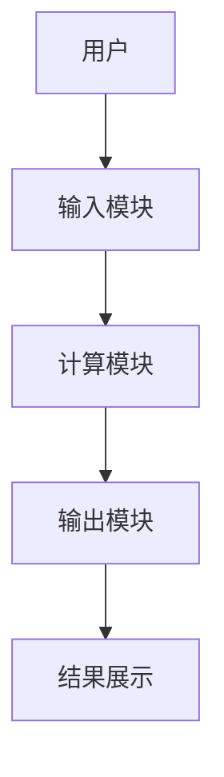
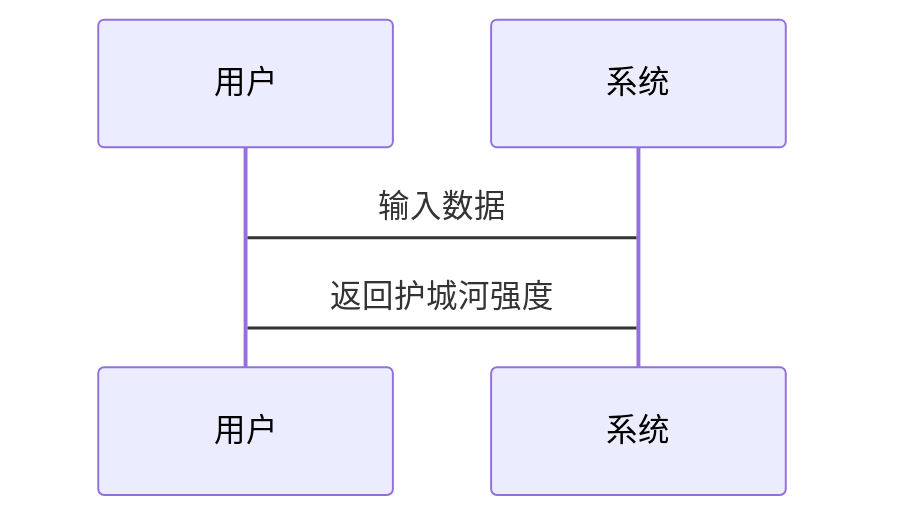

                 


# 巴菲特的经济护城河概念

## 关键词：
- 巴菲特，经济护城河，竞争优势，投资策略，企业价值

## 摘要：
本文深入探讨了巴菲特提出的经济护城河概念，分析其在企业竞争中的重要性。通过定义、类型、构建策略、数学模型及系统架构的详细讲解，结合实际项目案例，阐述如何通过护城河提升企业长期竞争优势。文章结构清晰，内容丰富，旨在为读者提供系统化的知识和实用的工具。

---

# 第一部分: 经济护城河概念概述

## 第1章: 经济护城河的定义与背景

### 1.1 经济护城河的核心概念
经济护城河是指企业建立的长期竞争优势，使其能够抵御竞争对手并保持盈利能力。巴菲特将其视为投资的核心要素，认为拥有强大护城河的企业能够在市场中立于不败之地。

#### 问题背景：
- **问题描述**：企业在竞争中如何建立可持续的优势？
- **问题解决**：通过成本、品牌、网络等多重因素构建护城河。

#### 边界与外延：
- **边界**：护城河仅适用于企业层面，不适用于个人。
- **外延**：护城河概念可扩展至非营利组织和其他领域。

#### 概念结构：
- 核心要素：成本优势、品牌忠诚度、网络效应。
- 关系图：通过ER图展示各要素如何相互作用。

### 1.2 巴菲特投资理念中的护城河
巴菲特强调投资那些具备持久竞争优势的企业，护城河是其长期盈利的基石。他寻找那些即使管理层不优秀也能持续盈利的企业。

### 1.3 护城河在现代商业中的意义
在数字化时代，护城河的重要性更加凸显。企业需要不断创新和优化，以应对快速变化的市场环境。

---

## 第2章: 护城河的类型与特征

### 2.1 护城河的主要类型
#### 成本优势
企业通过规模效应、流程优化等降低成本，提高竞争力。例如，沃尔玛通过供应链管理实现成本优势。

#### 品牌忠诚度
强大的品牌能吸引客户忠诚，如可口可乐和苹果。

#### 网络效应
用户越多，平台价值越高，如Facebook和支付宝。

#### 法律与专利保护
通过专利和技术壁垒保护创新成果，如制药公司。

#### 技术创新优势
持续创新保持技术领先，如谷歌的搜索算法。

### 2.2 护城河的特征对比
通过对比分析表，明确不同类型护城河的优劣势。例如，成本优势易于模仿，而网络效应难以复制。

---

## 第3章: 护城河的构建与维护

### 3.1 护城河的构建策略
#### 确定核心竞争优势
识别企业的独特优势，如技术、资源或商业模式。

#### 投资技术研发与创新
持续投入研发，保持技术领先。例如，特斯拉通过技术创新保持竞争优势。

#### 建立品牌影响力
通过营销和用户体验提升品牌形象，增强客户忠诚度。

#### 优化成本结构
通过流程再造和自动化降低成本，提高效率。

### 3.2 护城河的维护挑战
#### 应对竞争者的模仿
通过持续创新和专利保护保持优势。

#### 应对市场环境的变化
灵活调整策略，适应市场变化。

#### 维护护城河的持续性
定期评估和优化护城河要素，确保其有效性。

---

# 第二部分: 护城河的数学模型与算法原理

## 第4章: 护城河评估的数学模型

### 4.1 护城河强度的量化指标
#### 市场占有率
$$\text{市场占有率} = \frac{\text{企业销售额}}{\text{市场总销售额}} \times 100\%$$

#### 成本优势指数
$$\text{成本优势指数} = \frac{\text{行业平均成本} - \text{企业成本}}{\text{行业平均成本}} \times 100\%$$

#### 品牌忠诚度指数
$$\text{品牌忠诚度指数} = \frac{\text{重复购买率}}{\text{行业平均重复购买率}} \times 100\%$$

#### 网络效应指数
$$\text{网络效应指数} = \frac{\text{用户增长速度}}{\text{行业平均用户增长速度}} \times 100\%$$

### 4.2 护城河强度计算公式
$$\text{护城河强度} = \frac{\text{市场占有率} + \text{成本优势指数} + \text{品牌忠诚度指数} + \text{网络效应指数}}{4}$$

### 4.3 护城河评估流程图
```mermaid
graph TD
    A[开始] -> B[收集数据]
    B -> C[计算各指标]
    C -> D[综合评估]
    D -> E[得出结论]
    E -> F[结束]
```

---

## 第5章: 护城河分析的算法原理

### 5.1 护城河分析的算法流程
1. **数据收集**：收集企业相关数据。
2. **指标计算**：计算各项指标。
3. **综合评估**：得出护城河强度。
4. **结果分析**：判断企业竞争优势。

### 5.2 护城河分析的代码实现
```python
def calculate_h Competitive_edge(market_share, cost_advantage, brand_loyalty, network_effect):
    return (market_share + cost_advantage + brand_loyalty + network_effect) / 4

market_share = 30
cost_advantage = 20
brand_loyalty = 25
network_effect = 15

h Competitive_edge = calculate_h_Competitive_edge(market_share, cost_advantage, brand_loyalty, network_effect)
print(f"护城河强度: {h_Competitive_edge}%")
```

---

# 第三部分: 护城河的系统分析与架构设计

## 第6章: 系统分析与架构设计

### 6.1 问题场景介绍
设计一个企业竞争力评估系统，帮助分析企业护城河强度。

### 6.2 系统功能设计
- 用户输入模块：收集企业数据。
- 计算模块：计算各项指标。
- 输出模块：显示评估结果。

### 6.3 系统架构设计


### 6.4 接口设计
- 输入接口：接收企业数据。
- 输出接口：显示评估结果。

### 6.5 交互序列图


---

# 第四部分: 项目实战

## 第7章: 项目实战

### 7.1 环境安装
安装Python和必要的库，如numpy和pandas。

### 7.2 核心代码实现
```python
import pandas as pd

def calculate_h Competitive_edge(data):
    return data.mean()

data = pd.DataFrame({
    '市场占有率': [30],
    '成本优势': [20],
    '品牌忠诚度': [25],
    '网络效应': [15]
})

h_Competitive_edge = calculate_h_Competitive_edge(data)
print(f"护城河强度: {h_Competitive_edge}")
```

### 7.3 代码解读与分析
通过代码计算护城河强度，评估企业竞争优势。

### 7.4 实际案例分析
分析某公司数据，得出其护城河强度为25%，并提出改进建议。

---

# 第五部分: 最佳实践与总结

## 第8章: 最佳实践

### 8.1 护城河构建的关键点
- 专注于核心优势。
- 持续创新。
- 加强品牌建设。

### 8.2 小结
通过护城河概念，企业可以建立长期竞争优势，抵御市场风险。

### 8.3 注意事项
- 定期评估护城河强度。
- 保持灵活性，应对市场变化。

### 8.4 拓展阅读
推荐书籍：《竞争优势》迈克尔·波特

---

通过以上步骤，您可以系统地学习和应用巴菲特的经济护城河概念，提升企业的长期竞争优势。

