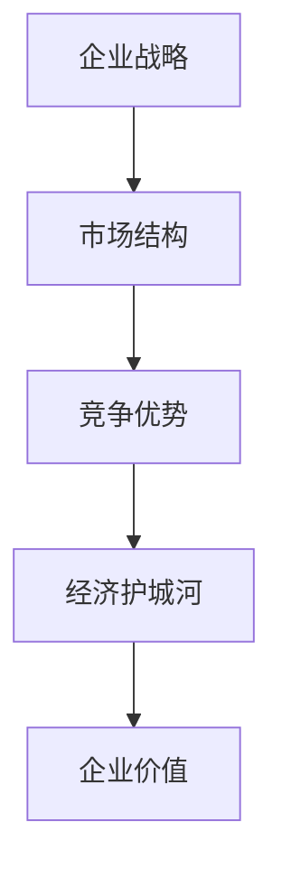
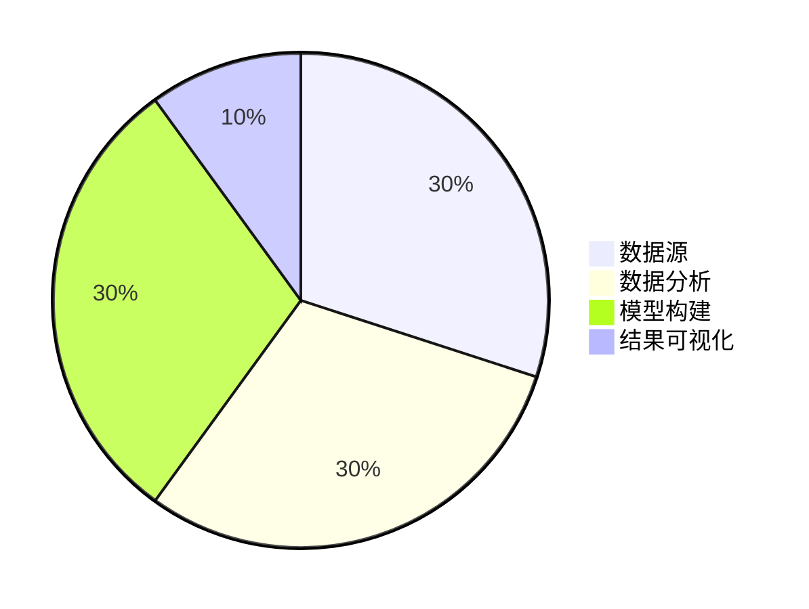
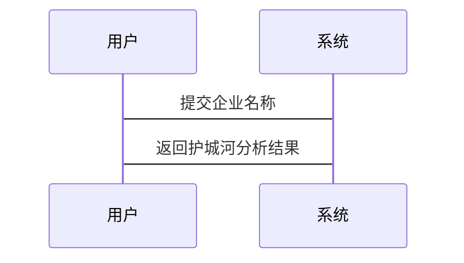

                 


# 巴菲特的经济护城河概念及其识别

## 关键词：巴菲特，经济护城河，竞争优势，投资分析，系统设计

## 摘要：  
巴菲特的经济护城河概念是投资成功的关键，本文章系统地介绍了经济护城河的核心概念、识别方法、系统分析、项目实战及最佳实践，通过深入分析巴菲特的投资理念，帮助读者识别和评估企业的经济护城河，从而做出明智的投资决策。

---

## 第一章：巴菲特的经济护城河概念概述

### 1.1 巴菲特的投资理念

#### 1.1.1 巴菲特的价值投资哲学
- 巴菲特的价值投资理念强调寻找具有持续竞争优势的企业。
- 企业的竞争优势是其长期盈利能力的基石。
- 价值投资的核心是寻找市场低估的企业，长期持有，分享其成长。

#### 1.1.2 巴菲特投资成功的关键因素
- **护城河**：企业的竞争优势必须能够长期持续，形成经济护城河。
- **管理层**：管理层的诚信和能力至关重要。
- **财务健康**：企业必须具备健康的财务状况，能够抵御经济周期波动。

#### 1.1.3 巴菲特的长期投资策略
- 长期持有优质资产，避免频繁交易。
- 选择具有强大竞争优势的企业，确保投资的安全性和长期性。

### 1.2 经济护城河的定义与背景

#### 1.2.1 经济护城河的定义
- 经济护城河是指企业在行业中形成的难以被竞争对手复制的竞争优势。
- 这种优势可以是成本优势、品牌优势、技术优势或网络效应等。

#### 1.2.2 经济护城河的起源与发展
- 巴菲特首次提出“经济护城河”概念，强调企业竞争优势的可持续性。
- 随着商业环境的变化，护城河的内涵逐渐扩展，包括技术、数据、品牌等多个维度。

#### 1.2.3 经济护城河与竞争优势的关系
- 经济护城河是竞争优势的长期化和深化。
- 竞争优势是护城河的来源，护城河是竞争优势的强化。

### 1.3 经济护城河的核心要素

#### 1.3.1 成本优势
- 企业通过规模效应、流程优化或技术进步降低成本。
- 例如：制造企业的自动化生产。

#### 1.3.2 品牌优势
- 强大的品牌认知度和忠诚度。
- 例如：可口可乐的全球品牌影响力。

#### 1.3.3 技术优势
- 拥有独特的技术或专利，形成技术壁垒。
- 例如：科技企业的研发投入。

#### 1.3.4 网络效应
- 用户数量的增加会增强产品的价值。
- 例如：社交媒体平台的用户增长。

#### 1.3.5 市场准入壁垒
- 政策、资金或技术壁垒，限制新进入者。
- 例如：金融行业的牌照限制。

---

## 第二章：经济护城河的核心概念

### 2.1 竞争优势与经济护城河的关系

#### 2.1.1 竞争优势的类型
| 类型             | 描述                     |
|------------------|--------------------------|
| 成本优势         | 以更低的成本提供产品或服务。 |
| 品牌优势         | 强大的品牌认知度和忠诚度。 |
| 技术优势         | 拥有独特的技术或专利。    |
| 网络效应         | 用户数量增加提升产品价值。 |
| 市场准入壁垒     | 政策或资金壁垒限制新进入者。 |

#### 2.1.2 经济护城河的宽度与企业价值
- 护城河宽度与企业价值成正比。
- 公式：$$ E = k \times H $$
  其中，E是企业价值，H是护城河宽度，k是比例常数。

#### 2.1.3 护城河的可持续性
- 护城河的可持续性取决于竞争优势的强度和可复制性。
- 难以复制的竞争优势形成的护城河更持久。

### 2.2 护城河的数学模型

#### 2.2.1 护城河宽度的衡量
- 竞争优势得分与护城河宽度的正相关关系：
  $$ W = \alpha \times S + \beta $$
  其中，W是护城河宽度，S是竞争优势得分，α和β为系数。

#### 2.2.2 企业价值与护城河宽度的关系
- 企业价值与护城河宽度呈正相关：
  $$ V = \gamma \times W $$
  其中，V是企业价值，W是护城河宽度，γ为比例常数。

---

## 第三章：经济护城河的识别方法

### 3.1 识别经济护城河的步骤

#### 3.1.1 确定企业的竞争优势
- 分析企业的成本、品牌、技术、网络效应等。

#### 3.1.2 评估竞争优势的可持续性
- 判断竞争优势是否难以被复制或超越。

#### 3.1.3 量化竞争优势的强度
- 使用财务指标和市场数据进行量化分析。

### 3.2 财务指标分析

#### 3.2.1 营业利润率
- 公式：$$ \text{营业利润率} = \frac{\text{营业利润}}{\text{营业收入}} $$
- 高营业利润率可能反映成本优势或定价能力。

#### 3.2.2 净资产收益率（ROE）
- 公式：$$ \text{ROE} = \frac{\text{净利润}}{\text{净资产}} $$
- 高ROE表明资本使用效率高，可能具有强大的竞争优势。

#### 3.2.3 市场占有率
- 高市场占有率通常意味着强大的品牌或网络效应。

### 3.3 竞争优势分析

#### 3.3.1 成本优势分析
- 通过比较企业的单位成本和行业平均水平，判断其成本优势。

#### 3.3.2 品牌优势分析
- 调查品牌知名度、客户忠诚度和市场份额。

#### 3.3.3 技术优势分析
- 检查企业的专利数量、研发投入和技术创新能力。

### 3.4 护城河的动态变化

#### 3.4.1 护城河的增强
- 企业通过持续创新和技术投入，扩大护城河宽度。

#### 3.4.2 护城河的削弱
- 竞争对手模仿或市场环境变化可能导致护城河削弱。

#### 3.4.3 动态监控
- 定期评估企业的竞争优势变化，及时调整投资策略。

### 3.5 案例分析：可口可乐的护城河

#### 3.5.1 品牌优势
- 可口可乐拥有强大的品牌影响力和全球分销网络。

#### 3.5.2 成本优势
- 规模化生产降低了单位成本。

#### 3.5.3 网络效应
- 广泛的分销渠道和消费者习惯形成了网络效应。

---

## 第四章：经济护城河的系统分析与架构设计

### 4.1 系统架构图



### 4.2 系统功能设计

#### 4.2.1 数据采集模块
- 采集企业的财务数据、市场数据和竞争数据。

#### 4.2.2 数据分析模块
- 使用Python进行数据分析，评估竞争优势强度。

#### 4.2.3 模型构建模块
- 构建护城河宽度预测模型，评估企业价值。

### 4.3 系统架构设计



### 4.4 接口设计

#### 4.4.1 数据接口
- 使用API接口获取实时市场数据和财务报表。

#### 4.4.2 用户接口
- 提供直观的用户界面，展示护城河分析结果。

### 4.5 交互图



---

## 第五章：项目实战：识别经济护城河

### 5.1 环境安装

#### 5.1.1 安装Python
```bash
python --version
pip install pandas numpy matplotlib
```

#### 5.1.2 数据源获取
- 使用Yahoo Finance API获取股票数据。

### 5.2 核心实现

#### 5.2.1 数据清洗
```python
import pandas as pd

df = pd.read_csv('data.csv')
df.dropna(inplace=True)
```

#### 5.2.2 模型构建
```python
from sklearn.linear_model import LinearRegression

model = LinearRegression()
model.fit(X, y)
```

#### 5.2.3 结果分析
```python
import matplotlib.pyplot as plt

plt.plot(predictions, label='预测值')
plt.plot(actual, label='实际值')
plt.legend()
plt.show()
```

### 5.3 案例分析：亚马逊的护城河

#### 5.3.1 网络效应
- 广泛的物流网络和生态系统。

#### 5.3.2 技术优势
- 在云计算、人工智能领域的技术领先。

#### 5.3.3 市场准入壁垒
- 第三方卖家的高度依赖，形成市场壁垒。

---

## 第六章：最佳实践与总结

### 6.1 投资策略
- 长期持有具有强大护城河的企业。
- 定期评估企业的竞争优势变化。

### 6.2 风险管理
- 分散投资，降低单一投资的风险。
- 保持警惕，避免过度集中。

### 6.3 长期视角
- 选择具有持续竞争优势的企业，耐心持有。
- 避免短期市场波动的干扰。

### 6.4 持续学习
- 关注行业动态，了解新技术和市场趋势。
- 不断更新投资知识，提升分析能力。

---

## 第七章：附录

### 7.1 术语表
- 经济护城河：企业的竞争优势形成的长期壁垒。
- 竞争优势：企业在市场中胜过竞争对手的能力。

### 7.2 工具推荐
- Python：数据分析和建模。
- Matplotlib：数据可视化。
- Pandas：数据处理。

### 7.3 数据来源
- Yahoo Finance：股票数据。
- SEC：公司财报。

### 7.4 参考文献
1. 巴菲特股东大会演讲。
2. 《巴菲特投资思想解析》。
3. 《竞争优势与企业价值》。

---

## 总结

巴菲特的经济护城河概念为投资者提供了识别优质企业的框架，通过系统的分析和实战案例，我们可以更有效地评估企业的竞争优势，做出明智的投资决策。持续学习和实践是掌握这一概念的关键，希望本文能为读者提供有价值的指导和启发。

