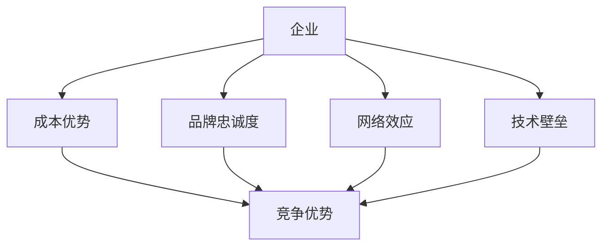
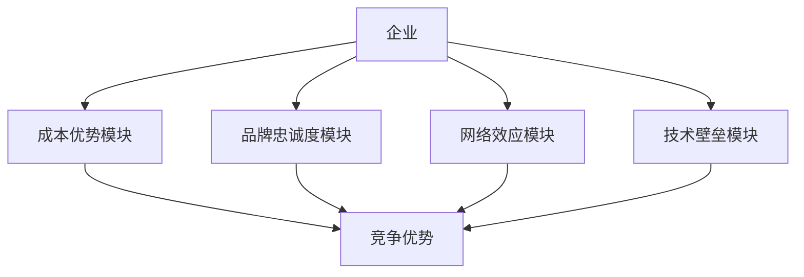

                 


# 巴菲特的经济护城河概念：寻找持久竞争优势

## 关键词：
经济护城河，巴菲特，竞争优势，企业战略，投资分析

## 摘要：
本文深入探讨了巴菲特提出的经济护城河概念，分析其在IT领域的应用与实践。通过系统性地拆解经济护城河的核心要素，结合实际案例和系统架构设计，详细阐述了如何利用经济护城河理论构建企业的持久竞争优势。文章从背景介绍、核心概念、算法原理、数学模型、系统分析、项目实战到最佳实践，层层递进，为读者提供了一套完整的经济护城河分析与实践方法论。

---

## 第一部分：经济护城河的背景与核心概念

### 第1章：经济护城河的背景与核心概念

#### 1.1 经济护城河的起源与定义
- **1.1.1 巴菲特投资理念的起源**  
  巴菲特的投资理念起源于价值投资理论，他强调寻找具有持续竞争优势的企业，而这种竞争优势的核心就是“经济护城河”。经济护城河是指企业在行业内长期保持竞争优势的能力，这种能力可以通过成本优势、品牌忠诚度、网络效应或技术壁垒等形式表现出来。

- **1.1.2 经济护城河的核心定义**  
  经济护城河是指企业在市场上难以被竞争对手复制或超越的竞争优势，这种优势可以保护企业免受竞争冲击，从而确保其长期盈利能力。经济护城河的核心在于其可持续性和可扩展性。

- **1.1.3 护城河的边界与外延**  
  经济护城河的边界包括企业的核心竞争力、市场地位和资源储备。其外延则涉及企业的商业模式、技术发展和组织能力等方面。

#### 1.2 经济护城河的核心要素
- **1.2.1 成本优势**  
  成本优势是经济护城河的重要组成部分，企业通过优化生产流程、规模化生产和供应链管理，能够在市场上提供更具竞争力的价格。

- **1.2.2 品牌忠诚度**  
  强大的品牌忠诚度意味着消费者更倾向于选择该品牌的产品或服务，从而为企业提供了持续的市场需求和定价能力。

- **1.2.3 网络效应**  
  网络效应是指随着用户数量的增加，产品的价值也随之增加。这种效应能够形成强大的市场壁垒，阻止竞争对手的入侵。

- **1.2.4 技术壁垒**  
  技术壁垒是通过专利、专有技术和研发能力形成的竞争优势，能够有效防止竞争对手在短期内复制企业的技术和产品。

#### 1.3 经济护城河的竞争优势来源
- **1.3.1 护城河的直接竞争优势**  
  直接竞争优势是指企业在产品性能、价格或服务质量上的优势，这些优势能够直接吸引客户并扩大市场份额。

- **1.3.2 护城河的间接竞争优势**  
  间接竞争优势包括企业通过品牌影响力、供应链控制和合作伙伴关系等形成的竞争优势，这些优势能够间接支持企业的市场地位。

- **1.3.3 护城河的动态竞争优势**  
  动态竞争优势是指企业能够根据市场变化不断调整和优化其护城河的能力，这种能力使企业能够在竞争中保持灵活性和创新性。

#### 1.4 经济护城河的企业战略意义
- **1.4.1 护城河与企业长期盈利能力**  
  经济护城河是企业长期盈利能力的重要保障，能够帮助企业抵御市场波动和竞争压力。

- **1.4.2 护城河与企业防御性竞争优势**  
  经济护城河能够为企业提供防御性竞争优势，使其在面对竞争对手时更具抵抗力。

- **1.4.3 护城河与企业估值的关系**  
  企业的经济护城河越强，其估值往往越高，因为投资者更愿意为具有持续竞争优势的企业支付更高的价格。

---

## 第二部分：经济护城河的核心概念与联系

### 第2章：经济护城河的核心概念与联系

#### 2.1 经济护城河的原理分析
- **2.1.1 护城河的经济学原理**  
  经济护城河的形成依赖于市场结构、成本曲线和竞争格局等因素。企业通过优化资源 allocation和提升效率，能够在市场上形成竞争优势。

- **2.1.2 护城河的市场结构分析**  
  市场结构包括垄断竞争、寡头垄断和完全竞争等类型。在不同的市场结构中，经济护城河的形成机制和表现形式也有所不同。

- **2.1.3 护城河的竞争优势模型**  
  经济护城河的竞争优势模型包括成本优势、品牌忠诚度、网络效应和技术壁垒等要素，这些要素共同构成了企业的竞争优势。

#### 2.2 经济护城河的核心属性特征对比
- **2.2.1 成本优势 vs. 网络效应**  
  成本优势是基于企业的生产效率和资源 allocation，而网络效应则依赖于用户数量和产品价值的相互作用。

- **2.2.2 品牌忠诚度 vs. 技术壁垒**  
  品牌忠诚度是基于消费者对品牌的信任和偏好，而技术壁垒则依赖于企业的技术积累和创新能力。

- **2.2.3 竞争优势的可持续性 vs. 竞争优势的可模仿性**  
  可持续性竞争优势能够长期为企业提供保护，而可模仿性竞争优势则可能被竞争对手快速复制。

#### 2.3 经济护城河的ER实体关系图


---

## 第三部分：经济护城河的算法与数学模型

### 第3章：经济护城河的算法与数学模型

#### 3.1 经济护城河的算法原理
- **3.1.1 护城河宽度量化算法**  
  通过量化企业的竞争优势，评估其护城河的宽度。具体步骤包括数据采集、特征提取、权重分配和结果计算。

#### 3.2 经济护城河的数学模型
- **3.2.1 加权评分模型**  
  使用加权评分法对企业的护城河进行量化评估，公式为：  
  $$ \text{护城河评分} = \sum (\text{特征权重} \times \text{特征得分}) $$

#### 3.3 经济护城河的Python实现
```python
def calculate_h护城河评分(enterprise_data):
    features = ['成本优势', '品牌忠诚度', '网络效应', '技术壁垒']
    weights = [0.3, 0.3, 0.2, 0.2]
    scores = []
    for feature in features:
        scores.append(enterprise_data[feature] * weights[features.index(feature)])
    return sum(scores)

# 示例数据
enterprise_data = {
    '成本优势': 90,
    '品牌忠诚度': 85,
    '网络效应': 80,
    '技术壁垒': 75
}

print(calculate_h护城河评分(enterprise_data))
```

#### 3.4 经济护城河的数学公式与解读
- **3.4.1 竞争优势计算公式**  
  $$ \text{竞争优势} = \frac{\text{护城河评分}}{\text{行业平均评分}} \times 100 $$  
  其中，护城河评分基于企业的核心竞争力，行业平均评分是行业内企业的平均评分。

---

## 第四部分：经济护城河的系统分析与设计

### 第4章：经济护城河的系统分析与设计

#### 4.1 经济护城河的系统分析
- **4.1.1 系统问题场景介绍**  
  企业如何通过系统化的分析和设计，构建具有经济护城河的竞争优势。

#### 4.2 经济护城河的系统架构设计


---

## 第五部分：经济护城河的项目实战

### 第5章：经济护城河的项目实战

#### 5.1 项目环境安装
- 安装Python和必要的库（如numpy、pandas、scikit-learn）。

#### 5.2 核心代码实现
```python
import numpy as np
import pandas as pd

def calculate_h护城河评分(df):
    features = ['成本优势', '品牌忠诚度', '网络效应', '技术壁垒']
    weights = [0.3, 0.3, 0.2, 0.2]
    df['护城河评分'] = df[features].apply(lambda x: np.dot(x, weights))
    return df

# 示例数据
data = {
    '企业': ['A', 'B', 'C', 'D'],
    '成本优势': [90, 85, 80, 75],
    '品牌忠诚度': [85, 80, 75, 70],
    '网络效应': [80, 75, 70, 65],
    '技术壁垒': [75, 70, 65, 60]
}

df = pd.DataFrame(data)
result = calculate_h护城河评分(df)
print(result)
```

---

## 第六部分：经济护城河的最佳实践与小结

### 第6章：经济护城河的最佳实践与小结

#### 6.1 最佳实践
- **定期评估护城河**：企业应定期评估其护城河的宽度和深度，确保竞争优势的持续性。
- **关注竞争对手**：密切关注竞争对手的动态，及时调整企业战略。
- **创新与优化**：通过技术创新和流程优化，不断提升企业的竞争优势。

#### 6.2 小结
经济护城河是企业长期竞争优势的核心，通过系统化的分析和实践，企业可以有效构建和维护其经济护城河，确保在激烈的市场竞争中立于不败之地。

---

通过以上思考过程，我们系统性地拆解了巴菲特的经济护城河概念，从理论到实践，从分析到设计，为读者提供了一套完整的经济护城河分析与实践方法论。

