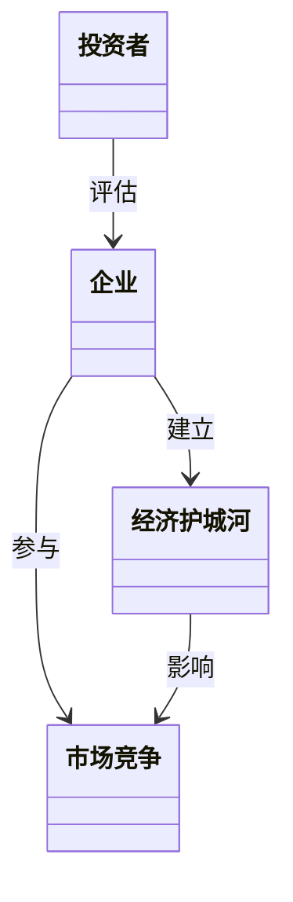
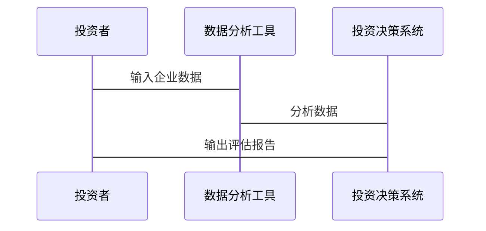

                 


# 巴菲特的经济护城河概念：寻找长期优势

> 关键词：巴菲特、经济护城河、投资策略、长期优势、企业分析、投资决策、风险管理

> 摘要：本文深入探讨了巴菲特的经济护城河概念，分析了其对企业长期竞争优势的影响，并结合实际案例展示了如何将这一理念应用于投资决策中。文章通过系统化的分析和详细的案例研究，揭示了经济护城河在投资中的重要性，为投资者提供了科学的决策依据。

---

## 第一部分：经济护城河的基本概念

### 1.1 经济护城河的定义与背景

#### 1.1.1 经济护城河的定义
经济护城河（Economic Moat）是巴菲特投资理念中的核心概念，指企业在行业中建立的长期竞争优势，能够有效防止竞争对手的侵蚀。这种优势可以是成本优势、品牌影响力、技术壁垒或网络效应等，使企业在市场中保持领先地位。

#### 1.1.2 巴菲特投资理念的背景
巴菲特的投资策略以价值投资为核心，注重企业的长期盈利能力。他认为，一个拥有强大经济护城河的企业能够在竞争中立于不败之地，从而为投资者带来稳定的回报。

#### 1.1.3 经济护城河的核心作用
经济护城河的作用在于为企业提供防御机制，防止竞争对手的侵袭，同时为企业创造超额利润。它不仅保护企业的市场份额，还能增强企业的定价能力。

### 1.2 经济护城河的类型与特征

#### 1.2.1 成本优势
成本优势是指企业能够以低于竞争对手的价格生产产品或提供服务，从而在价格战中占据优势。例如，低成本制造模式或规模经济效应。

#### 1.2.2 网络效应
网络效应是指产品或服务的价值随着用户数量的增加而增加，例如社交平台或操作系统。这种效应使得新进入者难以挑战现有企业的主导地位。

#### 1.2.3 品牌忠诚度
强大的品牌影响力能够吸引并留住客户，形成客户粘性。品牌忠诚度高的企业通常具有更高的定价能力和市场影响力。

#### 1.2.4 技术壁垒
技术壁垒通过专利、专有技术或复杂工艺为企业提供竞争优势，防止竞争对手轻易复制。

---

## 第二部分：巴菲特投资理念与经济护城河

### 2.1 巴菲特投资策略的核心

#### 2.1.1 价值投资的定义
价值投资是一种投资策略，强调以低于内在价值的价格购买优质资产。巴菲特的价值投资理念注重企业的基本面分析和长期竞争优势。

#### 2.1.2 长期投资的重要性
长期投资能够使投资者充分享受企业成长的成果，避免短期市场波动的干扰。巴菲特认为，投资的最终目标是寻找那些能够持续创造价值的企业。

#### 2.1.3 经济护城河在巴菲特投资中的地位
经济护城河是巴菲特评估企业投资价值的关键因素。他倾向于投资那些具有强大护城河的企业，因为这些企业能够抵御竞争压力，保持长期盈利能力。

### 2.2 巴菲特选股标准

#### 2.2.1 高ROE（净资产收益率）
ROE是衡量企业盈利能力的重要指标。巴菲特倾向于投资ROE持续较高的企业，因为这表明企业能够有效利用资本创造利润。

#### 2.2.2 强大的竞争优势
竞争优势是企业长期盈利能力的保障。巴菲特注重企业的市场地位、品牌影响力和技术壁垒等竞争优势。

#### 2.2.3 可持续的盈利能力
企业需要具备持续盈利能力，这通常与稳定的市场需求和高效的运营能力相关。巴菲特倾向于投资那些能够持续盈利的企业。

---

## 第三部分：经济护城河的构建与分析

### 3.1 企业如何构建经济护城河

#### 3.1.1 通过技术创新建立护城河
技术创新是企业建立护城河的重要手段。通过持续研发和创新，企业能够保持技术领先，防止竞争对手模仿。

#### 3.1.2 通过市场垄断地位建立护城河
市场垄断地位能够为企业提供强大的定价能力。例如，某些行业中的寡头垄断企业能够通过市场支配地位获得超额利润。

#### 3.1.3 通过品牌影响力巩固护城河
强大的品牌影响力能够增强客户忠诚度，形成市场壁垒。品牌不仅影响消费者的购买决策，还能为企业带来溢价能力。

### 3.2 经济护城河的评估方法

#### 3.2.1 五力分析模型（波特竞争理论）
五力分析模型包括新进入者的威胁、替代品的威胁、供应商的议价能力、买家的议价能力和现有竞争者之间的竞争程度。通过分析这些因素，可以评估企业的竞争优势。

#### 3.2.2 SWOT分析
SWOT分析（优势、劣势、机会、威胁）帮助企业识别内部优势和劣势，以及外部机会和威胁，从而制定有效的战略。

#### 3.2.3 市场份额与利润率分析
市场份额和利润率是衡量企业竞争力的重要指标。高市场份额和稳定的利润率表明企业具有强大的市场地位和盈利能力。

---

## 第四部分：经济护城河的系统分析与投资策略

### 4.1 投资决策的系统架构

#### 4.1.1 问题场景介绍
在投资决策中，投资者需要评估企业的竞争优势，判断其是否具备长期盈利能力。经济护城河分析是其中的重要环节。

#### 4.1.2 领域模型（Mermaid 类图）


#### 4.1.3 系统架构设计（Mermaid 架构图）
```mermaid
architecturalDiagram
    领域: 投资者, 企业, 市场竞争, 经济护城河
    技术: 数据分析工具, 投资决策系统
    投资者 --|> 数据分析工具: 使用
    企业 --|> 数据分析工具: 分析
    数据分析工具 --|> 投资决策系统: 提供数据
    投资决策系统 --|> 投资者: 生成报告
```

#### 4.1.4 系统接口设计
系统接口包括数据输入、分析模块调用和结果输出。投资者通过用户界面输入企业数据，系统调用分析模块，生成评估报告并返回给投资者。

#### 4.1.5 系统交互（Mermaid 序列图）


### 4.2 投资策略的算法原理

#### 4.2.1 投资回报率计算公式
$$ ROI = \frac{净利润}{投资成本} \times 100\% $$

#### 4.2.2 风险评估模型
$$ 风险系数 = \frac{波动率}{平均回报率} $$

---

## 第五部分：项目实战与最佳实践

### 5.1 项目实战：环境安装与核心实现

#### 5.1.1 环境安装
需要安装数据分析工具（如Python、Pandas、Matplotlib）和投资决策系统（如Excel、Tableau）。

#### 5.1.2 核心实现
使用Python代码实现经济护城河评估系统的核心模块，包括数据采集、分析和报告生成。

#### 5.1.3 代码应用解读与分析
以下是Python代码示例：
```python
import pandas as pd
import numpy as np

# 示例数据
data = {
    '公司': ['A', 'B', 'C'],
    'ROE': [0.2, 0.15, 0.18],
    '市场份额': [0.3, 0.2, 0.25],
    '利润率': [0.25, 0.15, 0.2]
}

df = pd.DataFrame(data)

# 计算经济护城河指数
df['经济护城河指数'] = df[['ROE', '市场份额', '利润率']].mean(axis=1)

print(df)
```

### 5.2 项目小结与最佳实践

#### 5.2.1 项目小结
通过项目实战，读者可以掌握经济护城河评估的基本方法，学会使用数据分析工具进行投资决策。

#### 5.2.2 最佳实践
- **持续学习**：关注行业动态，了解最新投资策略。
- **风险控制**：合理分散投资，避免过度集中。
- **长期视角**：坚持价值投资，避免短期波动干扰。

---

## 总结与展望

经济护城河是巴菲特投资理念的核心，它不仅帮助企业建立长期竞争优势，也为投资者提供了科学的决策依据。通过系统化的分析和实际案例的分析，我们可以更好地理解和应用这一概念。未来，随着市场的变化和技术的进步，经济护城河的概念将不断演变，投资者需要持续学习和适应，以抓住新的投资机会。

