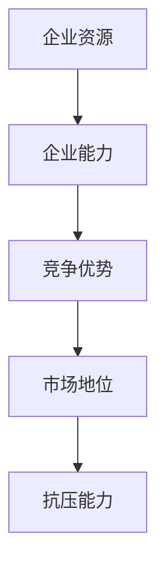
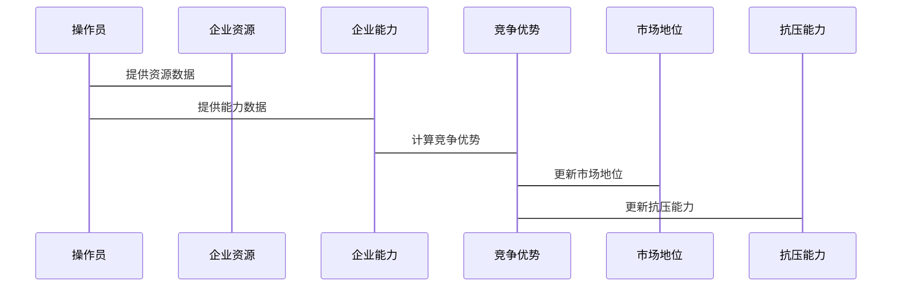

                 


# 巴菲特的经济护城河理论：如何识别持久竞争优势

> 关键词：巴菲特，经济护城河，可持续竞争优势，企业价值，投资策略

> 摘要：本文系统地介绍了巴菲特的经济护城河理论，从理论背景、核心概念、数学模型、系统分析到项目实战，层层剖析了如何识别和构建企业的持久竞争优势。通过丰富的图表、公式和案例分析，帮助读者全面理解并掌握这一经典投资理论。

---

# 第一部分: 巴菲特的经济护城河理论概述

## 第1章: 经济护城河的核心概念

### 1.1 经济护城河的定义与背景

#### 1.1.1 什么是经济护城河
经济护城河是巴菲特提出的一种投资理论，指企业在市场竞争中所拥有的独特优势，使其能够长期保持高于平均水平的利润率。这种优势可以是成本优势、差异化优势、网络效应或无形资产。

#### 1.1.2 护城河的起源与演变
护城河理论起源于巴菲特的价值投资理念，强调寻找具有持久竞争优势的企业。随着市场竞争的加剧，护城河的内涵逐渐扩展，从最初的低成本生产模式发展到涵盖网络效应、品牌忠诚度等多种形式。

#### 1.1.3 护城河在投资中的重要性
在投资决策中，护城河是评估企业长期价值的关键指标。具有强大护城河的企业能够抵御竞争压力，持续为股东创造价值。

### 1.2 护城河的核心要素

#### 1.2.1 可持续竞争优势的来源
- 成本优势：企业通过规模效应或技术创新降低成本。
- 差异化优势：通过独特的产品或服务吸引客户。
- 网络效应：用户数量增加带来的边际成本递减。
- 无形资产：品牌、专利、许可证等。

#### 1.2.2 护城河的四种类型
| 类型         | 描述                                                                 |
|--------------|----------------------------------------------------------------------|
| 成本优势     | 企业能够以低于竞争对手的成本提供产品或服务。                     |
| 差异化优势   | 企业提供独特的产品或服务，满足特定客户群体的需求。               |
| 网络效应     | 用户数量的增加会增强产品的价值，形成正反馈循环。                 |
| 无形资产     | 品牌、专利、许可证等无法被轻易复制的资产。                       |

#### 1.2.3 护城河的边界与外延
护城河的边界包括企业内部资源、外部环境和行业特征。外延则涉及企业战略、组织文化和执行力。

### 1.3 护城河与企业价值的关系

#### 1.3.1 护城河宽度与企业价值的关系
护城河宽度决定了企业竞争优势的持久性。宽度越宽，企业价值越高。

#### 1.3.2 护城河深度与企业抗压能力的影响
护城河深度决定了企业在面对竞争时的抗压能力。深度越深，企业的抗压能力越强。

#### 1.3.3 护城河的动态变化与企业战略调整
护城河的宽度和深度会随时间发生变化，企业需要通过持续创新和优化战略来维持护城河。

---

## 第2章: 护城河理论的核心概念与联系

### 2.1 护城河理论的核心原理

#### 2.1.1 可持续竞争优势的数学模型
$$\text{竞争优势} = \frac{\text{独特资源}}{\text{市场竞争程度}}$$

#### 2.1.2 护城河宽度与企业市场地位的关系
$$\text{护城河宽度} = \frac{\text{竞争对手模仿成本}}{\text{企业成本优势}}$$

#### 2.1.3 护城河深度与企业抗压能力的公式
$$\text{护城河深度} = \text{企业差异化优势} \times \text{客户忠诚度}$$

### 2.2 护城河类型对比分析

#### 2.2.1 成本优势 vs 差异化优势
| 特性         | 成本优势               | 差异化优势             |
|--------------|-----------------------|-----------------------|
| 适用场景     | 标准化产品             | 非标准化产品           |
| 竞争策略     | 低成本扩张             | 高端市场差异化         |

#### 2.2.2 网络效应 vs 无形资产
| 特性         | 网络效应               | 无形资产             |
|--------------|-----------------------|-----------------------|
| 依赖因素     | 用户数量               | 品牌、专利             |
| 可持续性     | 随用户增长而增强       | 需要持续投入和维护     |

### 2.3 护城河实体关系图

```mermaid
er
classDiagram
    class 经济护城河 {
        竞争优势
        市场地位
        抗压能力
    }
    class 可持续竞争优势 {
        成本优势
        差异化优势
        网络效应
        无形资产
    }
    经济护城河 <-- 关联 --> 可持续竞争优势
```

---

## 第3章: 护城河理论的数学模型与公式

### 3.1 护城河宽度的衡量公式

#### 3.1.1 护城河宽度计算公式
$$\text{护城河宽度} = \frac{\text{竞争对手模仿成本}}{\text{企业成本优势}}$$

#### 3.1.2 示例计算
$$\text{护城河宽度} = \frac{100}{20} = 5$$

### 3.2 护城河深度的数学模型

#### 3.2.1 护城河深度公式
$$\text{护城河深度} = \text{企业差异化优势} \times \text{客户忠诚度}$$

#### 3.2.2 示例计算
$$\text{护城河深度} = 0.8 \times 0.9 = 0.72$$

### 3.3 护城河的动态变化模型

#### 3.3.1 动态变化公式
$$\Delta \text{护城河深度} = \text{企业创新速度} - \text{行业变化速度}$$

#### 3.3.2 示例计算
$$\Delta \text{护城河深度} = 0.12 - 0.1 = 0.02$$

---

## 第4章: 护城河理论的系统分析与架构设计

### 4.1 系统分析

#### 4.1.1 问题场景介绍
如何识别和评估企业的护城河，以确定其持久竞争优势。

#### 4.1.2 项目介绍
护城河识别与评估系统，旨在帮助企业分析和优化其竞争优势。

### 4.2 系统功能设计

#### 4.2.1 领域模型
```mermaid
classDiagram
    class 企业 {
        资源
        能力
        战略
    }
    class 市场环境 {
        竞争对手
        客户需求
        行业趋势
    }
    企业 <-- 关联 --> 市场环境
```

#### 4.2.2 系统架构设计


#### 4.2.3 系统接口设计
- 输入接口：企业资源、能力、战略。
- 输出接口：竞争优势分析、市场地位评估、抗压能力报告。

#### 4.2.4 系统交互设计


---

## 第5章: 项目实战——护城河识别与评估

### 5.1 环境安装与工具准备

#### 5.1.1 环境安装
- 安装Python和相关库（如NumPy、Pandas、Matplotlib）。
- 安装Mermaid工具用于绘制图表。

#### 5.1.2 工具推荐
- 使用Jupyter Notebook进行数据分析。
- 使用Excel或Google Sheets进行简单的数据可视化。

### 5.2 系统核心实现源代码

#### 5.2.1 护城河宽度计算代码

```python
def calculate_hoarding_width(costume_competition, cost_advantage):
    return costume_competition / cost_advantage

# 示例数据
costume_competition = 100
cost_advantage = 20
print("护城河宽度 =", calculate_hoarding_width(costume_competition, cost_advantage))
```

#### 5.2.2 护城河深度计算代码

```python
def calculate_hoarding_depth(differentiation_advantage, customer_loyalty):
    return differentiation_advantage * customer_loyalty

# 示例数据
differentiation_advantage = 0.8
customer_loyalty = 0.9
print("护城河深度 =", calculate_hoarding_depth(differentiation_advantage, customer_loyalty))
```

### 5.3 实际案例分析

#### 5.3.1 案例：亚马逊的护城河

- **成本优势**：亚马逊通过规模效应和自动化降低运营成本。
- **网络效应**：亚马逊的Prime会员服务形成强大的网络效应。
- **无形资产**：亚马逊的品牌和技术专利。

#### 5.3.2 案例：可口可乐的护城河

- **成本优势**：全球供应链优化降低成本。
- **品牌忠诚度**：强大的品牌影响力和客户忠诚度。
- **网络效应**：广泛的分销网络和合作伙伴关系。

### 5.4 代码应用解读与分析

#### 5.4.1 护城河宽度计算结果解读
- 宽度为5，表示亚马逊的成本优势是竞争对手的5倍。

#### 5.4.2 护城河深度计算结果解读
- 深度为0.72，表示亚马逊的差异化优势和客户忠诚度结合良好。

---

## 第6章: 最佳实践与小结

### 6.1 最佳实践

#### 6.1.1 投资者视角
- 选择具有强大护城河的企业进行投资。
- 定期评估护城河的宽度和深度。

#### 6.1.2 企业管理者视角
- 通过创新和优化构建和强化护城河。
- 定期评估和调整企业战略。

### 6.2 小结
护城河理论是巴菲特投资哲学的核心，通过识别和评估企业的护城河，投资者和企业管理者可以更好地做出决策。

### 6.3 注意事项
- 护城河的宽度和深度需要动态评估。
- 需要结合企业实际和市场环境进行分析。

### 6.4 拓展阅读
- 《巴菲特传》
- 《投资之道》
- 《竞争优势》

---

通过以上章节的详细讲解，读者可以全面理解巴菲特的经济护城河理论，并将其应用于实际投资和企业管理中。

