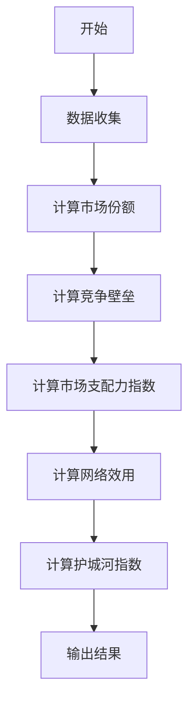
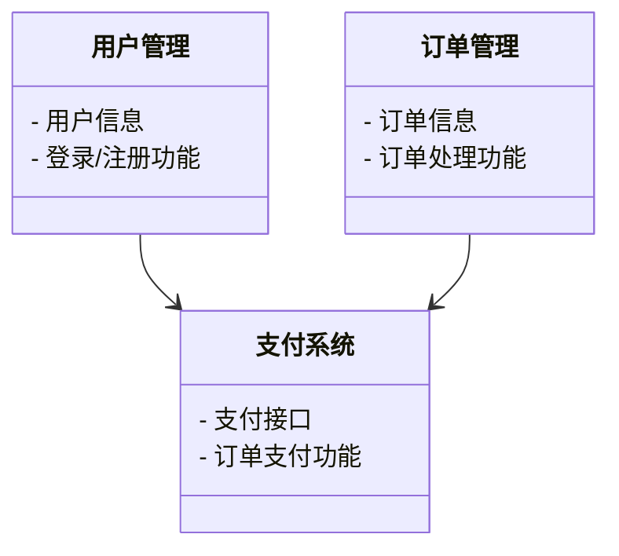
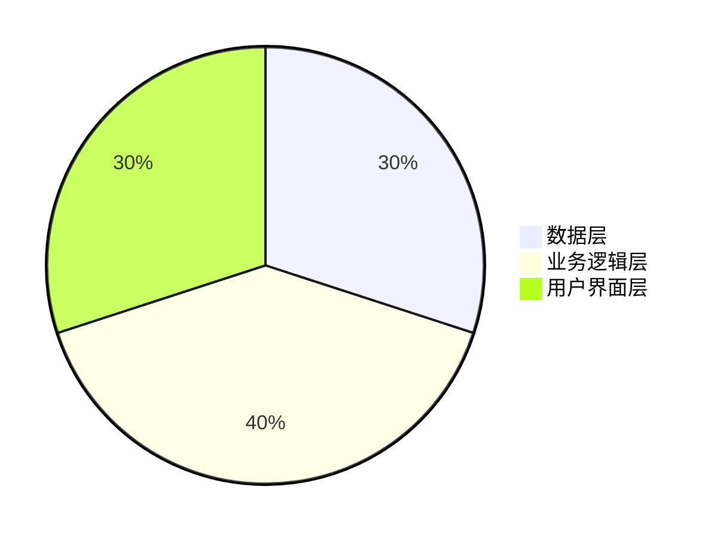
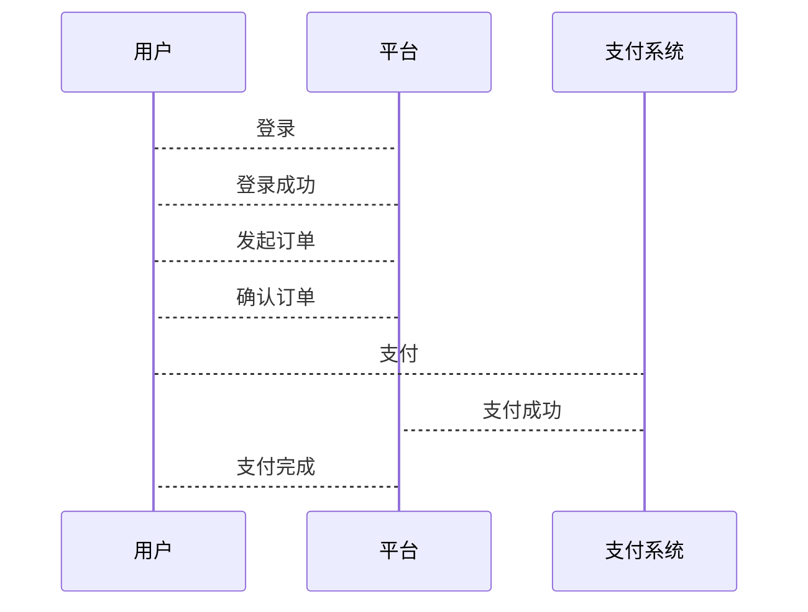

                 


# 目录大纲：《巴菲特的经济护城河理论：平台经济时代的新定义》

---

# 第一部分：引言

## 第1章：巴菲特的经济护城河理论概述

### 1.1 经济护城河的定义与背景

#### 1.1.1 经济护城河的定义

经济护城河是指企业在市场上建立的长期竞争优势，使其能够抵御竞争对手的侵蚀并保持高额利润。巴菲特认为，具有强大护城河的企业能够在长期中为股东创造超额价值。

#### 1.1.2 巴菲特投资理念的核心

巴菲特的投资理念强调长期价值和企业竞争优势。他认为，具有强大护城河的企业能够在市场中长期保持领先地位，从而为投资者带来稳定的回报。

#### 1.1.3 平台经济时代的经济护城河新特征

在平台经济时代，经济护城河的内涵发生了变化。传统的护城河可能依赖于成本优势或品牌影响力，而在平台经济中，护城河更多依赖于网络效应、数据垄断和用户粘性。

---

## 第2章：平台经济的定义与特点

### 2.1 平台经济的基本概念

平台经济是指通过平台连接供需双方，提供撮合交易或信息服务的商业模式。典型的平台包括淘宝、滴滴出行、美团等。

### 2.2 平台经济的核心特征

- **双边市场**：平台同时服务两个或多个用户群体，例如买家和卖家。
- **网络效应**：随着用户数量的增加，平台的价值也随之增加。
- **数据驱动**：平台通过收集和分析用户数据，优化匹配算法，提升用户体验。

### 2.3 平台经济与传统经济的对比

与传统经济相比，平台经济具有更高的效率和更低的交易成本。平台通过技术手段优化资源配置，降低信息不对称，提高市场匹配效率。

---

# 第二部分：经济护城河的核心要素

## 第3章：经济护城河的核心要素

### 3.1 成本优势

成本优势是传统经济中常见的护城河类型。企业通过规模效应、流程优化或技术进步降低成本，从而在价格竞争中占据优势。

### 3.2 资源优势

资源优势是指企业通过拥有独特的资源（如专利、原材料供应）构建竞争优势。例如，拥有独家矿石供应的矿业公司可以在成本和质量上占据优势。

### 3.3 市场支配力

市场支配力是指企业在市场上具有决定性影响力的能力。具有市场支配力的企业可以通过定价、产品差异化等方式巩固其地位。

---

## 第4章：平台经济中的经济护城河

### 4.1 网络效应

网络效应是平台经济中最重要的一种护城河类型。随着用户数量的增加，平台的价值也随之增加。例如，微信的用户数量越多，其社交网络的价值也越高。

### 4.2 数据垄断

数据垄断是平台经济中的另一种重要护城河类型。通过收集和分析用户数据，平台可以优化匹配算法，提升用户体验，从而巩固其市场地位。

### 4.3 用户粘性

用户粘性是指用户对平台的依赖程度。具有高用户粘性的平台能够通过持续提供优质服务，防止用户流失，从而巩固其市场地位。

---

# 第三部分：经济护城河的数学模型与算法原理

## 第5章：经济护城河的价值评估模型

### 5.1 市场支配力指数

市场支配力指数是一种衡量企业市场支配能力的指标，公式如下：

$$
\text{市场支配力指数} = \frac{\text{市场份额} + \text{竞争壁垒}}{2}
$$

其中，市场份额是指企业在市场中的占有率，竞争壁垒是指企业抵御竞争对手的能力。

### 5.2 网络效应的数学表达

网络效应可以通过以下公式进行衡量：

$$
\text{网络效用} = \text{用户数量} \times \text{用户价值}
$$

其中，用户数量是指平台的用户规模，用户价值是指每个用户为平台创造的价值。

### 5.3 平台经济中的护城河指数

平台经济中的护城河指数可以通过以下公式进行计算：

$$
\text{护城河指数} = \text{网络效用} + \text{数据垄断能力}
$$

其中，数据垄断能力是指平台在数据收集和分析方面的能力。

---

## 第6章：算法原理与流程图

### 6.1 经济护城河评估算法

以下是一个简单的经济护城河评估算法流程图：



---

# 第四部分：系统分析与架构设计

## 第7章：系统分析与架构设计

### 7.1 系统功能设计

以下是平台经济系统的功能设计类图：



### 7.2 系统架构设计

以下是平台经济系统的分层架构图：



---

## 第8章：系统接口设计与交互流程图

### 8.1 系统接口设计

以下是平台经济系统的接口设计：



---

# 第五部分：项目实战

## 第9章：项目实战

### 9.1 项目背景与需求分析

以滴滴出行为例，分析其经济护城河的建设。

### 9.2 项目环境安装

安装所需的工具和环境，例如：

- Python 3.8+
- 数据分析工具（如Pandas、NumPy）
- 可视化工具（如Matplotlib、Seaborn）

### 9.3 项目核心代码实现

以下是核心代码实现：

```python
import pandas as pd
import numpy as np

# 示例数据
data = {
    '用户数量': [100, 200, 300, 400],
    '用户价值': [10, 20, 30, 40],
    '网络效用': [1000, 4000, 9000, 16000]
}

df = pd.DataFrame(data)
print(df)
```

### 9.4 代码解读与分析

以上代码展示了如何通过Python进行数据分析，计算网络效用。通过分析数据，我们可以得出网络效用与用户数量和用户价值的关系。

### 9.5 项目总结与经验分享

通过滴滴出行的案例分析，我们可以看到网络效应在平台经济中的重要性。企业需要通过不断优化用户体验，提升用户数量和用户价值，从而增强自身的网络效应。

---

# 第六部分：最佳实践与未来趋势

## 第10章：最佳实践

### 10.1 护城河建设的策略

- 确保数据安全和隐私保护
- 提升用户体验，增强用户粘性
- 加强技术研发，保持技术领先

### 10.2 风险管理

- 定期评估护城河指数，及时调整策略
- 建立风险预警机制，防范潜在风险

### 10.3 持续优化

- 不断优化算法，提升匹配效率
- 关注市场变化，调整商业模式

## 第11章：未来趋势

### 11.1 平台经济的未来发展

- 数据驱动的决策将更加重要
- 人工智能和大数据技术将进一步推动平台经济发展
- 用户隐私和数据安全将成为平台竞争的关键因素

### 11.2 经济护城河的未来演变

- 网络效应和数据垄断将继续是护城河的核心要素
- 用户体验和技术创新将决定平台的长期竞争力

---

# 结语

在平台经济时代，经济护城河的内涵和形式发生了深刻变化。通过网络效应、数据垄断和用户粘性构建护城河，将成为企业在平台经济中获胜的关键。未来，随着技术的进步和市场的变化，护城河的构建和维护将变得更加复杂和重要。

