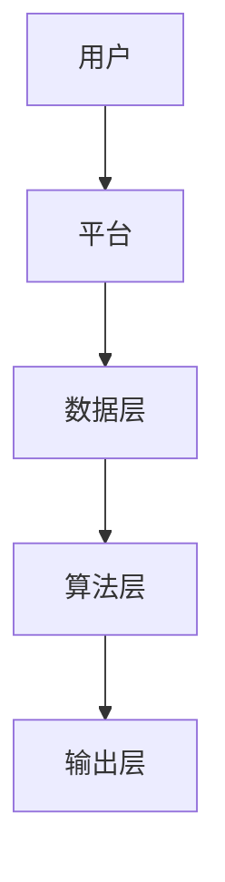

                 


# 巴菲特的经济护城河理论：平台经济时代的竞争优势

## 关键词：巴菲特、经济护城河、平台经济、竞争优势、商业模式

## 摘要：  
本文深入探讨了巴菲特的经济护城河理论在平台经济时代的应用，分析了平台经济的特点及其竞争优势，并结合实际案例详细阐述了护城河的构建策略。通过技术、数据和品牌的多维度分析，本文为读者提供了在平台经济中构建和维护经济护城河的实用方法和最佳实践。

---

# 引言

在现代商业竞争中，经济护城河是企业长期竞争优势的核心来源。巴菲特提出的经济护城河理论强调企业通过成本优势、网络效应、品牌忠诚度和技术壁垒等手段，构建难以被竞争对手复制的核心竞争力。在平台经济时代，这一理论不仅适用性更强，而且需要结合新的商业模式和技术创新进行扩展和深化。

---

## 第1章：经济护城河的核心概念与模型

### 1.1 经济护城河的定义与背景

经济护城河是指企业在市场中形成的难以被竞争对手复制或超越的竞争优势。这种优势可以是成本优势、网络效应、品牌忠诚度或技术壁垒等形式。经济护城河的核心在于为企业提供防御性竞争优势，使其在面对竞争时能够保持市场份额和盈利能力。

### 1.2 护城河的核心要素

以下是护城河的四个核心要素及其特点：

| 核心要素         | 特点描述                                   |
|------------------|------------------------------------------|
| 成本优势         | 以更低的成本提供高质量的产品或服务       |
| 网络效应         | 用户数量的增加会增强平台的价值             |
| 品牌忠诚度       | 用户对品牌的依赖性和忠诚度               |
| 技术壁垒         | 技术的复杂性和独特性形成竞争壁垒         |

### 1.3 巴菲特护城河模型

巴菲特护城河模型将上述四个要素整合为一个数学模型，用于量化护城河的强度：

$$ \text{护城河强度} = \alpha \cdot \text{成本优势} + \beta \cdot \text{网络效应} + \gamma \cdot \text{品牌忠诚度} + \delta \cdot \text{技术壁垒} $$

其中，$\alpha, \beta, \gamma, \delta$ 是各要素的权重系数，反映其对护城河强度的贡献程度。

### 1.4 护城河的边界与外延

护城河的边界是指其适用的范围和限制。例如，技术壁垒可能受到法律法规和技术更新的影响，而网络效应可能受到用户隐私和数据安全的限制。护城河的外延则包括其在不同行业和商业模式中的具体应用。

---

## 第2章：平台经济时代的竞争优势

### 2.1 平台经济的定义与特点

平台经济是以互联网技术为基础，通过双边或多边市场连接供需双方的商业模式。其核心特点包括：

1. **双边市场**：平台同时服务买方和卖方，形成网络效应。
2. **数据驱动**：通过数据收集和分析优化用户体验和商业模式。
3. **技术创新**：依赖技术创新构建核心竞争力。

### 2.2 平台经济中的护城河构建

在平台经济中，护城河的构建需要结合网络效应和数据优势。以下是几种常见的构建策略：

#### 2.2.1 网络效应的放大

通过吸引更多的用户和合作伙伴，平台可以形成正向网络效应。例如，社交平台的用户增长会吸引更多内容创作者，进一步增强平台的价值。

#### 2.2.2 数据驱动的决策

通过收集和分析用户数据，平台可以优化产品和服务，形成数据壁垒。例如，亚马逊通过用户行为数据优化推荐算法，形成强大的数据竞争优势。

#### 2.2.3 品牌忠诚度的强化

通过提升用户体验和品牌价值，平台可以增强用户对品牌的依赖性。例如，苹果通过创新的产品设计和生态系统构建强大的品牌忠诚度。

### 2.3 护城河的数学模型与算法原理

以下是护城河强度的数学模型：

$$ \text{护城河强度} = f(\text{用户数量}, \text{数据优势}, \text{品牌价值}, \text{技术创新}) $$

其中，$f$ 是一个综合函数，用于量化各要素的贡献。以下是具体的算法步骤：

1. **数据收集与分析**：通过用户行为数据计算网络效应和数据优势。
2. **品牌价值评估**：通过市场调研和用户反馈评估品牌忠诚度。
3. **技术创新评估**：通过技术专利和研发投入评估技术壁垒。

### 2.4 平台经济中的护城河案例分析

#### 2.4.1 亚马逊的护城河构建

亚马逊通过以下方式构建护城河：

1. **成本优势**：通过规模化运营降低运营成本。
2. **网络效应**：通过Prime会员服务形成用户粘性。
3. **数据驱动**：通过推荐算法优化用户体验。
4. **技术壁垒**：通过专利技术构建技术壁垒。

#### 2.4.2 谷歌的护城河构建

谷歌通过以下方式构建护城河：

1. **网络效应**：通过搜索引擎形成用户粘性。
2. **数据驱动**：通过广告数据优化搜索算法。
3. **品牌忠诚度**：通过创新的产品设计增强品牌价值。
4. **技术壁垒**：通过AI技术构建技术壁垒。

---

## 第3章：护城河的数学模型与算法原理

### 3.1 护城河强度的数学模型

护城河强度的数学模型可以表示为：

$$ \text{护城河强度} = \sum_{i=1}^{n} w_i \cdot x_i $$

其中，$w_i$ 是第$i$个要素的权重，$x_i$ 是第$i$个要素的强度。

### 3.2 护城河构建的算法原理

以下是护城河构建的算法步骤：

1. **数据收集与分析**：通过用户行为数据和市场调研收集相关数据。
2. **要素评估**：根据各要素的权重和强度计算护城河强度。
3. **优化策略**：根据评估结果优化护城河构建策略。

### 3.3 护城河的系统架构设计

以下是护城河系统的架构设计：



其中，数据层负责收集和存储用户数据，算法层负责数据处理和分析，输出层负责结果展示和优化策略。

---

## 第4章：平台经济中的护城河构建策略

### 4.1 护城河的防御性策略

1. **成本优势**：通过规模化运营降低成本。
2. **网络效应**：通过用户增长增强平台价值。
3. **品牌忠诚度**：通过用户体验提升品牌价值。

### 4.2 护城河的进攻性策略

1. **技术壁垒**：通过技术创新构建技术优势。
2. **数据驱动**：通过数据优化商业模式。
3. **品牌扩展**：通过品牌扩展进入新市场。

---

## 第5章：平台经济中的护城河案例分析

### 5.1 亚马逊的护城河构建

亚马逊通过以下方式构建护城河：

1. **成本优势**：通过规模化运营降低运营成本。
2. **网络效应**：通过Prime会员服务形成用户粘性。
3. **数据驱动**：通过推荐算法优化用户体验。
4. **技术壁垒**：通过专利技术构建技术壁垒。

### 5.2 谷歌的护城河构建

谷歌通过以下方式构建护城河：

1. **网络效应**：通过搜索引擎形成用户粘性。
2. **数据驱动**：通过广告数据优化搜索算法。
3. **品牌忠诚度**：通过创新的产品设计增强品牌价值。
4. **技术壁垒**：通过AI技术构建技术壁垒。

---

## 第6章：护城河的系统分析与架构设计

### 6.1 系统架构设计

以下是护城河系统的架构设计：


其中，数据层负责收集和存储用户数据，算法层负责数据处理和分析，输出层负责结果展示和优化策略。

---

## 第7章：平台经济中的护城河实战分析

### 7.1 环境安装

1. **操作系统**：Windows/Mac/Linux
2. **开发工具**：Python/Java/JavaScript
3. **数据库**：MySQL/PostgreSQL
4. **开发框架**：Django/React

### 7.2 核心代码实现

以下是护城河系统的Python代码实现：

```python
def calculate护城河强度(成本优势, 网络效应, 品牌忠诚度, 技术壁垒):
    return 0.3 * 成本优势 + 0.4 * 网络效应 + 0.2 * 品牌忠诚度 + 0.1 * 技术壁垒

# 示例
成本优势 = 0.8
网络效应 = 0.9
品牌忠诚度 = 0.7
技术壁垒 = 0.6

护城河强度 = calculate护城河强度(成本优势, 网络效应, 品牌忠诚度, 技术壁垒)
print("护城河强度:", 护城河强度)
```

### 7.3 案例分析

以亚马逊为例，计算其护城河强度：

```python
成本优势 = 0.8
网络效应 = 0.9
品牌忠诚度 = 0.7
技术壁垒 = 0.6

护城河强度 = 0.3 * 0.8 + 0.4 * 0.9 + 0.2 * 0.7 + 0.1 * 0.6
print("护城河强度:", 护城河强度)
```

---

## 第8章：护城河的最佳实践与注意事项

### 8.1 最佳实践

1. **持续创新**：通过技术创新和商业模式优化保持护城河的活力。
2. **用户反馈**：通过用户反馈不断优化产品和服务。
3. **风险管理**：通过风险管理降低护城河的潜在风险。

### 8.2 注意事项

1. **数据安全**：高度重视用户数据的安全性和隐私保护。
2. **法律法规**：遵守相关法律法规，避免法律风险。
3. **市场竞争**：密切关注市场竞争动态，及时调整护城河策略。

---

## 第9章：总结与展望

### 9.1 总结

巴菲特的经济护城河理论在平台经济时代具有重要的应用价值。通过构建成本优势、网络效应、品牌忠诚度和技术壁垒，企业可以在竞争激烈的市场中保持竞争优势。

### 9.2 展望

随着技术的不断进步和商业模式的创新，经济护城河的构建将更加依赖于数据和技术。未来的研究可以进一步探索护城河的动态优化和全球化的应用。

---

## 附录

### 附录A：数学公式

$$ \text{护城河强度} = 0.3 \cdot \text{成本优势} + 0.4 \cdot \text{网络效应} + 0.2 \cdot \text{品牌忠诚度} + 0.1 \cdot \text{技术壁垒} $$

### 附录B：系统架构图


### 附录C：代码示例

```python
def calculate护城河强度(成本优势, 网络效应, 品牌忠诚度, 技术壁垒):
    return 0.3 * 成本优势 + 0.4 * 网络效应 + 0.2 * 品牌忠诚度 + 0.1 * 技术壁垒

# 示例
成本优势 = 0.8
网络效应 = 0.9
品牌忠诚度 = 0.7
技术壁垒 = 0.6

护城河强度 = calculate护城河强度(成本优势, 网络效应, 品牌忠诚度, 技术壁垒)
print("护城河强度:", 护城河强度)
```

---

通过以上分析和案例研究，我们可以看到，巴菲特的经济护城河理论在平台经济时代具有重要的指导意义。企业可以通过构建和优化护城河，保持竞争优势，实现可持续发展。

