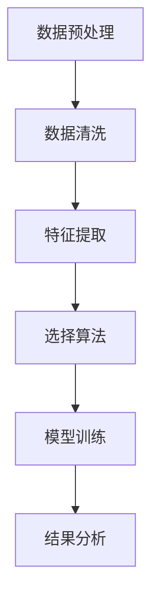
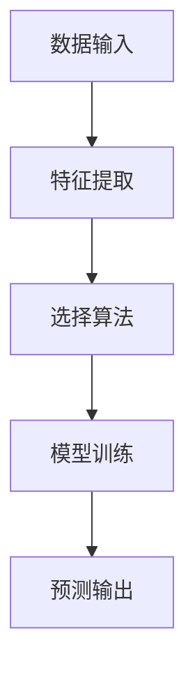
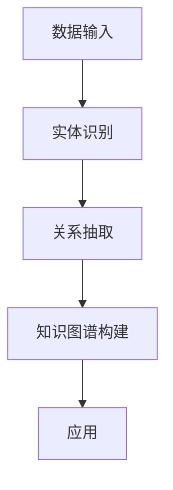

                 

# 巴菲特的经济护城河理论：数据经济时代的竞争优势

## 关键词：巴菲特, 经济护城河, 数据经济, 数据分析, 机器学习, 竞争优势

## 摘要：  
在数据经济时代，传统的竞争优势正在被重新定义。巴菲特的经济护城河理论为我们提供了一种新的视角来理解企业如何在数据驱动的经济中建立持久的竞争优势。本文从巴菲特的经济护城河理论出发，结合数据经济的特点，分析了数据在护城河构建中的作用，并探讨了如何通过数据分析、机器学习等技术手段来强化企业的护城河。通过实际案例分析，本文为读者提供了一套在数据经济时代构建和维护经济护城河的系统方法。

---

# 第一部分：巴菲特的经济护城河理论基础

## 第1章：巴菲特经济护城河理论概述

### 1.1 经济护城河的定义与核心要素

#### 1.1.1 经济护城河的定义  
经济护城河是指企业在市场竞争中形成的独特优势，使其能够抵御竞争对手的侵蚀并保持长期的竞争优势。这种优势可以是资源、技术、品牌、网络效应等。

#### 1.1.2 经济护城河的核心要素  
- **资源壁垒**：企业独有的资源，如专利、特许经营权等。  
- **技术壁垒**：技术创新带来的竞争优势。  
- **品牌壁垒**：强大的品牌形象和客户忠诚度。  
- **网络效应壁垒**：用户数量增加时，企业价值呈指数级增长。  

#### 1.1.3 经济护城河的分类与特点  
- **成本优势**：企业以更低的成本提供产品或服务。  
- **差异化优势**：通过独特的产品或服务吸引客户。  
- **规模经济优势**：通过规模化降低成本。  

### 1.2 巴菲特投资理念与护城河的关系

#### 1.2.1 巴菲特投资理念的核心思想  
巴菲特的投资理念强调“以合理的价格买入优秀的公司”，而优秀的公司往往具备强大的经济护城河。

#### 1.2.2 护城河在巴菲特投资策略中的地位  
巴菲特认为，护城河是企业长期盈利能力的保障，是抵御竞争的关键因素。

#### 1.2.3 护城河理论的演变与发展  
随着经济环境的变化，护城河的内涵也在不断扩展，从传统的资源和技术壁垒，逐步向数据和技术驱动的方向演进。

### 1.3 数据经济时代与经济护城河的结合

#### 1.3.1 数据经济时代的特征  
数据成为核心资源，数据驱动的商业模式逐渐成为主流。

#### 1.3.2 数据在经济护城河中的作用  
数据是构建护城河的核心资源，通过数据分析和挖掘，企业可以形成独特的竞争优势。

#### 1.3.3 数据经济时代护城河的新特点  
- 数据驱动的护城河更加动态和灵活。  
- 数据分析和人工智能技术成为护城河的核心支撑。  

## 1.4 本章小结  
本章介绍了巴菲特的经济护城河理论，分析了数据经济时代护城河的新特点，为后续章节的分析奠定了基础。

---

# 第二部分：数据经济时代的护城河分析框架

## 第2章：数据经济时代的核心竞争力

### 2.1 数据作为核心资源的特征

#### 2.1.1 数据的可扩展性  
数据可以无限复制和传播，具有极强的扩展性。

#### 2.1.2 数据的实时性  
实时数据的获取和处理能力成为企业竞争力的重要指标。

#### 2.1.3 数据的隐私性  
数据的隐私性和安全性成为企业构建护城河的重要考量。

### 2.2 数据驱动的商业模式

#### 2.2.1 数据驱动的盈利模式  
通过数据变现，企业可以创造新的收入来源。

#### 2.2.2 数据驱动的创新模式  
数据驱动的创新模式可以帮助企业快速响应市场变化。

#### 2.2.3 数据驱动的生态系统  
构建数据生态系统，企业可以实现多方合作共赢。

### 2.3 数据经济时代的核心竞争力分析

#### 2.3.1 数据获取能力  
企业需要具备高效的数据获取能力，才能在数据经济时代占据优势。

#### 2.3.2 数据处理能力  
强大的数据处理能力是构建护城河的关键。

#### 2.3.3 数据分析能力  
通过数据分析，企业可以发现数据中的价值，并转化为竞争优势。

## 2.4 本章小结  
本章分析了数据经济时代的核心竞争力，强调了数据获取、处理和分析能力的重要性。

---

# 第三部分：护城河的构建与数据分析技术

## 第3章：护城河构建的关键算法与技术

### 3.1 数据挖掘与分析技术

#### 3.1.1 数据挖掘的基本概念  
数据挖掘是从大量数据中提取有价值信息的过程。

#### 3.1.2 数据挖掘的关键算法  
- **决策树算法**：用于分类和预测。  
- **聚类算法**：用于数据分组。  
- **关联规则挖掘**：用于发现数据中的关联性。  

#### 3.1.3 数据挖掘在护城河构建中的应用  
通过数据挖掘，企业可以发现市场趋势和潜在机会。

#### 3.1.4 数据挖掘流程图  

### 3.2 机器学习与人工智能

#### 3.2.1 机器学习的基本原理  
机器学习是一种通过数据训练模型的技术。

#### 3.2.2 人工智能在数据经济中的应用  
人工智能可以帮助企业实现自动化决策和优化。

#### 3.2.3 机器学习在护城河构建中的作用  
通过机器学习，企业可以预测市场变化并优化资源配置。

#### 3.2.4 机器学习算法流程图  

### 3.3 自然语言处理与知识图谱

#### 3.3.1 自然语言处理的基本概念  
自然语言处理（NLP）是让计算机理解人类语言的技术。

#### 3.3.2 知识图谱的构建与应用  
知识图谱可以帮助企业构建知识库，支持智能决策。

#### 3.3.3 NLP在护城河构建中的应用  
通过NLP技术，企业可以实现智能客服和内容分析。

#### 3.3.4 知识图谱构建流程图  

### 3.4 本章小结  
本章详细介绍了护城河构建的关键算法与技术，包括数据挖掘、机器学习和自然语言处理等。

---

# 总结与展望

## 4.1 总结  
本文从巴菲特的经济护城河理论出发，结合数据经济的特点，分析了数据在护城河构建中的作用，并探讨了如何通过数据分析和人工智能技术来强化企业的护城河。

## 4.2 展望  
随着数据经济的不断发展，护城河的构建将更加依赖于数据分析和人工智能技术。未来的研究可以进一步探索护城河的动态演变和可持续性。

---

通过以上内容，读者可以系统地理解巴菲特的经济护城河理论在数据经济时代的应用，并掌握如何通过数据分析和技术手段来构建和强化企业的护城河。

