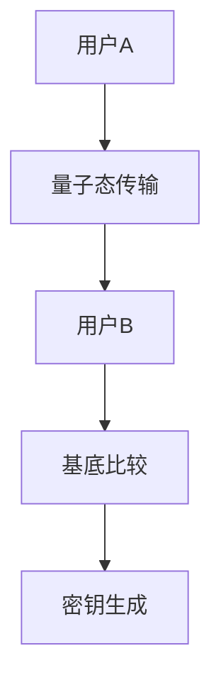
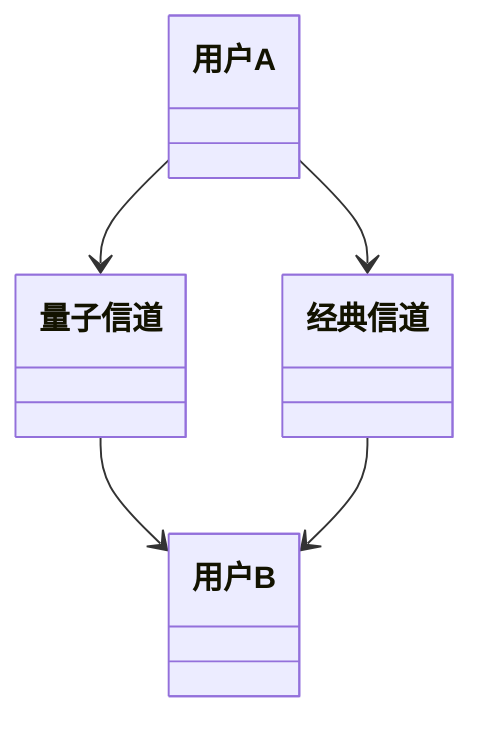

                 


# 巴菲特的经济护城河理论：量子加密时代的数据安全优势

## 关键词：巴菲特、经济护城河、量子加密、数据安全、技术优势、竞争优势、数据保护

## 摘要：本文探讨了巴菲特的经济护城河理论在量子加密时代的应用，分析了量子加密技术如何成为企业数据安全的核心竞争力。通过结合经济理论与技术创新，本文揭示了如何在数据安全领域构建长期的竞争优势，为企业制定数据保护策略提供了新的视角和方法。

---

# 第一部分：经济护城河与量子加密的结合

## 第1章：经济护城河理论概述

### 1.1 经济护城河的定义与核心要素

#### 1.1.1 经济护城河的定义

$$\text{经济护城河} = \text{企业竞争优势的可持续性}$$

经济护城河是指企业在行业中建立的难以被竞争对手复制的竞争优势，这种优势通常来源于技术、品牌、成本结构或市场进入壁垒。通过构建经济护城河，企业能够长期保持市场领先地位，抵御竞争对手的挑战。

#### 1.1.2 经济护城河的核心要素

| 核心要素 | 描述 | 示例 |
|----------|------|------|
| 技术优势 | 独特的技术或专利 | 量子加密技术 |
| 品牌价值 | 强大的品牌影响力 | 谷歌、苹果 |
| 成本优势 | 低成本生产或运营 | 快时尚品牌 |

#### 1.1.3 经济护城河的边界与外延

经济护城河的边界在于其独特性和可持续性。外延则包括企业如何利用护城河在不同市场扩展竞争优势。

---

### 1.2 巴菲特投资理念与经济护城河

#### 1.2.1 巴菲特投资理念概述

巴菲特的“护城河”理念强调投资那些具备持续竞争优势的企业。他指出，真正的护城河来源于企业的独特能力，而非单纯的市场地位或规模。

#### 1.2.2 经济护城河在巴菲特投资中的重要性

$$\text{护城河深度} \propto \text{企业竞争优势的持久性}$$

巴菲特倾向于投资那些能够在长期保持竞争优势的企业，这些企业通常具备强大的护城河，如技术专利、网络效应或成本优势。

#### 1.2.3 经济护城河的构建与维护

构建经济护城河需要企业不断投入资源，保持创新能力和市场敏锐度。护城河的维护则需要企业持续优化运营，应对市场变化。

---

### 1.3 量子加密时代的技术背景

#### 1.3.1 量子计算的基本原理

量子计算利用量子叠加和量子纠缠的原理，能够在某些特定问题上远超经典计算机的计算能力。例如，Shor算法可以在多项式时间内分解大质数，对现有加密算法构成威胁。

#### 1.3.2 量子加密的核心技术

量子加密技术，尤其是量子密钥分发（QKD），通过利用量子态的不可克隆性，提供一种理论上不可破解的加密方式。

#### 1.3.3 量子加密时代的数据安全挑战

随着量子计算的发展，传统加密算法面临被破解的风险。因此，量子加密技术的应用成为数据安全的关键。

---

### 1.4 数据安全与经济护城河的关联

#### 1.4.1 数据安全对企业竞争优势的影响

数据已成为企业的重要资产，数据安全直接关系到企业的核心竞争力。具备强大数据安全能力的企业能够在竞争中占据优势。

#### 1.4.2 量子加密如何构建数据安全的经济护城河

量子加密技术提供了更高的安全性，能够保护企业的核心数据不被竞争对手窃取或篡改，从而形成数据安全的护城河。

#### 1.4.3 数据安全对企业的长期价值

数据安全不仅保护了企业的资产，还能增强客户信任，提升品牌价值，从而为企业创造长期价值。

---

## 第2章：量子加密技术的数学模型与算法原理

### 2.1 量子加密的基本原理

#### 2.1.1 量子叠加与量子纠缠

量子叠加：量子系统处于多个状态的叠加态，例如，一个量子位（qubit）可以同时处于0和1的状态。

量子纠缠：两个或多个量子系统之间形成关联，一个系统的状态会直接影响另一个系统的状态。

#### 2.1.2 量子密钥分发（QKD）的数学模型

QKD的核心思想是通过量子态传输密钥，确保密钥的分发过程是安全的。其数学模型如下：

$$
\text{密钥生成} = \text{量子态传输} \oplus \text{基底选择}
$$

#### 2.1.3 量子加密算法的流程图



---

### 2.2 量子加密的核心算法

#### 2.2.1 BB84协议

BB84协议是最早的量子密钥分发协议，由Bennett和Bertlmann提出。其流程如下：

1. 用户A生成随机的量子态，并通过量子信道传输给用户B。
2. 用户B根据自己的基底测量量子态，并记录测量结果。
3. 双方通过公开通信比较基底，保留相同基底的测量结果作为密钥。

#### 2.2.2 EPR对与量子密钥分发

EPR对是量子纠缠态的一种，用于实现量子通信中的纠缠交换。其数学表示为：

$$
|\Phi^+\rangle = \frac{1}{\sqrt{2}} (|\uparrow\downarrow\rangle + |\downarrow\uparrow\rangle)
$$

---

### 2.3 量子加密的数学模型

#### 2.3.1 量子态的数学表示

量子态通常用向量或密度矩阵表示。例如，一个两维空间中的量子态可以表示为：

$$
|\psi\rangle = \alpha|0\rangle + \beta|1\rangle
$$

其中，$\alpha$ 和 $\beta$ 是复数，满足 $|\alpha|^2 + |\beta|^2 = 1$。

#### 2.3.2 量子加密的密钥生成过程

密钥生成过程包括量子态传输、基底比较和密钥提取。其数学模型如下：

$$
\text{密钥} = \text{量子态测量结果} \oplus \text{基底修正}
$$

---

## 第3章：量子加密技术在数据安全中的应用

### 3.1 数据安全的领域模型

#### 3.1.1 数据安全的领域模型图



---

### 3.2 量子加密技术的实际案例分析

#### 3.2.1 案例背景介绍

某企业希望通过量子加密技术保护其核心数据的传输过程，确保数据在传输过程中不被窃取或篡改。

#### 3.2.2 案例中的系统实现

该企业采用了BB84协议实现量子密钥分发，通过量子信道传输量子态，并通过经典信道进行基底比较和密钥生成。

#### 3.2.3 案例的分析与解读

通过量子加密技术，该企业成功构建了数据传输的安全通道，确保了数据的完整性和机密性。

---

## 第4章：量子加密时代的数据安全策略

### 4.1 数据安全策略的制定原则

#### 4.1.1 数据分类与分级

企业应根据数据的重要性和敏感程度进行分类和分级，制定相应的安全策略。

#### 4.1.2 数据访问控制策略

基于角色的访问控制（RBAC）是常见的数据访问控制策略，确保只有授权人员可以访问特定数据。

#### 4.1.3 数据加密策略

企业应采用多层次的加密策略，包括数据在存储和传输过程中的加密。

---

### 4.2 量子加密技术的安全策略

#### 4.2.1 量子密钥分发的安全性保障

量子密钥分发的安全性基于量子力学的基本原理，确保密钥的分发过程无法被窃听或篡改。

#### 4.2.2 量子加密技术的防护措施

企业应结合传统加密技术和量子加密技术，构建多层次的安全防护体系。

#### 4.2.3 量子加密技术的监控与预警

通过实时监控和预警系统，企业可以及时发现并应对潜在的安全威胁。

---

## 第5章：量子加密时代经济护城河的构建与维护

### 5.1 经济护城河的构建策略

#### 5.1.1 技术驱动的经济护城河

企业应加大对量子加密技术的研发投入，确保技术的领先地位。

#### 5.1.2 数据驱动的经济护城河

通过积累和分析数据，企业可以构建数据驱动的护城河，提升决策能力和市场响应速度。

#### 5.1.3 品牌驱动的经济护城河

强大的品牌形象和客户忠诚度也是重要的经济护城河。

---

### 5.2 经济护城河的维护策略

#### 5.2.1 技术更新与创新

企业需要持续关注技术发展，及时更新和优化量子加密技术。

#### 5.2.2 市场拓展与合作

通过市场拓展和合作伙伴关系，企业可以进一步巩固和扩大其经济护城河。

#### 5.2.3 人才培养与引进

具备量子计算和数据安全领域专业人才是构建和维护经济护城河的关键。

---

## 第6章：结论与展望

### 6.1 结论

通过将巴菲特的经济护城河理论与量子加密技术相结合，企业可以在数据安全领域构建强大的经济护城河，确保长期的竞争优势。

### 6.2 未来展望

随着量子计算技术的不断发展，量子加密技术将在数据安全领域发挥越来越重要的作用。企业应提前布局，积极构建量子加密时代的经济护城河。

---

## 参考文献

1. 巴菲特，沃伦. 《巴菲特投资思想》
2. 理查德·J·琳恩. 《量子计算入门》
3. 《量子密钥分发协议：BB84与EPR对的应用》

---

## 致谢

感谢读者的耐心阅读，感谢专家和同行的宝贵意见。

---

## 附录

### 附录A：量子加密技术相关术语解释

1. 量子叠加：量子系统处于多个状态的叠加态。
2. 量子纠缠：两个或多个量子系统之间形成关联。

### 附录B：量子加密算法的实现代码示例

```python
import random

def generate_qubit():
    return random.choice([0, 1])

def measure_qubit(qubit, basis):
    if basis == 'z':
        return qubit
    elif basis == 'x':
        return (qubit + 1) % 2
    else:
        return None

# 示例代码：BB84协议实现
def bb84_protocol():
    # 用户A生成量子态
    qubits = [generate_qubit() for _ in range(100)]
    
    # 用户B选择基底并测量
    bases = [random.choice(['z', 'x']) for _ in range(100)]
    measurements = [measure_qubit(qubit, basis) for qubit, basis in zip(qubits, bases)]
    
    # 比较基底并提取密钥
    common_bases = [i for i in range(100) if bases[i] == 'z']
    key = [qubits[i] for i in common_bases]
    return key

# 生成密钥
key = bb84_protocol()
print("生成的密钥:", key)
```

---

## 最佳实践

1. 在构建经济护城河时，企业应注重技术、品牌和成本的综合优势。
2. 量子加密技术的应用需要结合企业的实际情况，制定合理的安全策略。
3. 定期评估和优化经济护城河，确保其持续有效。

---

## 小结

通过结合巴菲特的经济护城河理论与量子加密技术，企业可以在数据安全领域构建强大的竞争优势，确保长期的市场领先地位。

---

## 注意事项

1. 量子加密技术目前仍处于发展阶段，尚未完全成熟。
2. 企业在应用量子加密技术时，应充分考虑其成本和技术门槛。
3. 数据安全的法律法规和行业标准也在不断变化，企业需保持关注。

---

## 拓展阅读

1. 《量子计算与信息安全》
2. 《经济护城河：竞争优势的构建与维护》
3. 《量子加密技术的应用与发展》

