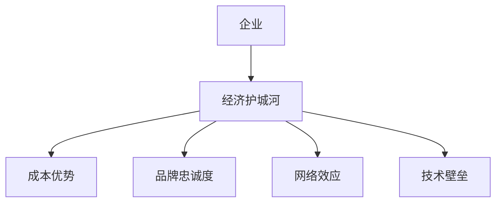
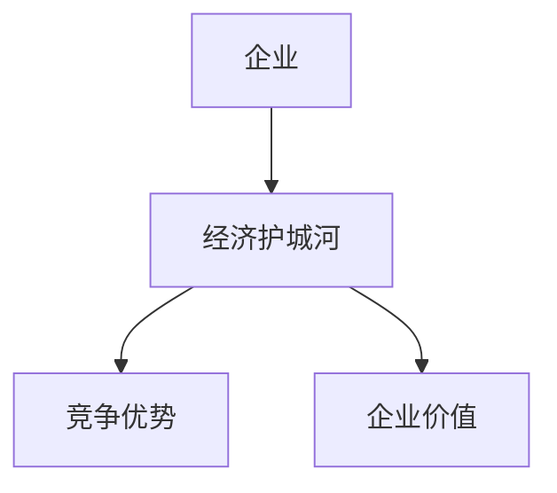
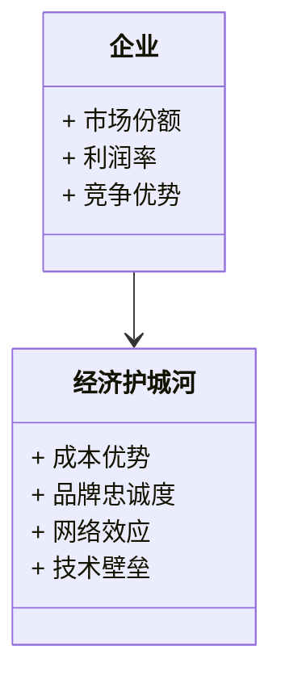
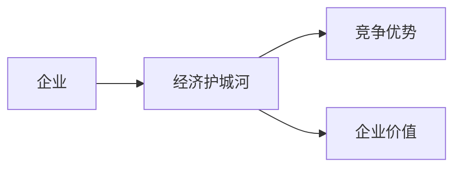

                 


# 巴菲特的经济护城河：持久竞争优势的重要性

## 关键词
- 巴菲特
- 经济护城河
- 竞争优势
- 投资策略
- 企业价值

## 摘要
本文深入探讨了巴菲特提出的“经济护城河”概念，分析其在企业持久竞争优势中的重要性。从定义、类型到实际应用，结合实例和图表，全面解析经济护城河的核心要素及其对投资决策的影响。文章结构清晰，内容详实，帮助读者理解如何通过构建经济护城河来提升企业竞争力和投资价值。

---

# 第一部分: 经济护城河的背景与核心概念

## 第1章: 经济护城河的定义与背景

### 1.1 经济护城河的起源与背景
#### 1.1.1 巴菲特投资理念的核心
巴菲特的投资理念以“长期价值投资”为核心，强调选择具有持续竞争优势的企业。他提出的“经济护城河”概念是这一理念的重要组成部分。

#### 1.1.2 经济护城河的定义与内涵
经济护城河是指企业在行业中形成的竞争优势，使其能够在长期竞争中保持领先地位，并抵御竞争对手的侵蚀。这种优势通常体现在成本、品牌、技术或网络效应等方面。

#### 1.1.3 经济护城河与企业价值的关系
企业价值的高低与其经济护城河的深度密切相关。强大的经济护城河能够为企业带来超额利润，从而提升其市场估值。

---

### 1.2 经济护城河的历史演变
#### 1.2.1 巴菲特早期投资策略
早期，巴菲特主要关注企业的财务状况和管理层素质。随着投资经验的积累，他逐渐意识到竞争优势的重要性。

#### 1.2.2 经济护城河概念的提出与发展
20世纪90年代，巴菲特在《巴菲特股东手册》中首次明确提出“经济护城河”概念，并将其作为评估企业投资价值的重要指标。

#### 1.2.3 经济护城河在现代投资中的应用
当前，经济护城河已成为投资者分析企业竞争力的重要工具，广泛应用于价值投资和企业战略规划中。

---

## 第2章: 经济护城河的核心要素

### 2.1 经济护城河的类型
#### 2.1.1 成本优势
成本优势是企业通过更低的生产成本或运营效率，提供更具竞争力的价格，从而吸引更多的客户。

#### 2.1.2 品牌忠诚度
强大的品牌影响力能够增强客户忠诚度，使其更愿意选择该品牌的产品或服务，从而形成市场壁垒。

#### 2.1.3 网络效应
网络效应是指用户数量的增加会增强产品的价值，从而吸引更多用户加入，形成正反馈循环。

#### 2.1.4 专利与技术壁垒
通过专利和技术壁垒，企业能够保护其创新成果，防止竞争对手轻易复制，从而保持技术领先优势。

---

### 2.2 经济护城河的核心特征
#### 2.2.1 持久性
经济护城河的持续时间越长，企业竞争优势越显著。

#### 2.2.2 宽广性
宽广的经济护城河能够覆盖更广泛的市场和客户群体，增强企业的市场影响力。

#### 2.2.3 经济性
经济护城河必须能够为企业的长期盈利能力提供支持，而不仅仅是短期优势。

---

## 第3章: 经济护城河与企业竞争优势

### 3.1 经济护城河与竞争优势的关系
#### 3.1.1 竞争优势的来源
竞争优势来源于企业的资源、能力和战略，而经济护城河是其中最关键的因素。

#### 3.1.2 经济护城河如何构建竞争优势
通过构建经济护城河，企业能够在市场中占据主导地位，降低竞争对手的威胁，从而实现持续增长。

---

### 3.2 经济护城河的边界与外延
#### 3.2.1 经济护城河的边界
经济护城河的边界由企业的核心竞争力决定，通常包括技术、品牌和成本等方面。

#### 3.2.2 经济护城河的外延
经济护城河的外延涉及企业的生态系统，包括供应商、客户、合作伙伴等，共同构成企业竞争优势的外部支持。

---

### 3.3 经济护城河的核心要素组成
#### 3.3.1 资源优势
企业通过资源控制（如原材料、数据等）形成竞争优势。

#### 3.3.2 能力优势
企业的核心能力（如技术创新、管理能力等）是经济护城河的重要组成部分。

#### 3.3.3 战略优势
通过制定和实施有效的战略，企业能够在市场中占据有利位置。

---

# 第二部分: 经济护城河的核心概念与联系

## 第4章: 经济护城河的核心原理

### 4.1 经济护城河的原理
#### 4.1.1 投资者视角的护城河
从投资者角度看，经济护城河是企业长期盈利能力的保障。

#### 4.1.2 企业视角的护城河
从企业角度看，经济护城河是抵御竞争、保持市场份额的关键。

---

### 4.2 经济护城河的核心概念体系
#### 4.2.1 护城河的层次结构
经济护城河可以分为核心层和外围层。核心层包括成本、品牌、技术等，外围层包括网络效应、合作伙伴等。

#### 4.2.2 护城河的动态演进
经济护城河不是静态的，而是随着市场变化不断演进和优化。

---

## 第5章: 经济护城河的核心概念对比

### 5.1 不同类型经济护城河的对比
#### 5.1.1 成本优势 vs 品牌忠诚度
成本优势注重价格竞争力，品牌忠诚度注重客户偏好。

#### 5.1.2 网络效应 vs 技术壁垒
网络效应依赖用户规模，技术壁垒依赖技术独占性。

---

### 5.2 经济护城河与竞争优势的对比
#### 5.2.1 经济护城河的独特性
经济护城河是竞争优势的核心来源。

#### 5.2.2 竞争优势的多样性
竞争优势还包括其他因素，如地理位置、政策支持等。

---

## 第6章: 经济护城河的实体关系图

### 6.1 经济护城河的实体关系图


### 6.2 经济护城河的核心要素关系


---

# 第三部分: 经济护城河的算法与数学模型

## 第7章: 经济护城河的算法原理

### 7.1 经济护城河的评估算法
经济护城河的评估通常基于定性和定量分析。以下是一个简化的评估模型：

#### 7.1.1 评估步骤
1. 确定企业的核心竞争力。
2. 评估竞争对手的威胁。
3. 量化企业的市场地位。

#### 7.1.2 护城河指数计算
护城河指数可以通过以下公式计算：
$$
\text{护城河指数} = \frac{\text{市场份额} \times \text{利润率}}{\text{竞争强度}}
$$

---

### 7.2 经济护城河的数学模型
经济护城河的数学模型可以用以下方式表示：
$$
\text{经济护城河深度} = \sum_{i=1}^{n} w_i \times c_i
$$
其中，$w_i$ 是第 $i$ 个要素的权重，$c_i$ 是第 $i$ 个要素的竞争力评分。

---

## 第8章: 经济护城河的系统分析与架构设计

### 8.1 系统功能设计
领域模型：


### 8.2 系统架构设计
架构图：


---

## 第9章: 项目实战

### 9.1 环境安装
无需特定环境，只需基本的数据分析工具。

### 9.2 核心实现源代码
以下是一个简单的护城河指数计算代码示例：
```python
def calculate_economic_moat(enterprise):
    cost_adv = enterprise.cost_adv
    brand_loyalty = enterprise.brand_loyalty
    network_effects = enterprise.network_effects
    tech_barr = enterprise.tech_barr

    # 计算护城河指数
    moat_index = (cost_adv + brand_loyalty + network_effects + tech_barr) / 4
    return moat_index

class Enterprise:
    def __init__(self, cost_adv, brand_loyalty, network_effects, tech_barr):
        self.cost_adv = cost_adv
        self.brand_loyalty = brand_loyalty
        self.network_effects = network_effects
        self.tech_barr = tech_barr

# 示例
enterprise = Enterprise(0.8, 0.7, 0.9, 0.6)
moat_index = calculate_economic_moat(enterprise)
print(f"护城河指数: {moat_index}")
```

---

## 第10章: 最佳实践

### 10.1 小结
经济护城河是企业持久竞争优势的关键，投资者和企业管理者都应重视其构建和维护。

### 10.2 注意事项
- 经济护城河需要持续优化。
- 不同行业的企业护城河类型可能不同。
- 需要结合实际情况灵活运用。

### 10.3 拓展阅读
建议阅读巴菲特的相关著作，如《巴菲特股东手册》和《巴菲特的投资思想》。

---

通过以上分析，我们可以清晰地看到，经济护城河是企业长期竞争优势的核心，构建和维护强大的经济护城河，能够为企业带来持久的市场优势和投资价值。

