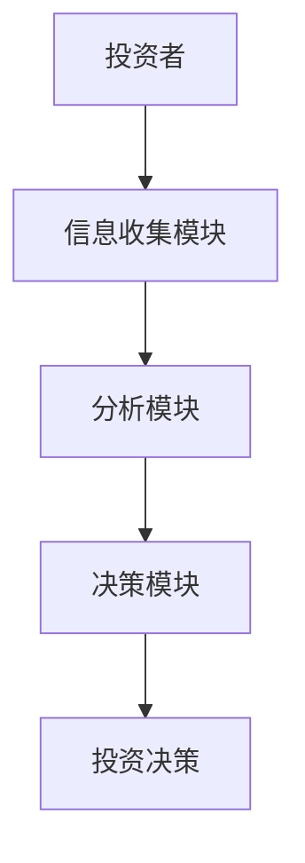
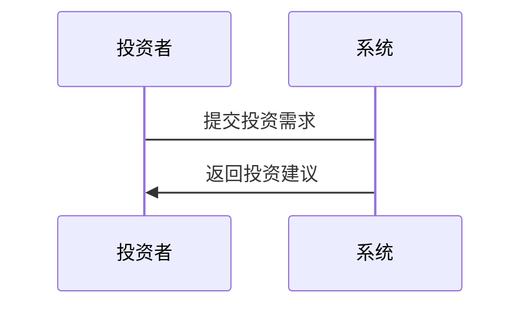

                 

# 巴菲特的耐心投资：等待合适的机会

## 关键词

- 巴菲特
- 价值投资
- 耐心投资
- 长期价值
- 投资策略

## 摘要

本文深入探讨了巴菲特的投资理念，特别是其强调的耐心投资策略。通过分析价值投资的核心原则、数学模型、系统架构以及实际案例，本文揭示了如何通过长期价值评估和耐心等待合适的投资机会，实现稳健的投资回报。文章还结合了数学公式、系统流程图和实际项目案例，为读者提供了全面而详细的指导。

---

## 第一部分: 巴菲特的耐心投资理念与背景

### 第1章: 巴菲特投资理念的核心背景

#### 1.1 投资市场的基本问题与挑战

##### 1.1.1 传统投资方法的局限性
- 传统投资方法的短期导向问题
- 市场波动对短期投资决策的影响
- 投资者情绪对决策的干扰

##### 1.1.2 巴菲特投资理念的提出背景
- 巴菲特的早年经历与投资理念的形成
- 20世纪70年代美国股市的背景
- 价值投资在低迷市场中的优势

##### 1.1.3 耐心投资的定义与核心要素
- 耐心投资的定义
- 长期价值评估的核心要素
- 耐心投资与市场波动的关系

#### 1.2 巴菲特投资理念的核心概念

##### 1.2.1 价值投资的定义与特征
- 价值投资的定义
- 价值投资的核心特征：寻找被低估的资产
- 价值投资与成长投资的区别

##### 1.2.2 耐心投资与长期价值的关系
- 长期价值的定义与评估方法
- 耐心投资如何实现长期价值
- 长期价值与市场周期的关系

##### 1.2.3 投资决策中的心理因素
- 投资者心理的常见问题
- 如何克服短期波动的干扰
- 耐心投资的心理基础

---

### 第2章: 价值投资的核心原则

#### 2.1 价值投资的哲学基础

##### 2.1.1 市场先生的比喻
- 市场先生的概念
- 投资者如何利用市场先生的报价
- 市场先生与价值投资的关系

##### 2.1.2 投资中的安全边际
- 安全边际的定义
- 安全边际的计算方法
- 安全边际的重要性

##### 2.1.3 内在价值的计算与评估
- 内在价值的定义
- 内在价值的计算公式
- 内在价值与市场价的关系

#### 2.2 价值投资的实践策略

##### 2.2.1 股票分析的三要素
- 财务状况：利润、负债、现金流
- 行业地位：竞争优势、市场占有率
- 管理团队：能力和声誉

##### 2.2.2 财务报表分析的核心指标
- 利润表：净利润率、ROE（净资产收益率）
- 资产负债表：负债率、流动比率
- 现金流量表：自由现金流

##### 2.2.3 行业分析与竞争优势评估
- 行业分析：行业周期、竞争结构
- 企业竞争优势：成本优势、品牌优势
- 行业地位与未来增长潜力

---

### 第3章: 耐心投资的数学模型与决策框架

#### 3.1 投资决策的数学模型

##### 3.1.1 内在价值的计算公式
$$ V = \frac{CF}{r - g} $$
其中，\( V \) 表示内在价值，\( CF \) 表示未来现金流，\( r \) 表示折现率，\( g \) 表示增长率。

##### 3.1.2 股票估值的多因子模型
$$ P = \alpha + \beta_1X_1 + \beta_2X_2 + ... + \beta_nX_n + \epsilon $$
其中，\( P \) 表示股票价格，\( X_i \) 表示各个影响因素，\( \beta_i \) 表示各因素的权重，\( \epsilon \) 表示误差项。

#### 3.2 投资组合的优化与风险控制

##### 3.2.1 马科维茨的有效前沿理论
- 马科维茨投资组合理论的简介
- 有效前沿的概念与应用
- 如何利用有效前沿优化投资组合

##### 3.2.2 资本资产定价模型（CAPM）
$$ E(r_i) = r_f + \beta_i (E(r_m) - r_f) $$
其中，\( E(r_i) \) 表示资产的预期收益率，\( r_f \) 表示无风险利率，\( \beta_i \) 表示资产的系统性风险系数，\( E(r_m) \) 表示市场预期收益率。

---

### 第4章: 耐心投资的系统架构与流程

#### 4.1 投资决策的系统架构

##### 4.1.1 问题场景介绍
- 投资者如何在复杂的市场环境中做出决策
- 系统化投资决策的重要性

##### 4.1.2 系统功能设计
- 信息收集模块：数据采集与处理
- 分析模块：财务分析、行业分析、竞争优势评估
- 决策模块：价值评估、投资决策、风险控制

##### 4.1.3 系统架构设计

##### 4.1.4 系统接口设计
- 数据接口：与金融数据库的对接
- 用户界面：投资者的操作界面
- 输出接口：投资建议的展示

##### 4.1.5 系统交互

---

## 第二部分: 耐心投资的实践与案例

### 第5章: 价值投资的实践策略

#### 5.1 选择投资标的的关键步骤

##### 5.1.1 确定投资目标
- 投资目标的设定
- 投资目标与个人风险承受能力的关系

##### 5.1.2 信息收集与初步筛选
- 数据来源：财务报表、行业报告、新闻资讯
- 初步筛选标准：ROE、PE、PB等指标

##### 5.1.3 深入分析与评估
- 财务分析：利润、负债、现金流
- 行业分析：竞争结构、市场潜力
- 管理团队评估：能力和声誉

#### 5.2 投资组合的构建与管理

##### 5.2.1 投资组合的构建策略
- 资产配置：股票、债券、现金的比例
- 行业分散：避免过度集中
- 地理分散：全球化投资

##### 5.2.2 投资组合的动态管理
- 定期评估：检查持仓与目标的一致性
- 调整策略：根据市场变化进行调整
- 保持耐心：避免频繁交易

---

### 第6章: 耐心投资的项目实战

#### 6.1 项目背景与目标

##### 6.1.1 项目背景
- 选择一家具有长期竞争优势的公司
- 确定投资的时间窗口
- 设定合理的预期收益

##### 6.1.2 项目目标
- 通过耐心投资实现稳健的收益
- 学习巴菲特的投资方法
- 提高投资决策的能力

#### 6.2 项目实施步骤

##### 6.2.1 信息收集与初步分析
- 收集目标公司的财务报表
- 分析行业竞争结构
- 评估公司管理团队

##### 6.2.2 价值评估与投资决策
- 计算内在价值
- 比较市场价与内在价值
- 确定投资金额与比例

##### 6.2.3 投资组合的构建与管理
- 设定投资比例
- 定期评估持仓
- 根据市场变化调整策略

#### 6.3 项目成果与经验总结

##### 6.3.1 项目成果
- 实现的投资收益
- 投资组合的表现
- 经验与教训

##### 6.3.2 经验总结
- 耐心投资的重要性
- 长期价值评估的准确性
- 投资组合管理的有效性

---

## 第三部分: 总结与展望

### 第7章: 耐心投资的总结与启示

#### 7.1 耐心投资的核心总结

##### 7.1.1 耐心投资的核心理念
- 长期价值的重要性
- 市场波动的不可预测性
- 耐心等待合适机会的必要性

##### 7.1.2 投资决策的关键因素
- 价值评估的准确性
- 投资组合的合理性
- 风险控制的有效性

#### 7.2 对未来投资的启示

##### 7.2.1 数字化工具的应用
- 利用大数据分析提高投资效率
- 人工智能在投资决策中的应用
- 量化分析与基本面分析的结合

##### 7.2.2 投资者心理的优化
- 克服短期波动的干扰
- 建立长期投资的耐心
- 提高风险管理能力

---

## 第8章: 小结与最佳实践

### 8.1 投资策略的小结

#### 8.1.1 耐心投资的策略总结
- 长期价值评估
- 耐心等待合适机会
- 严格的风险控制

#### 8.1.2 价值投资的关键点
- 选择具有长期竞争优势的公司
- 保持合理的投资组合
- 避免过度交易

### 8.2 最佳实践 tips

#### 8.2.1 投资者心理管理
- 保持耐心，避免贪婪和恐惧
- 坚持长期投资，避免短期波动的干扰
- 建立合理的风险承受能力

#### 8.2.2 投资组合管理
- 定期评估持仓，保持投资策略的一致性
- 根据市场变化进行适当的调整
- 保持分散投资，降低风险

#### 8.2.3 持续学习与提升
- 关注行业动态，学习新的投资知识
- 总结投资经验，优化投资策略
- 向巴菲特学习，坚持价值投资的理念

---

## 结语

通过本文的系统分析与实践案例，我们可以看到，耐心投资是实现长期稳健收益的有效策略。巴菲特的投资理念不仅为我们提供了理论指导，还为我们提供了实践中的宝贵经验。未来，随着市场环境的变化和技术的进步，耐心投资的理念将不断发展和完善，为投资者带来更多成功的机会。

